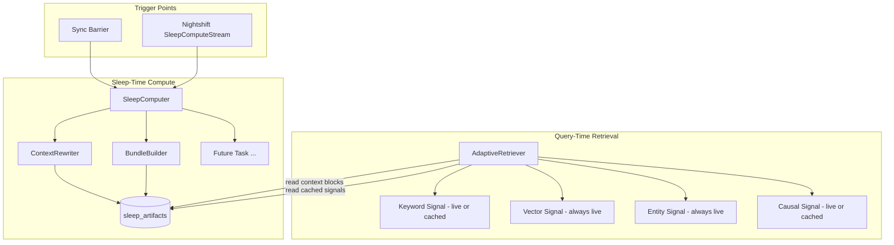
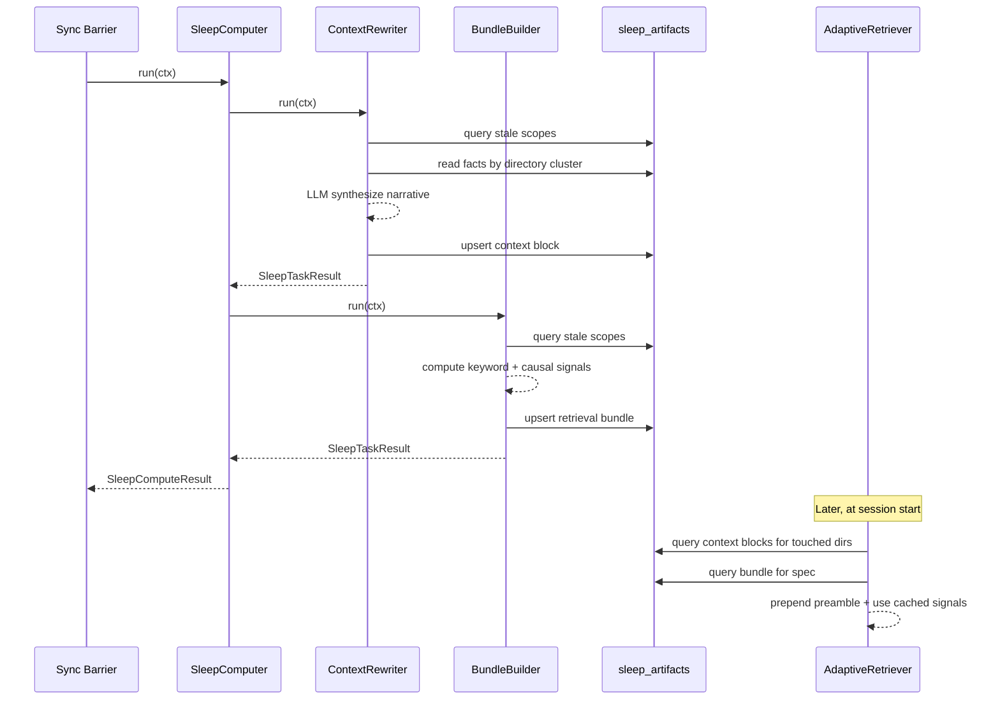

# Design Document: Sleep-Time Compute

## Overview

The sleep-time compute pipeline runs during idle periods (sync barriers and
nightshift daemon) to pre-process knowledge facts into enriched artifacts. It
uses a pluggable `SleepTask` protocol so new pre-computation strategies can be
added without modifying the orchestrator.

Two initial tasks ship with this spec:

1. **ContextRewriter** — Clusters facts by directory, synthesizes structured
   narrative summaries via LLM.
2. **BundleBuilder** — Pre-computes keyword and causal retrieval signals per
   spec (no LLM required).

The `AdaptiveRetriever` is extended to consume these artifacts: context blocks
are prepended as a preamble, cached signals bypass live computation.

## Architecture



### Module Responsibilities

1. **`agent_fox/knowledge/sleep_compute.py`** — `SleepTask` protocol,
   `SleepContext`, `SleepTaskResult`, `SleepComputeResult`, `SleepComputer`
   orchestrator.
2. **`agent_fox/knowledge/sleep_tasks/context_rewriter.py`** —
   `ContextRewriter` sleep task implementation.
3. **`agent_fox/knowledge/sleep_tasks/bundle_builder.py`** — `BundleBuilder`
   sleep task implementation.
4. **`agent_fox/knowledge/sleep_tasks/__init__.py`** — Package init, exports
   both tasks.
5. **`agent_fox/knowledge/retrieval.py`** — Extended `AdaptiveRetriever` to
   consume sleep artifacts (context preamble + cached signals).
6. **`agent_fox/knowledge/db.py`** — Schema migration adding `sleep_artifacts`
   table.
7. **`agent_fox/engine/barrier.py`** — Sleep compute step added to barrier
   sequence.
8. **`agent_fox/nightshift/streams.py`** — `SleepComputeStream` work stream.
9. **`agent_fox/core/config.py`** — `SleepConfig` dataclass under
   `KnowledgeConfig`.

## Data Flow



## Execution Paths

### Path 1: Sleep compute at sync barrier

1. `engine/barrier.py: run_sync_barrier_sequence` — calls sleep compute after
   compaction
2. `knowledge/sleep_compute.py: SleepComputer.run(ctx)` → `SleepComputeResult`
3. `knowledge/sleep_tasks/context_rewriter.py: ContextRewriter.run(ctx)` →
   `SleepTaskResult`
4. `knowledge/sleep_tasks/bundle_builder.py: BundleBuilder.run(ctx)` →
   `SleepTaskResult`
5. `engine/barrier.py` — logs results, continues to summary rendering

### Path 2: Sleep compute via nightshift daemon

1. `nightshift/daemon.py: DaemonRunner.run` — launches all streams including
   `SleepComputeStream`
2. `nightshift/streams.py: SleepComputeStream.run_once()` — opens DB, creates
   `SleepComputer`, runs it
3. `knowledge/sleep_compute.py: SleepComputer.run(ctx)` → `SleepComputeResult`
4. `nightshift/streams.py: SleepComputeStream.run_once()` — adds cost to
   shared budget, closes DB

### Path 3: Retriever consumes context blocks

1. `knowledge/retrieval.py: AdaptiveRetriever.retrieve(...)` — entry point
2. `knowledge/retrieval.py: _load_context_preamble(conn, touched_files,
   token_budget)` → `str`
3. `knowledge/retrieval.py: assemble_ranked_context(anchors, conn, config)` →
   `str` (existing)
4. `knowledge/retrieval.py: AdaptiveRetriever.retrieve` — concatenates preamble
   + context, returns `RetrievalResult`

### Path 4: Retriever consumes cached bundle

1. `knowledge/retrieval.py: AdaptiveRetriever.retrieve(...)` — entry point
2. `knowledge/retrieval.py: _load_cached_bundle(conn, spec_name)` →
   `CachedBundle | None`
3. If `CachedBundle` is valid: skip `_keyword_signal` and `_causal_signal`,
   use cached `ScoredFact` lists
4. Always compute `_vector_signal` and `_entity_signal` live
5. `knowledge/retrieval.py: weighted_rrf_fusion(...)` — fuse cached + live
   signals
6. `knowledge/retrieval.py: assemble_ranked_context(...)` → `str`

## Components and Interfaces

### SleepTask Protocol

```python
class SleepTask(Protocol):
    @property
    def name(self) -> str: ...

    async def run(self, ctx: SleepContext) -> SleepTaskResult: ...

    def stale_scopes(self, conn: duckdb.DuckDBPyConnection) -> list[str]: ...
```

### SleepContext

```python
@dataclass(frozen=True)
class SleepContext:
    conn: duckdb.DuckDBPyConnection
    repo_root: Path
    model: str
    embedder: EmbeddingGenerator | None
    budget_remaining: float
    sink_dispatcher: SinkDispatcher | None
```

### SleepTaskResult

```python
@dataclass(frozen=True)
class SleepTaskResult:
    created: int
    refreshed: int
    unchanged: int
    llm_cost: float
```

### SleepComputeResult

```python
@dataclass(frozen=True)
class SleepComputeResult:
    task_results: dict[str, SleepTaskResult]
    total_llm_cost: float
    errors: list[str]
```

### SleepComputer

```python
class SleepComputer:
    def __init__(
        self,
        tasks: Sequence[SleepTask],
        config: SleepConfig,
    ) -> None: ...

    async def run(self, ctx: SleepContext) -> SleepComputeResult: ...
```

### ContextRewriter

```python
class ContextRewriter:
    @property
    def name(self) -> str:
        return "context_rewriter"

    async def run(self, ctx: SleepContext) -> SleepTaskResult: ...

    def stale_scopes(
        self, conn: duckdb.DuckDBPyConnection
    ) -> list[str]: ...
```

### BundleBuilder

```python
class BundleBuilder:
    @property
    def name(self) -> str:
        return "bundle_builder"

    async def run(self, ctx: SleepContext) -> SleepTaskResult: ...

    def stale_scopes(
        self, conn: duckdb.DuckDBPyConnection
    ) -> list[str]: ...
```

### CachedBundle (internal to retrieval)

```python
@dataclass(frozen=True)
class CachedBundle:
    keyword_facts: list[ScoredFact]
    causal_facts: list[ScoredFact]
    content_hash: str
```

### SleepComputeStream (WorkStream)

```python
class SleepComputeStream:
    @property
    def name(self) -> str:
        return "sleep-compute"

    @property
    def interval(self) -> int: ...  # from config

    @property
    def enabled(self) -> bool: ...  # from config

    async def run_once(self) -> None: ...

    async def shutdown(self) -> None: ...
```

### SleepConfig

```python
class SleepConfig(BaseModel):
    enabled: bool = True
    max_cost: float = 1.0
    nightshift_interval: int = 1800
    context_rewriter_enabled: bool = True
    bundle_builder_enabled: bool = True
```

## Data Models

### sleep_artifacts Table

| Column | Type | Description |
|--------|------|-------------|
| `id` | UUID | Primary key |
| `task_name` | VARCHAR | Sleep task identifier (e.g., `"context_rewriter"`, `"bundle_builder"`) |
| `scope_key` | VARCHAR | Scope identifier (e.g., `"dir:agent_fox/knowledge"`, `"spec:01_core"`) |
| `content` | TEXT | Artifact content (narrative text or serialized JSON) |
| `metadata_json` | TEXT | Task-specific metadata (fact count, fact IDs, signal sizes, etc.) |
| `content_hash` | VARCHAR | SHA-256 hash of inputs for staleness detection |
| `created_at` | TIMESTAMP | When the artifact was created |
| `superseded_at` | TIMESTAMP | When the artifact was replaced (NULL = active) |

**Unique constraint:** `(task_name, scope_key)` where `superseded_at IS NULL`.

### Content Hash Computation

For **context blocks** (ContextRewriter):
```
hash_input = "|".join(sorted(f"{fact_id}:{confidence}" for fact in cluster))
content_hash = sha256(hash_input.encode()).hexdigest()
```

For **retrieval bundles** (BundleBuilder):
```
hash_input = "|".join(sorted(f"{fact_id}:{confidence}" for fact in spec_facts))
content_hash = sha256(hash_input.encode()).hexdigest()
```

### Context Block LLM Prompt

```
You are a knowledge system. Given a set of facts about code in the directory
"{directory_path}", write a structured narrative summary (max 2000 chars) that
explains how these facts relate to each other and what a developer should know
when working in this area.

Format:
### {directory_path}
{narrative summary}

Facts:
{numbered list of fact contents}
```

### Bundle Serialization Format

```json
{
  "keyword": [
    {"fact_id": "...", "content": "...", "spec_name": "...",
     "confidence": 0.8, "created_at": "...", "category": "...", "score": 0.5}
  ],
  "causal": [...]
}
```

## Operational Readiness

### Observability

- Audit event `SLEEP_COMPUTE_COMPLETE` emitted after each run with per-task
  counts and total cost.
- Standard Python logging at INFO level for task start/complete/skip, WARNING
  for errors.

### Rollout

- Feature is enabled by default (`sleep.enabled = true`) but incurs no LLM
  cost until facts exist and clusters form.
- Per-task enable flags allow incremental rollout.

### Rollback

- Set `sleep.enabled = false` in config.toml to disable entirely.
- Delete rows from `sleep_artifacts` table to clear cached artifacts.
- Retriever falls back to live computation gracefully.

### Migration

- Schema migration adds `sleep_artifacts` table. Idempotent (checks existence
  before creating).

## Correctness Properties

### Property 1: Staleness Determinism

*For any* set of active facts F in a scope S, *the* content hash function
SHALL produce the same hash value regardless of the order in which facts are
enumerated.

**Validates: Requirements 112-REQ-3.2, 112-REQ-4.2**

### Property 2: Artifact Uniqueness

*For any* task name T and scope key S, *the* `sleep_artifacts` table SHALL
contain at most one row where `task_name = T AND scope_key = S AND
superseded_at IS NULL`.

**Validates: Requirements 112-REQ-8.2, 112-REQ-8.3**

### Property 3: Budget Monotonicity

*For any* sequence of sleep tasks T1..Tn executed by `SleepComputer.run()`,
*the* remaining budget passed to task Ti+1 SHALL equal the initial budget
minus the sum of `llm_cost` from T1..Ti. No task SHALL receive a negative
budget.

**Validates: Requirements 112-REQ-2.1, 112-REQ-2.4**

### Property 4: Graceful Degradation

*For any* failure in sleep compute (task exception, missing table, stale
artifacts), *the* `AdaptiveRetriever.retrieve()` SHALL return a result at
least as complete as it would without sleep artifacts (live computation
fallback).

**Validates: Requirements 112-REQ-5.4, 112-REQ-5.E1, 112-REQ-5.E2**

### Property 5: Token Budget Compliance

*For any* retrieval call with `token_budget` B, *the* total length of the
preamble plus knowledge context SHALL NOT exceed B characters.

**Validates: Requirements 112-REQ-5.2**

### Property 6: Preamble Budget Cap

*For any* retrieval call, *the* context preamble from sleep artifacts SHALL
NOT exceed 30% of `token_budget`.

**Validates: Requirements 112-REQ-5.2**

### Property 7: Error Isolation

*For any* sleep task Ti that raises an exception, *the* orchestrator SHALL
still execute tasks Ti+1..Tn and return their results.

**Validates: Requirements 112-REQ-2.3**

### Property 8: Context Block Size Bound

*For any* context block produced by ContextRewriter, *the* `content` field
SHALL have length ≤ 2000 characters.

**Validates: Requirements 112-REQ-3.4**

### Property 9: Bundle Signal Fidelity

*For any* retrieval bundle loaded from cache, *the* deserialized keyword and
causal `ScoredFact` lists SHALL be identical to what `_keyword_signal` and
`_causal_signal` would produce given the same fact base (same IDs, scores,
ordering).

**Validates: Requirements 112-REQ-4.3, 112-REQ-5.3**

## Error Handling

| Error Condition | Behavior | Requirement |
|----------------|----------|-------------|
| Sleep task raises exception during run | Log warning, record in error list, continue to next task | 112-REQ-2.3 |
| Budget exhausted before task starts | Skip task, record "budget_exhausted" in error list | 112-REQ-2.4 |
| No registered sleep tasks | Return empty result | 112-REQ-2.E1 |
| LLM call fails for a directory cluster | Log warning, skip cluster, continue | 112-REQ-3.E3 |
| Signal computation fails for a spec | Log warning, skip spec, continue | 112-REQ-4.E2 |
| sleep_artifacts table doesn't exist | Retriever falls back to live computation | 112-REQ-5.E1 |
| All context blocks superseded | Skip preamble, use standard context only | 112-REQ-5.E2 |
| Knowledge DB unavailable at barrier | Log warning, skip sleep compute | 112-REQ-6.E1 |
| SleepComputeStream.run_once() fails | Daemon logs error, continues next cycle | 112-REQ-6.E2 |
| [knowledge.sleep] section missing | Use defaults | 112-REQ-7.E1 |
| sleep_artifacts table already exists | Migration is no-op | 112-REQ-8.E1 |

## Technology Stack

- **Python 3.11+** — async/await for sleep task execution
- **DuckDB** — sleep_artifacts table, queries for staleness detection
- **Anthropic API** — LLM calls for context re-representation (STANDARD tier)
- **hashlib** — SHA-256 content hashing
- **pydantic** — SleepConfig validation
- **JSON** — bundle serialization/deserialization

## Definition of Done

A task group is complete when ALL of the following are true:

1. All subtasks within the group are checked off (`[x]`)
2. All spec tests (`test_spec.md` entries) for the task group pass
3. All property tests for the task group pass
4. All previously passing tests still pass (no regressions)
5. No linter warnings or errors introduced
6. Code is committed on a feature branch and merged into `develop`
7. Feature branch is merged back to `develop`
8. `tasks.md` checkboxes are updated to reflect completion

## Testing Strategy

- **Unit tests** for `SleepComputer`, `ContextRewriter`, `BundleBuilder` using
  in-memory DuckDB and mock LLM/embedder.
- **Property tests** (Hypothesis) for staleness determinism, artifact
  uniqueness, budget monotonicity, token budget compliance, context block size
  bound.
- **Integration smoke tests** for barrier integration and retriever consumption
  of sleep artifacts.
