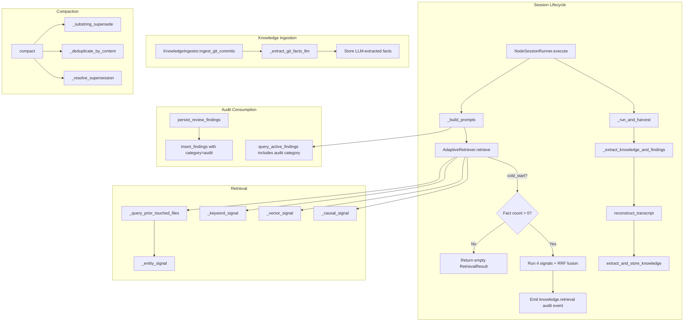
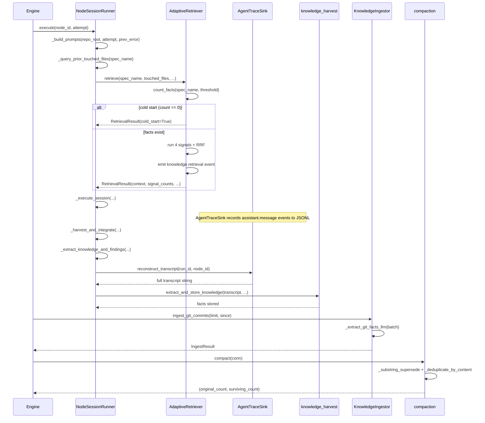

# Design Document: Knowledge System Effectiveness

## Overview

This spec fixes six effectiveness failures in the knowledge pipeline: (1)
extraction receives the session summary instead of the full transcript, (2) git
commits are stored verbatim as noise, (3) the entity signal is dead because
`touched_files=[]`, (4) audit reports have no downstream consumer, (5)
compaction barely triggers, and (6) cold-start retrieval executes four empty
signal queries. All changes land in existing modules — no new packages or
services are introduced.

## Architecture





### Module Responsibilities

1. **`agent_fox/knowledge/agent_trace.py`** — Records session events to JSONL;
   new `reconstruct_transcript()` function reads back assistant messages.
2. **`agent_fox/engine/session_lifecycle.py`** — Orchestrates session lifecycle;
   modified to reconstruct transcript from trace, query prior touched files,
   inject audit findings, and record retrieval summary.
3. **`agent_fox/engine/knowledge_harvest.py`** — Drives LLM fact extraction
   and storage; receives the full transcript instead of the session summary.
4. **`agent_fox/knowledge/ingest.py`** — Ingests external knowledge sources;
   modified to use LLM extraction for git commits instead of verbatim storage.
5. **`agent_fox/knowledge/retrieval.py`** — Multi-signal retrieval with RRF
   fusion; modified with cold-start skip and audit event emission.
6. **`agent_fox/knowledge/compaction.py`** — Fact deduplication and pruning;
   enhanced with substring supersession and minimum length filtering.
7. **`agent_fox/knowledge/extraction.py`** — LLM-based fact extraction from
   text; new prompt template for git commit extraction.
8. **`agent_fox/knowledge/audit.py`** — Audit event types; new
   `KNOWLEDGE_RETRIEVAL` event type added.
9. **`agent_fox/knowledge/review_store.py`** — Review findings persistence;
   `query_active_findings` already supports the audit category.
10. **`agent_fox/engine/review_persistence.py`** — Routes archetype outputs to
    typed parsers; audit-review path already persists to `review_findings`.

## Execution Paths

### Path 1: Full Transcript Knowledge Extraction

1. `session_lifecycle.py: NodeSessionRunner._run_and_harvest` — session completes
   with `status == "completed"` (line 700)
2. `session_lifecycle.py: NodeSessionRunner._extract_knowledge_and_findings` —
   called with `node_id`, `workspace` (line 701)
3. `agent_trace.py: reconstruct_transcript(audit_dir, run_id, node_id)` →
   `str` — **NEW**: reads JSONL, filters `assistant.message` events for
   `node_id`, concatenates content
4. `knowledge_harvest.py: extract_and_store_knowledge(transcript=<full transcript>, ...)`
   — receives the reconstructed transcript instead of the session summary
5. `extraction.py: extract_facts(transcript, spec_name, model_name)` →
   `list[Fact]` — LLM extraction now receives sufficient input
6. `knowledge_harvest.py: sync_facts_to_duckdb(knowledge_db, facts)` — persists
   extracted facts
7. `knowledge_harvest.py: _generate_embeddings(knowledge_db, facts, embedder)` —
   generates embeddings for new facts

### Path 2: LLM-Powered Git Commit Extraction

1. `ingest.py: KnowledgeIngestor.ingest_git_commits(limit=100)` — collects
   commits via `git log`
2. `ingest.py: KnowledgeIngestor._batch_commits(commits, batch_size=20)` →
   `list[list[CommitInfo]]` — **NEW**: groups commits into batches of 20,
   skipping messages shorter than 20 characters
3. `ingest.py: KnowledgeIngestor._extract_git_facts_llm(batch)` →
   `list[Fact]` — **NEW**: calls LLM with git-specific extraction prompt;
   returns facts with categories (decision, pattern, gotcha, convention) and
   variable confidence (high=0.9, medium=0.6, low=0.3)
4. `ingest.py: KnowledgeIngestor._store_embedding(fact_id, content, label)` →
   `bool` — generates embedding for each extracted fact
5. Side effect: facts inserted into `memory_facts` with `category='git'` and
   LLM-derived confidence

### Path 3: Entity Signal Activation via Prior Touched Files

1. `session_lifecycle.py: NodeSessionRunner._build_prompts(repo_root, attempt, prev_error)` —
   assembles prompts for coder session (line 237)
2. `session_lifecycle.py: NodeSessionRunner._query_prior_touched_files(spec_name)` →
   `list[str]` — **NEW**: queries `session_outcomes` for `touched_path` from
   prior completed sessions with the same `spec_name`, deduplicates, limits to
   50 most recent paths
3. `retrieval.py: AdaptiveRetriever.retrieve(touched_files=<prior paths>, ...)` →
   `RetrievalResult` — entity signal now receives real file paths
4. `retrieval.py: _entity_signal(touched_files, conn)` → `list[ScoredFact]` —
   BFS traversal of entity graph now returns entity-linked facts

### Path 4: Audit Report Consumption

1. `review_persistence.py: persist_review_findings(transcript, ...)` — already
   routes `audit-review` mode to `parse_auditor_output` (line 157)
2. `review_persistence.py: persist_auditor_results(spec_dir, result)` — writes
   audit report to `.agent-fox/audit/` (existing)
3. **NEW**: `review_persistence.py` — after persisting audit report, also calls
   `insert_findings(conn, findings)` with `category='audit'` for each
   non-PASS entry
4. `session_lifecycle.py: NodeSessionRunner._build_prompts` — existing
   `_build_retry_context` already calls `query_active_findings` which returns
   all categories including `'audit'`; **NEW**: extend to inject audit
   findings for first attempts (not just retries)

### Path 5: Cold-Start Detection and Skip

1. `retrieval.py: AdaptiveRetriever.retrieve(spec_name, ...)` — entry point
   (line 791)
2. `retrieval.py: AdaptiveRetriever._count_available_facts(spec_name, threshold)` →
   `int` — **NEW**: executes `SELECT COUNT(*) FROM memory_facts WHERE
   (spec_name = ? OR confidence >= ?) AND supersedes IS NULL`
3. If count == 0: return `RetrievalResult(context="", cold_start=True,
   signal_counts={})` with debug log "Skipping retrieval: no facts available
   (cold start)"
4. If count > 0: proceed with normal 4-signal retrieval

### Path 6: Compaction Improvements

1. `compaction.py: compact(conn)` — entry point (line 28)
2. `compaction.py: _filter_minimum_length(facts, min_length=50)` → `list[Fact]`
   — **NEW**: removes facts with `len(content) < 50`
3. `compaction.py: _substring_supersede(facts)` → `list[Fact]` — **NEW**:
   identifies facts whose content is a substring of another fact with equal or
   higher confidence; marks the shorter as superseded
4. `compaction.py: _deduplicate_by_content(facts)` → `list[Fact]` — existing
   content-hash dedup
5. `compaction.py: _resolve_supersession(facts)` → `list[Fact]` — existing
   chain resolution
6. Side effect: superseded facts updated in `memory_facts` with `supersedes`
   pointing to the surviving fact

### Path 7: Retrieval Quality Audit Event

1. `retrieval.py: AdaptiveRetriever.retrieve(...)` — after RRF fusion (line 883)
2. `retrieval.py: AdaptiveRetriever._emit_retrieval_event(...)` — **NEW**:
   emits `knowledge.retrieval` audit event with `spec_name`, `node_id`,
   `facts_returned`, `signals_active`, `cold_start`, `token_budget_used`
3. `session_lifecycle.py: NodeSessionRunner._run_and_harvest` — **NEW**: after
   retrieval, stores `retrieval_summary` dict on the `SessionRecord` for
   persistence to `session_outcomes`

## Components and Interfaces

### New Functions

```python
# agent_trace.py
def reconstruct_transcript(
    audit_dir: Path,
    run_id: str,
    node_id: str,
) -> str:
    """Read the agent trace JSONL file and reconstruct the full conversation
    transcript for a given node_id.

    Filters events to event_type == 'assistant.message' and matching node_id.
    Returns concatenated content strings separated by double newlines.
    Returns empty string if the file does not exist or contains no matching
    events.

    Requirements: 113-REQ-1.1, 113-REQ-1.E1, 113-REQ-1.E2
    """
```

```python
# ingest.py (on KnowledgeIngestor)
async def _extract_git_facts_llm(
    self,
    batch: list[tuple[str, str, str]],  # (sha, message, date)
    model_name: str = "SIMPLE",
) -> list[Fact]:
    """Extract structured facts from a batch of git commit messages using LLM.

    Returns facts with categories from {decision, pattern, gotcha, convention}
    and confidence derived from LLM response (high=0.9, medium=0.6, low=0.3).
    Returns empty list on LLM failure.

    Requirements: 113-REQ-2.1, 113-REQ-2.2, 113-REQ-2.3, 113-REQ-2.E1
    """
```

```python
# session_lifecycle.py (on NodeSessionRunner)
def _query_prior_touched_files(self, spec_name: str) -> list[str]:
    """Query session_outcomes for touched_path values from prior completed
    sessions with the same spec_name.

    Returns a deduplicated list of file paths, limited to the 50 most recently
    touched (by session created_at). Returns empty list if no prior sessions
    exist.

    Requirements: 113-REQ-3.1, 113-REQ-3.2, 113-REQ-3.E1
    """
```

```python
# retrieval.py (on AdaptiveRetriever)
def _count_available_facts(
    self,
    spec_name: str,
    confidence_threshold: float,
) -> int:
    """Count non-superseded facts matching spec_name or exceeding confidence
    threshold.

    Returns 0 on database error (triggering cold-start skip fallback to
    normal retrieval per 113-REQ-6.E1).

    Requirements: 113-REQ-6.1, 113-REQ-6.E1
    """
```

```python
# compaction.py
def _substring_supersede(
    facts: list[Fact],
) -> tuple[list[Fact], int]:
    """Identify facts whose content is a substring of another fact with equal
    or higher confidence. Mark the shorter fact as superseded by the longer.

    Returns (surviving_facts, superseded_count).

    Requirements: 113-REQ-5.1
    """
```

```python
# compaction.py
def _filter_minimum_length(
    facts: list[Fact],
    min_length: int = 50,
) -> tuple[list[Fact], int]:
    """Remove facts with content shorter than min_length characters.

    Returns (passing_facts, filtered_count).

    Requirements: 113-REQ-5.2
    """
```

### Modified Functions

```python
# session_lifecycle.py: _extract_knowledge_and_findings
# Before: reads session summary as transcript
# After: calls reconstruct_transcript() first, falls back to summary/_build_fallback_input
async def _extract_knowledge_and_findings(
    self,
    node_id: str,
    attempt: int,
    workspace: WorkspaceInfo,
    outcome_response: str = "",
) -> None:
    # NEW: reconstruct full transcript from agent trace JSONL
    # Falls back to session summary if trace unavailable
```

```python
# session_lifecycle.py: _build_prompts
# Before: passes touched_files=[]
# After: calls _query_prior_touched_files and passes result
def _build_prompts(
    self,
    repo_root: Path,
    attempt: int,
    previous_error: str | None,
) -> tuple[str, str]:
    # NEW: query prior touched files for entity signal
    # NEW: inject audit findings for all attempts (not just retries)
```

```python
# ingest.py: ingest_git_commits
# Before: stores raw commit messages at confidence=0.9
# After: batches commits, calls LLM extraction, stores extracted facts
async def ingest_git_commits(
    self,
    *,
    limit: int = 100,
    since: str | None = None,
    model_name: str = "SIMPLE",
) -> IngestResult:
    # NOTE: becomes async due to LLM call
```

```python
# retrieval.py: AdaptiveRetriever.retrieve
# Before: runs all 4 signals unconditionally
# After: checks cold-start first, emits retrieval audit event
def retrieve(self, ...) -> RetrievalResult:
    # NEW: cold-start check before signal queries
    # NEW: emit knowledge.retrieval audit event after fusion
    # MODIFIED: RetrievalResult gains cold_start field
```

```python
# compaction.py: compact
# Before: content-hash dedup + supersession resolution only
# After: adds minimum length filter + substring supersession
def compact(conn, path, ...) -> tuple[int, int]:
    # NEW: _filter_minimum_length step before dedup
    # NEW: _substring_supersede step after dedup
```

### Modified Data Structures

```python
# retrieval.py
@dataclass(frozen=True)
class RetrievalResult:
    context: str
    intent_profile: IntentProfile
    anchor_count: int
    signal_counts: dict[str, int] = field(default_factory=dict)
    sleep_hit: bool = False
    sleep_artifact_count: int = 0
    cold_start: bool = False  # NEW: 113-REQ-6.2
    token_budget_used: int = 0  # NEW: 113-REQ-7.1
```

```python
# knowledge/audit.py: AuditEventType
class AuditEventType(StrEnum):
    # ... existing members ...
    KNOWLEDGE_RETRIEVAL = "knowledge.retrieval"  # NEW: 113-REQ-7.1
```

### New Prompt Template

```python
# extraction.py
GIT_EXTRACTION_PROMPT: str = """Analyze the following batch of git commit messages
from a software project. Extract structured knowledge — decisions, patterns,
gotchas, and conventions — that would help a future developer working on
this codebase.

For each piece of knowledge, provide:
- content: A clear, standalone statement of the knowledge
- category: One of "decision", "pattern", "gotcha", "convention"
- confidence: "high", "medium", or "low"
- keywords: 2-5 relevant terms

Ignore boilerplate commits (version bumps, merge commits, trivial formatting).
Only extract knowledge that reveals intent, trade-offs, or non-obvious behavior.

Return a JSON array of objects. Return an empty array [] if no knowledge
can be extracted.

Commit messages:
{commits}
"""
```

## Database Changes

### Schema Migration (v-next)

No new tables. One new column on `session_outcomes`:

```sql
ALTER TABLE session_outcomes ADD COLUMN IF NOT EXISTS retrieval_summary TEXT;
-- JSON string: {"facts_injected": int, "signals_active": ["keyword", ...], "cold_start": bool}
```

## Correctness Properties

### CP-1: Transcript Fidelity

For any completed coder session S with `node_id` N in run R, if the agent
trace JSONL file `agent_{R}.jsonl` exists and contains at least one
`assistant.message` event with `node_id == N`, then the transcript passed to
`extract_and_store_knowledge()` SHALL contain the concatenated content of all
such events.

Validated by: test that reconstructed transcript equals the concatenation of
all assistant.message events for the target node_id from the JSONL file.

Requirements: 113-REQ-1.1, 113-REQ-1.2

### CP-2: Fallback Correctness

For any completed coder session S where the agent trace JSONL file does not
exist or contains zero assistant messages for the target `node_id`, the system
SHALL use `_build_fallback_input()` (commit diff + metadata) as the transcript
source, and SHALL NOT raise an exception.

Validated by: test with missing/empty JSONL file that extraction falls back
gracefully and a warning is logged.

Requirements: 113-REQ-1.E1, 113-REQ-1.E2

### CP-3: Git Fact Signal Quality

For any batch of git commits passed to `_extract_git_facts_llm()`, the
resulting facts SHALL have confidence values in {0.9, 0.6, 0.3} corresponding
to {high, medium, low} LLM assessments. No raw commit message SHALL be stored
as a fact when the LLM returns an empty extraction result for that batch.

Validated by: test that confidence values are exactly one of the three allowed
values, and test that empty LLM response produces zero stored facts.

Requirements: 113-REQ-2.1, 113-REQ-2.2, 113-REQ-2.3

### CP-4: Entity Signal Liveness

For any coder session targeting spec S where at least one prior completed
session for spec S has a non-null `touched_path` in `session_outcomes`, the
`touched_files` parameter passed to `AdaptiveRetriever.retrieve()` SHALL be
non-empty and contain at most 50 paths.

Validated by: test with seeded `session_outcomes` rows that retriever receives
the expected touched_files list.

Requirements: 113-REQ-3.1, 113-REQ-3.2

### CP-5: Audit Finding Persistence

For any audit-review session that produces a non-PASS `AuditResult`, every
entry in the result SHALL be persisted in `review_findings` with
`category='audit'`. These findings SHALL be returned by
`query_active_findings()` for subsequent coder sessions.

Validated by: test that persisted audit findings appear in
`query_active_findings` results and are included in coder prompt context.

Requirements: 113-REQ-4.1, 113-REQ-4.2

### CP-6: Cold-Start Efficiency

For any call to `AdaptiveRetriever.retrieve()` where zero non-superseded facts
match the spec_name or exceed the confidence threshold, the system SHALL
execute exactly one SQL query (the count query) and zero signal queries.

Validated by: test with empty `memory_facts` table that no signal functions are
called and `cold_start=True` is set on the result.

Requirements: 113-REQ-6.1, 113-REQ-6.2

### CP-7: Compaction Monotonicity

For any compaction run, the surviving fact count SHALL be less than or equal to
the input fact count. Every superseded fact SHALL have its `supersedes` field
set to the ID of a surviving fact with equal or higher confidence.

Validated by: test that superseded facts point to higher-confidence survivors,
and that the output count never exceeds the input count.

Requirements: 113-REQ-5.1, 113-REQ-5.3

### CP-8: Minimum Content Length Enforcement

For any fact ingestion path (LLM extraction, git extraction), no fact with
`len(content) < 50` SHALL be stored in `memory_facts`.

Validated by: test that facts shorter than 50 characters are filtered before
storage.

Requirements: 113-REQ-5.2

### CP-9: Retrieval Audit Trail

For any non-empty, non-cold-start retrieval, exactly one `knowledge.retrieval`
audit event SHALL be emitted containing `spec_name`, `node_id`,
`facts_returned`, `signals_active`, `cold_start`, and `token_budget_used`.

Validated by: test that the audit event is emitted with correct fields after
retrieval returns facts.

Requirements: 113-REQ-7.1

## Error Handling

| Scenario | Requirement | Behavior |
|----------|-------------|----------|
| Agent trace JSONL missing or unreadable | 113-REQ-1.E1 | Fall back to `_build_fallback_input`; log warning |
| Zero assistant messages in trace for node_id | 113-REQ-1.E2 | Skip extraction; log debug message |
| LLM git extraction call fails | 113-REQ-2.E1 | Skip batch; log warning; continue with next batch |
| Commit message < 20 chars | 113-REQ-2.E2 | Exclude from LLM batch silently |
| No prior sessions for spec (first session) | 113-REQ-3.E1 | Pass `touched_files=[]`; entity signal returns empty |
| Audit report unparseable | 113-REQ-4.E1 | Log warning; retain raw report; do not persist findings |
| Compaction reduces facts by > 50% | 113-REQ-5.E1 | Log info with before/after counts |
| Cold-start count query fails | 113-REQ-6.E1 | Proceed with normal retrieval; log warning |
| Retrieval audit event emission fails | 113-REQ-7.E1 | Continue without blocking; log warning |

## Definition of Done

1. All 7 requirements pass their acceptance criteria tests.
2. All 9 correctness properties are validated by automated tests.
3. All edge cases are covered by tests.
4. `make check` passes with no regressions.
5. No new lint warnings or type errors.

## Testing Strategy

- **Unit tests** for each new function (`reconstruct_transcript`,
  `_extract_git_facts_llm`, `_query_prior_touched_files`,
  `_count_available_facts`, `_substring_supersede`, `_filter_minimum_length`).
- **Integration tests** with a real DuckDB connection for cold-start skip,
  entity signal with seeded session_outcomes, and compaction improvements.
- **Mock LLM tests** for git commit extraction (mock the LLM call, verify
  fact structure and confidence mapping).
- **Regression tests** ensuring existing retrieval behavior is preserved when
  facts exist (non-cold-start path).
