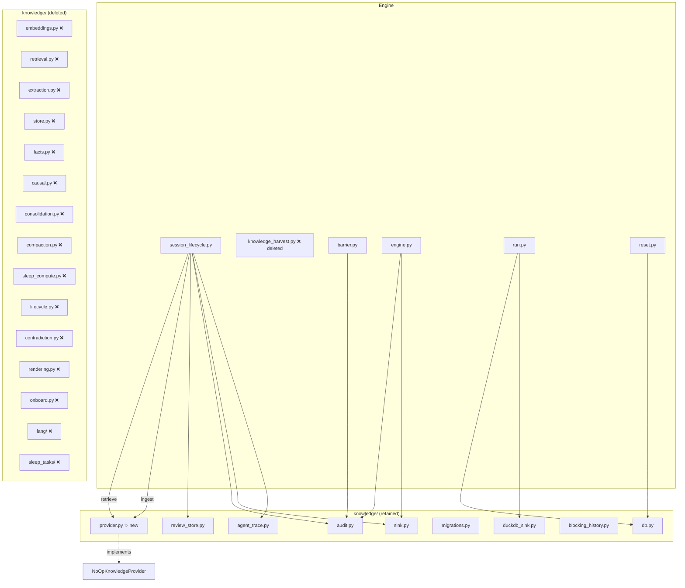

# Design Document: Knowledge System Decoupling

## Overview

This spec removes 35+ low-value knowledge modules (embedding pipeline, vector
search, 4-signal retrieval, fact extraction, causal chains, contradiction
detection, entity graph, sleep compute, static analysis, onboarding, compaction,
consolidation, language analyzers) and replaces them with a two-method
`KnowledgeProvider` protocol. The engine calls `retrieve()` pre-session and
`ingest()` post-session through the protocol — never importing knowledge
internals directly. A `NoOpKnowledgeProvider` ships as the default
implementation so the engine runs immediately after removal with zero knowledge
overhead.

High-value operational modules are retained in `knowledge/`: audit, sink,
DuckDB sink, DB connection, migrations, review store, blocking history, and
agent trace. These are operational infrastructure, not the knowledge pipeline.

## Architecture



### Module Responsibilities

1. **`provider.py`** (new) — Defines `KnowledgeProvider` protocol and
   `NoOpKnowledgeProvider` implementation.
2. **`audit.py`** (retained) — Structured audit event data model, event types,
   severity enums, run ID generation.
3. **`sink.py`** (retained) — `SessionSink` protocol, `SinkDispatcher`,
   event dataclasses.
4. **`duckdb_sink.py`** (retained) — DuckDB implementation of `SessionSink`.
5. **`db.py`** (retained) — DuckDB connection lifecycle, schema init,
   `open_knowledge_store`.
6. **`migrations.py`** (retained) — Schema versioning, forward-only migration
   runner.
7. **`review_store.py`** (retained) — CRUD for `review_findings` and
   `verification_results`.
8. **`blocking_history.py`** (retained) — Blocking decision tracking and
   threshold learning.
9. **`agent_trace.py`** (retained) — JSONL event sink for transcript
   reconstruction.
10. **`session_lifecycle.py`** (modified) — Retrieval assembly replaced with
    `KnowledgeProvider.retrieve()` call. Knowledge harvest replaced with
    `KnowledgeProvider.ingest()` call.
11. **`barrier.py`** (modified) — Consolidation, compaction, lifecycle cleanup,
    sleep compute, and rendering calls removed.
12. **`engine.py`** (modified) — End-of-run consolidation and rendering removed.
13. **`run.py`** (modified) — `EmbeddingGenerator` and `run_background_ingestion`
    imports removed. Provider injected via factory.
14. **`reset.py`** (modified) — `compact` import removed.

## Execution Paths

### Path 1: Pre-session knowledge retrieval

1. `engine/run.py: _setup_infrastructure` — creates `NoOpKnowledgeProvider`,
   passes to `NodeSessionRunner` via factory
2. `engine/session_lifecycle.py: NodeSessionRunner.__init__` — stores
   `knowledge_provider` reference
3. `engine/session_lifecycle.py: NodeSessionRunner._build_prompts` — calls
   `self._knowledge_provider.retrieve(spec_name, task_description)` →
   `list[str]`
4. `session/prompt.py: assemble_context` — receives returned strings as
   `memory_facts` parameter

### Path 2: Post-session knowledge ingestion

1. `engine/session_lifecycle.py: NodeSessionRunner._run_and_harvest` — after
   successful harvest, calls `_ingest_knowledge`
2. `engine/session_lifecycle.py: NodeSessionRunner._ingest_knowledge` — builds
   context dict with `touched_files`, `commit_sha`, `session_status`, calls
   `self._knowledge_provider.ingest(session_id, spec_name, context)` → `None`

### Path 3: Sync barrier (simplified)

1. `engine/engine.py: Orchestrator._run_loop` — detects barrier threshold
2. `engine/barrier.py: run_sync_barrier_sequence` — runs worktree verification,
   develop sync, hot-load, barrier callback, config reload
3. No consolidation, compaction, lifecycle cleanup, sleep compute, or rendering
   steps remain

### Path 4: Engine initialization

1. `engine/run.py: _setup_infrastructure` — opens `KnowledgeDB` via
   `open_knowledge_store`, creates `DuckDBSink`, creates `AgentTraceSink`,
   creates `NoOpKnowledgeProvider`
2. `engine/run.py: _setup_infrastructure` — no `EmbeddingGenerator` creation,
   no `run_background_ingestion` call
3. Returns infrastructure dict including `knowledge_provider`

### Path 5: Review findings persistence (unchanged)

1. `engine/session_lifecycle.py: NodeSessionRunner._extract_knowledge_and_findings`
   — calls `_persist_review_findings` (retained, unmodified)
2. `engine/review_persistence.py: persist_review_findings` — writes to
   `review_store` (retained, unmodified)

## Components and Interfaces

### KnowledgeProvider Protocol

```python
# agent_fox/knowledge/provider.py

from typing import Protocol, runtime_checkable

@runtime_checkable
class KnowledgeProvider(Protocol):
    def ingest(
        self,
        session_id: str,
        spec_name: str,
        context: dict,
    ) -> None:
        """Ingest knowledge from a completed session.

        Args:
            session_id: Node ID of the completed session.
            spec_name: Name of the spec the session belongs to.
            context: Dict with at minimum 'touched_files' (list[str]),
                     'commit_sha' (str), 'session_status' (str).
        """
        ...

    def retrieve(
        self,
        spec_name: str,
        task_description: str,
    ) -> list[str]:
        """Retrieve knowledge context for an upcoming session.

        Args:
            spec_name: Name of the spec being worked on.
            task_description: Human-readable description of the task.

        Returns:
            List of formatted text blocks ready for prompt injection.
            Empty list means no knowledge context.
        """
        ...


class NoOpKnowledgeProvider:
    """Knowledge provider that does nothing.

    Default implementation used when no knowledge system is configured.
    """

    def ingest(
        self,
        session_id: str,
        spec_name: str,
        context: dict,
    ) -> None:
        return None

    def retrieve(
        self,
        spec_name: str,
        task_description: str,
    ) -> list[str]:
        return []
```

### Modified NodeSessionRunner Interface

```python
class NodeSessionRunner:
    def __init__(
        self,
        node_id: str,
        config: AgentFoxConfig,
        *,
        archetype: str = "coder",
        mode: str | None = None,
        instances: int = 1,
        sink_dispatcher: SinkDispatcher | None = None,
        knowledge_db: KnowledgeDB,
        knowledge_provider: KnowledgeProvider,  # NEW — replaces embedder
        activity_callback: ActivityCallback | None = None,
        assessed_tier: ModelTier | None = None,
        run_id: str = "",
        timeout_override: int | None = None,
        max_turns_override: int | None = None,
        trace_enabled: bool = True,
    ) -> None: ...
```

### Modified KnowledgeConfig

```python
class KnowledgeConfig(BaseModel):
    model_config = ConfigDict(extra="ignore")
    store_path: str = Field(
        default=".agent-fox/knowledge.duckdb",
        description="Path to knowledge store",
    )
```

## Data Models

### Context Dictionary (ingest)

```python
{
    "touched_files": ["src/foo.py", "tests/test_foo.py"],
    "commit_sha": "abc123def456",
    "session_status": "completed",  # | "failed"
}
```

### Retrieve Return Value

```python
["Formatted fact block 1\n...", "Formatted fact block 2\n..."]
# Or empty list [] when no knowledge is available
```

## Operational Readiness

### Observability

- Audit events (`AuditEventType`) are retained and continue to fire for session
  lifecycle events.
- `HARVEST_COMPLETE` audit events will no longer be emitted (the harvest module
  is deleted).
- `SLEEP_COMPUTE_COMPLETE` audit events will no longer be emitted.
- Session outcome recording via `DuckDBSink` is unaffected.

### Rollout / Rollback

- This is a destructive removal. Rollback requires reverting the commit.
- Old DuckDB tables (`memory_facts`, `memory_embeddings`, `entity_graph`, etc.)
  are left in place — no migration needed.
- Configuration files with old fields are handled by Pydantic `extra="ignore"`.

### Migration / Compatibility

- No schema migration required. Tables for removed features stop being read/written.
- Configuration files with removed fields (e.g., `embedding_model`,
  `dedup_similarity_threshold`) are silently ignored.

## Correctness Properties

### Property 1: Protocol Structural Conformance

*For any* class C that implements both `ingest(session_id: str, spec_name: str, context: dict) -> None` and `retrieve(spec_name: str, task_description: str) -> list[str]`, `isinstance(C(), KnowledgeProvider)` SHALL return True.

**Validates: Requirements 1.1, 1.2, 2.1**

### Property 2: NoOp Retrieve Idempotency

*For any* values of `spec_name` and `task_description`, `NoOpKnowledgeProvider().retrieve(spec_name, task_description)` SHALL return an empty list `[]`.

**Validates: Requirements 2.3, 2.E1**

### Property 3: NoOp Ingest Safety

*For any* values of `session_id`, `spec_name`, and `context` dict, `NoOpKnowledgeProvider().ingest(session_id, spec_name, context)` SHALL return `None` without raising an exception.

**Validates: Requirements 2.2**

### Property 4: Engine Import Isolation

*For any* Python module in `agent_fox/engine/`, the set of names imported from `agent_fox.knowledge.*` SHALL NOT include any name from the deleted module set: `AdaptiveRetriever`, `RetrievalConfig`, `EmbeddingGenerator`, `extract_facts`, `extract_and_store_knowledge`, `store_causal_links`, `dedup_new_facts`, `detect_contradictions`, `run_consolidation`, `compact`, `render_summary`, `SleepComputer`, `SleepContext`, `BundleBuilder`, `ContextRewriter`, `run_cleanup`, `load_all_facts`, `Fact`.

**Validates: Requirements 3.2, 4.2, 5.1**

### Property 5: Deletion Completeness

*For any* file path in the deletion manifest (REQ 7.1, 7.2, 7.3, 7.4), that path SHALL NOT exist on disk after the spec is implemented.

**Validates: Requirements 7.1, 7.2, 7.3, 7.4**

### Property 6: Import Health

*For any* module in the `agent_fox` package, `importlib.import_module(module)` SHALL succeed without `ImportError` after all deletions are applied.

**Validates: Requirements 7.5, 10.1**

### Property 7: Configuration Backward Compatibility

*For any* configuration dictionary containing fields from the old `KnowledgeConfig` (e.g., `embedding_model`, `dedup_similarity_threshold`, `retrieval`, `sleep`), constructing a new `KnowledgeConfig` from that dictionary SHALL succeed without raising `ValidationError`.

**Validates: Requirements 8.1, 8.2, 8.3, 8.5**

### Property 8: Retrieve Failure Resilience

*For any* `KnowledgeProvider` implementation whose `retrieve()` raises an arbitrary exception, the engine's `_build_prompts` method SHALL catch the exception, log at WARNING level, and proceed with an empty knowledge context.

**Validates: Requirements 3.E1**

### Property 9: Ingest Failure Resilience

*For any* `KnowledgeProvider` implementation whose `ingest()` raises an arbitrary exception, the engine's `_ingest_knowledge` method SHALL catch the exception, log at WARNING level, and continue without retrying.

**Validates: Requirements 4.E1**

## Error Handling

| Error Condition | Behavior | Requirement |
|----------------|----------|-------------|
| `retrieve()` raises exception | Log WARNING, use empty context | 114-REQ-3.E1 |
| `ingest()` raises exception | Log WARNING, continue without retry | 114-REQ-4.E1 |
| Old config fields present | Silently ignored via `extra="ignore"` | 114-REQ-8.5 |
| Import of deleted module | `ImportError` at startup (fails fast) | 114-REQ-7.5 |
| Old DB tables exist | Not read or written; left in place | 114-REQ-5.E1, 114-REQ-6.E1 |
| Partial protocol impl | `TypeError` on `isinstance()` check | 114-REQ-1.E1 |
| Removed CLI command invoked | Command not registered; Click error | 114-REQ-9.E1 |

## Technology Stack

- **Language:** Python 3.12+
- **Type checking:** `typing.Protocol`, `runtime_checkable`
- **Configuration:** Pydantic v2 with `extra="ignore"`
- **Database:** DuckDB (retained for operational tables)
- **Testing:** pytest, Hypothesis (property tests)

## Definition of Done

A task group is complete when ALL of the following are true:

1. All subtasks within the group are checked off (`[x]`)
2. All spec tests (`test_spec.md` entries) for the task group pass
3. All property tests for the task group pass
4. All previously passing tests still pass (no regressions)
5. No linter warnings or errors introduced
6. Code is committed on a feature branch and merged into `develop`
7. Feature branch is merged back to `develop`
8. `tasks.md` checkboxes are updated to reflect completion

## Testing Strategy

- **Unit tests:** Verify `KnowledgeProvider` protocol conformance,
  `NoOpKnowledgeProvider` behavior, `KnowledgeConfig` field removal.
- **Property tests:** Hypothesis-driven tests for protocol conformance
  (Property 1), NoOp idempotency (Property 2-3), config backward compatibility
  (Property 7).
- **Integration tests:** Import health check across all `agent_fox` modules
  (Property 6). Engine import isolation scan (Property 4). File deletion
  verification (Property 5).
- **Smoke tests:** End-to-end engine run with `NoOpKnowledgeProvider` verifying
  session preparation and completion without knowledge overhead.
