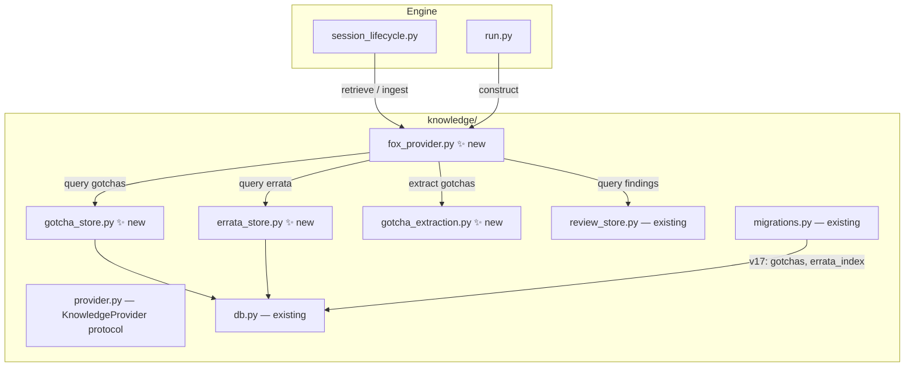
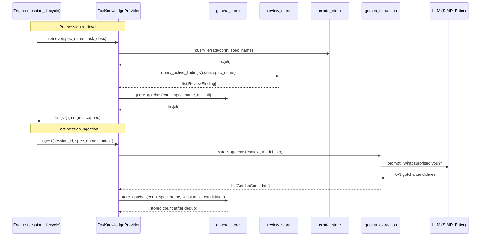

# Design Document: Pluggable Knowledge Provider

## Overview

This spec implements the `KnowledgeProvider` protocol (defined in spec 114)
with a concrete `FoxKnowledgeProvider` that stores and retrieves scoped,
high-signal knowledge. Three knowledge categories are supported:

- **Gotchas** — surprising or non-obvious findings extracted from session
  transcripts by an LLM, stored in a new `gotchas` DuckDB table.
- **Review carry-forward** — unresolved critical/major review findings read
  from the existing `review_findings` table at retrieval time.
- **Errata** — spec-to-errata-document pointers stored in a new `errata_index`
  DuckDB table.

Retrieval is scoped by `spec_name` with a configurable cap (default 10 items).
No embeddings or vector search. All queries are direct DuckDB column filters.

## Architecture





### Module Responsibilities

1. **`fox_provider.py`** (new) — `FoxKnowledgeProvider` class implementing the
   `KnowledgeProvider` protocol. Orchestrates retrieval from three categories
   and ingestion of gotchas.
2. **`gotcha_store.py`** (new) — DuckDB CRUD for the `gotchas` table. Query by
   spec_name with TTL and limit. Store with content-hash deduplication.
3. **`errata_store.py`** (new) — DuckDB CRUD for the `errata_index` table.
   Query by spec_name. Register/unregister errata entries.
4. **`gotcha_extraction.py`** (new) — LLM prompt construction and response
   parsing for gotcha extraction. Returns 0-3 `GotchaCandidate` objects.
5. **`review_store.py`** (existing) — Provides `query_active_findings()` for
   review carry-forward. Unmodified.
6. **`db.py`** (existing) — `KnowledgeDB` connection management. Unmodified.
7. **`migrations.py`** (existing) — Extended with migration v17 for `gotchas`
   and `errata_index` tables.

## Execution Paths

### Path 1: Pre-session knowledge retrieval

1. `engine/session_lifecycle.py: NodeSessionRunner._build_prompts` — calls
   `self._knowledge_provider.retrieve(spec_name, task_description)` →
   `list[str]`
2. `knowledge/fox_provider.py: FoxKnowledgeProvider.retrieve` — orchestrates
   three sub-queries
3. `knowledge/errata_store.py: query_errata(conn, spec_name)` → `list[str]`
   (prefixed with `[ERRATA] `)
4. `knowledge/review_store.py: query_active_findings(conn, spec_name)` →
   `list[ReviewFinding]` → formatted to `list[str]` (prefixed with
   `[REVIEW] `)
5. `knowledge/gotcha_store.py: query_gotchas(conn, spec_name, ttl_days, limit)` →
   `list[str]` (prefixed with `[GOTCHA] `)
6. `knowledge/fox_provider.py: FoxKnowledgeProvider._compose_results` —
   merges categories in priority order (errata, review, gotchas), trims
   gotchas if total exceeds `max_items` → `list[str]`

### Path 2: Post-session gotcha ingestion

1. `engine/session_lifecycle.py: NodeSessionRunner._ingest_knowledge` — calls
   `self._knowledge_provider.ingest(session_id, spec_name, context)`
2. `knowledge/fox_provider.py: FoxKnowledgeProvider.ingest` — checks
   `context["session_status"] == "completed"`, calls extraction
3. `knowledge/gotcha_extraction.py: extract_gotchas(context, model_tier)` →
   `list[GotchaCandidate]` (0-3 items, capped)
4. `knowledge/gotcha_store.py: store_gotchas(conn, spec_name, session_id, candidates)` →
   `int` (stored count after content-hash dedup)

### Path 3: Errata registration

1. `knowledge/errata_store.py: register_errata(conn, spec_name, file_path)` →
   `ErrataEntry` (the registered entry)
2. DuckDB `errata_index` table — side effect: row inserted with
   `(spec_name, file_path, created_at)`

### Path 4: Provider construction at engine startup

1. `engine/run.py: _setup_infrastructure` — reads `KnowledgeProviderConfig`
   from `config.knowledge.provider`
2. `engine/run.py: _setup_infrastructure` — constructs
   `FoxKnowledgeProvider(knowledge_db, provider_config)` → provider instance
3. Returns infrastructure dict with `knowledge_provider` key

## Components and Interfaces

### FoxKnowledgeProvider

```python
# agent_fox/knowledge/fox_provider.py

from agent_fox.knowledge.provider import KnowledgeProvider
from agent_fox.knowledge.db import KnowledgeDB

class FoxKnowledgeProvider:
    """Concrete KnowledgeProvider: gotchas + review carry-forward + errata."""

    def __init__(
        self,
        knowledge_db: KnowledgeDB,
        config: KnowledgeProviderConfig,
    ) -> None: ...

    def retrieve(
        self,
        spec_name: str,
        task_description: str,
    ) -> list[str]: ...

    def ingest(
        self,
        session_id: str,
        spec_name: str,
        context: dict,
    ) -> None: ...

    def _compose_results(
        self,
        errata: list[str],
        reviews: list[str],
        gotchas: list[str],
    ) -> list[str]: ...
```

### Gotcha Store

```python
# agent_fox/knowledge/gotcha_store.py

import duckdb

@dataclass(frozen=True)
class GotchaRecord:
    id: str
    spec_name: str
    text: str
    content_hash: str
    session_id: str
    created_at: datetime

def query_gotchas(
    conn: duckdb.DuckDBPyConnection,
    spec_name: str,
    ttl_days: int,
    limit: int = 5,
) -> list[str]:
    """Query non-expired gotchas for spec, ordered by recency.
    Returns formatted strings prefixed with [GOTCHA]."""
    ...

def store_gotchas(
    conn: duckdb.DuckDBPyConnection,
    spec_name: str,
    session_id: str,
    candidates: list[GotchaCandidate],
) -> int:
    """Store gotcha candidates with content-hash dedup.
    Returns count of actually stored (non-duplicate) gotchas."""
    ...

def compute_content_hash(text: str) -> str:
    """SHA-256 of normalized (lowered, whitespace-collapsed) text."""
    ...
```

### Errata Store

```python
# agent_fox/knowledge/errata_store.py

import duckdb

@dataclass(frozen=True)
class ErrataEntry:
    spec_name: str
    file_path: str
    created_at: datetime

def query_errata(
    conn: duckdb.DuckDBPyConnection,
    spec_name: str,
) -> list[str]:
    """Query errata entries for spec.
    Returns formatted strings prefixed with [ERRATA]."""
    ...

def register_errata(
    conn: duckdb.DuckDBPyConnection,
    spec_name: str,
    file_path: str,
) -> ErrataEntry:
    """Register an errata entry. Idempotent (ON CONFLICT DO NOTHING).
    Returns the registered entry."""
    ...

def unregister_errata(
    conn: duckdb.DuckDBPyConnection,
    spec_name: str,
    file_path: str,
) -> bool:
    """Remove an errata entry. Returns True if a row was deleted."""
    ...
```

### Gotcha Extraction

```python
# agent_fox/knowledge/gotcha_extraction.py

@dataclass(frozen=True)
class GotchaCandidate:
    text: str
    content_hash: str  # computed at extraction time

async def extract_gotchas(
    context: dict,
    model_tier: str = "SIMPLE",
) -> list[GotchaCandidate]:
    """Prompt the LLM for 0-3 gotcha candidates.
    Caps at 3 even if LLM returns more.
    Returns empty list on LLM failure."""
    ...
```

### KnowledgeProviderConfig

```python
# In agent_fox/core/config.py

class KnowledgeProviderConfig(BaseModel):
    model_config = ConfigDict(extra="ignore")

    max_items: int = Field(default=10, description="Max total retrieval items")
    gotcha_ttl_days: int = Field(default=90, description="Days before gotcha expiry")
    model_tier: str = Field(default="SIMPLE", description="LLM tier for gotcha extraction")
```

## Data Models

### gotchas Table (DuckDB)

```sql
CREATE TABLE IF NOT EXISTS gotchas (
    id           VARCHAR PRIMARY KEY,
    spec_name    VARCHAR NOT NULL,
    category     VARCHAR NOT NULL DEFAULT 'gotcha',
    text         VARCHAR NOT NULL,
    content_hash VARCHAR NOT NULL,
    session_id   VARCHAR NOT NULL,
    created_at   TIMESTAMP NOT NULL DEFAULT CURRENT_TIMESTAMP
);
```

### errata_index Table (DuckDB)

```sql
CREATE TABLE IF NOT EXISTS errata_index (
    spec_name  VARCHAR NOT NULL,
    file_path  VARCHAR NOT NULL,
    created_at TIMESTAMP NOT NULL DEFAULT CURRENT_TIMESTAMP,
    PRIMARY KEY (spec_name, file_path)
);
```

### Gotcha Extraction Prompt

```text
Based on this coding session, what was surprising or non-obvious?
What would you want to know if you were starting a new session on this spec?

Return 0-3 bullet points. Each should describe ONE specific gotcha:
something that looks like it should work but doesn't, a hidden constraint,
or an unexpected behavior. Return nothing if the session was straightforward.

Session context:
- Spec: {spec_name}
- Touched files: {touched_files}
- Status: {session_status}
```

### Retrieval Output Format

```python
[
    "[ERRATA] docs/errata/28_github_issue_rest_api.md",
    "[REVIEW] [critical] Security: SQL injection in query builder — unparameterized user input in WHERE clause",
    "[GOTCHA] The DuckDB ON CONFLICT clause requires explicit column list; omitting it silently does nothing",
]
```

## Operational Readiness

### Observability

- Gotcha ingestion count logged at INFO level per session.
- Retrieval item counts per category logged at DEBUG level.
- LLM extraction failures logged at WARNING level.

### Rollout / Rollback

- New tables (`gotchas`, `errata_index`) are additive — no risk of breaking
  existing data.
- Rollback: revert the commit and set `NoOpKnowledgeProvider` as default in
  `run.py`. The new tables remain inert.

### Migration / Compatibility

- Migration v17 creates both tables with `IF NOT EXISTS`.
- Existing databases gain the new tables on first open.
- Fresh databases get them via the initial schema + migration path.

## Correctness Properties

### Property 1: Protocol Conformance

*For any* instance of `FoxKnowledgeProvider`, `isinstance(instance, KnowledgeProvider)` SHALL return `True`.

**Validates: Requirements 1.1, 1.2**

### Property 2: Gotcha Deduplication

*For any* sequence of gotcha candidates where two candidates have the same
normalized text, `store_gotchas` SHALL store at most one record for that
content hash per spec_name.

**Validates: Requirements 2.4, 2.E1**

### Property 3: Gotcha TTL Exclusion

*For any* `gotcha_ttl_days` value T and gotcha with `created_at` older than
T days, `query_gotchas` SHALL NOT include that gotcha in the result.

**Validates: Requirements 3.2, 7.1**

### Property 4: Retrieval Cap

*For any* retrieval call, the total number of returned items SHALL NOT exceed
`max_items`, except when review findings and errata alone exceed `max_items`
(in which case gotchas are excluded but reviews+errata are all returned).

**Validates: Requirements 6.1, 6.2, 6.E2**

### Property 5: Category Priority Order

*For any* retrieval result with items from multiple categories, the items SHALL
appear in order: errata first, then review findings, then gotchas.

**Validates: Requirements 6.3**

### Property 6: Gotcha Extraction Cap

*For any* LLM response returning N candidates where N > 3, `extract_gotchas`
SHALL return exactly 3 candidates.

**Validates: Requirements 2.E3**

### Property 7: Failed Session Skip

*For any* `ingest()` call where `context["session_status"]` is not
`"completed"`, the provider SHALL not call the LLM and SHALL return
immediately.

**Validates: Requirements 2.5**

### Property 8: Content Hash Determinism

*For any* text string T, `compute_content_hash(T)` SHALL always return the
same SHA-256 value. *For any* two texts T1, T2 that differ only in
whitespace or casing, `compute_content_hash(T1)` SHALL equal
`compute_content_hash(T2)`.

**Validates: Requirements 2.4**

### Property 9: Review Category Prefix

*For any* review finding returned by `retrieve()`, the string SHALL start
with `"[REVIEW] "` and contain the finding's severity and description.

**Validates: Requirements 4.3**

## Error Handling

| Error Condition | Behavior | Requirement |
|----------------|----------|-------------|
| KnowledgeDB connection closed | Raise descriptive error | 115-REQ-1.E1 |
| LLM extraction failure | Log WARNING, return empty | 115-REQ-2.E2 |
| LLM returns >3 gotchas | Truncate to first 3 | 115-REQ-2.E3 |
| Duplicate gotcha hash | Skip silently | 115-REQ-2.E1 |
| No gotchas for spec | Empty gotcha contribution | 115-REQ-3.E1 |
| No findings for spec | Empty review contribution | 115-REQ-4.E1 |
| review_findings table missing | Empty review contribution | 115-REQ-4.E2 |
| No errata for spec | Empty errata contribution | 115-REQ-5.E1 |
| Errata file missing on disk | Still return entry | 115-REQ-5.E2 |
| All categories empty | Return empty list | 115-REQ-6.E1 |
| Reviews+errata exceed cap | Return all, omit gotchas | 115-REQ-6.E2 |
| gotcha_ttl_days is 0 | Exclude all gotchas | 115-REQ-7.E1 |

## Technology Stack

- **Language:** Python 3.12+
- **Database:** DuckDB (existing knowledge store)
- **LLM:** Anthropic API via SIMPLE model tier
- **Hashing:** `hashlib.sha256` for content deduplication
- **Configuration:** Pydantic v2 with `extra="ignore"`
- **Testing:** pytest, Hypothesis (property tests)

## Definition of Done

A task group is complete when ALL of the following are true:

1. All subtasks within the group are checked off (`[x]`)
2. All spec tests (`test_spec.md` entries) for the task group pass
3. All property tests for the task group pass
4. All previously passing tests still pass (no regressions)
5. No linter warnings or errors introduced
6. Code is committed on a feature branch and merged into `develop`
7. Feature branch is merged back to `develop`
8. `tasks.md` checkboxes are updated to reflect completion

## Testing Strategy

- **Unit tests:** `FoxKnowledgeProvider` protocol conformance, gotcha store
  CRUD, errata store CRUD, content hash determinism, retrieval composition
  with cap and priority. Uses in-memory DuckDB connections.
- **Property tests:** Hypothesis-driven tests for deduplication (Property 2),
  TTL exclusion (Property 3), retrieval cap (Property 4), category ordering
  (Property 5), content hash normalization (Property 8).
- **Integration tests:** Smoke tests for retrieval path (real provider,
  in-memory DB, mock LLM), ingestion path (real provider, in-memory DB,
  mock LLM), provider construction at startup.
