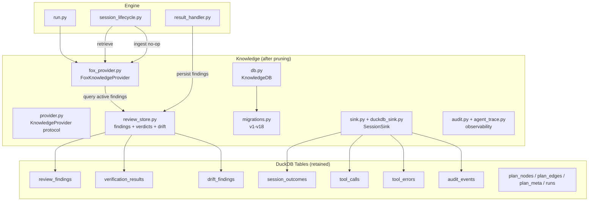

# Design Document: Knowledge System Pruning

## Overview

This change removes dead and noise-producing components from the knowledge
system while preserving the review-findings carry-forward pipeline that
demonstrated value. The change is subtractive: files are deleted, tables
are dropped, and the `FoxKnowledgeProvider` is simplified. No new features
are added.

## Architecture



### Files Removed

| File | Reason |
|------|--------|
| `gotcha_extraction.py` | Noise-producing LLM extraction |
| `gotcha_store.py` | Storage for noise data |
| `errata_store.py` | Never populated in production |
| `blocking_history.py` | Broken recording, infeasible learning |

### Module Responsibilities (post-pruning)

1. **provider.py** — Defines `KnowledgeProvider` protocol and `NoOpKnowledgeProvider`
2. **fox_provider.py** — Implements `KnowledgeProvider` with review-only retrieval
3. **review_store.py** — CRUD for review_findings, verification_results, drift_findings
4. **db.py** — DuckDB connection lifecycle and schema initialization
5. **migrations.py** — Forward-only schema migrations (v1–v18)
6. **sink.py** — `SessionSink` protocol and `SinkDispatcher`
7. **duckdb_sink.py** — `DuckDBSink` writing session_outcomes, tool_calls, tool_errors, audit_events
8. **audit.py** — `AuditEvent` model, JSONL sink, retention enforcement
9. **agent_trace.py** — Session conversation trace (JSONL), transcript reconstruction

## Execution Paths

### Path 1: Pre-session knowledge retrieval

1. `engine/run.py: _setup_infrastructure` — creates `FoxKnowledgeProvider(knowledge_db, config)`
2. `engine/session_lifecycle.py: NodeSessionRunner._build_prompts` — calls `knowledge_provider.retrieve(spec_name, task_description)`
3. `knowledge/fox_provider.py: FoxKnowledgeProvider.retrieve` — calls `_query_reviews(conn, spec_name)`
4. `knowledge/fox_provider.py: FoxKnowledgeProvider._query_reviews` — calls `review_store.query_active_findings(conn, spec_name)` → `list[ReviewFinding]`
5. `knowledge/fox_provider.py: FoxKnowledgeProvider._query_reviews` — filters to critical/major, formats as `[REVIEW]` strings → `list[str]`
6. `engine/session_lifecycle.py: NodeSessionRunner._build_prompts` — injects retrieved strings into session context

### Path 2: Post-session ingestion (no-op)

1. `engine/session_lifecycle.py: NodeSessionRunner._run_and_harvest` — calls `self._ingest_knowledge(node_id, ...)`
2. `engine/session_lifecycle.py: NodeSessionRunner._ingest_knowledge` — calls `knowledge_provider.ingest(node_id, spec_name, context)`
3. `knowledge/fox_provider.py: FoxKnowledgeProvider.ingest` — returns immediately (no-op)

### Path 3: Review finding persistence (unchanged)

1. `engine/session_lifecycle.py: NodeSessionRunner._extract_knowledge_and_findings` — parses review output
2. `engine/session_lifecycle.py: NodeSessionRunner._persist_review_findings` — calls `review_store.insert_findings(conn, findings)`
3. `knowledge/review_store.py: insert_findings` — supersedes old records via `superseded_by`, inserts new records → `int` (count inserted)

## Components and Interfaces

### FoxKnowledgeProvider (simplified)

```python
class FoxKnowledgeProvider:
    def __init__(self, knowledge_db: KnowledgeDB, config: KnowledgeProviderConfig) -> None: ...
    def retrieve(self, spec_name: str, task_description: str) -> list[str]: ...
    def ingest(self, session_id: str, spec_name: str, context: dict[str, Any]) -> None: ...
    # Internal
    def _query_reviews(self, conn: Any, spec_name: str) -> list[str]: ...
```

### KnowledgeProviderConfig (simplified)

```python
class KnowledgeProviderConfig(BaseModel):
    max_items: int = Field(default=10, description="Max total retrieval items")
```

### review_store (simplified — remove `_insert_causal_links`)

The `insert_findings()`, `insert_verdicts()`, and `insert_drift_findings()`
functions continue to supersede old records via the `superseded_by` column.
The `_insert_causal_links()` helper and all `fact_causes` writes are removed.

### Migration v18

```sql
DROP TABLE IF EXISTS gotchas;
DROP TABLE IF EXISTS errata_index;
DROP TABLE IF EXISTS blocking_history;
DROP TABLE IF EXISTS sleep_artifacts;
DROP TABLE IF EXISTS memory_facts;
DROP TABLE IF EXISTS memory_embeddings;
DROP TABLE IF EXISTS entity_graph;
DROP TABLE IF EXISTS entity_edges;
DROP TABLE IF EXISTS fact_entities;
DROP TABLE IF EXISTS fact_causes;
```

## Data Models

### Tables Retained (no schema changes)

- `review_findings` — id, severity, description, requirement_ref, spec_name, task_group, session_id, superseded_by, created_at, category
- `verification_results` — id, requirement_id, verdict, evidence, spec_name, task_group, session_id, superseded_by, created_at
- `drift_findings` — id, severity, description, spec_ref, artifact_ref, spec_name, task_group, session_id, superseded_by, created_at
- `session_outcomes` — (unchanged, including the NULL `retrieval_summary` column)
- `tool_calls`, `tool_errors`, `audit_events` — unchanged
- `plan_nodes`, `plan_edges`, `plan_meta`, `runs`, `schema_version` — unchanged

### Tables Dropped (migration v18)

`gotchas`, `errata_index`, `blocking_history`, `sleep_artifacts`,
`memory_facts`, `memory_embeddings`, `entity_graph`, `entity_edges`,
`fact_entities`, `fact_causes`

## Operational Readiness

- **Rollback:** If migration v18 has been applied, the dropped tables and
  their data are gone. The data had zero demonstrated value, so this is
  acceptable. The migration is forward-only.
- **Observability:** The audit_events table continues to record all
  operational events. No observability is lost.
- **Compatibility:** Existing `config.toml` files with `gotcha_ttl_days` or
  `model_tier` fields are silently ignored (Pydantic `extra = "ignore"`).

## Correctness Properties

### Property 1: Review carry-forward preserved

*For any* spec_name with active critical/major review findings,
`FoxKnowledgeProvider.retrieve(spec_name, _)` SHALL return a non-empty list
containing those findings formatted as `[REVIEW]` strings.

**Validates: Requirements 116-REQ-6.1, 116-REQ-6.2**

### Property 2: No gotcha or errata output

*For any* input to `FoxKnowledgeProvider.retrieve()`,
the returned list SHALL contain no strings prefixed with `[GOTCHA]` or
`[ERRATA]`.

**Validates: Requirements 116-REQ-1.4, 116-REQ-2.2**

### Property 3: Ingest is a no-op

*For any* call to `FoxKnowledgeProvider.ingest(session_id, spec_name, context)`,
the function SHALL return without making any LLM calls, database writes,
or side effects.

**Validates: Requirements 116-REQ-1.3**

### Property 4: Migration safety

*For any* database state (fresh or migrated from v1–v17), applying migration
v18 SHALL drop exactly the 10 specified tables and SHALL NOT alter any
retained tables.

**Validates: Requirements 116-REQ-4.1, 116-REQ-4.2, 116-REQ-4.E1**

### Property 5: Supersession without causal links

*For any* sequence of `insert_findings()` calls for the same (spec_name,
task_group), the system SHALL correctly mark old records via `superseded_by`
without writing to `fact_causes`.

**Validates: Requirements 116-REQ-5.1, 116-REQ-5.2**

### Property 6: Config backward compatibility

*For any* `config.toml` containing `gotcha_ttl_days` or `model_tier` fields,
loading `KnowledgeProviderConfig` SHALL succeed without error and SHALL
ignore the unknown fields.

**Validates: Requirements 116-REQ-7.1, 116-REQ-7.2, 116-REQ-7.E1**

## Error Handling

| Error Condition | Behavior | Requirement |
|----------------|----------|-------------|
| `review_findings` table missing | Return empty list | 116-REQ-6.E1 |
| Dropped table referenced in query | Table gone; code paths removed | 116-REQ-4.1 |
| Config with removed fields | Fields silently ignored | 116-REQ-7.E1 |
| `gotchas` table exists from prior run | Ignored; not queried | 116-REQ-1.E1 |

## Technology Stack

- Python 3.12+
- DuckDB (existing dependency)
- Pydantic v2 (existing dependency for config)

## Definition of Done

A task group is complete when ALL of the following are true:

1. All subtasks within the group are checked off (`[x]`)
2. All spec tests (`test_spec.md` entries) for the task group pass
3. All property tests for the task group pass
4. All previously passing tests still pass (no regressions)
5. No linter warnings or errors introduced
6. Code is committed on a feature branch and merged into `develop`
7. Feature branch is merged back to `develop`
8. `tasks.md` checkboxes are updated to reflect completion

## Testing Strategy

- **Unit tests** verify that removed modules no longer exist (import errors),
  that `FoxKnowledgeProvider` returns only review data, and that config
  ignores removed fields.
- **Property tests** verify review carry-forward is preserved for arbitrary
  finding sets, and that no gotcha/errata strings leak into retrieval output.
- **Integration tests** verify that a full retrieve→inject→retrieve cycle
  works with the simplified provider on a real DuckDB instance.
