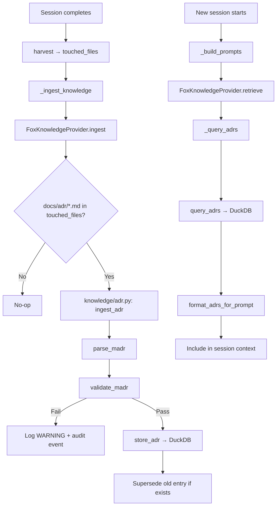

# Design Document: ADR Ingestion into Knowledge System

## Overview

ADR ingestion adds a new knowledge signal to the post-session pipeline.
After each session, the system checks whether the agent created or modified
any ADR files in `docs/adr/`, validates them against the MADR 4.0.0 format,
stores valid entries in DuckDB, and retrieves relevant ADR summaries during
future session context assembly. The implementation follows the same patterns
as the errata subsystem (`knowledge/errata.py`): a self-contained module
with dataclasses, parse/validate/store/query/format functions, a DuckDB
migration, and integration via `FoxKnowledgeProvider`.

## Architecture



### Module Responsibilities

1. **`agent_fox/knowledge/adr.py`** — ADR parsing, validation, storage,
   retrieval, and summary formatting. Self-contained module following the
   errata pattern.
2. **`agent_fox/knowledge/migrations.py`** — Schema migration to create the
   `adr_entries` table (v22).
3. **`agent_fox/knowledge/fox_provider.py`** — Extended to call ADR ingest
   on post-session and ADR query on pre-session retrieval.
4. **`agent_fox/knowledge/audit.py`** — Two new `AuditEventType` values:
   `ADR_VALIDATION_FAILED` and `ADR_INGESTED`.

## Execution Paths

### Path 1: ADR Detection and Ingestion (post-session)

```
1. engine/session_lifecycle.py: NodeSessionRunner._run_and_harvest
   — completes harvest, produces touched_files list
2. engine/session_lifecycle.py: NodeSessionRunner._ingest_knowledge
   — builds context dict with touched_files, calls provider.ingest()
3. knowledge/fox_provider.py: FoxKnowledgeProvider.ingest(session_id, spec_name, context)
   — extracts touched_files and project_root from context
4. knowledge/adr.py: detect_adr_changes(touched_files) → list[str]
   — filters for docs/adr/*.md paths
5. knowledge/adr.py: ingest_adr(conn, file_path, project_root) → ADREntry | None
   — reads file, orchestrates parse→validate→store pipeline
6. knowledge/adr.py: parse_madr(content) → ADREntry | None
   — parses MADR markdown into structured ADREntry
7. knowledge/adr.py: validate_madr(entry) → ADRValidationResult
   — checks mandatory sections and ≥3 options
8. knowledge/adr.py: store_adr(conn, entry) → int
   — inserts row (with supersession), returns rows inserted
   — side effect: row inserted/superseded in DuckDB adr_entries table
```

### Path 2: ADR Retrieval (pre-session)

```
1. engine/session_lifecycle.py: NodeSessionRunner._build_prompts
   — calls provider.retrieve(spec_name, task_description)
2. knowledge/fox_provider.py: FoxKnowledgeProvider.retrieve(spec_name, task_description)
   → list[str]
   — calls _query_reviews(), _query_errata(), _query_adrs()
3. knowledge/fox_provider.py: FoxKnowledgeProvider._query_adrs(conn, spec_name, task_description)
   → list[str]
   — calls query_adrs() and format_adrs_for_prompt()
4. knowledge/adr.py: query_adrs(conn, spec_name, task_description) → list[ADREntry]
   — queries active entries matching by spec_refs or keyword overlap
5. knowledge/adr.py: format_adrs_for_prompt(adrs) → list[str]
   — produces [ADR]-prefixed summary strings
```

## Components and Interfaces

### CLI / Public API

No new CLI commands. ADR ingestion is fully automatic as part of the
post-session pipeline.

### Core Data Types

```python
@dataclass(frozen=True)
class ADREntry:
    """Structured representation of a parsed MADR document."""
    id: str
    file_path: str
    title: str
    status: str
    chosen_option: str
    justification: str
    considered_options: list[str]
    summary: str
    content_hash: str
    keywords: list[str]
    spec_refs: list[str]
    created_at: datetime | None = None
    superseded_at: datetime | None = None


@dataclass(frozen=True)
class ADRValidationResult:
    """Result of MADR structural validation."""
    passed: bool
    diagnostics: list[str]
```

### Module Interfaces

```python
# --- agent_fox/knowledge/adr.py ---

def detect_adr_changes(touched_files: list[str]) -> list[str]:
    """Filter touched_files for docs/adr/*.md paths."""

def parse_madr(content: str) -> ADREntry | None:
    """Parse MADR markdown content into an ADREntry."""

def validate_madr(entry: ADREntry) -> ADRValidationResult:
    """Validate MADR structural compliance."""

def generate_adr_summary(entry: ADREntry) -> str:
    """Produce a concise one-line summary of an ADR."""

def extract_spec_refs(content: str) -> list[str]:
    """Extract spec references from ADR content."""

def extract_keywords(title: str) -> list[str]:
    """Extract searchable keywords from ADR title."""

def ingest_adr(
    conn: duckdb.DuckDBPyConnection,
    file_path: str,
    project_root: Path,
    *,
    sink: SinkDispatcher | None = None,
    run_id: str = "",
) -> ADREntry | None:
    """Full ingest pipeline: read → parse → validate → store.
    Returns the ingested ADREntry or None on failure."""

def store_adr(
    conn: duckdb.DuckDBPyConnection,
    entry: ADREntry,
) -> int:
    """Insert ADR entry into DuckDB, handling supersession.
    Returns number of rows inserted (0 or 1)."""

def query_adrs(
    conn: duckdb.DuckDBPyConnection,
    spec_name: str,
    task_description: str,
    *,
    limit: int = 10,
) -> list[ADREntry]:
    """Query active ADRs matching by spec_refs or keyword overlap."""

def format_adrs_for_prompt(adrs: list[ADREntry]) -> list[str]:
    """Format ADR entries as [ADR]-prefixed prompt strings."""
```

## Data Models

### DuckDB Schema: `adr_entries`

```sql
CREATE TABLE IF NOT EXISTS adr_entries (
    id              VARCHAR PRIMARY KEY,
    file_path       VARCHAR NOT NULL,
    title           VARCHAR NOT NULL,
    status          VARCHAR NOT NULL DEFAULT 'proposed',
    chosen_option   VARCHAR,
    considered_options TEXT[],
    justification   TEXT,
    summary         TEXT NOT NULL,
    content_hash    VARCHAR NOT NULL,
    keywords        TEXT[] DEFAULT [],
    spec_refs       TEXT[] DEFAULT [],
    created_at      TIMESTAMP NOT NULL DEFAULT CURRENT_TIMESTAMP,
    superseded_at   TIMESTAMP
);
```

### MADR Section Heading Recognition

The parser accepts the following H2 headings as synonyms for mandatory MADR
sections:

| Mandatory Section | Accepted Synonyms |
|-------------------|-------------------|
| Context and Problem Statement | `Context` |
| Considered Options | `Options Considered`, `Considered Alternatives` |
| Decision Outcome | `Decision` |

### ADR Summary Format

```
[ADR] {title}: Chose "{chosen_option}" over {comma-separated other options}. {justification}
```

Example:
```
[ADR] Use Claude Exclusively: Chose "Claude-only backend" over "Multi-provider abstraction", "OpenAI support", "Gemini support". No concrete requirement for non-Claude providers; tool-use capabilities tightly coupled to agent-fox architecture.
```

## Operational Readiness

### Observability

- Two new audit event types: `ADR_VALIDATION_FAILED` (WARNING) and
  `ADR_INGESTED` (INFO).
- Standard Python logging at DEBUG/WARNING levels for all error paths.

### Rollout

- Feature is always active once the migration is applied. No feature flag.
- The DuckDB migration (v22) is forward-only and uses
  `CREATE TABLE IF NOT EXISTS` for idempotency.

### Migration / Compatibility

- Existing ADRs in `docs/adr/` are not automatically ingested. They are only
  processed when touched by a coding session.
- ADRs that do not follow MADR format produce a warning and are skipped — no
  data corruption or pipeline disruption.

## Correctness Properties

### Property 1: Detection Accuracy

*For any* list of file paths `paths`, `detect_adr_changes(paths)` SHALL
return exactly those elements matching the glob pattern `docs/adr/*.md`
(one directory level only, `.md` extension only).

**Validates: Requirements 1.1, 1.2, 1.E2**

### Property 2: Parse Completeness

*For any* valid MADR content string with an H1 heading, a Considered Options
section listing N ≥ 1 items, and a Decision Outcome section with a chosen
option, `parse_madr(content)` SHALL return an ADREntry with a non-empty
`title`, `len(considered_options) == N`, and a non-empty `chosen_option`.

**Validates: Requirements 2.1, 2.5, 2.6**

### Property 3: Validation Consistency

*For any* ADREntry where `title` is non-empty, `chosen_option` is non-empty,
`considered_options` has ≥ 3 items, and all three mandatory section headings
were found during parsing, `validate_madr(entry)` SHALL return
`passed=True` with an empty `diagnostics` list.

**Validates: Requirements 3.1, 3.2, 3.3, 3.4**

### Property 4: Supersession Idempotency

*For any* ADR file content `c` and file path `p`, calling
`store_adr(conn, entry)` twice with the same `content_hash` SHALL result
in exactly one active row (superseded_at IS NULL) for that file_path.

**Validates: Requirements 5.1, 5.2, 5.3**

### Property 5: Retrieval Excludes Superseded

*For any* set of ADR entries where some have `superseded_at IS NOT NULL`,
`query_adrs(conn, spec_name, task_description)` SHALL return only entries
where `superseded_at IS NULL`.

**Validates: Requirements 6.1, 5.3**

### Property 6: Summary Format Compliance

*For any* ADREntry with non-empty `title` and `chosen_option`,
`format_adrs_for_prompt([entry])` SHALL return a list containing exactly
one string that starts with `"[ADR] "`.

**Validates: Requirements 6.2**

### Property 7: Content Hash Determinism

*For any* byte string `b`, computing SHA-256 twice SHALL produce the same
hex digest.

**Validates: Requirements 4.2, 5.2**

## Error Handling

| Error Condition | Behavior | Requirement |
|----------------|----------|-------------|
| File not readable / not UTF-8 | Return None, log WARNING | 117-REQ-2.E2 |
| No H1 heading in content | Return None (parse failure) | 117-REQ-2.E1 |
| Validation fails (missing sections) | Log WARNING, emit audit event, skip ingestion | 117-REQ-7.1, 7.2, 7.3 |
| Validation fails (< 3 options) | Log WARNING, emit audit event, skip ingestion | 117-REQ-3.2, 7.1 |
| DB connection unavailable | Log WARNING, return 0 | 117-REQ-4.E1 |
| adr_entries table missing | Log DEBUG, return empty/0 | 117-REQ-4.4, 6.E1 |
| Duplicate content_hash | Skip insertion, return 0 | 117-REQ-4.E2, 5.2 |
| Audit event emission fails | Log DEBUG, continue | 117-REQ-7.E1 |
| touched_files empty/None | Return empty list | 117-REQ-1.E1 |
| ADR file deleted between harvest and ingest | Skip, log DEBUG | 117-REQ-1.3 |

## Technology Stack

- **Language:** Python 3.12+
- **Database:** DuckDB (via `duckdb` Python package)
- **Hashing:** `hashlib.sha256` (stdlib)
- **Parsing:** Regex-based markdown parsing (no external markdown library)
- **Testing:** pytest, Hypothesis (property-based tests)

## Definition of Done

A task group is complete when ALL of the following are true:

1. All subtasks within the group are checked off (`[x]`)
2. All spec tests (`test_spec.md` entries) for the task group pass
3. All property tests for the task group pass
4. All previously passing tests still pass (no regressions)
5. No linter warnings or errors introduced
6. Code is committed on a feature branch and merged into `develop`
7. Feature branch is merged back to `develop`
8. `tasks.md` checkboxes are updated to reflect completion

## Testing Strategy

- **Unit tests** cover each function in `knowledge/adr.py` independently:
  parsing, validation, detection, storage, retrieval, formatting.
- **Property-based tests** (Hypothesis) verify the 7 correctness properties
  using generated MADR content and file path lists.
- **Integration smoke tests** verify the full ingest→retrieve pipeline using
  a real in-memory DuckDB connection (no mocks on `knowledge/adr.py`
  functions).
