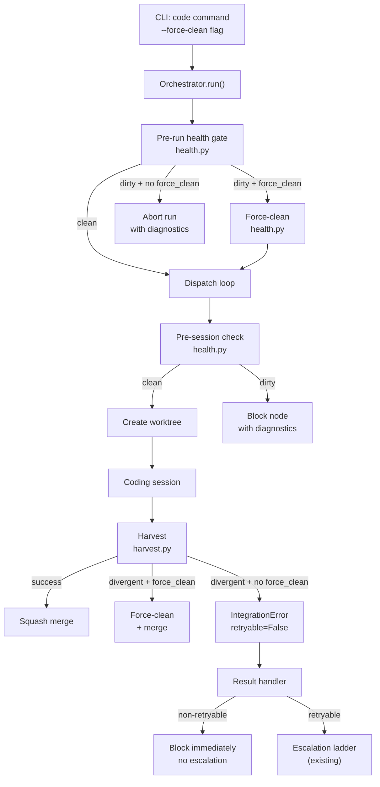

# Design Document: Git Stack Hardening

## Overview

This design introduces a workspace health subsystem that validates repository
state at multiple checkpoints (pre-run, pre-session, and harvest), classifies
errors for correct retry routing, and improves observability across the git
operations stack. The changes span six modules and introduce one new module.

## Architecture



### Module Responsibilities

1. **`agent_fox/workspace/health.py`** (new) — Workspace health check and
   force-clean logic. Single responsibility: assess and optionally remediate
   repo working tree state.
2. **`agent_fox/core/errors.py`** (modified) — Add `retryable` attribute to
   `IntegrationError` for error classification.
3. **`agent_fox/workspace/harvest.py`** (modified) — Thread `force_clean`
   option through harvest; mark divergent-file errors as non-retryable;
   improve error messages with remediation hints.
4. **`agent_fox/engine/result_handler.py`** (modified) — Check `is_non_retryable`
   flag on SessionRecord; block immediately without escalation ladder.
5. **`agent_fox/engine/engine.py`** (modified) — Call health gate on startup;
   register run lifecycle cleanup handler; detect stale runs.
6. **`agent_fox/engine/dispatch.py`** (modified) — Call pre-session workspace
   check before creating worktrees.
7. **`agent_fox/engine/graph_sync.py`** (modified) — Make cascade blocking
   idempotent for already-blocked and completed nodes.
8. **`agent_fox/workspace/develop.py`** (modified) — Emit structured audit
   events for sync operations.

## Execution Paths

### Path 1: Pre-run health gate detects dirty workspace

1. `cli/code.py: code_cmd` — parses `--force-clean`, passes to engine config
2. `engine/engine.py: Orchestrator.run` — calls health gate before dispatch loop
3. `workspace/health.py: check_workspace_health(repo_root)` → `HealthReport`
4. `workspace/health.py: check_workspace_health` — runs `git ls-files --others --exclude-standard` and `git diff --cached --name-only`
5. If `HealthReport.has_issues` and not `force_clean`: raises `WorkspaceError` with diagnostic message
6. If `HealthReport.has_issues` and `force_clean`: calls `force_clean_workspace(repo_root, report)` → removes files, returns cleaned report
7. `engine/engine.py: Orchestrator.run` — catches `WorkspaceError`, logs diagnostics, aborts run with terminal status

### Path 2: Non-retryable harvest failure blocks node immediately

1. `engine/session_lifecycle.py: NodeSessionRunner._harvest_and_integrate` — calls `harvest()`
2. `workspace/harvest.py: harvest` — calls `_harvest_under_lock`
3. `workspace/harvest.py: _clean_conflicting_untracked` — detects divergent files, raises `IntegrationError(retryable=False)`
4. `engine/session_lifecycle.py: _harvest_and_integrate` — catches `IntegrationError`, checks `exc.retryable`, sets `is_non_retryable=True` on `SessionRecord`
5. `engine/session_lifecycle.py: _run_and_harvest` — returns `SessionRecord` with `is_non_retryable=True`
6. `engine/result_handler.py: SessionResultHandler.process` — routes to `_handle_failure`
7. `engine/result_handler.py: _handle_failure` — checks `is_non_retryable`, calls `_handle_exhausted` immediately (no ladder consumption)
8. `engine/state_manager.py: StateManager.block_task` — blocks node with "workspace-state" classification, cascade-blocks dependents

### Path 3: Pre-session check catches mid-run drift

1. `engine/dispatch.py: DispatchManager.prepare_launch` — called for each ready node
2. `workspace/health.py: check_workspace_health(repo_root)` → `HealthReport`
3. If `HealthReport.has_issues`: returns `None` (skip dispatch), blocks node via `_block_task`
4. If clean: proceeds with worktree creation and session dispatch

### Path 4: Develop sync emits audit events

1. `workspace/develop.py: ensure_develop` — fetches origin, checks divergence
2. `workspace/develop.py: _sync_develop_with_remote` — determines sync strategy
3. `workspace/develop.py: _sync_develop_under_lock` — executes sync (ff/rebase/merge)
4. On success: emits `develop.sync` audit event with method and commit counts → returns sync method string
5. On failure: emits `develop.sync_failed` audit event with reason and divergence state

### Path 5: Stale run detection on startup

1. `engine/engine.py: Orchestrator.run` — before dispatch loop
2. Queries knowledge DB for runs with status "running"
3. For each stale run: transitions to "stalled" with reason "Process terminated without cleanup"
4. Returns count of stale runs cleaned up

## Components and Interfaces

### CLI Extension

The `code` command accepts a new `--force-clean` flag:

```
agent-fox code --force-clean
```

This flag is also configurable via the project config file:

```toml
[workspace]
force_clean = false
```

CLI flag takes precedence over config file.

### Core Data Types

```python
@dataclass(frozen=True)
class HealthReport:
    untracked_files: list[str]
    dirty_index_files: list[str]

    @property
    def has_issues(self) -> bool:
        return bool(self.untracked_files or self.dirty_index_files)

    @property
    def all_files(self) -> list[str]:
        return sorted(set(self.untracked_files + self.dirty_index_files))
```

### Module Interfaces

#### `agent_fox/workspace/health.py`

```python
async def check_workspace_health(repo_root: Path) -> HealthReport:
    """Check repo working tree for untracked files and dirty index."""

async def force_clean_workspace(
    repo_root: Path,
    report: HealthReport,
) -> HealthReport:
    """Remove untracked files and reset dirty index. Returns updated report."""

def format_health_diagnostic(
    report: HealthReport,
    *,
    max_files: int = 20,
) -> str:
    """Format a HealthReport into an actionable error message."""
```

#### `agent_fox/core/errors.py` (modified)

```python
class IntegrationError(AgentFoxError):
    def __init__(self, message: str, *, retryable: bool = True, **context: Any):
        super().__init__(message, **context)
        self.retryable = retryable
```

#### `agent_fox/workspace/harvest.py` (modified signatures)

```python
async def harvest(
    repo_root: Path,
    workspace: WorkspaceInfo,
    dev_branch: str = "develop",
    *,
    force_clean: bool = False,
) -> list[str]:

async def _clean_conflicting_untracked(
    repo_root: Path,
    feature_branch: str,
    *,
    force_clean: bool = False,
) -> None:
```

#### Session record extension

```python
@dataclass
class SessionRecord:
    # ... existing fields ...
    is_non_retryable: bool = False
```

## Data Models

### Audit Event Types (new)

| Event Type | Severity | Payload |
|------------|----------|---------|
| `workspace.health_check` | info | `{status, untracked_count, dirty_index_count}` |
| `workspace.force_clean` | warning | `{removed_files, failed_files}` |
| `develop.sync` | info | `{method, local_ahead, remote_ahead}` |
| `develop.sync_failed` | warning | `{reason, local_ahead, remote_ahead}` |
| `develop.fetch_failed` | warning | `{reason}` |
| `run.stale_detected` | warning | `{stale_run_id, original_started_at}` |

### Configuration Extension

```toml
[workspace]
force_clean = false  # default: conservative (report and abort)
```

## Operational Readiness

### Observability

- All new code paths emit structured audit events via the existing
  `audit_events` table.
- Health check results are logged at INFO (clean) or WARNING (issues found).
- Force-clean operations are logged at WARNING with full file lists.
- Non-retryable errors include "workspace-state" classification in blocked
  reason for filtering.

### Rollout

- Default behavior is unchanged (conservative: report and abort).
- `--force-clean` is opt-in.
- No migration needed; new audit event types are additive.

### Compatibility

- `IntegrationError` gains a `retryable` attribute that defaults to `True`,
  preserving backward compatibility for all existing raise sites.
- `SessionRecord` gains `is_non_retryable` field defaulting to `False`.
- `harvest()` gains `force_clean` keyword argument defaulting to `False`.
- All changes are backward-compatible.

## Correctness Properties

### Property 1: Health Check Completeness

*For any* repository state with N untracked files (excluding `.gitignore`
matches), `check_workspace_health` SHALL return a `HealthReport` whose
`untracked_files` list contains exactly those N files.

**Validates: 118-REQ-1.1**

### Property 2: Force-Clean Safety

*For any* set of files removed by `force_clean_workspace`, every removed file
SHALL have been present in the input `HealthReport.all_files` list. No file
outside the report SHALL be removed.

**Validates: 118-REQ-2.1**

### Property 3: Non-Retryable Classification Correctness

*For any* `IntegrationError` raised by `_clean_conflicting_untracked` due to
divergent untracked files, the error SHALL have `retryable=False`. *For any*
`IntegrationError` raised by merge conflict resolution (merge agent failure),
the error SHALL have `retryable=True` (the default).

**Validates: 118-REQ-3.1, 118-REQ-3.E1**

### Property 4: Idempotent Cascade Blocking

*For any* node already in "blocked" state, calling `mark_blocked` on that node
SHALL produce no state change, no warning log emission, and no audit event
emission.

**Validates: 118-REQ-7.1**

### Property 5: Run Lifecycle Completeness

*For any* run that has been started (inserted into the `runs` table with status
"running"), the run SHALL eventually reach a terminal status (completed, failed,
or stalled) — either through normal completion, error handling, or the cleanup
handler.

**Validates: 118-REQ-6.1, 118-REQ-6.2, 118-REQ-6.3**

### Property 6: Error Message Completeness

*For any* workspace-state error (health check failure or harvest
divergent-file error), the formatted error message SHALL contain: (a) at least
one file path from the conflict list, (b) the string `git clean` as a
remediation hint, and (c) the string `--force-clean` as the automation
suggestion.

**Validates: 118-REQ-8.1, 118-REQ-8.2**

### Property 7: Pre-Session Monotonicity

*For any* repository state where `check_workspace_health` returns a
`HealthReport` with `has_issues=False`, a subsequent call to
`check_workspace_health` on the same repository (with no intervening external
modification) SHALL also return `has_issues=False`.

**Validates: 118-REQ-4.1, 118-REQ-4.3**

## Error Handling

| Error Condition | Behavior | Requirement |
|----------------|----------|-------------|
| Untracked files at run start, no force-clean | Abort run with diagnostics | 118-REQ-1.2 |
| Untracked files at run start, force-clean | Remove files, proceed | 118-REQ-2.1 |
| Dirty index at run start, no force-clean | Abort run with diagnostics | 118-REQ-1.E1 |
| Dirty index at run start, force-clean | Reset index, proceed | 118-REQ-2.E1 |
| Git command error during health check | Log warning, proceed (fail-open) | 118-REQ-1.E2 |
| Permission error during force-clean | Log warning, abort run | 118-REQ-2.E2 |
| Divergent untracked files at harvest, no force-clean | IntegrationError(retryable=False) | 118-REQ-3.1 |
| Divergent untracked files at harvest, force-clean | Remove files, proceed with merge | 118-REQ-2.3 |
| Merge conflict at harvest | IntegrationError(retryable=True), existing behavior | 118-REQ-3.E1 |
| Non-retryable error in result handler | Block immediately, no escalation | 118-REQ-3.2 |
| Untracked files detected pre-session | Skip dispatch, block node | 118-REQ-4.2 |
| Git error during pre-session check | Log warning, proceed | 118-REQ-4.E1 |
| Remote unreachable during develop fetch | Emit audit event, proceed local-only | 118-REQ-5.E1 |
| Stale "running" run detected on startup | Transition to "stalled" | 118-REQ-6.1 |
| Cleanup handler DB write failure | Log warning, exit | 118-REQ-6.E1 |
| Cascade block on already-blocked node | Skip silently | 118-REQ-7.1 |
| Cascade block on completed node | Skip silently | 118-REQ-7.2 |
| Cascade block on in-progress node | Skip, log DEBUG | 118-REQ-7.E1 |
| File list exceeds 20 items | Truncate with "... and N more" | 118-REQ-8.E1 |

## Technology Stack

- **Language:** Python 3.12+
- **Async:** asyncio (all git operations are async)
- **Git:** subprocess via `run_git` wrapper in `agent_fox/workspace/git.py`
- **Database:** DuckDB via existing knowledge DB connection
- **Testing:** pytest, pytest-asyncio, hypothesis (property tests)
- **Config:** TOML via existing config loader

## Definition of Done

A task group is complete when ALL of the following are true:

1. All subtasks within the group are checked off (`[x]`)
2. All spec tests (`test_spec.md` entries) for the task group pass
3. All property tests for the task group pass
4. All previously passing tests still pass (no regressions)
5. No linter warnings or errors introduced
6. Code is committed on a feature branch and merged into `develop`
7. `tasks.md` checkboxes are updated to reflect completion

## Testing Strategy

- **Unit tests** validate each function in `health.py` with mocked git
  commands. Verify health check detection, force-clean removal, and diagnostic
  formatting.
- **Unit tests** for error classification verify `IntegrationError.retryable`
  attribute propagation through harvest → session record → result handler.
- **Property-based tests** (Hypothesis) verify health check completeness,
  force-clean safety, error message structure, idempotent blocking, and
  monotonicity.
- **Integration smoke tests** exercise the full path from engine startup
  through health check, session dispatch, harvest, and result handling using
  a real git repository (no mock of git or harvest components).
