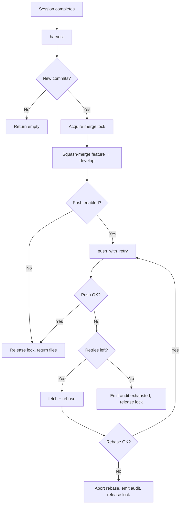
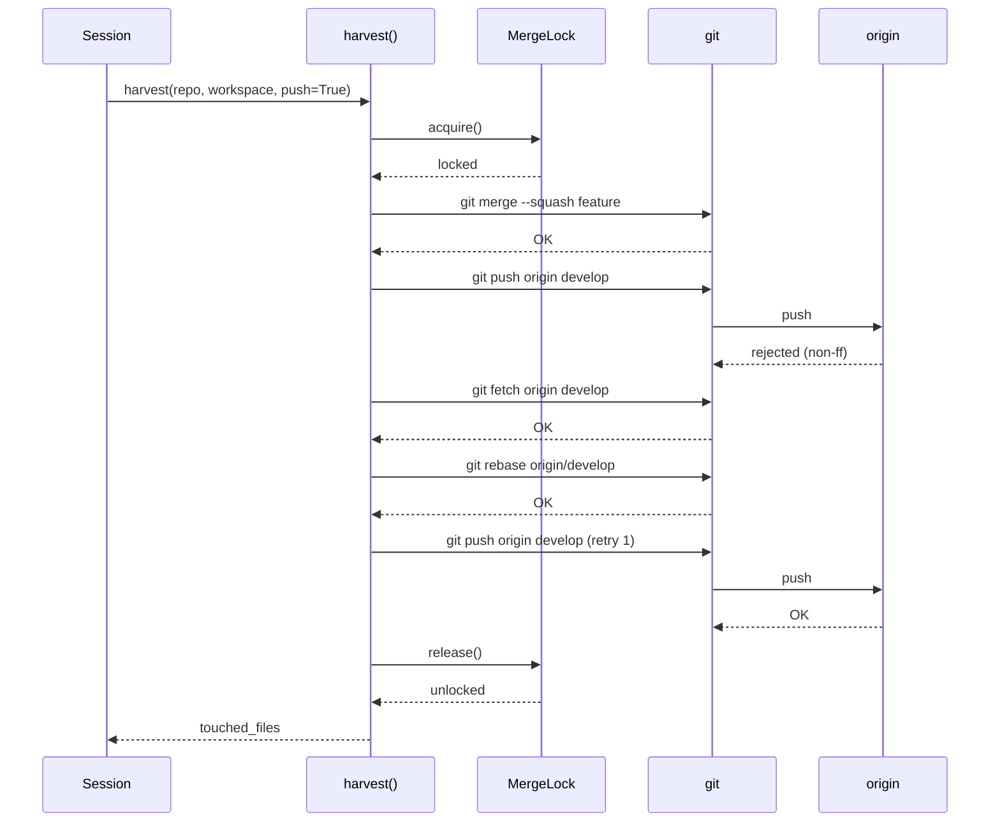

# Design Document: Atomic Push with Retry

## Overview

This change makes the harvest pipeline's merge+push operation atomic by
moving the `git push` inside the merge lock scope, and adds retry-with-rebase
logic to handle push failures from concurrent or external pushes. A new
`git.push_failed` audit event provides observability into push reliability.

## Architecture





### Module Responsibilities

1. **`agent_fox/workspace/harvest.py`** — Orchestrates harvest: squash-merge,
   push-with-retry, worktree cleanup. Owns the merge lock scope.
2. **`agent_fox/workspace/git.py`** — Low-level git operations: push, fetch,
   rebase. Stateless functions.
3. **`agent_fox/workspace/develop.py`** — Develop branch sync logic. Provides
   `_sync_develop_under_lock()` for use by callers that already hold the lock.
4. **`agent_fox/workspace/merge_lock.py`** — File-based async merge lock.
   Unchanged by this spec.
5. **`agent_fox/knowledge/audit.py`** — Audit event type enum. Extended with
   new event types.
6. **`agent_fox/engine/session_lifecycle.py`** — Session completion handler.
   Passes audit sink to harvest for push failure events.

## Execution Paths

### Path 1: Harvest with successful push (happy path)

1. `session_lifecycle.py: _harvest_and_integrate` — calls `harvest(push=True)`
2. `harvest.py: harvest` — checks for new commits, acquires merge lock
3. `harvest.py: _harvest_under_lock` — runs `git merge --squash`, commits
4. `harvest.py: _push_with_retry` — calls `git.push_to_remote()` → `True`
5. `harvest.py: harvest` — releases lock, returns `list[str]` of touched files
6. `session_lifecycle.py: _harvest_and_integrate` — calls `post_harvest_integrate()` which skips push (already done)

### Path 2: Harvest with push failure and successful retry

1. `session_lifecycle.py: _harvest_and_integrate` — calls `harvest(push=True)`
2. `harvest.py: harvest` — checks for new commits, acquires merge lock
3. `harvest.py: _harvest_under_lock` — runs `git merge --squash`, commits
4. `harvest.py: _push_with_retry` — calls `git.push_to_remote()` → `False`
5. `harvest.py: _push_with_retry` — emits `git.push_failed` audit event (attempt 1)
6. `harvest.py: _push_with_retry` — calls `git.fetch_remote()`, then `git.rebase_onto()`
7. `harvest.py: _push_with_retry` — calls `git.push_to_remote()` → `True` (attempt 2)
8. `harvest.py: _push_with_retry` — emits `git.push_retry_success` audit event
9. `harvest.py: harvest` — releases lock, returns `list[str]`

### Path 3: Harvest with push failure, retries exhausted

1. `session_lifecycle.py: _harvest_and_integrate` — calls `harvest(push=True)`
2. `harvest.py: harvest` — acquires merge lock
3. `harvest.py: _harvest_under_lock` — merges, commits
4. `harvest.py: _push_with_retry` — push fails, retries 3 times, all fail
5. `harvest.py: _push_with_retry` — emits `git.push_failed` with `retries_exhausted: true`
6. `harvest.py: _push_with_retry` — logs WARNING, returns `False`
7. `harvest.py: harvest` — releases lock, returns `list[str]` (merge succeeded even if push didn't)

### Path 4: Harvest with push failure, rebase conflict aborts retry

1. `session_lifecycle.py: _harvest_and_integrate` — calls `harvest(push=True)`
2. `harvest.py: harvest` — acquires merge lock
3. `harvest.py: _harvest_under_lock` — merges, commits
4. `harvest.py: _push_with_retry` — push fails (attempt 1)
5. `harvest.py: _push_with_retry` — fetches, attempts rebase → conflict
6. `harvest.py: _push_with_retry` — calls `git.rebase_abort()`, emits `git.push_failed` with `rebase_conflict: true`
7. `harvest.py: _push_with_retry` — stops retrying, returns `False`
8. `harvest.py: harvest` — releases lock, returns `list[str]`

## Components and Interfaces

### New function: `_push_with_retry`

```python
async def _push_with_retry(
    repo_root: Path,
    branch: str = "develop",
    remote: str = "origin",
    max_retries: int = 3,
    audit_sink: AuditSink | None = None,
    run_id: str | None = None,
    node_id: str | None = None,
) -> bool:
    """Push branch to remote with fetch-rebase retry on non-ff rejection.

    Returns True if push succeeded (possibly after retries), False if all
    attempts failed. Never raises — push failures are best-effort.
    """
```

### Modified function: `harvest`

```python
async def harvest(
    repo_root: Path,
    workspace: WorkspaceInfo,
    dev_branch: str = "develop",
    *,
    force_clean: bool = False,
    push: bool = True,               # NEW: push inside lock
    audit_sink: AuditSink | None = None,  # NEW: for push audit events
    run_id: str | None = None,       # NEW: for audit event context
    node_id: str | None = None,      # NEW: for audit event context
) -> list[str]:
```

### Modified function: `_harvest_under_lock`

```python
async def _harvest_under_lock(
    repo_root: Path,
    workspace: WorkspaceInfo,
    dev_branch: str,
    *,
    force_clean: bool = False,
    push: bool = True,               # NEW
    audit_sink: AuditSink | None = None,  # NEW
    run_id: str | None = None,       # NEW
    node_id: str | None = None,      # NEW
) -> list[str]:
```

### New git helper: `rebase_onto`

```python
async def rebase_onto(
    repo_root: Path,
    upstream: str,
) -> bool:
    """Rebase current branch onto upstream. Returns True on success."""
```

### New git helper: `rebase_abort`

```python
async def rebase_abort(repo_root: Path) -> None:
    """Abort an in-progress rebase."""
```

### New git helper: `fetch_remote`

```python
async def fetch_remote(
    repo_root: Path,
    remote: str = "origin",
    branch: str | None = None,
) -> bool:
    """Fetch from remote. Returns True on success."""
```

### Modified function: `_sync_develop_with_remote`

Extracts the under-lock logic so it can be called by `_push_with_retry`
when the merge lock is already held:

```python
async def _sync_develop_with_remote(
    repo_root: Path,
    *,
    _lock_held: bool = False,   # NEW: skip lock acquisition
) -> str | None:
```

### New audit event types

```python
class AuditEventType(StrEnum):
    # ... existing ...
    GIT_PUSH_FAILED = "git.push_failed"
    GIT_PUSH_RETRY_SUCCESS = "git.push_retry_success"
```

### Modified function: `post_harvest_integrate`

```python
async def post_harvest_integrate(
    repo_root: Path,
    workspace: WorkspaceInfo,
    *,
    push_already_done: bool = False,  # NEW: skip push if harvest pushed
) -> None:
```

## Data Models

### `git.push_failed` audit event payload

```json
{
  "branch": "develop",
  "remote": "origin",
  "attempt": 1,
  "max_attempts": 4,
  "error": "non-fast-forward rejection: ...",
  "will_retry": true,
  "retries_exhausted": false,
  "rebase_conflict": false
}
```

### `git.push_retry_success` audit event payload

```json
{
  "branch": "develop",
  "remote": "origin",
  "total_attempts": 2
}
```

## Operational Readiness

- **Monitoring:** New audit events `git.push_failed` and
  `git.push_retry_success` enable alerting on push failure rates.
- **Rollback:** The `push` parameter defaults to `True`. Setting
  `push=False` restores pre-fix behavior without code changes.
- **Lock contention:** Lock hold time increases by push duration (1-5s
  typical, up to ~15s with retries). The 300s timeout provides ample margin.

## Correctness Properties

### Property 1: Atomic Merge-Push

*For any* successful harvest operation with `push=True`, the merge commit
on develop and the push to origin SHALL happen under the same merge lock
acquisition — no other task can observe a state where the merge has
completed but the push has not yet been attempted.

**Validates: Requirements 121-REQ-1.1, 121-REQ-1.2**

### Property 2: Bounded Retry

*For any* push failure sequence, the total number of push attempts
(initial + retries) SHALL be at most 4 (1 initial + 3 retries), and the
system SHALL terminate the retry loop in finite time.

**Validates: Requirements 121-REQ-2.2, 121-REQ-2.4**

### Property 3: Rebase Linearity

*For any* retry cycle that includes a rebase, the resulting develop branch
history SHALL remain linear (no merge commits introduced by the retry
logic).

**Validates: Requirements 121-REQ-2.1**

### Property 4: Audit Completeness

*For any* push failure, the audit trail SHALL contain at least one
`git.push_failed` event, and *for any* push that succeeds after retries,
the audit trail SHALL contain exactly one `git.push_retry_success` event.

**Validates: Requirements 121-REQ-3.1, 121-REQ-3.4**

### Property 5: No Double Push

*For any* harvest operation where push succeeds inside the lock, the
subsequent call to `post_harvest_integrate()` SHALL NOT execute a second
push to origin.

**Validates: Requirements 121-REQ-5.3, 121-REQ-5.E1**

### Property 6: Rebase Conflict Safety

*For any* rebase that encounters a conflict during a retry cycle, the
rebase SHALL be aborted and no further push attempts SHALL be made,
leaving the local develop branch in a clean state (no in-progress rebase).

**Validates: Requirements 121-REQ-2.E2**

## Error Handling

| Error Condition | Behavior | Requirement |
|----------------|----------|-------------|
| Push non-fast-forward rejection | Fetch, rebase, retry (up to 3) | 121-REQ-2.1 |
| Push non-retryable error (auth, network) | Log and stop immediately | 121-REQ-2.E3 |
| Fetch fails during retry | Skip rebase, attempt push as-is | 121-REQ-2.E1 |
| Rebase conflict during retry | Abort rebase, stop retrying | 121-REQ-2.E2 |
| All retries exhausted | Log WARNING, return False | 121-REQ-2.4 |
| No remote configured | Skip push, return normally | 121-REQ-1.E1 |
| Merge lock timeout | Raise IntegrationError | 121-REQ-1.E2 |
| Audit sink unavailable | Log WARNING, continue | 121-REQ-3.E1 |

## Technology Stack

- **Language:** Python 3.12+
- **Async:** asyncio
- **Git operations:** subprocess calls via `run_git()` helper
- **Locking:** `MergeLock` (file-based + asyncio.Lock)
- **Testing:** pytest + pytest-asyncio, Hypothesis for property tests
- **Audit:** `AuditEventType` enum, `emit_audit_event()` helper

## Definition of Done

A task group is complete when ALL of the following are true:

1. All subtasks within the group are checked off (`[x]`)
2. All spec tests (`test_spec.md` entries) for the task group pass
3. All property tests for the task group pass
4. All previously passing tests still pass (no regressions)
5. No linter warnings or errors introduced
6. Code is committed on a feature branch and merged into `develop`
7. Feature branch is merged back to `develop`
8. `tasks.md` checkboxes are updated to reflect completion

## Testing Strategy

- **Unit tests:** Mock `run_git` to simulate push failures, fetch failures,
  rebase conflicts. Verify retry counts, audit events, lock behavior.
- **Property tests:** Use Hypothesis to generate sequences of push
  success/failure outcomes and verify bounded retry, audit completeness,
  and no-double-push properties.
- **Integration tests:** Not required — the git operations are already
  tested in `test_harvester.py` and `test_develop_reconciliation.py`.
  The new behavior is purely orchestration logic testable with mocks.
