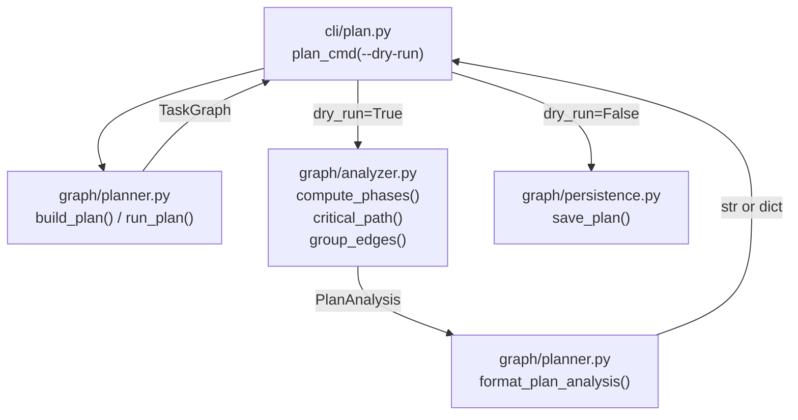

# Design Document: --dry-run Flag on plan Command

## Overview

Add a `--dry-run` flag to the `plan` CLI command and the `run_plan()` API.
When set, the full planning pipeline runs but database persistence is
skipped. A new `analyzer` module computes parallelism phases, critical path,
and edge grouping from the resolved `TaskGraph`. A new formatter renders
the analysis for human or JSON consumption.

## Architecture



### Module Responsibilities

1. **`cli/plan.py`** — CLI entry point. Adds `--dry-run` flag. Routes to
   analyzer+formatter or persistence based on flag value.
2. **`graph/planner.py`** — Planning pipeline. `build_plan()` unchanged.
   `run_plan()` gains `dry_run` parameter to skip persistence. New
   `format_plan_analysis()` renders analysis output.
3. **`graph/analyzer.py`** — Pure functions for plan analysis:
   `compute_phases()`, `critical_path()`, `group_edges()`.
4. **`graph/persistence.py`** — Unchanged. Only called when `dry_run=False`.

## Execution Paths

### Path 1: Plan with --dry-run (human-readable)

1. `cli/plan.py: plan_cmd(dry_run=True)` — parses flags, calls planner
2. `graph/planner.py: build_plan(specs_dir, filter_spec, fast, config)` → `TaskGraph`
3. `graph/analyzer.py: compute_phases(graph)` → `list[Phase]`
4. `graph/analyzer.py: critical_path(graph)` → `list[str]`
5. `graph/analyzer.py: group_edges(graph)` → `GroupedEdges`
6. `graph/planner.py: format_plan_analysis(graph, phases, path, grouped, specs)` → `str`
7. `cli/plan.py: click.echo(output)` — side effect: prints to stdout

### Path 2: Plan with --dry-run --json

1. `cli/plan.py: plan_cmd(dry_run=True, json_mode=True)` — parses flags
2. `graph/planner.py: build_plan(specs_dir, filter_spec, fast, config)` → `TaskGraph`
3. `graph/analyzer.py: compute_phases(graph)` → `list[Phase]`
4. `graph/analyzer.py: critical_path(graph)` → `list[str]`
5. `graph/analyzer.py: group_edges(graph)` → `GroupedEdges`
6. `cli/plan.py: emit(analysis_dict)` — side effect: prints JSON to stdout

### Path 3: Plan without --dry-run (unchanged)

1. `cli/plan.py: plan_cmd(dry_run=False)` — existing flow
2. `graph/planner.py: build_plan(...)` → `TaskGraph`
3. `graph/persistence.py: save_plan(graph, conn)` — side effect: writes to DuckDB
4. `cli/plan.py: click.echo(format_plan_summary(...))` — side effect: prints summary

### Path 4: run_plan() with dry_run=True (API)

1. Caller invokes `graph/planner.py: run_plan(config, dry_run=True)`
2. `graph/planner.py: build_plan(specs_dir, filter_spec, fast, config)` → `TaskGraph`
3. `run_plan()` returns `TaskGraph` without calling `save_plan()`

## Components and Interfaces

### CLI (`cli/plan.py`)

```python
@click.command("plan")
@click.option("--dry-run", is_flag=True, help="Show plan analysis without persisting to database")
@click.option("--fast", is_flag=True, help="Exclude optional tasks")
@click.option("--spec", "filter_spec", default=None, help="Plan a single spec")
@click.option("--specs-dir", type=click.Path(), default=None, help="Path to specs directory")
@click.pass_context
def plan_cmd(ctx, dry_run, fast, filter_spec, specs_dir) -> None: ...
```

### Analyzer (`graph/analyzer.py`)

```python
@dataclass
class Phase:
    number: int          # 0-indexed phase number
    node_ids: list[str]  # nodes in this phase, sorted by _sort_key

@dataclass
class GroupedEdges:
    intra_spec: list[Edge]   # edges within a spec
    cross_spec: list[Edge]   # edges between specs

def compute_phases(graph: TaskGraph) -> list[Phase]:
    """Group nodes into parallelism phases by topological depth."""
    ...

def critical_path(graph: TaskGraph) -> list[str]:
    """Compute longest path through the DAG (uniform edge weights)."""
    ...

def group_edges(graph: TaskGraph) -> GroupedEdges:
    """Partition edges by kind (intra_spec vs cross_spec)."""
    ...
```

### Formatter (`graph/planner.py`)

```python
def format_plan_analysis(
    graph: TaskGraph,
    phases: list[Phase],
    path: list[str],
    grouped: GroupedEdges,
    specs: list[SpecInfo],
) -> str:
    """Format rich plan analysis for human-readable output."""
    ...
```

### Updated API (`graph/planner.py`)

```python
def run_plan(
    config: AgentFoxConfig,
    *,
    specs_dir: Path | None = None,
    force: bool = False,
    fast: bool = False,
    filter_spec: str | None = None,
    dry_run: bool = False,           # NEW
) -> TaskGraph:
    """Build the task graph. When dry_run=True, skip persistence."""
    ...
```

## Data Models

### Phase

```python
@dataclass
class Phase:
    number: int          # 0-indexed
    node_ids: list[str]  # sorted lexicographically
```

### GroupedEdges

```python
@dataclass
class GroupedEdges:
    intra_spec: list[Edge]
    cross_spec: list[Edge]
```

### Human-readable Analysis Output Format

```
Plan Analysis
========================================
Specs:         01_core, 02_planning
Total tasks:   8
Review nodes:  2
Dependencies:  12
Fast mode:     off

Parallelism Phases
------------------
Phase 0 (2 nodes):
  01_core:1 — Parse specifications
  02_planning:1 — Set up dependencies

Phase 1 (3 nodes):
  01_core:2 — Build graph
  02_planning:2 — Resolve ordering
  02_planning:0:skeptic:pre-review — Skeptic Review

Phase 2 (1 node):
  01_core:3 — Final validation

Summary: 3 phases, peak parallelism: 3

Critical Path
-------------
01_core:1 -> 01_core:2 -> 01_core:3
Length: 3 nodes

Dependency Edges
----------------
Intra-spec (10):
  01_core:1 -> 01_core:2
  01_core:2 -> 01_core:3
  ...

Cross-spec (2):
  01_core:2 -> 02_planning:2
  ...
```

### JSON Analysis Output Format

```json
{
  "nodes": { ... },
  "edges": [ ... ],
  "order": [ ... ],
  "metadata": { ... },
  "phases": [
    { "number": 0, "node_ids": ["01_core:1", "02_planning:1"] },
    { "number": 1, "node_ids": ["01_core:2", "02_planning:2"] }
  ],
  "critical_path": ["01_core:1", "01_core:2", "01_core:3"],
  "grouped_edges": {
    "intra_spec": [{"source": "01_core:1", "target": "01_core:2", "kind": "intra_spec"}],
    "cross_spec": [{"source": "01_core:2", "target": "02_planning:2", "kind": "cross_spec"}]
  }
}
```

## Operational Readiness

- **Observability**: Analysis operations use the existing `logging` framework
  at DEBUG level.
- **Rollout**: The flag is additive and off by default. No existing behavior
  changes.
- **Migration**: No schema changes. No database migration needed.

## Correctness Properties

### Property 1: Phase Completeness

*For any* valid TaskGraph, `compute_phases(graph)` SHALL produce phases that
together contain exactly the same set of node IDs as `graph.order`.

**Validates: Requirements 122-REQ-2.1**

### Property 2: Phase Ordering Respects Dependencies

*For any* valid TaskGraph and any edge (A → B) in the graph,
`compute_phases(graph)` SHALL place A in a phase with a strictly lower
number than the phase containing B.

**Validates: Requirements 122-REQ-2.1**

### Property 3: Critical Path Is Valid Path

*For any* valid TaskGraph with at least one node, `critical_path(graph)`
SHALL return a list of node IDs where each consecutive pair (N_i, N_{i+1})
is connected by a directed edge in the graph.

**Validates: Requirements 122-REQ-4.1**

### Property 4: Critical Path Is Longest

*For any* valid TaskGraph, `critical_path(graph)` SHALL return a path whose
length is greater than or equal to every other path from any source to any
sink in the graph.

**Validates: Requirements 122-REQ-4.1, 122-REQ-4.3**

### Property 5: Analyze Does Not Persist

*For any* invocation of `run_plan(config, dry_run=True)`, the system SHALL
not call `save_plan()` or open a database connection.

**Validates: Requirements 122-REQ-1.1, 122-REQ-6.1**

### Property 6: Edge Grouping Is Exhaustive

*For any* valid TaskGraph, `group_edges(graph)` SHALL produce a
`GroupedEdges` where `len(intra_spec) + len(cross_spec)` equals
`len(graph.edges)`.

**Validates: Requirements 122-REQ-3.1**

### Property 7: Critical Path Determinism

*For any* valid TaskGraph, two calls to `critical_path(graph)` with the
same graph SHALL return identical results.

**Validates: Requirements 122-REQ-4.3**

### Property 8: Phase Determinism

*For any* valid TaskGraph, two calls to `compute_phases(graph)` with the
same graph SHALL return identical results, including the ordering of
node IDs within each phase.

**Validates: Requirements 122-REQ-2.1**

## Error Handling

| Error Condition | Behavior | Requirement |
|----------------|----------|-------------|
| Empty specs directory with --dry-run | Error message, exit 1 | 122-REQ-1.E1 |
| Cycle detected during --dry-run | Cycle error message, exit 1 | 122-REQ-1.E2 |
| --dry-run --spec with invalid spec name | Error message, exit 1 | 122-REQ-5.E1 |
| Empty graph (no nodes) | No critical path displayed | 122-REQ-4.E2 |

## Technology Stack

- **Python 3.11+** — project language
- **Click** — CLI framework (existing)
- **DuckDB** — knowledge store (existing, not modified)
- **dataclasses** — for `Phase` and `GroupedEdges` types

## Definition of Done

A task group is complete when ALL of the following are true:

1. All subtasks within the group are checked off (`[x]`)
2. All spec tests (`test_spec.md` entries) for the task group pass
3. All property tests for the task group pass
4. All previously passing tests still pass (no regressions)
5. No linter warnings or errors introduced
6. Code is committed on a feature branch and merged into `develop`
7. Feature branch is merged back to `develop`
8. `tasks.md` checkboxes are updated to reflect completion

## Testing Strategy

- **Unit tests** for `compute_phases()`, `critical_path()`, `group_edges()`
  with hand-crafted graphs covering linear chains, diamonds, fan-outs,
  single nodes, and empty graphs.
- **Property-based tests** using Hypothesis to generate random DAGs and
  verify invariants (completeness, ordering, path validity, determinism).
- **Integration tests** for the CLI using Click's test runner to verify
  `--dry-run` skips persistence and produces correct output format.
- **Smoke tests** tracing each execution path end-to-end.
