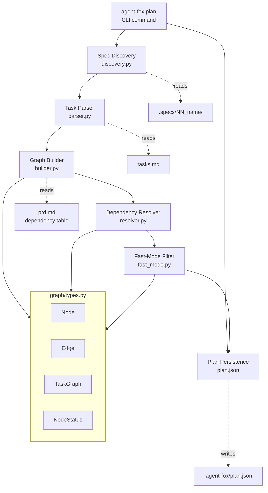

# Design Document: Planning Engine

## Overview

The planning engine converts human-authored specifications into a
machine-executable task graph. It discovers spec folders, parses task
definitions from markdown, builds a dependency DAG, resolves execution
order via topological sort, optionally filters optional tasks (fast mode),
and persists the plan for downstream commands.

## Architecture



### Module Responsibilities

1. `agent_fox/spec/discovery.py` -- Scan `.specs/` for valid spec folders,
   return sorted list of `SpecInfo` records
2. `agent_fox/spec/parser.py` -- Parse `tasks.md` markdown into
   `TaskGroupDef` objects; detect optional markers and subtasks
3. `agent_fox/graph/types.py` -- Core data models: `Node`, `Edge`,
   `TaskGraph`, `NodeStatus` enum, `PlanMetadata`
4. `agent_fox/graph/builder.py` -- Construct `TaskGraph` from parsed specs:
   create nodes, add intra-spec and cross-spec edges
5. `agent_fox/graph/resolver.py` -- Topological sort with cycle detection
   and deterministic tie-breaking
6. `agent_fox/graph/fast_mode.py` -- Remove optional nodes, rewire
   transitive dependencies
7. `agent_fox/cli/plan.py` -- `agent-fox plan` Click command with options

## Components and Interfaces

### Spec Discovery

```python
# agent_fox/spec/discovery.py
from dataclasses import dataclass
from pathlib import Path

@dataclass(frozen=True)
class SpecInfo:
    """Metadata about a discovered specification folder."""
    name: str           # e.g., "01_core_foundation"
    prefix: int         # e.g., 1
    path: Path          # e.g., Path(".specs/01_core_foundation")
    has_tasks: bool     # whether tasks.md exists
    has_prd: bool       # whether prd.md exists

def discover_specs(
    specs_dir: Path,
    filter_spec: str | None = None,
) -> list[SpecInfo]:
    """Discover spec folders in the given directory.

    Args:
        specs_dir: Path to the .specs/ directory.
        filter_spec: If set, return only this spec (by name or prefix).

    Returns:
        List of SpecInfo sorted by numeric prefix.

    Raises:
        PlanError: If no specs found or filter matches nothing.
    """
    ...
```

### Task Parser

```python
# agent_fox/spec/parser.py
from dataclasses import dataclass, field
from pathlib import Path

@dataclass(frozen=True)
class SubtaskDef:
    """A single nested subtask within a task group."""
    id: str             # e.g., "1.2"
    title: str          # subtask description text
    completed: bool     # checkbox state

@dataclass(frozen=True)
class TaskGroupDef:
    """A parsed top-level task group from tasks.md."""
    number: int                     # group number (1, 2, 3, ...)
    title: str                      # group title text
    optional: bool                  # True if marked with *
    completed: bool                 # True if checkbox is [x]
    subtasks: tuple[SubtaskDef, ...]  # nested subtasks
    body: str                       # full raw text of the group

def parse_tasks(tasks_path: Path) -> list[TaskGroupDef]:
    """Parse a tasks.md file into a list of task group definitions.

    Args:
        tasks_path: Path to the tasks.md file.

    Returns:
        List of TaskGroupDef in document order.
    """
    ...
```

### Cross-Spec Dependency Parser

```python
# agent_fox/spec/parser.py (continued)

@dataclass(frozen=True)
class CrossSpecDep:
    """A cross-spec dependency declaration from a prd.md table."""
    from_spec: str      # source spec name
    from_group: int     # source group number
    to_spec: str        # target spec name
    to_group: int       # target group number

def parse_cross_deps(prd_path: Path) -> list[CrossSpecDep]:
    """Parse cross-spec dependency table from a spec's prd.md.

    Looks for a markdown table with columns like:
    | This Spec | Depends On | What It Uses |

    Args:
        prd_path: Path to the spec's prd.md file.

    Returns:
        List of CrossSpecDep declarations. Empty if no table found.
    """
    ...
```

### Graph Types

```python
# agent_fox/graph/types.py
from dataclasses import dataclass, field
from datetime import datetime
from enum import Enum

class NodeStatus(str, Enum):
    PENDING = "pending"
    IN_PROGRESS = "in_progress"
    COMPLETED = "completed"
    FAILED = "failed"
    BLOCKED = "blocked"
    SKIPPED = "skipped"

@dataclass
class Node:
    """A task graph node representing a single task group."""
    id: str                     # "{spec_name}:{group_number}"
    spec_name: str              # e.g., "02_planning_engine"
    group_number: int           # e.g., 1
    title: str                  # human-readable title
    optional: bool              # True if marked optional
    status: NodeStatus = NodeStatus.PENDING
    subtask_count: int = 0      # number of subtasks
    body: str = ""              # raw task body for context

@dataclass(frozen=True)
class Edge:
    """A directed dependency edge: source must complete before target."""
    source: str     # node ID that must complete first
    target: str     # node ID that depends on source
    kind: str       # "intra_spec" or "cross_spec"

@dataclass
class PlanMetadata:
    """Metadata about the generated plan."""
    created_at: str             # ISO 8601 timestamp
    fast_mode: bool = False
    filtered_spec: str | None = None
    version: str = ""           # agent-fox version

@dataclass
class TaskGraph:
    """The complete task graph with nodes, edges, and metadata."""
    nodes: dict[str, Node]          # node_id -> Node
    edges: list[Edge]               # all dependency edges
    order: list[str]                # topologically sorted node IDs
    metadata: PlanMetadata = field(default_factory=lambda: PlanMetadata(
        created_at=datetime.now().isoformat()
    ))

    def predecessors(self, node_id: str) -> list[str]:
        """Return IDs of all direct predecessors of a node."""
        return [e.source for e in self.edges if e.target == node_id]

    def successors(self, node_id: str) -> list[str]:
        """Return IDs of all direct successors of a node."""
        return [e.target for e in self.edges if e.source == node_id]

    def ready_nodes(self) -> list[str]:
        """Return IDs of nodes whose predecessors are all completed."""
        ...
```

### Graph Builder

```python
# agent_fox/graph/builder.py
from pathlib import Path
from agent_fox.spec.discovery import SpecInfo
from agent_fox.spec.parser import TaskGroupDef, CrossSpecDep
from agent_fox.graph.types import TaskGraph, Node, Edge

def build_graph(
    specs: list[SpecInfo],
    task_groups: dict[str, list[TaskGroupDef]],
    cross_deps: list[CrossSpecDep],
) -> TaskGraph:
    """Construct a TaskGraph from discovered specs and parsed tasks.

    1. Create a Node for each task group.
    2. Add intra-spec edges (group N depends on N-1).
    3. Add cross-spec edges from dependency declarations.
    4. Validate: no dangling references.

    Args:
        specs: Discovered spec metadata.
        task_groups: Mapping of spec_name -> list of TaskGroupDef.
        cross_deps: Cross-spec dependency declarations.

    Returns:
        TaskGraph with nodes and edges but no ordering yet.

    Raises:
        PlanError: If dangling cross-spec references found.
    """
    ...
```

### Dependency Resolver

```python
# agent_fox/graph/resolver.py
from agent_fox.graph.types import TaskGraph

def resolve_order(graph: TaskGraph) -> list[str]:
    """Compute a topological ordering of the task graph.

    Uses Kahn's algorithm. Ties are broken by spec prefix (ascending)
    then group number (ascending) for deterministic output.

    Args:
        graph: TaskGraph with nodes and edges.

    Returns:
        List of node IDs in execution order.

    Raises:
        PlanError: If the graph contains a cycle, listing involved nodes.
    """
    ...
```

### Fast-Mode Filter

```python
# agent_fox/graph/fast_mode.py
from agent_fox.graph.types import TaskGraph

def apply_fast_mode(graph: TaskGraph) -> TaskGraph:
    """Remove optional nodes and rewire dependencies.

    For each optional node B with predecessors {A1, A2} and
    successors {C1, C2}, add edges A_i -> C_j for all combinations,
    then remove B and its edges. B's status is set to SKIPPED.

    Args:
        graph: The full task graph.

    Returns:
        A new TaskGraph with optional nodes removed and dependencies
        rewired. The skipped nodes are retained in the graph with
        SKIPPED status but excluded from the ordering.
    """
    ...
```

### Plan CLI Command

```python
# agent_fox/cli/plan.py
import click
from agent_fox.cli.app import main

@main.command()
@click.option("--fast", is_flag=True, help="Exclude optional tasks")
@click.option("--spec", "filter_spec", default=None, help="Plan a single spec")
@click.option("--reanalyze", is_flag=True, help="Discard cached plan")
@click.option("--verify", is_flag=True, help="Verify dependency consistency")
@click.pass_context
def plan(
    ctx: click.Context,
    fast: bool,
    filter_spec: str | None,
    reanalyze: bool,
    verify: bool,
) -> None:
    """Build an execution plan from specifications."""
    ...
```

## Data Models

### Plan JSON Schema

```json
{
  "metadata": {
    "created_at": "2026-03-01T12:00:00",
    "fast_mode": false,
    "filtered_spec": null,
    "version": "0.1.0"
  },
  "nodes": {
    "01_core_foundation:1": {
      "id": "01_core_foundation:1",
      "spec_name": "01_core_foundation",
      "group_number": 1,
      "title": "Write failing spec tests",
      "optional": false,
      "status": "pending",
      "subtask_count": 8,
      "body": "..."
    }
  },
  "edges": [
    {"source": "01_core_foundation:1", "target": "01_core_foundation:2", "kind": "intra_spec"}
  ],
  "order": [
    "01_core_foundation:1",
    "01_core_foundation:2"
  ]
}
```

### tasks.md Parsing Grammar

```
top_level_group  := "- [" checkbox "] " [optional] group_num ". " title NL body
checkbox         := " " | "x" | "-"
optional         := "* "
group_num        := DIGIT+
title            := TEXT (to end of line)
body             := (subtask | text_line)*
subtask          := INDENT "- [" checkbox "] " subtask_id " " TEXT NL
subtask_id       := DIGIT+ "." DIGIT+
text_line        := INDENT TEXT NL
```

### Cross-Spec Dependency Table Format

The builder looks for a markdown table in each spec's `prd.md` with the
header pattern `| This Spec | Depends On |`. Each row yields a
`CrossSpecDep`. The dependency is at spec-level: the *last* group of the
depended-on spec must complete before the *first* group of this spec.

## Correctness Properties

### Property 1: Topological Order Validity

*For any* valid task graph (no cycles), the `resolve_order()` function SHALL
return an ordering where for every edge (A -> B), A appears before B.

**Validates:** 02-REQ-4.1

### Property 2: Fast-Mode Dependency Preservation

*For any* task graph where optional node B has predecessor A and successor C,
after `apply_fast_mode()`, C SHALL be reachable from A through remaining edges.

**Validates:** 02-REQ-5.2

### Property 3: Node ID Uniqueness

*For any* set of discovered specs and parsed task groups, every node in the
constructed `TaskGraph` SHALL have a unique ID.

**Validates:** 02-REQ-3.3

### Property 4: Cycle Detection Completeness

*For any* task graph containing a cycle, `resolve_order()` SHALL raise a
`PlanError` rather than returning a partial ordering.

**Validates:** 02-REQ-3.E2

### Property 5: Discovery Sort Order

*For any* set of spec folders, `discover_specs()` SHALL return them sorted
by numeric prefix in ascending order.

**Validates:** 02-REQ-1.1

### Property 6: Idempotent Plan Loading

*For any* valid plan, serializing it to JSON and deserializing it back SHALL
produce an equivalent `TaskGraph`.

**Validates:** 02-REQ-6.1, 02-REQ-6.3

### Property 7: Fast-Mode Skipped Count

*For any* task graph with K optional nodes, after `apply_fast_mode()`, exactly
K nodes SHALL have status `SKIPPED` and the ordering SHALL contain
`total_nodes - K` entries.

**Validates:** 02-REQ-5.1

## Error Handling

| Error Condition | Behavior | Requirement |
|----------------|----------|-------------|
| `.specs/` directory missing or empty | Raise `PlanError("No specifications found")` | 02-REQ-1.E1 |
| `--spec` filter matches nothing | Raise `PlanError` listing available specs | 02-REQ-1.E2 |
| Spec folder has no `tasks.md` | Skip with logged warning | 02-REQ-1.3 |
| `tasks.md` has no parseable groups | Return empty list, log warning | 02-REQ-2.E1 |
| Cross-spec dep references missing spec/group | Raise `PlanError` with dangling reference details | 02-REQ-3.E1 |
| Dependency cycle detected | Raise `PlanError` listing cycle nodes | 02-REQ-3.E2 |
| `plan.json` corrupted or unparseable | Log warning, rebuild from scratch | 02-REQ-6.E1 |
| Empty graph (no task groups at all) | Produce empty ordering, warn user | 02-REQ-4.E1 |

## Definition of Done

A task group is complete when ALL of the following are true:

1. All subtasks within the group are checked off (`[x]`)
2. All spec tests (`test_spec.md` entries) for the task group pass
3. All property tests for the task group pass
4. All previously passing tests still pass (no regressions)
5. No linter warnings or errors introduced
6. Code is committed on a feature branch and pushed to remote
7. Feature branch is merged back to `develop`
8. `tasks.md` checkboxes are updated to reflect completion

## Testing Strategy

- **Unit tests** validate individual functions: spec discovery, task parsing,
  graph construction, topological sort, fast-mode filtering, plan
  serialization/deserialization.
- **Property tests** (Hypothesis) verify invariants: topological order
  validity, fast-mode dependency preservation, node ID uniqueness, cycle
  detection completeness, discovery sort order, idempotent serialization.
- **Integration tests** verify the plan command end-to-end in a temporary
  project with sample spec folders: discovery, parsing, graph building,
  plan persistence, and CLI output.
