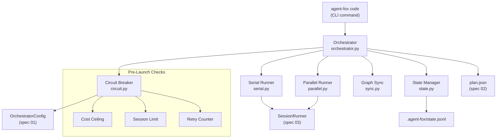

# Design Document: Orchestrator

## Overview

The orchestrator is the deterministic execution engine that reads the task
graph, dispatches sessions in dependency order, manages retries, cascade-blocks
failed tasks, persists state, enforces resource limits, and handles graceful
interruption. It contains zero LLM calls -- all AI work is delegated to the
session runner (spec 03). This spec covers six modules under
`agent_fox/engine/`.

## Architecture



### Module Responsibilities

1. `agent_fox/engine/orchestrator.py` -- Main execution loop. Loads plan,
   loads or initializes state, picks ready tasks, dispatches to serial or
   parallel runner, updates state after each session. Deterministic, zero
   LLM calls.
2. `agent_fox/engine/serial.py` -- Sequential session execution. Runs one
   task at a time with inter-session delay between dispatches.
3. `agent_fox/engine/parallel.py` -- Concurrent session execution. Runs up
   to 8 tasks via asyncio, with lock-serialized state writes.
4. `agent_fox/engine/circuit.py` -- Circuit breaker. Pre-launch checks:
   cost ceiling, session count limit, retry counter. Returns a go/no-go
   decision for each proposed session launch.
5. `agent_fox/engine/state.py` -- Execution state persistence. Save/load
   `.agent-fox/state.jsonl`, record session outcomes, reconstruct state
   on resume.
6. `agent_fox/engine/sync.py` -- Graph state propagation. Mark tasks
   complete/failed/blocked, propagate cascade blocks via BFS, identify
   ready tasks.

## Components and Interfaces

### Data Models

```python
# agent_fox/engine/state.py
from dataclasses import dataclass, field
from enum import Enum


class RunStatus(str, Enum):
    """Overall orchestrator run status."""
    RUNNING = "running"
    COMPLETED = "completed"
    INTERRUPTED = "interrupted"
    COST_LIMIT = "cost_limit"
    SESSION_LIMIT = "session_limit"
    STALLED = "stalled"


@dataclass
class SessionRecord:
    """Record of a single session attempt."""
    node_id: str
    attempt: int             # 1-indexed attempt number
    status: str              # "completed" | "failed"
    input_tokens: int
    output_tokens: int
    cost: float
    duration_ms: int
    error_message: str | None
    timestamp: str           # ISO 8601


@dataclass
class ExecutionState:
    """Full execution state, persisted after every session."""
    plan_hash: str                           # SHA-256 of plan.json
    node_states: dict[str, str]              # node_id -> NodeStatus value
    session_history: list[SessionRecord]
    total_input_tokens: int = 0
    total_output_tokens: int = 0
    total_cost: float = 0.0
    total_sessions: int = 0
    started_at: str = ""                     # ISO 8601
    updated_at: str = ""                     # ISO 8601
    run_status: str = "running"
```

### Orchestrator

```python
# agent_fox/engine/orchestrator.py
from agent_fox.core.config import OrchestratorConfig
from agent_fox.engine.state import ExecutionState, StateManager
from agent_fox.engine.circuit import CircuitBreaker
from agent_fox.engine.sync import GraphSync
from agent_fox.engine.serial import SerialRunner
from agent_fox.engine.parallel import ParallelRunner


class Orchestrator:
    """Deterministic execution engine. Zero LLM calls."""

    def __init__(
        self,
        config: OrchestratorConfig,
        plan_path: Path,
        state_path: Path,
        session_runner_factory: Callable[[str], SessionRunner],
    ) -> None:
        """
        Args:
            config: Orchestrator configuration (parallelism, retries, etc.)
            plan_path: Path to .agent-fox/plan.json
            state_path: Path to .agent-fox/state.jsonl
            session_runner_factory: Factory that creates a SessionRunner for
                a given node_id. Injected to enable testing with mocks.
        """
        self._config = config
        self._plan_path = plan_path
        self._state_path = state_path
        self._session_runner_factory = session_runner_factory
        self._state_manager = StateManager(state_path)
        self._circuit = CircuitBreaker(config)
        self._graph_sync: GraphSync | None = None
        self._interrupted = False
        ...

    async def run(self) -> ExecutionState:
        """Execute the full orchestration loop.

        1. Load plan from plan.json
        2. Load or initialize execution state
        3. Register SIGINT handler
        4. Loop: pick ready tasks, check circuit breaker, dispatch, update state
        5. Return final execution state

        Raises:
            PlanError: if plan.json is missing or corrupted
            CostLimitError: if cost ceiling is reached (after cleanup)
        """
        ...

    def _install_signal_handler(self) -> None:
        """Register SIGINT handler that sets _interrupted flag."""
        ...

    async def _shutdown(self, state: ExecutionState) -> None:
        """Save state, cancel in-flight tasks, print resume instructions."""
        ...
```

### Serial Runner

```python
# agent_fox/engine/serial.py
import asyncio
from agent_fox.engine.state import ExecutionState, SessionRecord


class SerialRunner:
    """Runs tasks one at a time with inter-session delay."""

    def __init__(
        self,
        session_runner_factory: Callable[[str], SessionRunner],
        inter_session_delay: float,
    ) -> None: ...

    async def execute(
        self,
        node_id: str,
        attempt: int,
        previous_error: str | None,
    ) -> SessionRecord:
        """Execute a single session and return the outcome record.

        Args:
            node_id: The task graph node to execute.
            attempt: The attempt number (1-indexed).
            previous_error: Error message from prior attempt, if any.

        Returns:
            A SessionRecord with outcome, cost, and timing.
        """
        ...

    async def delay(self) -> None:
        """Wait for the configured inter-session delay."""
        ...
```

### Parallel Runner

```python
# agent_fox/engine/parallel.py
import asyncio
from agent_fox.engine.state import ExecutionState, SessionRecord


class ParallelRunner:
    """Runs up to N tasks concurrently via asyncio."""

    def __init__(
        self,
        session_runner_factory: Callable[[str], SessionRunner],
        max_parallelism: int,
        inter_session_delay: float,
    ) -> None:
        self._state_lock = asyncio.Lock()
        ...

    async def execute_batch(
        self,
        tasks: list[tuple[str, int, str | None]],
        on_complete: Callable[[SessionRecord], Awaitable[None]],
    ) -> list[SessionRecord]:
        """Execute a batch of tasks concurrently.

        Args:
            tasks: List of (node_id, attempt, previous_error) tuples.
            on_complete: Callback invoked (under lock) after each session
                completes. Used by orchestrator to update state and
                propagate graph changes.

        Returns:
            List of SessionRecords for all completed tasks.
        """
        ...

    async def cancel_all(self) -> None:
        """Cancel all in-flight tasks. Called on SIGINT."""
        ...
```

### Circuit Breaker

```python
# agent_fox/engine/circuit.py
from agent_fox.core.config import OrchestratorConfig
from agent_fox.engine.state import ExecutionState


class LaunchDecision:
    """Result of a circuit breaker check."""
    allowed: bool
    reason: str | None  # None if allowed, explanation if denied


class CircuitBreaker:
    """Pre-launch checks: cost ceiling, session limit, retry counter."""

    def __init__(self, config: OrchestratorConfig) -> None: ...

    def check_launch(
        self,
        node_id: str,
        attempt: int,
        state: ExecutionState,
    ) -> LaunchDecision:
        """Determine whether a session launch is permitted.

        Checks (in order):
        1. Cost ceiling: state.total_cost >= config.max_cost
        2. Session limit: state.total_sessions >= config.max_sessions
        3. Retry limit: attempt > config.max_retries + 1

        Args:
            node_id: The task to check.
            attempt: The proposed attempt number (1-indexed).
            state: Current execution state.

        Returns:
            LaunchDecision with allowed=True or allowed=False with reason.
        """
        ...

    def should_stop(self, state: ExecutionState) -> LaunchDecision:
        """Check whether the orchestrator should stop launching entirely.

        This is called before picking the next batch of ready tasks.
        Checks cost ceiling and session limit only (not per-task retry).
        """
        ...
```

### State Manager

```python
# agent_fox/engine/state.py
import json
from pathlib import Path


class StateManager:
    """Handles loading, saving, and querying execution state."""

    def __init__(self, state_path: Path) -> None: ...

    def load(self) -> ExecutionState | None:
        """Load the most recent execution state from state.jsonl.

        Reads all lines, deserializes each as JSON, and reconstructs
        the latest ExecutionState.

        Returns:
            The loaded state, or None if file does not exist.

        Raises:
            Logs warning and returns None if file is corrupted.
        """
        ...

    def save(self, state: ExecutionState) -> None:
        """Append the current state as a JSON line to state.jsonl.

        Thread-safe: uses file-level locking for parallel mode.
        """
        ...

    def record_session(
        self,
        state: ExecutionState,
        record: SessionRecord,
    ) -> ExecutionState:
        """Update state with a completed session record.

        - Appends record to session_history
        - Updates total_input_tokens, total_output_tokens, total_cost
        - Increments total_sessions
        - Updates updated_at timestamp

        Returns:
            The updated ExecutionState (same object, mutated).
        """
        ...

    @staticmethod
    def compute_plan_hash(plan_path: Path) -> str:
        """Compute SHA-256 hash of plan.json for change detection."""
        ...
```

### Graph Sync

```python
# agent_fox/engine/sync.py


class GraphSync:
    """Graph state propagation: ready detection, cascade blocking."""

    def __init__(self, node_states: dict[str, str], edges: dict[str, list[str]]) -> None:
        """
        Args:
            node_states: Mutable dict of node_id -> status string.
            edges: Adjacency list: node_id -> list of dependency node_ids
                (nodes that must complete before this one).
        """
        ...

    def ready_tasks(self) -> list[str]:
        """Return node_ids of all tasks that are ready to execute.

        A task is ready when:
        - Its status is 'pending'
        - All of its dependencies have status 'completed'

        Returns:
            List of ready node_ids, sorted by spec prefix then group number.
        """
        ...

    def mark_completed(self, node_id: str) -> None:
        """Mark a task as completed and update the graph."""
        ...

    def mark_failed(self, node_id: str) -> None:
        """Mark a task as failed (before retry decision)."""
        ...

    def mark_blocked(self, node_id: str, reason: str) -> list[str]:
        """Mark a task as blocked and cascade-block all dependents.

        Uses BFS to find all transitively dependent nodes and marks
        them as blocked with the given reason.

        Args:
            node_id: The task that exhausted retries.
            reason: Human-readable blocking reason.

        Returns:
            List of node_ids that were cascade-blocked.
        """
        ...

    def mark_in_progress(self, node_id: str) -> None:
        """Mark a task as in_progress (being executed)."""
        ...

    def is_stalled(self) -> bool:
        """Check if no progress is possible.

        Returns True when no tasks are ready, no tasks are in_progress,
        but incomplete tasks remain.
        """
        ...

    def summary(self) -> dict[str, int]:
        """Return counts by status: {pending: N, completed: N, ...}."""
        ...
```

## Data Models

### ExecutionState Lifecycle

```
                    +-----------+
                    |  (start)  |
                    +-----+-----+
                          |
                    +-----v-----+
                    |  pending   |
                    +-----+-----+
                          |
                    +-----v-----+
                    | in_progress|
                    +-----+-----+
                       /     \
                +-----v--+ +--v------+
                |completed| | failed  |
                +---------+ +----+----+
                                 |
                          +------v------+
                          | retry?      |
                          | attempt<=max|
                          +------+------+
                            /         \
                    +------v--+  +----v-----+
                    | pending  |  | blocked  |
                    | (retry)  |  +----+-----+
                    +----------+       |
                                 +-----v-------+
                                 | cascade-    |
                                 | block deps  |
                                 +-------------+
```

### state.jsonl Format

Each line is a JSON object representing the full execution state snapshot at a
point in time. The last line is the current state. Example:

```json
{"plan_hash":"abc123","node_states":{"01_core:1":"completed","01_core:2":"pending"},"session_history":[{"node_id":"01_core:1","attempt":1,"status":"completed","input_tokens":12000,"output_tokens":8000,"cost":0.15,"duration_ms":45000,"error_message":null,"timestamp":"2026-03-01T10:00:00Z"}],"total_input_tokens":12000,"total_output_tokens":8000,"total_cost":0.15,"total_sessions":1,"started_at":"2026-03-01T09:55:00Z","updated_at":"2026-03-01T10:00:00Z","run_status":"running"}
```

### Directory Layout

```
agent_fox/
  engine/
    __init__.py
    orchestrator.py     # Main execution loop
    serial.py           # Sequential runner
    parallel.py         # Concurrent runner
    circuit.py          # Pre-launch checks
    state.py            # State persistence
    sync.py             # Graph state propagation
```

## Correctness Properties

### Property 1: Resume Idempotency

*For any* execution state persisted to `state.jsonl`, loading that state and
resuming execution SHALL produce the same sequence of session dispatches as if
the orchestrator had never been interrupted, provided the plan has not changed
(same plan hash).

**Validates:** 04-REQ-4.3, 04-REQ-7.2

### Property 2: Cascade Completeness

*For any* task T marked as blocked, every node reachable from T via dependency
edges SHALL also be marked as blocked. No node that transitively depends on T
SHALL remain in `pending` status.

**Validates:** 04-REQ-3.1, 04-REQ-10.2

### Property 3: Cost Limit Enforcement

*For any* execution where `max_cost` is configured, the number of sessions
*launched* after cumulative cost reaches the limit SHALL be zero. Sessions
that were in-flight when the limit was reached SHALL be allowed to complete.

**Validates:** 04-REQ-5.1, 04-REQ-5.2

### Property 4: Exactly-Once Execution

*For any* task in the graph, across all resume cycles, the task SHALL
transition to `completed` at most once. A task that is `completed` SHALL
never be re-executed.

**Validates:** 04-REQ-7.1, 04-REQ-7.2

### Property 5: Ready Task Correctness

*For any* task reported as ready by `GraphSync.ready_tasks()`, all of its
dependencies SHALL have status `completed`. No task with an incomplete
dependency SHALL be reported as ready.

**Validates:** 04-REQ-1.1, 04-REQ-10.1

### Property 6: Retry Bound

*For any* task, the total number of session attempts SHALL be at most
`max_retries + 1`. The orchestrator SHALL never exceed this bound.

**Validates:** 04-REQ-2.1, 04-REQ-2.3

### Property 7: Parallel State Safety

*For any* concurrent execution of N sessions, state writes SHALL be
serialized such that no two `save()` calls interleave and the resulting
`state.jsonl` is a valid sequence of JSON lines.

**Validates:** 04-REQ-6.3

## Error Handling

| Error Condition | Behavior | Requirement |
|----------------|----------|-------------|
| plan.json missing | Raise `PlanError` with "run `agent-fox plan` first" | 04-REQ-1.E1 |
| plan.json corrupted | Raise `PlanError` with parse error details | 04-REQ-1.E1 |
| Empty plan (zero nodes) | Print "nothing to execute", exit 0 | 04-REQ-1.E2 |
| state.jsonl corrupted | Log warning, discard state, start fresh | 04-REQ-4.E2 |
| Plan hash mismatch on resume | Warn user, offer fresh start or abort | 04-REQ-4.E1 |
| Session failure, retries remain | Retry with error feedback | 04-REQ-2.1, 04-REQ-2.2 |
| Session failure, retries exhausted | Block task, cascade-block dependents | 04-REQ-2.3, 04-REQ-3.1 |
| Cost ceiling reached | Stop launching, allow in-flight to finish | 04-REQ-5.1, 04-REQ-5.2 |
| Session limit reached | Stop launching, allow in-flight to finish | 04-REQ-5.3 |
| SIGINT received | Save state, cancel in-flight, print resume | 04-REQ-8.1, 04-REQ-8.2 |
| Double SIGINT | Exit immediately | 04-REQ-8.E1 |
| Stalled (no ready, no in-flight) | Warn user, exit non-zero | 04-REQ-1.4, 04-REQ-10.E1 |
| max_retries = 0, task fails | Block immediately, no retry | 04-REQ-2.E1 |

## Testing Strategy

- **Unit tests** validate individual components in isolation:
  - `GraphSync`: ready task detection, cascade blocking, stall detection
  - `CircuitBreaker`: cost ceiling, session limit, retry bound
  - `StateManager`: save/load roundtrip, plan hash computation, corrupt file handling
  - `SerialRunner`: single session dispatch, delay behavior
  - `ParallelRunner`: concurrent dispatch, lock serialization, cancellation

- **Property tests** (Hypothesis) verify invariants:
  - Cascade completeness: for any graph and blocked node, all dependents are blocked
  - Ready task correctness: for any graph state, ready tasks have all deps completed
  - Retry bound: for any sequence of failures, attempt count never exceeds max + 1
  - Cost limit: for any cost sequence, no launches after limit reached

- **Integration tests** verify the orchestrator end-to-end with mock session runners:
  - Full execution of a small graph (3-5 tasks, linear chain)
  - Resume after interruption
  - Parallel execution with mock concurrent sessions
  - Cost limit enforcement across multiple sessions

- All tests mock `SessionRunner` -- no real LLM calls in orchestrator tests.

- **Test command:** `uv run pytest tests/unit/engine/ -q`

## Definition of Done

A task group is complete when ALL of the following are true:

1. All subtasks within the group are checked off (`[x]`)
2. All spec tests (`test_spec.md` entries) for the task group pass
3. All property tests for the task group pass
4. All previously passing tests still pass (no regressions)
5. No linter warnings or errors introduced
6. Code is committed on a feature branch and pushed to remote
7. Feature branch is merged back to `develop`
8. `tasks.md` checkboxes are updated to reflect completion
