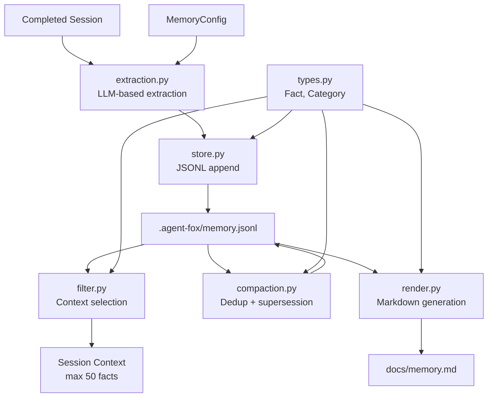

# Design Document: Structured Memory

## Overview

This spec implements the structured memory system for agent-fox v2. It
extracts facts from completed coding sessions, stores them in JSONL, selects
relevant facts for future session context, compacts the knowledge base, and
generates a human-readable summary. All subsequent knowledge-related specs
(Fox Ball, Time Vision) build on the fact model and storage layer established
here.

## Architecture



### Module Responsibilities

1. `agent_fox/memory/types.py` -- Fact dataclass, Category enum, ConfidenceLevel
   enum. Shared data types for all memory modules.
2. `agent_fox/memory/extraction.py` -- Extract facts from a completed session
   transcript using the SIMPLE model. Sends a structured prompt requesting
   JSON output. Parses the response into Fact objects.
3. `agent_fox/memory/store.py` -- JSONL-based fact store. Append facts, read
   all facts, load facts filtered by spec name. Manages the
   `.agent-fox/memory.jsonl` file.
4. `agent_fox/memory/filter.py` -- Select facts relevant to a task: match by
   spec_name and keyword overlap with the task description. Rank by relevance
   score. Enforce the 50-fact budget.
5. `agent_fox/memory/compaction.py` -- Deduplicate facts by content hash.
   Resolve supersession chains. Rewrite the JSONL file with surviving facts.
6. `agent_fox/memory/render.py` -- Generate human-readable `docs/memory.md`
   organized by category. Called at sync barriers and on demand.

## Components and Interfaces

### Data Types

```python
# agent_fox/memory/types.py
from dataclasses import dataclass, field
from enum import Enum


class Category(str, Enum):
    """Classification labels for extracted facts."""
    GOTCHA = "gotcha"
    PATTERN = "pattern"
    DECISION = "decision"
    CONVENTION = "convention"
    ANTI_PATTERN = "anti_pattern"
    FRAGILE_AREA = "fragile_area"


class ConfidenceLevel(str, Enum):
    """Reliability level of an extracted fact."""
    HIGH = "high"
    MEDIUM = "medium"
    LOW = "low"


@dataclass
class Fact:
    """A structured unit of knowledge extracted from a coding session."""
    id: str                      # UUID v4
    content: str                 # Description of the learning
    category: str                # Category enum value
    spec_name: str               # Source specification name
    keywords: list[str]          # Relevant terms for matching
    confidence: str              # "high" | "medium" | "low"
    created_at: str              # ISO 8601 timestamp
    supersedes: str | None = None  # UUID of the fact this one replaces
```

### Fact Extraction

```python
# agent_fox/memory/extraction.py
import json
import logging
import uuid
from datetime import datetime, timezone

from agent_fox.core.models import resolve_model
from agent_fox.memory.types import Category, ConfidenceLevel, Fact

logger = logging.getLogger("agent_fox.memory.extraction")

EXTRACTION_PROMPT = """Analyze the following coding session transcript and extract
structured learnings. For each learning, provide:

- content: A clear, concise description of the learning (1-2 sentences).
- category: One of: gotcha, pattern, decision, convention, anti_pattern, fragile_area.
- confidence: One of: high, medium, low.
- keywords: A list of 2-5 relevant terms for matching this fact to future tasks.

Respond with a JSON array of objects. Example:
[
  {
    "content": "The pytest-asyncio plugin requires mode='auto' in pyproject.toml.",
    "category": "gotcha",
    "confidence": "high",
    "keywords": ["pytest", "asyncio", "configuration"]
  }
]

If no learnings are worth extracting, respond with an empty array: []

Session transcript:
{transcript}
"""


async def extract_facts(
    transcript: str,
    spec_name: str,
    model_name: str = "SIMPLE",
) -> list[Fact]:
    """Extract structured facts from a session transcript using an LLM.

    Args:
        transcript: The full session transcript text.
        spec_name: The specification name for provenance.
        model_name: The model tier or ID to use (default: SIMPLE).

    Returns:
        A list of Fact objects extracted from the transcript.
        Returns an empty list if extraction fails or yields no facts.
    """
    ...


def _parse_extraction_response(
    raw_response: str,
    spec_name: str,
) -> list[Fact]:
    """Parse LLM JSON response into Fact objects.

    Validates categories and confidence levels, assigning defaults for
    invalid values. Generates UUIDs and timestamps for each fact.

    Args:
        raw_response: The raw JSON string from the LLM.
        spec_name: The specification name for provenance.

    Returns:
        A list of validated Fact objects.

    Raises:
        ValueError: If the response is not valid JSON.
    """
    ...
```

### Fact Store

```python
# agent_fox/memory/store.py
import json
import logging
from pathlib import Path

from agent_fox.memory.types import Fact

logger = logging.getLogger("agent_fox.memory.store")

DEFAULT_MEMORY_PATH = Path(".agent-fox/memory.jsonl")


def append_facts(facts: list[Fact], path: Path = DEFAULT_MEMORY_PATH) -> None:
    """Append facts to the JSONL file.

    Creates the file and parent directories if they do not exist.

    Args:
        facts: List of Fact objects to append.
        path: Path to the JSONL file.
    """
    ...


def load_all_facts(path: Path = DEFAULT_MEMORY_PATH) -> list[Fact]:
    """Load all facts from the JSONL file.

    Args:
        path: Path to the JSONL file.

    Returns:
        A list of all Fact objects. Returns an empty list if the file
        does not exist or is empty.
    """
    ...


def load_facts_by_spec(
    spec_name: str,
    path: Path = DEFAULT_MEMORY_PATH,
) -> list[Fact]:
    """Load facts filtered by specification name.

    Args:
        spec_name: The specification name to filter by.
        path: Path to the JSONL file.

    Returns:
        A list of Fact objects matching the spec name.
    """
    ...


def write_facts(facts: list[Fact], path: Path = DEFAULT_MEMORY_PATH) -> None:
    """Overwrite the JSONL file with the given facts.

    Used by compaction to rewrite the file after deduplication.

    Args:
        facts: The complete list of facts to write.
        path: Path to the JSONL file.
    """
    ...


def _fact_to_dict(fact: Fact) -> dict:
    """Serialize a Fact to a JSON-compatible dictionary."""
    ...


def _dict_to_fact(data: dict) -> Fact:
    """Deserialize a dictionary to a Fact object."""
    ...
```

### Context Selection (Filter)

```python
# agent_fox/memory/filter.py
import logging
from datetime import datetime, timezone

from agent_fox.memory.types import Fact

logger = logging.getLogger("agent_fox.memory.filter")

MAX_CONTEXT_FACTS = 50


def select_relevant_facts(
    all_facts: list[Fact],
    spec_name: str,
    task_keywords: list[str],
    budget: int = MAX_CONTEXT_FACTS,
) -> list[Fact]:
    """Select facts relevant to a task, ranked by relevance score.

    Matching criteria:
    - spec_name exact match (facts from the same spec)
    - Keyword overlap between fact keywords and task keywords

    Scoring:
    - keyword_match_count: number of overlapping keywords (case-insensitive)
    - recency_bonus: normalized value between 0 and 1 based on fact age
    - relevance_score = keyword_match_count + recency_bonus

    Args:
        all_facts: Complete list of facts from the knowledge base.
        spec_name: The current task's specification name.
        task_keywords: Keywords describing the current task.
        budget: Maximum number of facts to return (default: 50).

    Returns:
        A list of up to `budget` facts, sorted by relevance score
        (highest first).
    """
    ...


def _compute_relevance_score(
    fact: Fact,
    spec_name: str,
    task_keywords_lower: set[str],
    now: datetime,
    oldest: datetime,
) -> float:
    """Compute the relevance score for a single fact.

    Score = keyword_match_count + recency_bonus

    The recency bonus is computed as:
        (fact_age_from_oldest) / (total_age_range) if range > 0, else 1.0

    This gives the newest fact a bonus of 1.0 and the oldest a bonus of 0.0.
    """
    ...
```

### Compaction

```python
# agent_fox/memory/compaction.py
import hashlib
import logging
from pathlib import Path

from agent_fox.memory.store import load_all_facts, write_facts, DEFAULT_MEMORY_PATH
from agent_fox.memory.types import Fact

logger = logging.getLogger("agent_fox.memory.compaction")


def compact(path: Path = DEFAULT_MEMORY_PATH) -> tuple[int, int]:
    """Compact the knowledge base by removing duplicates and superseded facts.

    Steps:
    1. Load all facts.
    2. Deduplicate by content hash (SHA-256 of content string), keeping the
       earliest instance.
    3. Resolve supersession chains: if B supersedes A and C supersedes B,
       only C survives.
    4. Rewrite the JSONL file with surviving facts.

    Args:
        path: Path to the JSONL file.

    Returns:
        A tuple of (original_count, surviving_count).
    """
    ...


def _content_hash(content: str) -> str:
    """Compute SHA-256 hash of a fact's content string."""
    return hashlib.sha256(content.encode("utf-8")).hexdigest()


def _deduplicate_by_content(facts: list[Fact]) -> list[Fact]:
    """Remove duplicate facts with the same content hash.

    Keeps the earliest instance (by created_at) for each unique hash.
    """
    ...


def _resolve_supersession(facts: list[Fact]) -> list[Fact]:
    """Remove facts that have been superseded by newer facts.

    A fact is superseded if another fact references its ID in the
    `supersedes` field. Chains are resolved transitively.
    """
    ...
```

### Human-Readable Summary (Render)

```python
# agent_fox/memory/render.py
import logging
from pathlib import Path

from agent_fox.memory.store import load_all_facts, DEFAULT_MEMORY_PATH
from agent_fox.memory.types import Category, Fact

logger = logging.getLogger("agent_fox.memory.render")

DEFAULT_SUMMARY_PATH = Path("docs/memory.md")

CATEGORY_TITLES: dict[str, str] = {
    "gotcha": "Gotchas",
    "pattern": "Patterns",
    "decision": "Decisions",
    "convention": "Conventions",
    "anti_pattern": "Anti-Patterns",
    "fragile_area": "Fragile Areas",
}


def render_summary(
    memory_path: Path = DEFAULT_MEMORY_PATH,
    output_path: Path = DEFAULT_SUMMARY_PATH,
) -> None:
    """Generate a human-readable markdown summary of all facts.

    Creates `docs/memory.md` with facts organized by category. Each fact
    entry includes the content, source spec name, and confidence level.

    Creates the output directory if it does not exist.

    Args:
        memory_path: Path to the JSONL fact file.
        output_path: Path to the output markdown file.
    """
    ...


def _render_fact(fact: Fact) -> str:
    """Render a single fact as a markdown list item.

    Format:
        - {content} _(spec: {spec_name}, confidence: {confidence})_
    """
    ...


def _render_empty_summary() -> str:
    """Render the summary content when no facts exist."""
    return (
        "# Agent-Fox Memory\n\n"
        "_No facts have been recorded yet._\n"
    )
```

## Data Models

### Fact Lifecycle

```
Session Transcript
    |
    v
[extraction.py] -- LLM call (SIMPLE model)
    |
    v
list[Fact]  (with UUID, timestamp, category, keywords)
    |
    v
[store.py] -- append to .agent-fox/memory.jsonl
    |
    +---> [filter.py] -- select for next session context (max 50)
    |
    +---> [compaction.py] -- dedup + supersession resolution
    |
    +---> [render.py] -- generate docs/memory.md
```

### JSONL Record Format

Each line in `.agent-fox/memory.jsonl` is a JSON object:

```json
{
  "id": "a1b2c3d4-e5f6-7890-abcd-ef1234567890",
  "content": "The pytest-asyncio plugin requires mode='auto' in pyproject.toml.",
  "category": "gotcha",
  "spec_name": "01_core_foundation",
  "keywords": ["pytest", "asyncio", "configuration"],
  "confidence": "high",
  "created_at": "2026-03-01T10:30:00+00:00",
  "supersedes": null
}
```

### Human-Readable Summary Format

```markdown
# Agent-Fox Memory

## Gotchas

- The pytest-asyncio plugin requires mode='auto' in pyproject.toml. _(spec: 01_core_foundation, confidence: high)_

## Patterns

- Using `tmp_path` fixture with monkeypatch provides reliable filesystem isolation. _(spec: 01_core_foundation, confidence: medium)_

## Decisions
...
```

## Correctness Properties

### Property 1: Context Budget Enforcement

*For any* knowledge base of any size and any set of task keywords, the
`select_relevant_facts()` function SHALL return at most `budget` facts
(default: 50). The returned list SHALL never exceed the budget.

**Validates:** 05-REQ-4.3

### Property 2: Compaction Idempotency

*For any* knowledge base, running `compact()` twice SHALL produce the same
file content as running it once. The second compaction SHALL not remove any
additional facts.

**Validates:** 05-REQ-5.E2

### Property 3: Category Completeness

*For any* value in the `Category` enum, there SHALL exist a corresponding
entry in `CATEGORY_TITLES` and the value SHALL be accepted by fact extraction
and storage without error.

**Validates:** 05-REQ-2.1

### Property 4: Fact Serialization Round-Trip

*For any* valid Fact object, serializing it to JSON via `_fact_to_dict()` and
deserializing it back via `_dict_to_fact()` SHALL produce a Fact object equal
to the original.

**Validates:** 05-REQ-3.2

### Property 5: Deduplication Determinism

*For any* set of facts containing duplicates (same content hash), the
`_deduplicate_by_content()` function SHALL always keep the same instance (the
earliest by `created_at`) regardless of input order.

**Validates:** 05-REQ-5.1

### Property 6: Supersession Chain Resolution

*For any* chain of supersession (A superseded by B, B superseded by C), only
the terminal fact (C) SHALL survive compaction. No intermediate or original
facts in the chain SHALL remain.

**Validates:** 05-REQ-5.2

## Error Handling

| Error Condition | Behavior | Requirement |
|----------------|----------|-------------|
| LLM returns invalid JSON | Log warning, skip extraction, return empty list | 05-REQ-1.E1 |
| LLM returns zero facts | Log debug message, return empty list | 05-REQ-1.E2 |
| Unknown category in LLM response | Log warning, default to "gotcha" | 05-REQ-2.2 |
| Memory file does not exist (read) | Return empty list | 05-REQ-4.E2 |
| Memory file does not exist (write) | Create file and parent dirs | 05-REQ-3.E1 |
| Memory file write failure | Log error, continue without raising | 05-REQ-3.E2 |
| No matching facts for context | Return empty list | 05-REQ-4.E1 |
| Empty knowledge base for compaction | Report "no compaction needed" | 05-REQ-5.E1 |
| docs/ directory missing for render | Create directory | 05-REQ-6.E1 |
| Empty knowledge base for render | Generate "no facts" summary | 05-REQ-6.E2 |

## Technology Stack

| Technology | Version | Purpose |
|-----------|---------|---------|
| Python | 3.12+ | Runtime |
| anthropic | 0.40+ | LLM API calls for extraction |
| pytest | 8.0+ | Test framework |
| hypothesis | 6.0+ | Property-based testing |

## Testing Strategy

- **Unit tests** validate individual functions: fact serialization round-trip,
  content hash computation, category validation, keyword matching, relevance
  scoring, deduplication, supersession resolution, markdown rendering.
- **Property tests** (Hypothesis) verify invariants: context budget
  enforcement, compaction idempotency, serialization round-trip, deduplication
  determinism, supersession chain resolution, category completeness.
- **Integration tests** verify the end-to-end extraction pipeline with a
  mocked LLM, the store append/read cycle, and the compact command.
- **Mock strategy:** All tests that would call the LLM use a mock that returns
  predetermined JSON responses. No real API calls in tests.

## Definition of Done

A task group is complete when ALL of the following are true:

1. All subtasks within the group are checked off (`[x]`)
2. All spec tests (`test_spec.md` entries) for the task group pass
3. All property tests for the task group pass
4. All previously passing tests still pass (no regressions)
5. No linter warnings or errors introduced
6. Code is committed on a feature branch and pushed to remote
7. Feature branch is merged back to `develop`
8. `tasks.md` checkboxes are updated to reflect completion
