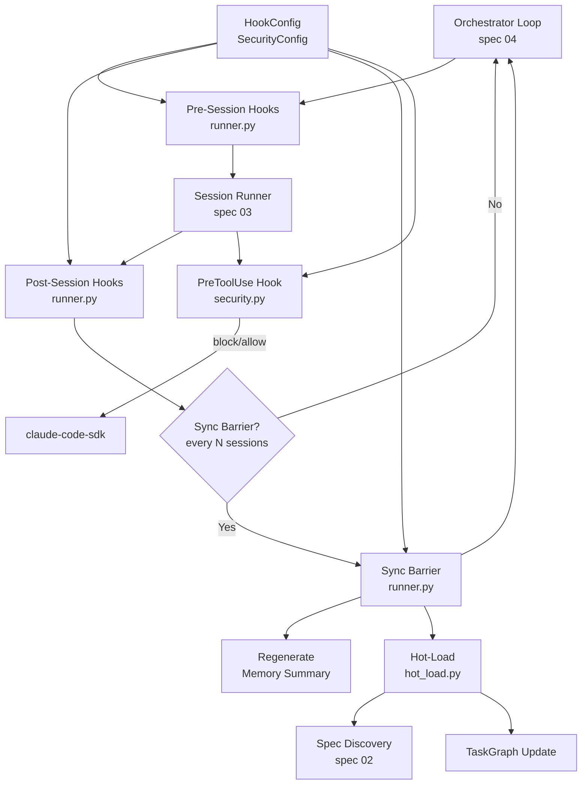

# Design Document: Hooks, Sync Barriers, and Security

## Overview

This spec implements three related extensibility and safety systems: the hook
runner that executes user-configured scripts at session boundaries and sync
barriers, the command allowlist that restricts agent shell access, and the
hot-loader that discovers and incorporates new specifications at sync barriers.

## Architecture



### Module Responsibilities

1. `agent_fox/hooks/runner.py` -- Execute hook scripts (pre_code, post_code,
   sync_barrier) as subprocesses. Pass context via environment variables.
   Handle abort/warn modes. Enforce hook timeout.
2. `agent_fox/hooks/security.py` -- Command allowlist enforcement. Default
   allowlist of ~35 commands. Extend via config. Register as claude-code-sdk
   PreToolUse hook.
3. `agent_fox/engine/hot_load.py` -- At sync barriers, scan `.specs/` for new
   folders not in the current plan. Parse, build nodes, and incorporate into
   the task graph without restart.

## Components and Interfaces

### Hook Runner

```python
# agent_fox/hooks/runner.py
import subprocess
import logging
from dataclasses import dataclass
from pathlib import Path
from agent_fox.core.config import HookConfig
from agent_fox.core.errors import HookError

logger = logging.getLogger("agent_fox.hooks.runner")


@dataclass(frozen=True)
class HookContext:
    """Context passed to hook scripts via environment variables."""
    spec_name: str
    task_group: str        # group number as string, or barrier sequence
    workspace: str         # absolute path to workspace directory
    branch: str            # feature branch name


@dataclass(frozen=True)
class HookResult:
    """Result of a single hook script execution."""
    script: str            # path or name of the hook script
    exit_code: int
    stdout: str
    stderr: str
    timed_out: bool


def build_hook_env(context: HookContext) -> dict[str, str]:
    """Build the environment variable dict for a hook subprocess.

    Returns a copy of the current environment with AF_* variables added:
    - AF_SPEC_NAME: the current specification name
    - AF_TASK_GROUP: the current task group number
    - AF_WORKSPACE: absolute path to the workspace directory
    - AF_BRANCH: the feature branch name
    """
    ...


def run_hook(
    script: str,
    context: HookContext,
    *,
    timeout: int = 300,
    mode: str = "abort",
    cwd: Path | None = None,
) -> HookResult:
    """Execute a single hook script as a subprocess.

    Args:
        script: Path to the hook script or command string.
        context: HookContext with task metadata.
        timeout: Maximum execution time in seconds.
        mode: "abort" or "warn" -- determines behavior on failure.
        cwd: Working directory for the subprocess.

    Returns:
        HookResult with exit code, output, and timeout flag.

    Raises:
        HookError: If the hook fails and mode is "abort".
    """
    ...


def run_hooks(
    scripts: list[str],
    context: HookContext,
    *,
    config: HookConfig,
    cwd: Path | None = None,
) -> list[HookResult]:
    """Execute a list of hook scripts sequentially.

    Args:
        scripts: List of hook script paths/commands.
        context: HookContext with task metadata.
        config: HookConfig for timeout and per-hook modes.
        cwd: Working directory for subprocesses.

    Returns:
        List of HookResult for each script executed.

    Raises:
        HookError: If any hook fails in "abort" mode.
    """
    ...


def run_pre_session_hooks(
    context: HookContext,
    config: HookConfig,
    *,
    no_hooks: bool = False,
) -> list[HookResult]:
    """Run all configured pre-session hooks.

    Args:
        context: HookContext with task metadata.
        config: HookConfig with pre_code script list.
        no_hooks: If True, skip all hooks and return empty list.

    Returns:
        List of HookResult. Empty if no_hooks=True or no hooks configured.

    Raises:
        HookError: If any abort-mode hook fails.
    """
    ...


def run_post_session_hooks(
    context: HookContext,
    config: HookConfig,
    *,
    no_hooks: bool = False,
) -> list[HookResult]:
    """Run all configured post-session hooks.

    Args:
        context: HookContext with task metadata.
        config: HookConfig with post_code script list.
        no_hooks: If True, skip all hooks and return empty list.

    Returns:
        List of HookResult. Empty if no_hooks=True or no hooks configured.

    Raises:
        HookError: If any abort-mode hook fails.
    """
    ...


def run_sync_barrier_hooks(
    barrier_number: int,
    config: HookConfig,
    *,
    workspace: str = "",
    branch: str = "",
    no_hooks: bool = False,
) -> list[HookResult]:
    """Run all configured sync-barrier hooks.

    Creates a HookContext with spec_name="__sync_barrier__" and
    task_group set to the barrier sequence number.

    Args:
        barrier_number: The barrier sequence number (1, 2, 3, ...).
        config: HookConfig with sync_barrier script list.
        workspace: Workspace path for the barrier context.
        branch: Branch name for the barrier context.
        no_hooks: If True, skip all hooks and return empty list.

    Returns:
        List of HookResult. Empty if no_hooks=True or no hooks configured.

    Raises:
        HookError: If any abort-mode hook fails.
    """
    ...
```

### Command Allowlist (Security)

```python
# agent_fox/hooks/security.py
import logging
from pathlib import PurePosixPath
from agent_fox.core.config import SecurityConfig
from agent_fox.core.errors import SecurityError

logger = logging.getLogger("agent_fox.hooks.security")

# Default allowlist: ~35 standard development commands
DEFAULT_ALLOWLIST: frozenset[str] = frozenset({
    # Version control
    "git",
    # Python ecosystem
    "python", "python3", "uv", "pip", "pytest", "ruff", "mypy",
    # JavaScript ecosystem
    "npm", "npx", "node",
    # Build tools
    "make", "cargo", "go", "rustc", "gcc",
    # File utilities
    "ls", "cat", "mkdir", "cp", "mv", "rm", "find", "grep",
    "sed", "awk", "echo", "head", "tail", "wc", "sort", "diff",
    "touch", "chmod",
    # Network utilities
    "curl", "wget",
    # Archive utilities
    "tar", "gzip",
    # System utilities
    "which", "env", "printenv", "date",
    # Shell builtins / control
    "cd", "pwd", "test", "true", "false",
})


def build_effective_allowlist(config: SecurityConfig) -> frozenset[str]:
    """Compute the effective allowlist from configuration.

    - If bash_allowlist is set, use it as the complete list (replaces defaults).
    - If bash_allowlist_extend is set (and bash_allowlist is not), use
      DEFAULT_ALLOWLIST + extensions.
    - If both are set, bash_allowlist takes precedence and a warning is logged.
    - If neither is set, use DEFAULT_ALLOWLIST.

    Args:
        config: SecurityConfig with allowlist settings.

    Returns:
        Frozenset of permitted command names.
    """
    ...


def extract_command_name(command_string: str) -> str:
    """Extract the command name from a shell command string.

    Takes the first whitespace-delimited token and strips any path prefix
    to yield the basename. For example:
    - "git status" -> "git"
    - "/usr/bin/python3 -m pytest" -> "python3"
    - "  ls -la  " -> "ls"

    Args:
        command_string: The full command string from the Bash tool.

    Returns:
        The extracted command name (basename only).

    Raises:
        SecurityError: If the command string is empty or whitespace-only.
    """
    ...


def check_command_allowed(
    command_string: str,
    allowlist: frozenset[str],
) -> tuple[bool, str]:
    """Check whether a command is permitted by the allowlist.

    Args:
        command_string: The full command string.
        allowlist: Set of permitted command names.

    Returns:
        Tuple of (allowed: bool, message: str). If blocked, message
        identifies the command and lists up to 10 similar allowed commands.
    """
    ...


def make_pre_tool_use_hook(
    config: SecurityConfig,
) -> object:
    """Create a PreToolUse hook function for the claude-code-sdk.

    The returned callable inspects Bash tool invocations and blocks
    commands not on the effective allowlist. Non-Bash tool invocations
    are passed through without inspection.

    The hook follows the claude-code-sdk PreToolUse protocol:
    - Receives tool_name and tool_input
    - Returns {"decision": "allow"} or {"decision": "block", "message": "..."}

    Args:
        config: SecurityConfig with allowlist settings.

    Returns:
        A callable suitable for use as a PreToolUse hook.
    """
    ...
```

### Hot-Loader

```python
# agent_fox/engine/hot_load.py
import logging
from pathlib import Path
from agent_fox.graph.types import TaskGraph
from agent_fox.spec.discovery import SpecInfo

logger = logging.getLogger("agent_fox.engine.hot_load")


def discover_new_specs(
    specs_dir: Path,
    known_specs: set[str],
) -> list[SpecInfo]:
    """Find spec folders in .specs/ not already in the task graph.

    Args:
        specs_dir: Path to the .specs/ directory.
        known_specs: Set of spec names already in the current plan.

    Returns:
        List of newly discovered SpecInfo records, sorted by prefix.
    """
    ...


def hot_load_specs(
    graph: TaskGraph,
    specs_dir: Path,
) -> tuple[TaskGraph, list[str]]:
    """Incorporate newly discovered specs into the task graph.

    1. Discover new spec folders not in graph.nodes.
    2. Parse tasks.md for each new spec.
    3. Parse cross-spec dependencies from each new spec's prd.md.
    4. Create nodes and edges for the new specs.
    5. Re-compute topological ordering.
    6. Return updated graph and list of new spec names.

    Args:
        graph: The current task graph.
        specs_dir: Path to the .specs/ directory.

    Returns:
        Tuple of (updated TaskGraph, list of newly added spec names).
        If no new specs are found, returns the original graph unchanged
        and an empty list.
    """
    ...
```

## Data Models

### Hook Environment Variables

| Variable | Description | Example |
|----------|-------------|---------|
| `AF_SPEC_NAME` | Current specification name | `"03_session_and_workspace"` |
| `AF_TASK_GROUP` | Current task group number (or barrier number) | `"2"` |
| `AF_WORKSPACE` | Absolute path to workspace directory | `"/repo/.agent-fox/worktrees/03/2"` |
| `AF_BRANCH` | Feature branch name | `"feature/03_session_and_workspace/2"` |

For sync-barrier hooks, `AF_SPEC_NAME` is set to `"__sync_barrier__"` and
`AF_TASK_GROUP` is the barrier sequence number.

### Default Allowlist (Complete)

```
git python python3 uv pip npm npx node pytest ruff mypy make cargo go rustc
gcc ls cat mkdir cp mv rm find grep sed awk echo curl wget tar gzip which env
printenv date head tail wc sort diff touch chmod cd pwd test true false
```

Total: 46 commands.

### Sync Barrier Trigger Condition

```
barrier_triggered = (
    sync_interval > 0
    and completed_session_count > 0
    and completed_session_count % sync_interval == 0
)
```

## Correctness Properties

### Property 1: Allowlist Enforcement Completeness

*For any* Bash tool invocation with a command string, the PreToolUse hook SHALL
either allow or block the command. No command SHALL pass without being checked
against the effective allowlist. A command is allowed if and only if its
extracted name (first token, basename) is in the effective allowlist.

**Validates:** 06-REQ-8.1, 06-REQ-8.2

### Property 2: Hook Timeout Guarantee

*For any* hook script execution, the subprocess SHALL terminate within
`timeout + 5` seconds (allowing 5 seconds for process cleanup). A timed-out
hook SHALL always be treated as a failure, never as a success.

**Validates:** 06-REQ-3.1, 06-REQ-3.2

### Property 3: Default Allowlist Stability

*For any* `SecurityConfig` with both `bash_allowlist` and
`bash_allowlist_extend` set to their defaults (None and empty list
respectively), the effective allowlist SHALL equal `DEFAULT_ALLOWLIST`.

**Validates:** 06-REQ-8.3, 06-REQ-9.1, 06-REQ-9.2

### Property 4: Hook Mode Determinism

*For any* hook script and configured mode, the system SHALL always raise
`HookError` for "abort" mode failures and never raise for "warn" mode
failures. There SHALL be no mode where the behavior is ambiguous.

**Validates:** 06-REQ-2.1, 06-REQ-2.2, 06-REQ-2.3

### Property 5: Hot-Load Monotonicity

*For any* task graph, after hot-loading, the set of node IDs in the graph
SHALL be a superset of the node IDs before hot-loading. No existing node
SHALL be removed or modified.

**Validates:** 06-REQ-7.1, 06-REQ-7.3

### Property 6: No-Hooks Bypass Completeness

*For any* run with `--no-hooks`, zero hook subprocesses SHALL be spawned.
This applies to pre-session, post-session, and sync-barrier hooks alike.

**Validates:** 06-REQ-5.1

## Error Handling

| Error Condition | Behavior | Requirement |
|----------------|----------|-------------|
| Hook script not found / not executable | Treat as failure, apply configured mode | 06-REQ-2.E1 |
| Hook script exits non-zero (abort mode) | Raise `HookError` with script name and exit code | 06-REQ-2.1 |
| Hook script exits non-zero (warn mode) | Log warning, continue execution | 06-REQ-2.2 |
| Hook script exceeds timeout | Terminate subprocess, treat as failure | 06-REQ-3.2 |
| Empty command string in Bash tool | Block invocation with descriptive error | 06-REQ-8.E1 |
| Command not on allowlist | Block with message listing command name | 06-REQ-8.2 |
| New spec has invalid dependency reference | Log warning, skip new spec | 06-REQ-7.E1 |
| No new specs found at barrier | Continue without graph modification | 06-REQ-7.E2 |
| Both bash_allowlist and bash_allowlist_extend set | Use bash_allowlist, log warning | 06-REQ-9.E1 |

## Technology Stack

| Technology | Version | Purpose |
|-----------|---------|---------|
| Python | 3.12+ | Runtime |
| subprocess | stdlib | Hook script execution |
| pytest | 8.0+ | Test framework |
| hypothesis | 6.0+ | Property-based testing |

## Definition of Done

A task group is complete when ALL of the following are true:

1. All subtasks within the group are checked off (`[x]`)
2. All spec tests (`test_spec.md` entries) for the task group pass
3. All property tests for the task group pass
4. All previously passing tests still pass (no regressions)
5. No linter warnings or errors introduced
6. Code is committed on a feature branch and pushed to remote
7. Feature branch is merged back to `develop`
8. `tasks.md` checkboxes are updated to reflect completion

## Testing Strategy

- **Unit tests** validate individual functions: hook environment construction,
  single hook execution, hook mode behavior, command extraction, allowlist
  building, allowlist checking, new spec discovery, task graph augmentation.
- **Property tests** (Hypothesis) verify invariants: allowlist enforcement
  completeness, hook timeout guarantee, default allowlist stability, hook
  mode determinism, hot-load monotonicity, no-hooks bypass completeness.
- **Hook execution tests** use temporary executable scripts created via
  `tmp_path` to simulate real hook scripts with controlled exit codes and
  execution durations.
- **Security tests** use parameterized test cases covering the full default
  allowlist, path-prefixed commands, empty commands, and custom allowlists.
- **Hot-load tests** use temporary `.specs/` directories with controlled
  spec folder contents.
