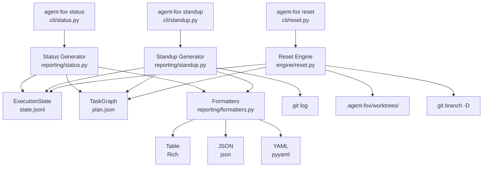

# Design Document: Operational Commands

## Overview

This spec implements three operational CLI commands: `agent-fox status`,
`agent-fox standup`, and `agent-fox reset`. The reporting layer reads execution
state and plan data to produce structured reports. The reset engine modifies
execution state and cleans up filesystem artifacts. A shared formatter
interface renders reports as Rich tables, JSON, or YAML.

## Architecture



### Module Responsibilities

1. `agent_fox/reporting/status.py` -- Generate status report data from
   execution state and task graph: task counts by status, token usage, cost,
   blocked/failed tasks list.
2. `agent_fox/reporting/standup.py` -- Generate standup report data: agent
   activity within a time window, human commits (via git log), file overlap
   detection, cost breakdown by model, queued tasks.
3. `agent_fox/reporting/formatters.py` -- Output formatting: table (Rich),
   JSON, YAML. Shared formatter interface used by both status and standup.
4. `agent_fox/engine/reset.py` -- Reset incomplete tasks or a single task.
   Clean up worktree directories and feature branches. Re-evaluate blocked
   tasks after single-task reset.
5. `agent_fox/cli/status.py` -- `agent-fox status` Click command with
   `--format` option.
6. `agent_fox/cli/standup.py` -- `agent-fox standup` Click command with
   `--hours`, `--format`, `--output` options.
7. `agent_fox/cli/reset.py` -- `agent-fox reset` Click command with optional
   task ID positional argument and `--yes` flag.

## Components and Interfaces

### Status Report Generator

```python
# agent_fox/reporting/status.py
from dataclasses import dataclass, field
from pathlib import Path

@dataclass(frozen=True)
class TaskSummary:
    """Summary of a single blocked or failed task."""
    task_id: str
    title: str
    status: str
    reason: str  # failure message or blocking reason

@dataclass(frozen=True)
class StatusReport:
    """Complete status report data model."""
    counts: dict[str, int]       # status -> count
    total_tasks: int
    input_tokens: int
    output_tokens: int
    estimated_cost: float        # USD
    problem_tasks: list[TaskSummary]
    per_spec: dict[str, dict[str, int]]  # spec_name -> {status -> count}

def generate_status(
    state_path: Path,
    plan_path: Path,
) -> StatusReport:
    """Generate a status report from execution state and plan.

    Args:
        state_path: Path to .agent-fox/state.jsonl.
        plan_path: Path to .agent-fox/plan.json.

    Returns:
        StatusReport with task counts, token usage, cost, and problem tasks.

    Raises:
        AgentFoxError: If neither state nor plan file can be read.
    """
    ...
```

### Standup Report Generator

```python
# agent_fox/reporting/standup.py
from dataclasses import dataclass, field
from datetime import datetime
from pathlib import Path

@dataclass(frozen=True)
class AgentActivity:
    """Agent work within the reporting window."""
    tasks_completed: int
    sessions_run: int
    input_tokens: int
    output_tokens: int
    cost: float                  # USD
    completed_task_ids: list[str]

@dataclass(frozen=True)
class HumanCommit:
    """A non-agent commit within the reporting window."""
    sha: str
    author: str
    timestamp: str               # ISO 8601
    subject: str
    files_changed: list[str]

@dataclass(frozen=True)
class FileOverlap:
    """A file modified by both agent and human in the window."""
    path: str
    agent_task_ids: list[str]    # which agent tasks touched it
    human_commits: list[str]     # which human commit SHAs touched it

@dataclass(frozen=True)
class CostBreakdown:
    """Cost breakdown by model tier."""
    tier: str
    sessions: int
    input_tokens: int
    output_tokens: int
    cost: float

@dataclass(frozen=True)
class QueueSummary:
    """Current task queue status."""
    ready: int
    pending: int
    blocked: int
    failed: int
    completed: int

@dataclass(frozen=True)
class StandupReport:
    """Complete standup report data model."""
    window_hours: int
    window_start: str            # ISO 8601
    window_end: str              # ISO 8601
    agent: AgentActivity
    human_commits: list[HumanCommit]
    file_overlaps: list[FileOverlap]
    cost_breakdown: list[CostBreakdown]
    queue: QueueSummary

def generate_standup(
    state_path: Path,
    plan_path: Path,
    repo_path: Path,
    hours: int = 24,
    agent_author: str = "agent-fox",
) -> StandupReport:
    """Generate a standup report for the given time window.

    Args:
        state_path: Path to .agent-fox/state.jsonl.
        plan_path: Path to .agent-fox/plan.json.
        repo_path: Path to the git repository root.
        hours: Reporting window in hours (default 24).
        agent_author: Git author name used by agent-fox for filtering.

    Returns:
        StandupReport covering the specified time window.
    """
    ...


def _get_human_commits(
    repo_path: Path,
    since: datetime,
    agent_author: str,
) -> list[HumanCommit]:
    """Query git log for non-agent commits since the given timestamp.

    Uses `git log --since=<ISO> --invert-grep --author=<agent_author>`
    to exclude agent commits.

    Args:
        repo_path: Path to the git repository root.
        since: Start of reporting window.
        agent_author: Author name to exclude.

    Returns:
        List of HumanCommit records.
    """
    ...


def _detect_overlaps(
    agent_files: dict[str, list[str]],  # path -> list of task_ids
    human_commits: list[HumanCommit],
) -> list[FileOverlap]:
    """Detect files modified by both agent and human.

    Args:
        agent_files: Mapping of file path to agent task IDs that touched it.
        human_commits: Human commits with their changed files.

    Returns:
        List of FileOverlap records for files touched by both.
    """
    ...
```

### Output Formatters

```python
# agent_fox/reporting/formatters.py
from __future__ import annotations
from dataclasses import asdict
from enum import Enum
from pathlib import Path
from typing import Any, Protocol

from rich.console import Console
from rich.table import Table


class OutputFormat(str, Enum):
    TABLE = "table"
    JSON = "json"
    YAML = "yaml"


class ReportFormatter(Protocol):
    """Protocol for report formatters."""

    def format_status(self, report: StatusReport) -> str: ...
    def format_standup(self, report: StandupReport) -> str: ...


class TableFormatter:
    """Rich table formatter for terminal output."""

    def __init__(self, console: Console) -> None:
        self._console = console

    def format_status(self, report: StatusReport) -> str:
        """Render status report as Rich tables."""
        ...

    def format_standup(self, report: StandupReport) -> str:
        """Render standup report as Rich tables."""
        ...


class JsonFormatter:
    """JSON formatter for machine-readable output."""

    def format_status(self, report: StatusReport) -> str:
        """Serialize status report as JSON."""
        ...

    def format_standup(self, report: StandupReport) -> str:
        """Serialize standup report as JSON."""
        ...


class YamlFormatter:
    """YAML formatter for human-readable structured output."""

    def format_status(self, report: StatusReport) -> str:
        """Serialize status report as YAML."""
        ...

    def format_standup(self, report: StandupReport) -> str:
        """Serialize standup report as YAML."""
        ...


def get_formatter(
    fmt: OutputFormat,
    console: Console | None = None,
) -> ReportFormatter:
    """Factory function to create the appropriate formatter.

    Args:
        fmt: The desired output format.
        console: Rich console instance (required for table format).

    Returns:
        A formatter implementing ReportFormatter.
    """
    ...


def write_output(
    content: str,
    output_path: Path | None = None,
    console: Console | None = None,
) -> None:
    """Write formatted output to stdout or a file.

    Args:
        content: The formatted report string.
        output_path: If set, write to this file instead of stdout.
        console: Rich console for styled stdout output.

    Raises:
        AgentFoxError: If the output path is not writable.
    """
    ...
```

### Reset Engine

```python
# agent_fox/engine/reset.py
from dataclasses import dataclass
from pathlib import Path

@dataclass(frozen=True)
class ResetResult:
    """Result of a reset operation."""
    reset_tasks: list[str]       # task IDs that were reset
    unblocked_tasks: list[str]   # task IDs that were cascade-unblocked
    cleaned_worktrees: list[str] # worktree directories removed
    cleaned_branches: list[str]  # git branches deleted

def reset_all(
    state_path: Path,
    plan_path: Path,
    worktrees_dir: Path,
    repo_path: Path,
) -> ResetResult:
    """Reset all incomplete tasks to pending.

    Resets tasks with status failed, blocked, or in_progress.
    Cleans up worktree directories and feature branches.

    Args:
        state_path: Path to .agent-fox/state.jsonl.
        plan_path: Path to .agent-fox/plan.json.
        worktrees_dir: Path to .agent-fox/worktrees/.
        repo_path: Path to the git repository root.

    Returns:
        ResetResult summarizing what was reset.

    Raises:
        AgentFoxError: If state or plan files are missing.
    """
    ...


def reset_task(
    task_id: str,
    state_path: Path,
    plan_path: Path,
    worktrees_dir: Path,
    repo_path: Path,
) -> ResetResult:
    """Reset a single task and re-evaluate downstream blockers.

    If the reset task was the sole blocker for a downstream task,
    that downstream task is also reset to pending.

    Args:
        task_id: The task identifier to reset (e.g., "02_planning_engine:3").
        state_path: Path to .agent-fox/state.jsonl.
        plan_path: Path to .agent-fox/plan.json.
        worktrees_dir: Path to .agent-fox/worktrees/.
        repo_path: Path to the git repository root.

    Returns:
        ResetResult summarizing what was reset and unblocked.

    Raises:
        AgentFoxError: If the task ID is not found in the plan.
        AgentFoxError: If the task is already completed.
    """
    ...


def _clean_worktree(worktrees_dir: Path, task_id: str) -> str | None:
    """Remove a task's worktree directory if it exists.

    Args:
        worktrees_dir: Path to .agent-fox/worktrees/.
        task_id: The task identifier.

    Returns:
        The worktree path that was removed, or None if it didn't exist.
    """
    ...


def _clean_branch(repo_path: Path, task_id: str) -> str | None:
    """Delete a task's feature branch if it exists.

    The branch name is derived from the task ID:
    feature/{spec_name}-{group_number}.

    Args:
        repo_path: Path to the git repository root.
        task_id: The task identifier.

    Returns:
        The branch name that was deleted, or None if it didn't exist.
    """
    ...


def _find_sole_blocker_dependents(
    task_id: str,
    plan: TaskGraph,
    state: ExecutionState,
) -> list[str]:
    """Find downstream tasks where task_id is the sole blocker.

    A downstream task qualifies if:
    1. Its status is 'blocked'.
    2. All of its prerequisites are either 'completed' or the task
       being reset.

    Args:
        task_id: The task being reset.
        plan: The task graph.
        state: Current execution state.

    Returns:
        List of task IDs that can be unblocked.
    """
    ...
```

### CLI Commands

```python
# agent_fox/cli/status.py
import click
from agent_fox.cli.app import main

@main.command()
@click.option(
    "--format", "fmt",
    type=click.Choice(["table", "json", "yaml"], case_sensitive=False),
    default="table",
    help="Output format (default: table)",
)
@click.pass_context
def status(ctx: click.Context, fmt: str) -> None:
    """Show execution progress dashboard."""
    ...
```

```python
# agent_fox/cli/standup.py
import click
from agent_fox.cli.app import main

@main.command()
@click.option(
    "--hours",
    type=int,
    default=24,
    help="Reporting window in hours (default: 24)",
)
@click.option(
    "--format", "fmt",
    type=click.Choice(["table", "json", "yaml"], case_sensitive=False),
    default="table",
    help="Output format (default: table)",
)
@click.option(
    "--output",
    type=click.Path(),
    default=None,
    help="Write report to file instead of stdout",
)
@click.pass_context
def standup(ctx: click.Context, hours: int, fmt: str, output: str | None) -> None:
    """Generate daily activity report."""
    ...
```

```python
# agent_fox/cli/reset.py
import click
from agent_fox.cli.app import main

@main.command()
@click.argument("task_id", required=False, default=None)
@click.option("--yes", "-y", is_flag=True, help="Skip confirmation prompt")
@click.pass_context
def reset(ctx: click.Context, task_id: str | None, yes: bool) -> None:
    """Reset failed/blocked tasks for retry.

    If TASK_ID is provided, reset only that task.
    Otherwise, reset all incomplete tasks (with confirmation).
    """
    ...
```

## Data Models

### ExecutionState (from spec 04, consumed here)

The status and standup commands read the execution state persisted by the
orchestrator. The relevant fields consumed by this spec:

```python
@dataclass
class SessionRecord:
    """A single session attempt record from state.jsonl."""
    task_id: str
    attempt: int
    outcome: str              # "success" | "failure"
    input_tokens: int
    output_tokens: int
    cost: float
    duration_seconds: float
    model: str
    error_message: str | None
    touched_paths: list[str]  # files modified by this session
    timestamp: str            # ISO 8601

@dataclass
class ExecutionState:
    """Reconstructed execution state from state.jsonl replay."""
    plan_hash: str
    node_statuses: dict[str, str]    # task_id -> NodeStatus value
    session_history: list[SessionRecord]
    total_input_tokens: int
    total_output_tokens: int
    total_cost: float
    block_reasons: dict[str, str]    # task_id -> reason
```

### Report Serialization

All report data models use frozen dataclasses. For JSON and YAML output, they
are converted to dictionaries via `dataclasses.asdict()`. The JSON formatter
uses `json.dumps(data, indent=2)`. The YAML formatter uses
`yaml.dump(data, default_flow_style=False)`.

### Git Log Parsing

The standup command invokes `git log` with structured format strings to parse
commit metadata. The format string:

```
git log --since="<ISO timestamp>" --invert-grep --author="<agent_author>" \
    --format="%H|%an|%aI|%s" --name-only
```

This produces commit hash, author name, author date (ISO), and subject on the
first line, followed by changed file names on subsequent lines, with commits
separated by blank lines.

## Correctness Properties

### Property 1: Status Count Consistency

*For any* execution state, the sum of all status counts in a `StatusReport`
SHALL equal `total_tasks`.

**Validates:** 07-REQ-1.1

### Property 2: Standup Window Filtering

*For any* standup report with window `[start, end]`, every session record
included in `agent.completed_task_ids` SHALL have a timestamp within the window,
and every `HumanCommit` SHALL have a timestamp within the window.

**Validates:** 07-REQ-2.1, 07-REQ-2.2

### Property 3: File Overlap Completeness

*For any* standup report, every file in `file_overlaps` SHALL appear in both
the agent's touched paths and at least one human commit's changed files within
the reporting window.

**Validates:** 07-REQ-2.3

### Property 4: Reset Preserves Completed Tasks

*For any* full reset operation, no task with status `completed` SHALL have its
status changed.

**Validates:** 07-REQ-4.1

### Property 5: Single-Task Reset Cascade Correctness

*For any* single-task reset, a downstream task is unblocked if and only if
all of its prerequisites are either `completed` or the task being reset (which
becomes `pending`).

**Validates:** 07-REQ-5.2

### Property 6: Format Roundtrip (JSON)

*For any* `StatusReport` or `StandupReport`, formatting as JSON and parsing
the result back SHALL produce a dictionary equivalent to
`dataclasses.asdict(report)`.

**Validates:** 07-REQ-3.2

## Error Handling

| Error Condition | Behavior | Requirement |
|----------------|----------|-------------|
| No state file and no plan file | Print error: run `agent-fox plan` first, exit code 1 | 07-REQ-1.E2 |
| No state file but plan exists | Show all tasks as pending, zero cost/tokens | 07-REQ-1.E1 |
| No agent activity in standup window | Report zero agent activity, show human commits and queue | 07-REQ-2.E1 |
| No git commits in standup window | Report zero human commits | 07-REQ-2.E2 |
| Output file not writable | Print error, exit code 1 | 07-REQ-3.E1 |
| No incomplete tasks to reset | Print info message, exit successfully | 07-REQ-4.E1 |
| No state file for reset | Print error: run `agent-fox code` first, exit code 1 | 07-REQ-4.E2 |
| Unknown task ID for single reset | Print error with valid task IDs, exit code 1 | 07-REQ-5.E1 |
| Reset a completed task | Print warning, exit successfully, no changes | 07-REQ-5.E2 |
| Git command fails during reset cleanup | Log warning, continue reset (best-effort cleanup) | -- |
| Git command fails during standup | Log warning, return empty human commits | -- |

## Technology Stack

| Technology | Version | Purpose |
|-----------|---------|---------|
| Python | 3.12+ | Runtime |
| Click | 8.1+ | CLI framework |
| Rich | 13.0+ | Table rendering |
| PyYAML | 6.0+ | YAML output |
| pytest | 8.0+ | Testing |
| hypothesis | 6.0+ | Property-based testing |

## Definition of Done

A task group is complete when ALL of the following are true:

1. All subtasks within the group are checked off (`[x]`)
2. All spec tests (`test_spec.md` entries) for the task group pass
3. All property tests for the task group pass
4. All previously passing tests still pass (no regressions)
5. No linter warnings or errors introduced
6. Code is committed on a feature branch and pushed to remote
7. Feature branch is merged back to `develop`
8. `tasks.md` checkboxes are updated to reflect completion

## Testing Strategy

- **Unit tests** validate individual functions: status report generation,
  standup report generation, file overlap detection, human commit parsing,
  formatter output, reset logic, cascade unblocking.
- **Property tests** (Hypothesis) verify invariants: status count consistency,
  standup window filtering, reset preserves completed tasks, cascade
  correctness, JSON roundtrip.
- **Integration tests** verify the CLI commands end-to-end in a temporary
  project with sample state and plan files: status display, standup with git
  history, reset with worktree/branch cleanup, format switching.
