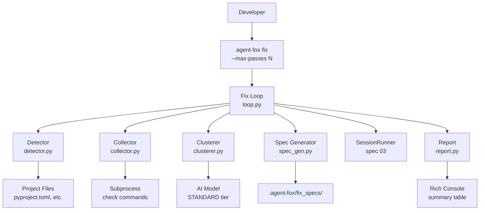

# Design Document: Error Auto-Fix

## Overview

This spec implements the `agent-fox fix` command: an iterative loop that
detects quality checks, runs them, clusters failures by root cause, generates
fix specifications, and runs coding sessions until all checks pass or a
termination condition is met. It builds on the session runner (spec 03) and
orchestrator (spec 04) for session execution, and on core foundation (spec 01)
for CLI, config, and error handling.

## Architecture



### Module Responsibilities

1. `agent_fox/fix/detector.py` -- Detect available quality checks by inspecting
   project configuration files. Returns a list of check descriptors.
2. `agent_fox/fix/collector.py` -- Run detected checks as subprocesses, capture
   stdout/stderr, parse failures into structured records.
3. `agent_fox/fix/clusterer.py` -- Group failures by likely root cause. Primary
   path: AI-assisted semantic grouping (STANDARD model). Fallback: one group
   per check command.
4. `agent_fox/fix/spec_gen.py` -- Generate a complete fix specification for each
   failure cluster. Writes to `.agent-fox/fix_specs/`.
5. `agent_fox/fix/loop.py` -- Iterative fix loop: run checks, cluster, generate
   specs, run sessions, re-check. Manages termination conditions.
6. `agent_fox/fix/report.py` -- Fix summary report rendering: passes completed,
   clusters resolved/remaining, sessions consumed, termination reason.
7. `agent_fox/cli/fix.py` -- `agent-fox fix` Click command with `--max-passes`
   option.

## Components and Interfaces

### Check Descriptor

```python
# agent_fox/fix/detector.py
from dataclasses import dataclass
from enum import Enum


class CheckCategory(str, Enum):
    TEST = "test"
    LINT = "lint"
    TYPE = "type"
    BUILD = "build"


@dataclass(frozen=True)
class CheckDescriptor:
    """A detected quality check."""
    name: str                # Human-readable name, e.g. "pytest"
    command: list[str]       # Shell command, e.g. ["uv", "run", "pytest"]
    category: CheckCategory  # Check category
```

### Detector

```python
# agent_fox/fix/detector.py
from pathlib import Path


def detect_checks(project_root: Path) -> list[CheckDescriptor]:
    """Inspect project configuration files and return detected checks.

    Detection rules:
    - pyproject.toml [tool.pytest] or [tool.pytest.ini_options] -> pytest
    - pyproject.toml [tool.ruff] -> ruff
    - pyproject.toml [tool.mypy] -> mypy
    - package.json scripts.test -> npm test
    - package.json scripts.lint -> npm lint
    - Makefile with 'test' target -> make test
    - Cargo.toml [package] -> cargo test

    Returns an empty list if no checks are found. The caller is responsible
    for raising an error in that case.
    """
    ...


def _inspect_pyproject(path: Path) -> list[CheckDescriptor]:
    """Parse pyproject.toml for pytest, ruff, mypy sections."""
    ...


def _inspect_package_json(path: Path) -> list[CheckDescriptor]:
    """Parse package.json for test and lint scripts."""
    ...


def _inspect_makefile(path: Path) -> list[CheckDescriptor]:
    """Scan Makefile for a 'test' target."""
    ...


def _inspect_cargo_toml(path: Path) -> list[CheckDescriptor]:
    """Parse Cargo.toml for [package] section."""
    ...
```

### Failure Record

```python
# agent_fox/fix/collector.py
from dataclasses import dataclass


@dataclass(frozen=True)
class FailureRecord:
    """A structured failure from a quality check."""
    check: CheckDescriptor   # Which check produced this failure
    output: str              # Combined stdout + stderr
    exit_code: int           # Process exit code
```

### Collector

```python
# agent_fox/fix/collector.py
from pathlib import Path

SUBPROCESS_TIMEOUT = 300  # 5 minutes


def run_checks(
    checks: list[CheckDescriptor],
    project_root: Path,
) -> tuple[list[FailureRecord], list[CheckDescriptor]]:
    """Run all check commands and return (failures, passed_checks).

    Each check is run as a subprocess with a 5-minute timeout.
    Commands that exit 0 are considered passing.
    Commands that exit non-zero produce a FailureRecord.
    Commands that time out produce a FailureRecord with a timeout message.

    Returns a tuple of (failure_records, checks_that_passed).
    """
    ...
```

### Failure Cluster

```python
# agent_fox/fix/clusterer.py
from dataclasses import dataclass


@dataclass
class FailureCluster:
    """A group of failures believed to share a common root cause."""
    label: str                    # Descriptive label for the root cause
    failures: list[FailureRecord] # Failure records in this cluster
    suggested_approach: str       # Suggested fix approach
```

### Clusterer

```python
# agent_fox/fix/clusterer.py
from agent_fox.core.config import AgentFoxConfig


def cluster_failures(
    failures: list[FailureRecord],
    config: AgentFoxConfig,
) -> list[FailureCluster]:
    """Group failures by likely root cause.

    Primary: Send failure outputs to STANDARD model, ask it to group by
    root cause and suggest fix approaches. Parse structured response.

    Fallback (AI unavailable): One cluster per check command, using the
    check name as the cluster label.
    """
    ...


def _ai_cluster(
    failures: list[FailureRecord],
    config: AgentFoxConfig,
) -> list[FailureCluster]:
    """Use AI model to semantically cluster failures."""
    ...


def _fallback_cluster(failures: list[FailureRecord]) -> list[FailureCluster]:
    """Group failures by check command (one cluster per check)."""
    ...
```

### Fix Specification Generator

```python
# agent_fox/fix/spec_gen.py
from pathlib import Path


@dataclass(frozen=True)
class FixSpec:
    """A generated fix specification."""
    cluster_label: str   # Label of the failure cluster
    spec_dir: Path       # Path to the generated spec directory
    task_prompt: str     # The assembled task prompt for the session


def generate_fix_spec(
    cluster: FailureCluster,
    output_dir: Path,
    pass_number: int,
) -> FixSpec:
    """Generate a fix specification for a failure cluster.

    Creates a directory under output_dir with:
    - requirements.md: what needs to be fixed
    - design.md: suggested approach
    - tasks.md: task list for the session

    The task_prompt field contains the fully assembled prompt for the
    session runner, including failure output and fix instructions.
    """
    ...


def cleanup_fix_specs(output_dir: Path) -> None:
    """Remove all generated fix spec directories."""
    ...
```

### Fix Loop

```python
# agent_fox/fix/loop.py
from dataclasses import dataclass
from pathlib import Path

from agent_fox.core.config import AgentFoxConfig


class TerminationReason(str, Enum):
    ALL_FIXED = "all_fixed"
    MAX_PASSES = "max_passes"
    COST_LIMIT = "cost_limit"
    INTERRUPTED = "interrupted"


@dataclass
class FixResult:
    """Result of the fix loop."""
    passes_completed: int
    clusters_resolved: int
    clusters_remaining: int
    sessions_consumed: int
    termination_reason: TerminationReason
    remaining_failures: list[FailureRecord]


async def run_fix_loop(
    project_root: Path,
    config: AgentFoxConfig,
    max_passes: int = 3,
) -> FixResult:
    """Run the iterative fix loop.

    Algorithm:
    1. Detect available quality checks (once, at start).
    2. For each pass (up to max_passes):
       a. Run all checks, collect failures.
       b. If no failures, terminate with ALL_FIXED.
       c. Cluster failures by root cause.
       d. Generate fix specs for each cluster.
       e. Run a coding session for each cluster.
       f. Track sessions consumed and cost.
    3. After last pass, run checks one final time to determine resolution.
    4. Produce FixResult.

    Termination conditions:
    - All checks pass -> ALL_FIXED
    - max_passes reached -> MAX_PASSES
    - Cost limit reached -> COST_LIMIT
    - KeyboardInterrupt -> INTERRUPTED
    """
    ...
```

### Fix Report

```python
# agent_fox/fix/report.py
from rich.console import Console


def render_fix_report(result: FixResult, console: Console) -> None:
    """Render the fix summary report to the console.

    Displays:
    - Passes completed (e.g., "3 of 3 passes")
    - Clusters resolved vs remaining
    - Total sessions consumed
    - Termination reason (human-readable)
    - If failures remain: list of remaining failure summaries
    """
    ...
```

### CLI Command

```python
# agent_fox/cli/fix.py
import click


@click.command("fix")
@click.option(
    "--max-passes",
    type=int,
    default=3,
    help="Maximum number of fix passes (default: 3).",
)
@click.pass_context
def fix_cmd(ctx: click.Context, max_passes: int) -> None:
    """Detect and auto-fix quality check failures.

    Runs quality checks (tests, lint, type-check, build), groups failures
    by root cause, generates fix specifications, and runs coding sessions
    to resolve them. Iterates until all checks pass or max passes reached.
    """
    ...
```

## Detection Rules

| Config File | Section / Indicator | Check Name | Command | Category |
|-------------|---------------------|------------|---------|----------|
| `pyproject.toml` | `[tool.pytest]` or `[tool.pytest.ini_options]` | pytest | `["uv", "run", "pytest"]` | test |
| `pyproject.toml` | `[tool.ruff]` | ruff | `["uv", "run", "ruff", "check", "."]` | lint |
| `pyproject.toml` | `[tool.mypy]` | mypy | `["uv", "run", "mypy", "."]` | type |
| `package.json` | `scripts.test` | npm test | `["npm", "test"]` | test |
| `package.json` | `scripts.lint` | npm lint | `["npm", "run", "lint"]` | lint |
| `Makefile` | `test:` target line | make test | `["make", "test"]` | test |
| `Cargo.toml` | `[package]` section | cargo test | `["cargo", "test"]` | test |

## Data Models

### Fix Spec Directory Structure

```
.agent-fox/fix_specs/
  pass_1_cluster_0_pytest_failures/
    requirements.md
    design.md
    tasks.md
  pass_1_cluster_1_ruff_violations/
    requirements.md
    design.md
    tasks.md
```

### AI Clustering Prompt Structure

The clusterer sends a prompt to the STANDARD model with the following format:

```
You are analyzing quality check failures from a software project.
Group the following failures by their likely root cause.

For each group, provide:
1. A short descriptive label for the root cause
2. Which failure indices belong to the group
3. A suggested approach for fixing the group

Failures:
[1] Check: pytest | Exit code: 1
Output: <truncated failure output>

[2] Check: mypy | Exit code: 1
Output: <truncated failure output>

Respond in JSON format:
{
  "groups": [
    {
      "label": "Missing return type annotations",
      "failure_indices": [2],
      "suggested_approach": "Add return type annotations to functions..."
    }
  ]
}
```

### AI Clustering Response Parsing

The clusterer parses the model response as JSON. If parsing fails or the
response structure is invalid, the system falls back to `_fallback_cluster`.

## Correctness Properties

### Property 1: Detection Determinism

*For any* project directory with a fixed set of configuration files, calling
`detect_checks()` twice SHALL return the same list of check descriptors in the
same order.

**Validates:** 08-REQ-1.1, 08-REQ-1.2

### Property 2: Collector Completeness

*For any* list of check descriptors, `run_checks()` SHALL return exactly one
result per check: either a FailureRecord in the failures list or a
CheckDescriptor in the passed list. No check shall appear in both or neither.

**Validates:** 08-REQ-2.1, 08-REQ-2.2, 08-REQ-2.3

### Property 3: Cluster Coverage

*For any* non-empty list of failure records, `cluster_failures()` SHALL return
a set of clusters whose union of failure records equals the input list. No
failure record shall be lost or duplicated.

**Validates:** 08-REQ-3.1, 08-REQ-3.2, 08-REQ-3.3

### Property 4: Loop Termination

*For any* configuration with `max_passes >= 1`, the fix loop SHALL terminate
within `max_passes` iterations or when all checks pass, whichever comes first.
The loop SHALL never run more than `max_passes` complete cycles.

**Validates:** 08-REQ-5.1, 08-REQ-5.2

### Property 5: Report Consistency

*For any* FixResult, `passes_completed <= max_passes` AND
`clusters_resolved + clusters_remaining >= 0` AND `sessions_consumed >= 0` AND
`termination_reason` is a valid enum value.

**Validates:** 08-REQ-6.1, 08-REQ-6.2

## Error Handling

| Error Condition | Behavior | Requirement |
|----------------|----------|-------------|
| No quality checks detected | Report error, exit with non-zero code | 08-REQ-1.E1 |
| Config file unparseable (bad TOML/JSON) | Log warning, skip file, continue detection | 08-REQ-1.E2 |
| Check command times out (>5 min) | Record as failure with timeout message, continue | 08-REQ-2.E1 |
| AI clustering fails (no credentials, network, model error) | Fall back to one cluster per check | 08-REQ-3.3 |
| AI response unparseable (invalid JSON, missing fields) | Fall back to one cluster per check | 08-REQ-3.3 |
| Fix spec directory creation fails | Raise AgentFoxError with path details | (defensive) |
| Session runner fails during fix session | Record failure, continue to next cluster | (defensive) |
| Cost limit reached during fix loop | Terminate loop with COST_LIMIT reason | 08-REQ-5.2 |
| User interrupt (Ctrl+C) during fix loop | Terminate loop with INTERRUPTED reason | 08-REQ-5.2 |
| --max-passes <= 0 | Clamp to 1, log warning | 08-REQ-7.E1 |

## Technology Stack

| Technology | Version | Purpose |
|-----------|---------|---------|
| Python | 3.12+ | Runtime |
| Click | 8.1+ | CLI command registration |
| Rich | 13.0+ | Report rendering (tables, styled text) |
| Anthropic SDK | 0.40+ | AI clustering (STANDARD model) |
| subprocess | stdlib | Running quality check commands |
| tomllib | stdlib (3.11+) | Parsing pyproject.toml and Cargo.toml |
| json | stdlib | Parsing package.json, AI clustering responses |

## Testing Strategy

- **Unit tests** validate individual functions: detector rules for each config
  file type, collector subprocess handling (mocked), clusterer fallback logic,
  spec generator output structure, report rendering.
- **Property tests** (Hypothesis) verify invariants: detection determinism,
  collector completeness, cluster coverage, loop termination, report
  consistency.
- **Integration tests** are not included in this spec. The fix loop's
  integration with the session runner is tested at the system level.
- **Subprocess mocking.** All tests that involve running check commands mock
  `subprocess.run` to avoid external dependencies. Tests provide predetermined
  stdout/stderr and exit codes.
- **AI mocking.** All tests that involve AI clustering mock the Anthropic
  client to return predetermined responses. Fallback behavior is tested by
  simulating API failures.
- **Test directory:** `tests/unit/fix/`
- **Test command:** `uv run pytest tests/unit/fix/ -q`

## Definition of Done

A task group is complete when ALL of the following are true:

1. All subtasks within the group are checked off (`[x]`)
2. All spec tests (`test_spec.md` entries) for the task group pass
3. All property tests for the task group pass
4. All previously passing tests still pass (no regressions)
5. No linter warnings or errors introduced
6. Code is committed on a feature branch and pushed to remote
7. Feature branch is merged back to `develop`
8. `tasks.md` checkboxes are updated to reflect completion
