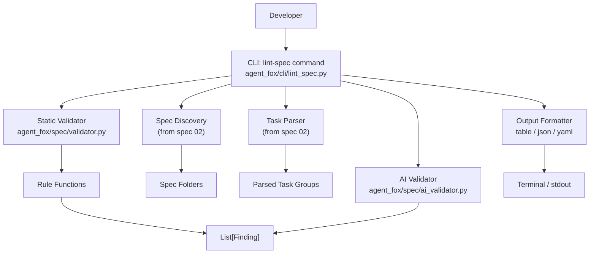

# Design Document: Specification Validation

## Overview

This spec implements the `agent-fox lint-spec` command, which validates
specification files for structural and quality problems before execution. The
system consists of three modules: a static validation rules engine, an optional
AI-powered semantic analyzer, and a CLI command that orchestrates validation and
formats output.

## Architecture



### Module Responsibilities

1. `agent_fox/spec/validator.py` -- Static validation rules engine. Contains
   pure functions that examine parsed spec data and return `Finding` lists.
   Each rule is independently testable.

2. `agent_fox/spec/ai_validator.py` -- AI-powered semantic analysis. Uses the
   STANDARD model tier to analyze acceptance criteria text for vagueness and
   implementation leakage. Optional; skipped when `--ai` is not provided or
   the model is unavailable.

3. `agent_fox/cli/lint_spec.py` -- `agent-fox lint-spec` CLI command.
   Orchestrates discovery, parsing, validation, and output formatting. Manages
   `--format` and `--ai` flags. Sets exit code based on findings.

## Components and Interfaces

### Finding Data Model

```python
# agent_fox/spec/validator.py
from dataclasses import dataclass

@dataclass(frozen=True)
class Finding:
    """A single validation finding."""
    spec_name: str       # e.g., "01_core_foundation"
    file: str            # e.g., "tasks.md"
    rule: str            # e.g., "missing-file", "oversized-group"
    severity: str        # "error" | "warning" | "hint"
    message: str         # Human-readable description
    line: int | None     # Source line number, if available
```

### Severity Constants

```python
# agent_fox/spec/validator.py

SEVERITY_ERROR = "error"
SEVERITY_WARNING = "warning"
SEVERITY_HINT = "hint"
```

### Static Validation Rules

Each rule is a function with the signature:

```python
def rule_name(spec_name: str, spec_path: Path, ...) -> list[Finding]:
    """Check a specific structural property of a spec folder."""
    ...
```

Rules receive the data they need (spec path, parsed tasks, parsed requirements)
and return findings. They do not perform I/O beyond reading files from the spec
folder.

```python
# agent_fox/spec/validator.py
from pathlib import Path

EXPECTED_FILES = ["prd.md", "requirements.md", "design.md", "test_spec.md", "tasks.md"]
MAX_SUBTASKS_PER_GROUP = 6

def check_missing_files(spec_name: str, spec_path: Path) -> list[Finding]:
    """Check for missing expected files in a spec folder.

    Rule: missing-file
    Severity: error
    Produces one finding per missing file.
    """
    ...

def check_oversized_groups(
    spec_name: str,
    task_groups: list[TaskGroup],
) -> list[Finding]:
    """Check for task groups with more than MAX_SUBTASKS_PER_GROUP subtasks.

    Rule: oversized-group
    Severity: warning
    Excludes verification steps from the subtask count.
    """
    ...

def check_missing_verification(
    spec_name: str,
    task_groups: list[TaskGroup],
) -> list[Finding]:
    """Check for task groups without a verification step.

    Rule: missing-verification
    Severity: warning
    A verification step matches the pattern N.V (e.g., "1.V Verify task group 1").
    """
    ...

def check_missing_acceptance_criteria(
    spec_name: str,
    spec_path: Path,
) -> list[Finding]:
    """Check for requirement sections without acceptance criteria.

    Rule: missing-acceptance-criteria
    Severity: error
    Scans requirements.md for requirement headings and checks each has at least
    one criterion line containing a requirement ID pattern [NN-REQ-N.N].
    """
    ...

def check_broken_dependencies(
    spec_name: str,
    spec_path: Path,
    known_specs: dict[str, list[int]],
) -> list[Finding]:
    """Check for dependency references to non-existent specs or task groups.

    Rule: broken-dependency
    Severity: error
    Parses the dependency table from prd.md and validates each reference
    against the known_specs dict (mapping spec name to list of group numbers).
    """
    ...

def check_untraced_requirements(
    spec_name: str,
    spec_path: Path,
) -> list[Finding]:
    """Check for requirements not referenced by any test in test_spec.md.

    Rule: untraced-requirement
    Severity: warning
    Collects requirement IDs from requirements.md and checks for references
    in test_spec.md.
    """
    ...
```

### Validation Orchestrator

```python
# agent_fox/spec/validator.py

def validate_specs(
    specs_dir: Path,
    discovered_specs: list[DiscoveredSpec],
) -> list[Finding]:
    """Run all static validation rules against all discovered specs.

    1. For each spec, run check_missing_files.
    2. For specs with tasks.md, parse task groups and run:
       - check_oversized_groups
       - check_missing_verification
    3. For specs with requirements.md, run:
       - check_missing_acceptance_criteria
    4. For specs with requirements.md and test_spec.md, run:
       - check_untraced_requirements
    5. Build known_specs map, then for each spec with prd.md, run:
       - check_broken_dependencies
    6. Sort all findings by spec_name, file, severity order.
    7. Return the complete findings list.
    """
    ...
```

### AI Validator

```python
# agent_fox/spec/ai_validator.py
from pathlib import Path
from agent_fox.spec.validator import Finding

async def analyze_acceptance_criteria(
    spec_name: str,
    spec_path: Path,
    model: str,
) -> list[Finding]:
    """Use AI to analyze acceptance criteria for quality issues.

    Reads requirements.md, extracts acceptance criteria text, and sends
    it to the STANDARD-tier model for analysis.

    The prompt asks the model to identify:
    1. Vague or unmeasurable criteria (rule: vague-criterion)
    2. Implementation-leaking criteria (rule: implementation-leak)

    Returns Hint-severity findings for each issue identified.

    Uses a structured prompt that asks the model to return JSON with:
    - criterion_id: the requirement ID
    - issue_type: "vague" or "implementation-leak"
    - explanation: why the criterion is problematic
    - suggestion: how to improve it
    """
    ...

async def run_ai_validation(
    discovered_specs: list[DiscoveredSpec],
    model: str,
) -> list[Finding]:
    """Run AI validation across all discovered specs.

    Iterates through specs, calling analyze_acceptance_criteria for each
    spec that has a requirements.md file. Collects and returns all findings.
    """
    ...
```

### CLI Command

```python
# agent_fox/cli/lint_spec.py
import click
import json
import sys
from pathlib import Path

@click.command("lint-spec")
@click.option(
    "--format", "output_format",
    type=click.Choice(["table", "json", "yaml"]),
    default="table",
    help="Output format for findings.",
)
@click.option(
    "--ai",
    is_flag=True,
    default=False,
    help="Enable AI-powered semantic analysis of acceptance criteria.",
)
@click.pass_context
def lint_spec(ctx: click.Context, output_format: str, ai: bool) -> None:
    """Validate specification files for structural and quality problems."""
    ...
```

The command:

1. Discovers spec folders using `discover_specs()` from spec 02.
2. Runs `validate_specs()` to collect static findings.
3. If `--ai` is set, runs `run_ai_validation()` to collect AI findings.
4. Merges and sorts all findings.
5. Formats output based on `--format`.
6. Exits with code 1 if any Error findings exist, 0 otherwise.

### Output Formatting

```python
# agent_fox/cli/lint_spec.py

def format_table(findings: list[Finding], console: Console) -> None:
    """Render findings as a Rich table grouped by spec.

    Table columns: Severity, File, Rule, Message, Line
    Groups: one section per spec, with a header row.
    Footer: summary counts (N errors, N warnings, N hints).
    """
    ...

def format_json(findings: list[Finding]) -> str:
    """Serialize findings as JSON.

    Structure:
    {
        "findings": [
            {
                "spec_name": "...",
                "file": "...",
                "rule": "...",
                "severity": "...",
                "message": "...",
                "line": N | null
            },
            ...
        ],
        "summary": {
            "error": N,
            "warning": N,
            "hint": N,
            "total": N
        }
    }
    """
    ...

def format_yaml(findings: list[Finding]) -> str:
    """Serialize findings as YAML with the same structure as JSON."""
    ...
```

## Data Models

### Finding (defined above)

The `Finding` dataclass is the core data model. It is frozen (immutable) and
uses simple types for easy serialization.

### DiscoveredSpec (from spec 02)

```python
# Referenced from spec 02 -- not defined here
@dataclass
class DiscoveredSpec:
    name: str           # e.g., "01_core_foundation"
    path: Path          # e.g., Path(".specs/01_core_foundation")
    prefix: int         # e.g., 1
```

### TaskGroup (from spec 02)

```python
# Referenced from spec 02 -- not defined here
@dataclass
class TaskGroup:
    number: int
    title: str
    optional: bool
    subtasks: list[Subtask]
    body: str
```

### Validation Rule Catalog

| Rule Name | Severity | What It Checks | REQ |
|-----------|----------|---------------|-----|
| `missing-file` | error | Expected files missing from spec folder | REQ-082 |
| `oversized-group` | warning | Task group with >6 subtasks | REQ-082 |
| `missing-verification` | warning | Task group without N.V verification step | REQ-082 |
| `missing-acceptance-criteria` | error | Requirement section without criteria | REQ-082 |
| `broken-dependency` | error | Cross-spec ref to non-existent spec or group | REQ-082 |
| `untraced-requirement` | warning | Requirement ID not found in test_spec.md | REQ-082 |
| `vague-criterion` | hint | AI: acceptance criterion is vague/unmeasurable | REQ-083 |
| `implementation-leak` | hint | AI: criterion describes "how" not "what" | REQ-083 |

## Correctness Properties

### Property 1: Finding Immutability

*For any* Finding instance, all attributes SHALL be immutable after creation.
Modifying an attribute SHALL raise an error.

**Validates:** Data integrity -- findings cannot be accidentally mutated during
collection or formatting.

### Property 2: Static Rules Produce Consistent Output

*For any* static validation rule function, given identical input (same spec
folder contents), the function SHALL always return the same list of findings
(deterministic output, no randomness).

**Validates:** 09-REQ-1.2 -- reproducible validation results.

### Property 3: Error Severity Implies Non-Zero Exit

*For any* findings list containing at least one Error-severity finding, the CLI
command SHALL exit with a non-zero code.

**Validates:** 09-REQ-9.4

### Property 4: No Errors Implies Zero Exit

*For any* findings list containing no Error-severity findings (only Warning and
Hint, or empty), the CLI command SHALL exit with code 0.

**Validates:** 09-REQ-9.5

### Property 5: All Expected Files Checked

*For any* spec folder, the `check_missing_files` rule SHALL check for exactly
the five expected files (`prd.md`, `requirements.md`, `design.md`,
`test_spec.md`, `tasks.md`) and produce one finding per missing file.

**Validates:** 09-REQ-2.1, 09-REQ-2.2

### Property 6: Oversized Group Threshold

*For any* task group, `check_oversized_groups` SHALL produce a finding if and
only if the number of non-verification subtasks exceeds 6.

**Validates:** 09-REQ-3.1, 09-REQ-3.2

## Error Handling

| Error Condition | Behavior | Requirement |
|----------------|----------|-------------|
| `.specs/` directory missing or empty | Single Error finding, exit code 1 | 09-REQ-1.E1 |
| Spec folder missing expected file | Error finding per missing file | 09-REQ-2.2 |
| `tasks.md` unparseable | Warning finding, skip task-based rules for that spec | (robustness) |
| `requirements.md` unparseable | Warning finding, skip requirement-based rules | (robustness) |
| Dependency ref to missing spec | Error finding | 09-REQ-6.2 |
| Dependency ref to missing group | Error finding | 09-REQ-6.3 |
| AI model unavailable | Log warning, skip AI checks, continue | 09-REQ-8.E1 |
| AI response unparseable | Log warning, skip AI findings for that spec | (robustness) |
| YAML library not installed | Fall back to JSON with a warning message | (robustness) |

## Technology Stack

| Technology | Version | Purpose |
|-----------|---------|---------|
| Python | 3.12+ | Runtime |
| Click | 8.1+ | CLI command registration |
| Rich | 13.0+ | Table output formatting |
| Anthropic SDK | 0.40+ | AI-powered semantic analysis |
| PyYAML | 6.0+ | YAML output format (optional dependency) |
| pytest | 8.0+ | Test framework |

## Testing Strategy

- **Unit tests** validate each static rule function independently using fixture
  spec directories with known problems. Each rule function receives prepared
  inputs and returns a deterministic list of findings.

- **Unit tests** for the AI validator mock the Anthropic API client to verify
  prompt construction and response parsing without network calls.

- **Unit tests** for output formatters verify table rendering, JSON structure,
  and YAML structure from known finding lists.

- **Property tests** (Hypothesis) verify invariants: Finding immutability,
  exit code logic (errors present => non-zero, no errors => zero), expected
  file count, and oversized group threshold.

- **Integration tests** verify the full CLI command end-to-end using
  `click.testing.CliRunner` with fixture spec directories, checking exit code,
  output format, and finding counts.

- **Fixture spec directories** are created under `tests/fixtures/specs/` with
  deliberately planted problems (missing files, oversized groups, broken deps,
  etc.) for reliable, repeatable testing.

## Definition of Done

A task group is complete when ALL of the following are true:

1. All subtasks within the group are checked off (`[x]`)
2. All spec tests (`test_spec.md` entries) for the task group pass
3. All property tests for the task group pass
4. All previously passing tests still pass (no regressions)
5. No linter warnings or errors introduced
6. Code is committed on a feature branch and pushed to remote
7. Feature branch is merged back to `develop`
8. `tasks.md` checkboxes are updated to reflect completion
