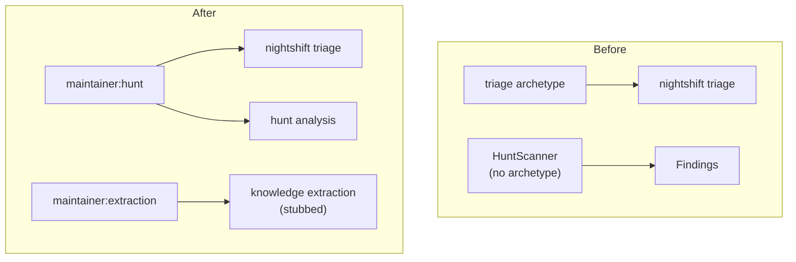

# Design Document: Maintainer Archetype

## Overview

This spec creates the Maintainer archetype with hunt and extraction modes,
absorbs the triage archetype, and wires the nightshift pipeline to use the
new identity. The extraction mode is stubbed with a well-defined interface
for future implementation.

## Architecture



### Module Responsibilities

1. **`agent_fox/archetypes.py`** — Adds `maintainer` entry with `hunt` and
   `extraction` modes. Removes `triage` entry.
2. **`agent_fox/_templates/prompts/maintainer.md`** — Template with shared
   identity and mode-specific sections.
3. **`agent_fox/nightshift/triage.py`** — Updated to reference
   `maintainer:hunt` for model/security resolution.
4. **`agent_fox/nightshift/extraction.py`** (NEW) — Stub module with
   `ExtractionInput`, `ExtractionResult`, and `extract_knowledge()`.
5. **`agent_fox/_templates/profiles/maintainer.md`** — Default profile
   (if Spec 99 is implemented first, this is the profile; otherwise
   this is the prompt template).

## Execution Paths

### Path 1: Nightshift triage via maintainer:hunt

```
1. nightshift/engine.py: NightShiftEngine._run_issue_check()
2. nightshift/triage.py: run_batch_triage(issues, edges, config) → TriageResult
3. engine/sdk_params.py: resolve_model_tier(config, "maintainer", mode="hunt") → "STANDARD"
4. engine/sdk_params.py: resolve_security_config(config, "maintainer", mode="hunt") → SecurityConfig
5. session/prompt.py: loads maintainer.md hunt section for triage prompt
6. AI call executes with maintainer:hunt permissions
7. Returns TriageResult with ordering + edges + supersessions
```

### Path 2: Knowledge extraction (stubbed)

```
1. (future) engine/session_lifecycle.py: post-session hook calls extract_knowledge()
2. nightshift/extraction.py: extract_knowledge(ExtractionInput) → ExtractionResult
3. Returns ExtractionResult(facts=[], status="not_implemented")
4. Caller logs info and continues
```

## Components and Interfaces

### Registry Entry

```python
# agent_fox/archetypes.py

ARCHETYPE_REGISTRY["maintainer"] = ArchetypeEntry(
    name="maintainer",
    templates=["maintainer.md"],
    default_model_tier="STANDARD",
    injection=None,
    task_assignable=False,
    default_max_turns=80,
    modes={
        "hunt": ModeConfig(
            allowlist=["ls", "cat", "git", "wc", "head", "tail"],
        ),
        "extraction": ModeConfig(
            allowlist=[],  # no shell access
        ),
    },
)
```

### Extraction Interface

```python
# agent_fox/nightshift/extraction.py (NEW)

@dataclass(frozen=True)
class ExtractionInput:
    """Input for knowledge extraction from a session transcript."""
    session_id: str
    transcript: str
    spec_name: str
    archetype: str
    mode: str | None = None


@dataclass(frozen=True)
class ExtractionResult:
    """Result of knowledge extraction."""
    facts: list[dict] = field(default_factory=list)
    session_id: str = ""
    status: str = "not_implemented"


def extract_knowledge(input: ExtractionInput) -> ExtractionResult:
    """Extract knowledge from a session transcript.

    Currently returns an empty result. Will be implemented in a future spec
    to use LLM-driven fact extraction.
    """
    logger.info(
        "Knowledge extraction not yet implemented for session %s",
        input.session_id,
    )
    return ExtractionResult(
        session_id=input.session_id,
        status="not_implemented",
    )
```

### Updated Triage

```python
# agent_fox/nightshift/triage.py

async def run_batch_triage(
    issues: list[Issue],
    explicit_edges: list[Edge],
    config: AgentFoxConfig,
) -> TriageResult:
    """Run AI batch triage using maintainer:hunt archetype identity."""
    # Model tier resolution uses maintainer:hunt
    tier = resolve_model_tier(config, "maintainer", mode="hunt")
    security = resolve_security_config(config, "maintainer", mode="hunt")
    ...
```

## Data Models

### ExtractionInput Fields

| Field | Type | Description |
|-------|------|-------------|
| session_id | str | Unique session identifier |
| transcript | str | Full conversation transcript |
| spec_name | str | Name of the spec being worked on |
| archetype | str | Archetype of the session |
| mode | str \| None | Mode of the session |

### ExtractionResult Fields

| Field | Type | Description |
|-------|------|-------------|
| facts | list[dict] | Extracted facts (empty when stubbed) |
| session_id | str | Session identifier |
| status | str | "not_implemented", "success", or "error" |

## Operational Readiness

- **Migration:** The triage archetype is removed. Nightshift code references
  are updated. Config key `archetypes.triage` triggers a deprecation warning.
- **Observability:** Extraction stub logs at INFO level when called.
  Triage resolution logs at DEBUG level.
- **Future work:** The extraction pipeline implementation will be a separate
  spec that builds on the ExtractionInput/ExtractionResult interfaces.

## Correctness Properties

### Property 1: Maintainer Mode Config

*For any* maintainer mode in `{"hunt", "extraction"}`, the resolved effective
config SHALL have the correct allowlist and model tier.

**Validates: Requirements 100-REQ-1.1, 100-REQ-1.2, 100-REQ-1.3**

### Property 2: Triage Removed

*For any* lookup of `"triage"` in `ARCHETYPE_REGISTRY`, the result SHALL be
absent (key not found).

**Validates: Requirements 100-REQ-2.1**

### Property 3: Extraction Stub Safety

*For any* `ExtractionInput`, calling `extract_knowledge()` SHALL return a
valid `ExtractionResult` with `status="not_implemented"` and SHALL NOT raise
an exception.

**Validates: Requirements 100-REQ-4.3, 100-REQ-4.E1**

### Property 4: Nightshift Resolution

*For any* nightshift triage call, model tier resolution SHALL use
`"maintainer"` as the archetype and `"hunt"` as the mode.

**Validates: Requirements 100-REQ-5.1, 100-REQ-5.2**

## Error Handling

| Error Condition | Behavior | Requirement |
|----------------|----------|-------------|
| get_archetype("triage") called | Warning logged, falls back to coder | 100-REQ-1.E1 |
| Old config key `archetypes.triage` | Deprecation warning logged | 100-REQ-2.E1 |
| extract_knowledge() called | Returns empty result, no error | 100-REQ-4.E1 |

## Technology Stack

- Python 3.12+
- `dataclasses` (frozen dataclasses for extraction types)
- Existing nightshift module structure
- Existing test stack: `pytest`, `hypothesis`

## Definition of Done

A task group is complete when ALL of the following are true:

1. All subtasks within the group are checked off (`[x]`)
2. All spec tests (`test_spec.md` entries) for the task group pass
3. All property tests for the task group pass
4. All previously passing tests still pass (no regressions)
5. No linter warnings or errors introduced
6. Code is committed on a feature branch and merged into `develop`
7. `tasks.md` checkboxes are updated to reflect completion

## Testing Strategy

- **Unit tests** verify registry contents, extraction types, triage
  integration, and template existence.
- **Property-based tests** verify mode config correctness, triage removal,
  extraction stub safety, and nightshift resolution.
- **Integration smoke tests** verify end-to-end triage resolution and
  extraction stub behavior.
