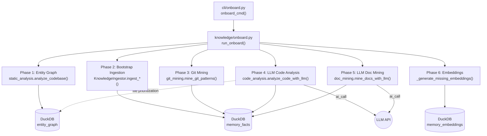

# Design Document: Knowledge Onboarding

## Overview

The onboarding subsystem provides a CLI command that seeds the knowledge store
for existing codebases by composing six phases: entity graph analysis,
bootstrap ingestion, git pattern mining, LLM code analysis, LLM documentation
mining, and embedding generation. Three modules are entirely new (git mining,
code analysis, doc mining). The orchestrator and CLI command wire everything
together.

## Architecture



### Module Responsibilities

1. **`agent_fox/cli/onboard.py`** (NEW) — Click command definition with
   `--path`, `--skip-*`, `--model`, and threshold options. Loads config,
   opens DB, calls async orchestrator via `asyncio.run()`, prints summary.
2. **`agent_fox/knowledge/onboard.py`** (NEW) — Async orchestrator function
   `run_onboard()` that runs six phases in sequence, catches per-phase
   errors, tracks timing, and returns `OnboardResult`.
3. **`agent_fox/knowledge/git_mining.py`** (NEW) — Git pattern mining
   module with `mine_git_patterns()` that parses `git log --numstat` output,
   computes file change frequencies and co-change counts, and creates facts.
4. **`agent_fox/knowledge/code_analysis.py`** (NEW) — LLM code analysis
   module with `analyze_code_with_llm()` that reads source files of any
   language (Python, Go, Rust, TypeScript, etc.), sends them to the LLM
   via `ai_call()`, parses extracted facts, and stores them.
5. **`agent_fox/knowledge/doc_mining.py`** (NEW) — LLM documentation mining
   module with `mine_docs_with_llm()` that reads markdown files, sends
   them to the LLM via `ai_call()`, parses extracted facts, and stores them.
6. **`agent_fox/knowledge/static_analysis.py`** (existing) — Called for
   entity graph phase.
7. **`agent_fox/knowledge/ingest.py`** (existing) — Called for bootstrap
   ingestion phase.
8. **`agent_fox/knowledge/embeddings.py`** (existing) — Called for
   embedding generation phase.

## Execution Paths

### Path 1: Full onboard pipeline

```
1. cli/onboard.py: onboard_cmd(ctx, path, skip_*, model, thresholds)
2.   validates path, loads AgentFoxConfig, opens KnowledgeDB
3.   asyncio.run(run_onboard(project_root, config, db, ...))
4. knowledge/onboard.py: run_onboard(project_root, config, db, skip_*, model, thresholds) → OnboardResult
5.   Phase 1: static_analysis.analyze_codebase(project_root, conn) → AnalysisResult
6.   Phase 2: KnowledgeIngestor(conn, embedder, project_root).ingest_adrs() → IngestResult
7.   Phase 2: KnowledgeIngestor(conn, embedder, project_root).ingest_errata() → IngestResult
8.   Phase 2: KnowledgeIngestor(conn, embedder, project_root).ingest_git_commits(limit=10000) → IngestResult
9.   Phase 3: git_mining.mine_git_patterns(project_root, conn, days, thresholds) → MiningResult
10.  Phase 4: await code_analysis.analyze_code_with_llm(project_root, conn, model) → CodeAnalysisResult
11.  Phase 5: await doc_mining.mine_docs_with_llm(project_root, conn, model) → DocMiningResult
12.  Phase 6: _generate_missing_embeddings(conn, embedder) → (generated, failed)
13.  returns OnboardResult with aggregated counts
14. cli/onboard.py: prints summary to stderr (or JSON to stdout if --json)
```

### Path 2: Partial onboard (phases skipped)

```
1. cli/onboard.py: onboard_cmd(ctx, path, skip_entities=True, skip_code_analysis=True, ...)
2. knowledge/onboard.py: run_onboard(..., skip_entities=True, skip_code_analysis=True, ...)
3.   Phase 1: SKIPPED (recorded in OnboardResult.phases_skipped)
4.   Phase 2: KnowledgeIngestor.ingest_*() → IngestResults
5.   Phase 3: mine_git_patterns() → MiningResult
6.   Phase 4: SKIPPED (recorded in OnboardResult.phases_skipped)
7.   Phase 5: await mine_docs_with_llm() → DocMiningResult
8.   Phase 6: _generate_missing_embeddings() → counts
9.   returns OnboardResult
```

### Path 3: Git pattern mining detail

```
1. knowledge/git_mining.py: mine_git_patterns(project_root, conn, days=365, fragile_threshold=20, cochange_threshold=5)
2.   _parse_git_numstat(project_root, days) → dict[commit_sha, list[file_path]]
3.   checks len(commit_files) >= 10, returns early if not
4.   _compute_file_frequencies(commit_files) → dict[file_path, int]
5.   _compute_cochange_counts(commit_files) → dict[tuple[file_a, file_b], int]
6.   _is_mining_fact_exists(conn, fingerprint) → bool  (dedup check per fact)
7.   creates Fact(category="fragile_area", ...) for files >= fragile_threshold
8.   creates Fact(category="pattern", ...) for pairs >= cochange_threshold
9.   knowledge/store.py: MemoryStore.write_fact(fact) — side effect: stored in DuckDB
10.  returns MiningResult(fragile_areas_created, cochange_patterns_created, commits_analyzed, files_analyzed)
```

### Path 4: LLM code analysis detail

```
1. knowledge/code_analysis.py: analyze_code_with_llm(project_root, conn, model="STANDARD", max_files=0)
2.   _get_files_by_priority(conn, project_root) → list[Path]
3.     queries entity_graph for file entities sorted by incoming import edge count (all languages)
4.     falls back to _scan_source_files(project_root) only if entity graph is empty
5.   for each file in priority order:
6.     _is_mining_fact_exists(conn, f"onboard:code:{rel_path}") → skip if True
7.     content = file.read_text()
8.     raw_text, _ = await ai_call(model_tier=model, messages=[...], system=CODE_ANALYSIS_PROMPT, context="onboard code analysis")
9.     facts = _parse_llm_facts(raw_text, spec_name="onboard", file_path=rel_path)
10.    for each fact: MemoryStore.write_fact(fact)
11.  returns CodeAnalysisResult(facts_created, files_analyzed, files_skipped)
```

### Path 5: LLM documentation mining detail

```
1. knowledge/doc_mining.py: mine_docs_with_llm(project_root, conn, model="STANDARD")
2.   _collect_doc_files(project_root) → list[Path]
3.     collects README.md, CONTRIBUTING.md, CHANGELOG.md from root
4.     collects docs/**/*.md excluding docs/adr/ and docs/errata/
5.   for each doc:
6.     _is_mining_fact_exists(conn, f"onboard:doc:{rel_path}") → skip if True
7.     content = doc.read_text()
8.     raw_text, _ = await ai_call(model_tier=model, messages=[...], system=DOC_MINING_PROMPT, context="onboard doc mining")
9.     facts = _parse_llm_facts(raw_text, spec_name="onboard", file_path=rel_path)
10.    for each fact: MemoryStore.write_fact(fact)
11.  returns DocMiningResult(facts_created, docs_analyzed, docs_skipped)
```

## Components and Interfaces

### CLI Command

```python
# agent_fox/cli/onboard.py

@click.command("onboard")
@click.option("--path", type=click.Path(exists=True, file_okay=False),
              default=None, help="Project root (default: cwd)")
@click.option("--skip-entities", is_flag=True, help="Skip entity graph phase")
@click.option("--skip-ingestion", is_flag=True, help="Skip ADR/errata/git ingestion")
@click.option("--skip-mining", is_flag=True, help="Skip git pattern mining")
@click.option("--skip-code-analysis", is_flag=True, help="Skip LLM code analysis")
@click.option("--skip-doc-mining", is_flag=True, help="Skip LLM documentation mining")
@click.option("--skip-embeddings", is_flag=True, help="Skip embedding generation")
@click.option("--model", type=str, default="STANDARD",
              help="Model tier for LLM phases (default: STANDARD)")
@click.option("--mining-days", type=int, default=365,
              help="Days of git history to analyze (default: 365)")
@click.option("--fragile-threshold", type=int, default=20,
              help="Min commits to flag as fragile area (default: 20)")
@click.option("--cochange-threshold", type=int, default=5,
              help="Min co-occurrences for co-change pattern (default: 5)")
@click.option("--max-files", type=int, default=0,
              help="Max source files for code analysis (0 = all, default: 0)")
@click.pass_context
def onboard_cmd(ctx, path, skip_entities, skip_ingestion, skip_mining,
                skip_code_analysis, skip_doc_mining, skip_embeddings,
                model, mining_days, fragile_threshold,
                cochange_threshold, max_files) -> None:
```

### Onboard Orchestrator

```python
# agent_fox/knowledge/onboard.py

@dataclass
class OnboardResult:
    """Aggregated result of all onboarding phases."""
    # Entity graph phase
    entities_upserted: int = 0
    edges_upserted: int = 0
    entities_soft_deleted: int = 0
    # Bootstrap ingestion phase
    adrs_ingested: int = 0
    errata_ingested: int = 0
    git_commits_ingested: int = 0
    # Git mining phase
    fragile_areas_created: int = 0
    cochange_patterns_created: int = 0
    commits_analyzed: int = 0
    files_analyzed: int = 0
    # LLM code analysis phase
    code_facts_created: int = 0
    code_files_analyzed: int = 0
    code_files_skipped: int = 0
    # Documentation mining phase
    doc_facts_created: int = 0
    docs_analyzed: int = 0
    docs_skipped: int = 0
    # Embedding phase
    embeddings_generated: int = 0
    embeddings_failed: int = 0
    # Meta
    phases_skipped: list[str] = field(default_factory=list)
    phases_errored: list[str] = field(default_factory=list)
    elapsed_seconds: float = 0.0


async def run_onboard(
    project_root: Path,
    config: AgentFoxConfig,
    db: KnowledgeDB,
    *,
    skip_entities: bool = False,
    skip_ingestion: bool = False,
    skip_mining: bool = False,
    skip_code_analysis: bool = False,
    skip_doc_mining: bool = False,
    skip_embeddings: bool = False,
    model: str = "STANDARD",
    mining_days: int = 365,
    fragile_threshold: int = 20,
    cochange_threshold: int = 5,
    max_files: int = 0,
) -> OnboardResult:
    """Run the onboarding pipeline and return aggregated results.

    Phases run sequentially:
    1. Entity graph analysis (structural foundation)
    2. Bootstrap ingestion (ADRs, errata, git commits)
    3. Git pattern mining (deterministic)
    4. LLM code analysis (reads source, extracts architectural facts)
    5. LLM documentation mining (reads docs, extracts conventions)
    6. Embedding generation (embeds all unembedded facts)
    """
```

### Git Pattern Mining

```python
# agent_fox/knowledge/git_mining.py

@dataclass(frozen=True)
class MiningResult:
    """Result of git pattern mining."""
    fragile_areas_created: int = 0
    cochange_patterns_created: int = 0
    commits_analyzed: int = 0
    files_analyzed: int = 0


def mine_git_patterns(
    project_root: Path,
    conn: duckdb.DuckDBPyConnection,
    *,
    days: int = 365,
    fragile_threshold: int = 20,
    cochange_threshold: int = 5,
) -> MiningResult:
    """Extract fragile areas and co-change patterns from git history."""
```

### Internal Mining Functions

```python
def _parse_git_numstat(project_root: Path, days: int) -> dict[str, list[str]]:
    """Parse git log --numstat. Returns commit SHA → changed file paths."""

def _compute_file_frequencies(commit_files: dict[str, list[str]]) -> dict[str, int]:
    """Count how many commits touched each file."""

def _compute_cochange_counts(
    commit_files: dict[str, list[str]],
) -> dict[tuple[str, str], int]:
    """Count co-occurrences for every pair of files changed in the same commit.
    Keys are sorted tuples (file_a, file_b) where file_a < file_b."""

def _is_mining_fact_exists(conn: duckdb.DuckDBPyConnection, fingerprint: str) -> bool:
    """Check if a fact with this fingerprint keyword already exists."""
```

### LLM Code Analysis

```python
# agent_fox/knowledge/code_analysis.py

from agent_fox.core.client import ai_call

@dataclass(frozen=True)
class CodeAnalysisResult:
    """Result of LLM code analysis."""
    facts_created: int = 0
    files_analyzed: int = 0
    files_skipped: int = 0


async def analyze_code_with_llm(
    project_root: Path,
    conn: duckdb.DuckDBPyConnection,
    *,
    model: str = "STANDARD",
    max_files: int = 0,
) -> CodeAnalysisResult:
    """Analyze source files with LLM to extract architectural knowledge.

    Reads each source file (any language), sends to LLM with a code
    analysis prompt, parses the structured JSON response into facts, and
    stores them. Files are processed in priority order (most-imported first
    when entity graph is available, alphabetical otherwise).

    Args:
        project_root: Root directory of the project.
        conn: DuckDB connection with knowledge schema.
        model: Model tier for LLM calls (default: STANDARD).
        max_files: Maximum files to analyze (0 = no limit).

    Returns:
        CodeAnalysisResult with counts.
    """


# Recognized source file extensions (language-agnostic)
SOURCE_EXTENSIONS: set[str] = {
    ".py", ".go", ".rs", ".ts", ".tsx", ".js", ".jsx",
    ".java", ".kt", ".kts", ".swift", ".c", ".cpp", ".cc",
    ".cxx", ".h", ".hpp", ".cs", ".rb", ".ex", ".exs",
    ".erl", ".hs", ".ml", ".mli", ".scala", ".clj",
    ".lua", ".php", ".r", ".jl", ".dart", ".zig",
    ".nim", ".v", ".cr", ".sh", ".bash", ".zsh",
}


def _get_files_by_priority(
    conn: duckdb.DuckDBPyConnection,
    project_root: Path,
) -> list[Path]:
    """Get source files ordered by architectural significance.

    Uses entity graph import edges to rank files by incoming import count.
    The entity graph supports all languages equally (Spec 95, extended by
    Spec 102). Falls back to scanning source files from disk by recognized
    extensions only if the entity graph is empty (e.g., entity graph phase
    was skipped or no source files were parseable). Excludes test
    directories, build artifacts, vendor directories, and hidden
    directories.
    """


def _scan_source_files(project_root: Path) -> list[Path]:
    """Scan project root for source files by recognized extensions.

    Respects .gitignore if pathspec is available. Excludes common
    non-source directories: node_modules, vendor, .venv, __pycache__,
    build, dist, target, .git.
    Returns files sorted alphabetically by relative path.
    """


def _parse_llm_facts(
    raw_text: str,
    spec_name: str,
    file_path: str,
    source_type: str,
) -> list[Fact]:
    """Parse LLM JSON response into Fact objects.

    Expected format: JSON array of objects with keys:
    content, category, confidence, keywords.

    Adds fingerprint keyword and file_path keyword to each fact.
    """
```

### LLM Documentation Mining

```python
# agent_fox/knowledge/doc_mining.py

from agent_fox.core.client import ai_call

@dataclass(frozen=True)
class DocMiningResult:
    """Result of LLM documentation mining."""
    facts_created: int = 0
    docs_analyzed: int = 0
    docs_skipped: int = 0


async def mine_docs_with_llm(
    project_root: Path,
    conn: duckdb.DuckDBPyConnection,
    *,
    model: str = "STANDARD",
) -> DocMiningResult:
    """Mine project documentation with LLM to extract knowledge.

    Reads markdown files (README, CONTRIBUTING, docs/*.md excluding
    ADRs and errata), sends each to LLM with a documentation analysis
    prompt, parses facts, and stores them.

    Args:
        project_root: Root directory of the project.
        conn: DuckDB connection with knowledge schema.
        model: Model tier for LLM calls (default: STANDARD).

    Returns:
        DocMiningResult with counts.
    """


def _collect_doc_files(project_root: Path) -> list[Path]:
    """Collect markdown documentation files for mining.

    Includes: README.md, CONTRIBUTING.md, CHANGELOG.md at root,
    and all *.md under docs/ — excluding docs/adr/ and docs/errata/.
    """
```

### Shared Fact Parsing

The `_parse_llm_facts()` function is defined in `code_analysis.py` and
imported by `doc_mining.py`. Both modules use the same LLM response format
and fact construction logic.

**LLM Response Format (expected from both prompts):**
```json
[
  {
    "content": "Description of the finding",
    "category": "decision|convention|pattern|anti_pattern|fragile_area|gotcha",
    "confidence": "high|medium|low",
    "keywords": ["relevant", "terms"]
  }
]
```

## Data Models

### OnboardResult Fields

| Field | Type | Description |
|-------|------|-------------|
| entities_upserted | int | Entities created/updated by entity graph |
| edges_upserted | int | Edges created/updated by entity graph |
| entities_soft_deleted | int | Entities soft-deleted by entity graph |
| adrs_ingested | int | ADR facts ingested |
| errata_ingested | int | Errata facts ingested |
| git_commits_ingested | int | Git commit facts ingested |
| fragile_areas_created | int | Fragile area facts from git mining |
| cochange_patterns_created | int | Co-change pattern facts from git mining |
| commits_analyzed | int | Git commits parsed during mining |
| files_analyzed | int | Unique files seen during mining |
| code_facts_created | int | Facts from LLM code analysis |
| code_files_analyzed | int | Source files analyzed by LLM |
| code_files_skipped | int | Source files skipped (errors or dedup) |
| doc_facts_created | int | Facts from LLM doc mining |
| docs_analyzed | int | Documents analyzed by LLM |
| docs_skipped | int | Documents skipped (errors or dedup) |
| embeddings_generated | int | Embeddings successfully generated |
| embeddings_failed | int | Embedding generation failures |
| phases_skipped | list[str] | Phase names skipped by user |
| phases_errored | list[str] | Phase names that failed with errors |
| elapsed_seconds | float | Total elapsed wall time |

### MiningResult Fields

| Field | Type | Description |
|-------|------|-------------|
| fragile_areas_created | int | Fragile area facts created |
| cochange_patterns_created | int | Co-change pattern facts created |
| commits_analyzed | int | Total commits parsed |
| files_analyzed | int | Unique files seen |

### CodeAnalysisResult Fields

| Field | Type | Description |
|-------|------|-------------|
| facts_created | int | Total facts extracted from code |
| files_analyzed | int | Files successfully analyzed by LLM |
| files_skipped | int | Files skipped (error, dedup, unparseable) |

### DocMiningResult Fields

| Field | Type | Description |
|-------|------|-------------|
| facts_created | int | Total facts extracted from docs |
| docs_analyzed | int | Docs successfully analyzed by LLM |
| docs_skipped | int | Docs skipped (error, dedup, unparseable) |

### Fact Content Templates

**Fragile area fact (git mining):**
```
category: fragile_area
spec_name: onboard
content: "Fragile area: {file_path} was modified in {count} commits over
  the past {days} days, indicating high churn."
confidence: 0.6
keywords: ["onboard:fragile:{file_path}", "{file_path}", "fragile", "churn"]
```

**Co-change pattern fact (git mining):**
```
category: pattern
spec_name: onboard
content: "Co-change pattern: {file_a} and {file_b} were modified together
  in {count} commits, suggesting coupling."
confidence: 0.6
keywords: ["onboard:cochange:{file_a}:{file_b}", "{file_a}", "{file_b}", "coupling"]
```

**Code analysis fact (LLM):**
```
category: <LLM-determined: decision|convention|pattern|anti_pattern|fragile_area|gotcha>
spec_name: onboard
content: <LLM-generated description>
confidence: <LLM-determined: parsed via parse_confidence()>
keywords: ["onboard:code:{file_path}", <LLM-generated keywords>]
```

**Doc mining fact (LLM):**
```
category: <LLM-determined>
spec_name: onboard
content: <LLM-generated description>
confidence: <LLM-determined>
keywords: ["onboard:doc:{doc_path}", <LLM-generated keywords>]
```

The first keyword in each fact serves as the deduplication fingerprint.

### LLM Prompts

**Code analysis system prompt (CODE_ANALYSIS_PROMPT):**
```
You are analyzing source code from an existing software project to extract
architectural knowledge. For each file, identify:

- **Decisions**: Architectural choices (e.g., "uses dependency injection",
  "event-driven architecture", "repository pattern for data access").
- **Conventions**: Coding standards and naming conventions (e.g., "all
  handlers follow async/await pattern", "error types use Error suffix").
- **Patterns**: Recurring design patterns (e.g., "factory pattern for
  creating services", "decorator pattern for cross-cutting concerns").
- **Anti-patterns**: Code smells or problematic patterns (e.g., "god class
  with too many responsibilities", "circular dependency between modules").
- **Fragile areas**: Code that appears fragile or risky (e.g., "complex
  conditional logic", "tightly coupled to external API").
- **Gotchas**: Non-obvious behaviors or traps (e.g., "silent exception
  swallowing", "order-dependent initialization").

Return a JSON array. Each element has: "content" (description), "category"
(one of: decision, convention, pattern, anti_pattern, fragile_area, gotcha),
"confidence" (high/medium/low), "keywords" (2-5 relevant terms).

Only report findings that are genuinely useful to a developer working in
this codebase for the first time. Prefer fewer high-quality facts over
many shallow observations.
```

**Doc mining system prompt (DOC_MINING_PROMPT):**
```
You are analyzing project documentation to extract knowledge for a
development knowledge base. For each document, identify:

- **Conventions**: Coding standards, workflow rules, naming conventions.
- **Decisions**: Architectural or design decisions with rationale.
- **Patterns**: Recommended approaches or established workflows.
- **Gotchas**: Warnings, caveats, or non-obvious requirements.

Return a JSON array. Each element has: "content" (description), "category"
(one of: decision, convention, pattern, gotcha), "confidence"
(high/medium/low), "keywords" (2-5 relevant terms).

Focus on actionable knowledge that helps a developer understand how to
work in this project. Skip boilerplate, license text, and generic
information.
```

## Operational Readiness

- **Observability:** Each phase logs at INFO level when starting and
  completing. Errors are logged at WARNING level. LLM calls are tracked
  by `ai_call`'s built-in token tracking (context labels: "onboard code
  analysis", "onboard doc mining"). The final summary is printed to stderr.
- **Performance:** Entity graph analysis is O(files * AST size). Git mining
  is O(commits * files_per_commit). LLM phases are O(files * LLM latency)
  — these are the slowest phases. Embedding generation is O(facts).
- **Cost:** LLM phases make one `ai_call` per source file / doc file. With
  STANDARD tier (Sonnet), expect ~$0.01-0.05 per file depending on size.
  A 500-file project might cost $5-25. ADVANCED tier (Opus) costs ~10x more.
- **Migration:** No schema migrations needed — all tables already exist
  from Spec 95 and the base knowledge schema.
- **Future work:** Additional LLM analysis passes (e.g., cross-file
  architectural pattern detection, API surface mapping) can be added as
  new phases in the orchestrator.

## Correctness Properties

### Property 1: Mining Threshold Monotonicity

*For any* git history, increasing the fragile area threshold SHALL produce
fewer or equal fragile area facts compared to a lower threshold, holding
all other parameters constant.

**Validates: Requirements 101-REQ-4.1, 101-REQ-4.4**

### Property 2: Onboard Idempotency

*For any* codebase, running `run_onboard()` twice in sequence SHALL produce
an `OnboardResult` where the second run's fact creation counts are zero
(all facts already exist).

**Validates: Requirements 101-REQ-8.2**

### Property 3: Mining Fact Validity

*For any* `MiningResult` produced by `mine_git_patterns()`, every created
fact SHALL have: a non-empty `content`, a valid `category` (either
`fragile_area` or `pattern`), `spec_name="onboard"`, a non-empty `keywords`
list, and `confidence` in `[0.0, 1.0]`.

**Validates: Requirements 101-REQ-4.1, 101-REQ-4.2**

### Property 4: Phase Independence

*For any* combination of skip flags, skipped phases SHALL NOT affect the
output of non-skipped phases (no inter-phase side effects beyond data
written to DuckDB).

**Validates: Requirements 101-REQ-2.2, 101-REQ-3.2, 101-REQ-4.7,
101-REQ-5.4, 101-REQ-6.3, 101-REQ-7.2**

### Property 5: LLM Fact Validity

*For any* `CodeAnalysisResult` or `DocMiningResult`, every created fact
SHALL have: a non-empty `content`, a valid `category` (one of the six
Category enum values), `spec_name="onboard"`, a non-empty `keywords` list
containing a fingerprint keyword, and `confidence` in `[0.0, 1.0]`.

**Validates: Requirements 101-REQ-5.1, 101-REQ-6.1**

## Error Handling

| Error Condition | Behavior | Requirement |
|----------------|----------|-------------|
| Invalid path (not a directory) | Error message, exit 1 | 101-REQ-1.E1 |
| Not a git repository | Skip git phases, warn | 101-REQ-1.E2 |
| Entity graph analysis fails | Log error, continue | 101-REQ-2.E1 |
| Individual ingestion source fails | Log error, continue others | 101-REQ-3.E1 |
| Fewer than 10 commits | Skip mining, log info | 101-REQ-4.E2 |
| LLM call fails for a file | Log error, skip file, continue | 101-REQ-5.E1 |
| Entity graph empty (no file entities) | Fall back to disk scan | 101-REQ-5.E2 |
| LLM returns unparseable JSON (code) | Log warning, skip file | 101-REQ-5.E3 |
| LLM call fails for a document | Log error, skip doc, continue | 101-REQ-6.E1 |
| No documentation files found | Skip phase, log info | 101-REQ-6.E2 |
| LLM returns unparseable JSON (doc) | Log warning, skip doc | 101-REQ-6.E3 |
| Embedding generation fails per fact | Log warning, continue | 101-REQ-7.E1 |

## Technology Stack

- Python 3.12+
- `click` for CLI (existing CLI framework)
- `subprocess` for `git log --numstat` parsing
- `duckdb` for fact storage (existing)
- `dataclasses` for result types
- `ai_call` / `ai_call_sync` from `agent_fox.core.client` for LLM calls
- Existing: `KnowledgeIngestor`, `EmbeddingGenerator`, `analyze_codebase`

## Definition of Done

A task group is complete when ALL of the following are true:

1. All subtasks within the group are checked off (`[x]`)
2. All spec tests (`test_spec.md` entries) for the task group pass
3. All property tests for the task group pass
4. All previously passing tests still pass (no regressions)
5. No linter warnings or errors introduced
6. Code is committed on a feature branch and merged into `develop`
7. `tasks.md` checkboxes are updated to reflect completion

## Testing Strategy

- **Unit tests** verify git mining functions, LLM code analysis, LLM doc
  mining, orchestrator behavior, CLI registration, and result dataclasses.
  LLM calls are mocked in unit tests.
- **Property-based tests** verify threshold monotonicity, idempotency,
  fact validity (both mining and LLM-derived), and phase independence.
- **Integration smoke tests** verify the full pipeline end-to-end with
  a real DuckDB connection, mocked git subprocess, and mocked LLM calls.
