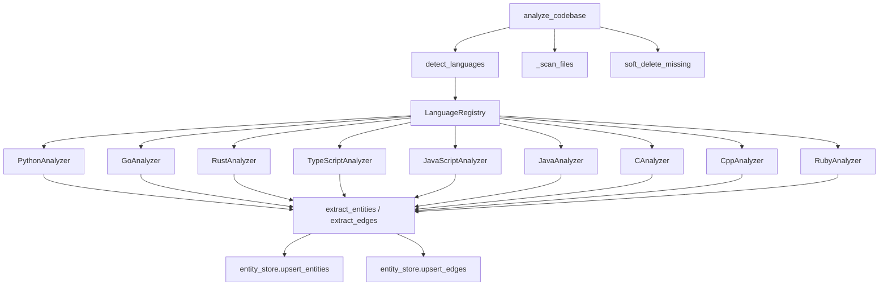

# Design Document: Multi-Language Entity Graph

## Overview

This spec refactors the Python-only static analysis in `static_analysis.py`
into a multi-language extraction framework. Each supported language implements
a `LanguageAnalyzer` protocol. A central registry maps file extensions to
analyzers. The existing `analyze_codebase()` function is refactored to detect
languages, dispatch to analyzers, and aggregate results -- preserving its
public signature for backward compatibility.

## Architecture



### Module Responsibilities

1. `agent_fox/knowledge/lang/__init__.py` -- Package init; exports registry
   and all analyzer classes.
2. `agent_fox/knowledge/lang/base.py` -- `LanguageAnalyzer` protocol
   definition.
3. `agent_fox/knowledge/lang/registry.py` -- `LanguageRegistry` class,
   `detect_languages()`, `_scan_files()`.
4. `agent_fox/knowledge/lang/python_lang.py` -- `PythonAnalyzer`; refactored
   from existing `static_analysis.py` extraction logic.
5. `agent_fox/knowledge/lang/go_lang.py` -- `GoAnalyzer`; Go entity/edge
   extraction.
6. `agent_fox/knowledge/lang/rust_lang.py` -- `RustAnalyzer`; Rust
   entity/edge extraction.
7. `agent_fox/knowledge/lang/typescript_lang.py` -- `TypeScriptAnalyzer` and
   `JavaScriptAnalyzer`; TS/JS entity/edge extraction using respective
   tree-sitter grammars.
8. `agent_fox/knowledge/lang/java_lang.py` -- `JavaAnalyzer`; Java
   entity/edge extraction.
9. `agent_fox/knowledge/lang/c_lang.py` -- `CAnalyzer` and `CppAnalyzer`;
   C/C++ entity/edge extraction.
10. `agent_fox/knowledge/lang/ruby_lang.py` -- `RubyAnalyzer`; Ruby
    entity/edge extraction.
11. `agent_fox/knowledge/static_analysis.py` -- Refactored orchestrator;
    uses registry to dispatch to per-language analyzers.
12. `agent_fox/knowledge/entities.py` -- Extended `AnalysisResult` with
    `languages_analyzed` field; `Entity` unchanged (language stored in DB
    only).
13. `agent_fox/knowledge/entity_store.py` -- `upsert_entities()` updated to
    accept and write `language` column; `_row_to_entity()` reads new column.
14. `agent_fox/knowledge/migrations.py` -- Migration v9: add `language`
    column and backfill.

## Execution Paths

### Path 1: Full Multi-Language Codebase Analysis

1. `static_analysis.py: analyze_codebase(repo_root, conn)` -- entry point
2. `registry.py: detect_languages(repo_root)` -> `list[LanguageAnalyzer]`
3. For each detected analyzer:
   a. `registry.py: _scan_files(repo_root, analyzer.file_extensions)` ->
      `list[Path]`
   b. `analyzer.build_module_map(repo_root, files)` -> `dict[str, str]`
   c. `analyzer.make_parser()` -> tree-sitter `Parser`
   d. For each file:
      - `static_analysis.py: _parse_file(file_path, parser)` -> `Tree | None`
      - `analyzer.extract_entities(tree, rel_path)` -> `list[Entity]`
      - `analyzer.extract_edges(tree, rel_path, entities, module_map)` ->
        `list[EntityEdge]`
4. `entity_store.py: upsert_entities(conn, all_entities)` -> `list[str]`
5. Resolve sentinel edges (path-keyed and class-keyed) to real UUIDs
6. `entity_store.py: upsert_edges(conn, resolved_edges)` -> `int`
7. `entity_store.py: soft_delete_missing(conn, found_keys)` -> `int`
8. Return `AnalysisResult(entities_upserted, edges_upserted,
   entities_soft_deleted, languages_analyzed)`

### Path 2: Python-Only Codebase (Backward Compatibility)

1. `analyze_codebase(repo_root, conn)` -- same entry point
2. `detect_languages(repo_root)` -> `[PythonAnalyzer]` (only `.py` found)
3. `PythonAnalyzer.build_module_map()` -> same dotted-path map as before
4. `PythonAnalyzer.make_parser()` -> tree-sitter Python parser
5. `PythonAnalyzer.extract_entities()` -> same entities as original code
6. `PythonAnalyzer.extract_edges()` -> same edges as original code
7. Sentinel resolution, upsert, soft-delete -- identical logic
8. Return `AnalysisResult(..., languages_analyzed=("python",))`

### Path 3: Mixed-Language Repository

1. `detect_languages(repo_root)` -> `[PythonAnalyzer, GoAnalyzer, ...]`
2. Each analyzer processes its own file set independently
3. All entities collected into a single list, upserted together
4. Sentinel resolution operates across all languages (import from Python
   file to Go file is possible if paths resolve)
5. Soft-delete considers all languages' found_keys combined
6. Return aggregated `AnalysisResult`

## Data Models

### LanguageAnalyzer Protocol

```python
from typing import Protocol, runtime_checkable

@runtime_checkable
class LanguageAnalyzer(Protocol):
    @property
    def language_name(self) -> str: ...

    @property
    def file_extensions(self) -> set[str]: ...

    def make_parser(self) -> Parser: ...

    def extract_entities(self, tree, rel_path: str) -> list[Entity]: ...

    def extract_edges(
        self,
        tree,
        rel_path: str,
        entities: list[Entity],
        module_map: dict[str, str],
    ) -> list[EntityEdge]: ...

    def build_module_map(
        self,
        repo_root: Path,
        files: list[Path],
    ) -> dict[str, str]: ...
```

### LanguageRegistry

```python
class LanguageRegistry:
    def register(self, analyzer: LanguageAnalyzer) -> None: ...
    def get_analyzer(self, extension: str) -> LanguageAnalyzer | None: ...
    def all_analyzers(self) -> list[LanguageAnalyzer]: ...

def get_default_registry() -> LanguageRegistry: ...
def detect_languages(repo_root: Path) -> list[LanguageAnalyzer]: ...
def _scan_files(repo_root: Path, extensions: set[str]) -> list[Path]: ...
```

### Extended AnalysisResult

```python
@dataclass(frozen=True)
class AnalysisResult:
    entities_upserted: int
    edges_upserted: int
    entities_soft_deleted: int
    languages_analyzed: tuple[str, ...] = ()
```

### Entity (Unchanged)

The `Entity` dataclass is not modified. The `language` value is stored in the
database column and passed to `upsert_entities()` as a separate parameter
or via a thin wrapper. The `_row_to_entity()` function is updated to read the
column but does not add it to the dataclass to minimize churn across all
consumers.

Instead, `upsert_entities()` accepts an optional `language: str | None`
parameter. When provided, new inserts use it; existing entities are updated
if their language is NULL.

### Migration v9

```sql
ALTER TABLE entity_graph ADD COLUMN language VARCHAR;
UPDATE entity_graph SET language = 'python' WHERE language IS NULL;
```

## Tree-Sitter Node Type Mappings

Each language analyzer maps tree-sitter AST node types to entity and edge
extractions. The tables below serve as the reference for implementers.

### Python (refactored from existing code)

| Node Type | EntityType | Notes |
|-----------|-----------|-------|
| (file) | FILE | One per file |
| `__init__.py` directory | MODULE | Package entity |
| `class_definition` | CLASS | |
| `function_definition` | FUNCTION | Qualified as `Class.method` when nested |
| `decorated_definition` | -- | Unwrap to inner class/function |

| Node Type | EdgeType | Resolution |
|-----------|---------|------------|
| file -> class/function | CONTAINS | Direct containment |
| class -> method | CONTAINS | Direct containment |
| `import_statement` | IMPORTS | Resolve via dotted-path module map |
| `import_from_statement` | IMPORTS | Resolve via dotted-path module map |
| `argument_list` (class bases) | EXTENDS | Resolve by class name |

### Go

| Node Type | EntityType | Notes |
|-----------|-----------|-------|
| (file) | FILE | One per file |
| `package_clause` | MODULE | One per directory (package name) |
| `type_spec` -> `struct_type` | CLASS | Struct definition |
| `type_spec` -> `interface_type` | CLASS | Interface definition |
| `function_declaration` | FUNCTION | Top-level function |
| `method_declaration` | FUNCTION | Qualified as `Type.Method` |

| Node Type | EdgeType | Resolution |
|-----------|---------|------------|
| file -> struct/interface/func | CONTAINS | Direct containment |
| `import_declaration` | IMPORTS | Resolve package path to directory |
| (none) | EXTENDS | Go uses embedding, not modeled |

**Go module map:** Maps the last path segment of each Go package directory to
the repo-relative directory path. For example, if `pkg/server/` contains Go
files with `package server`, the map entry is `"server" -> "pkg/server"`.

### Rust

| Node Type | EntityType | Notes |
|-----------|-----------|-------|
| (file) | FILE | One per file |
| `mod_item` | MODULE | `mod name;` or `mod name { ... }` |
| `struct_item` | CLASS | |
| `enum_item` | CLASS | |
| `trait_item` | CLASS | |
| `function_item` | FUNCTION | Top-level or nested in `impl` |
| `impl_item` -> `function_item` | FUNCTION | Qualified as `Type.method` |

| Node Type | EdgeType | Resolution |
|-----------|---------|------------|
| file -> struct/enum/trait/fn | CONTAINS | Direct containment |
| `use_declaration` | IMPORTS | Resolve crate-relative path |
| (none) | EXTENDS | Rust uses traits, not modeled |

**Rust module map:** Maps Rust module paths (e.g., `crate::module::sub`) to
repo-relative file paths by following `mod.rs` / `<name>.rs` conventions.

### TypeScript

| Node Type | EntityType | Notes |
|-----------|-----------|-------|
| (file) | FILE | One per file |
| (file-level) | MODULE | ES module (one per file) |
| `class_declaration` | CLASS | |
| `interface_declaration` | CLASS | TypeScript interfaces |
| `function_declaration` | FUNCTION | |
| `lexical_declaration` with `arrow_function` | FUNCTION | Top-level `const fn = () => {}` |
| method in class body | FUNCTION | Qualified as `Class.method` |

| Node Type | EdgeType | Resolution |
|-----------|---------|------------|
| file -> class/function | CONTAINS | Direct containment |
| class -> method | CONTAINS | Direct containment |
| `import_statement` | IMPORTS | Resolve relative path to file |
| `extends_clause` | EXTENDS | Resolve by class name |
| `implements_clause` | EXTENDS | Mapped to extends |

**TypeScript/JavaScript module map:** Maps relative import paths to
repo-relative file paths. Tries extensions `.ts`, `.tsx`, `.js`, `.jsx` and
`/index.*` variants.

### JavaScript

Same as TypeScript except:
- No `interface_declaration` extraction
- Uses `tree-sitter-javascript` grammar
- File extensions: `.js`, `.jsx`

### Java

| Node Type | EntityType | Notes |
|-----------|-----------|-------|
| (file) | FILE | One per file |
| `package_declaration` | MODULE | Java package |
| `class_declaration` | CLASS | |
| `interface_declaration` | CLASS | |
| `enum_declaration` | CLASS | |
| `method_declaration` | FUNCTION | Qualified as `Class.method` |

| Node Type | EdgeType | Resolution |
|-----------|---------|------------|
| file -> class | CONTAINS | Direct containment |
| class -> method | CONTAINS | Direct containment |
| `import_declaration` | IMPORTS | Resolve fully qualified class to file |
| `superclass` | EXTENDS | Resolve by class name |
| `super_interfaces` / `extends_interfaces` | EXTENDS | Mapped to extends |

**Java module map:** Maps fully qualified class names (e.g., `com.example.Foo`)
to repo-relative paths by converting dots to slashes and appending `.java`.

### C

| Node Type | EntityType | Notes |
|-----------|-----------|-------|
| (file) | FILE | One per file |
| `struct_specifier` (named) | CLASS | Named struct definitions |
| `function_definition` | FUNCTION | |

| Node Type | EdgeType | Resolution |
|-----------|---------|------------|
| file -> struct/function | CONTAINS | Direct containment |
| `preproc_include` | IMPORTS | Resolve header path to file entity |
| (none) | EXTENDS | C has no inheritance |

**C module map:** Maps quoted include paths (e.g., `"utils/math.h"`) to
repo-relative file paths. Angle-bracket includes (`<stdio.h>`) are skipped
(external dependency).

### C++

Same as C plus:
- `class_specifier` -> CLASS
- `namespace_definition` -> MODULE (qualified as `outer::inner`)
- `base_class_clause` -> EXTENDS edge
- File extensions: `.cpp`, `.hpp`, `.cc`, `.cxx`, `.hh`
- Uses `tree-sitter-cpp` grammar

### Ruby

| Node Type | EntityType | Notes |
|-----------|-----------|-------|
| (file) | FILE | One per file |
| `module` | MODULE | Ruby module definition |
| `class` | CLASS | |
| `method` | FUNCTION | Qualified as `Class.method` |

| Node Type | EdgeType | Resolution |
|-----------|---------|------------|
| module -> class | CONTAINS | Direct containment |
| class -> method | CONTAINS | Direct containment |
| `call` (`require`, `require_relative`) | IMPORTS | Resolve require path to file |
| `superclass` | EXTENDS | Resolve by class name |

**Ruby module map:** Maps require paths to repo-relative file paths. For
`require_relative`, resolves relative to the current file's directory. For
`require`, searches `lib/` directory by convention.

## Dependencies (pyproject.toml)

```toml
"tree-sitter>=0.23",
"tree-sitter-python>=0.23",
"tree-sitter-go>=0.23",
"tree-sitter-javascript>=0.23",
"tree-sitter-typescript>=0.23",
"tree-sitter-rust>=0.23",
"tree-sitter-java>=0.23",
"tree-sitter-c>=0.23",
"tree-sitter-cpp>=0.23",
"tree-sitter-ruby>=0.23",
```

Note: Exact minimum versions should be verified at implementation time against
PyPI. If a grammar package does not yet support the tree-sitter>=0.23 API,
that language is deferred and protected by the graceful-skip behavior
(102-REQ-2.E2).

## File Layout

```
agent_fox/knowledge/
  lang/
    __init__.py
    base.py            # LanguageAnalyzer protocol
    registry.py        # LanguageRegistry, detect_languages, _scan_files
    python_lang.py     # PythonAnalyzer
    go_lang.py         # GoAnalyzer
    rust_lang.py       # RustAnalyzer
    typescript_lang.py # TypeScriptAnalyzer, JavaScriptAnalyzer
    java_lang.py       # JavaAnalyzer
    c_lang.py          # CAnalyzer, CppAnalyzer
    ruby_lang.py       # RubyAnalyzer
  static_analysis.py   # Refactored: uses registry for dispatch
  entities.py          # Extended AnalysisResult
  entity_store.py      # Updated upsert_entities for language column
  migrations.py        # Migration v9
```

## Correctness Properties

### CP-1: Extension Uniqueness

No two registered analyzers may claim the same file extension. The registry
raises `ValueError` on duplicate registration. This is verified at
registration time (not at query time).

### CP-2: Backward Compatibility

For a Python-only codebase, `analyze_codebase()` produces the same set of
entity natural keys `(entity_type, entity_path, entity_name)` and the same
set of resolved edge triples `(source_natural_key, target_natural_key,
relationship)` as the pre-Spec-102 implementation. The `languages_analyzed`
field is the only addition.

### CP-3: Entity Deduplication Across Runs

The natural key `(entity_type, entity_path, entity_name)` uniqueness
constraint ensures that re-running analysis on the same codebase does not
create duplicate entities, regardless of which languages are analyzed.

### CP-4: Soft-Delete Correctness

When a file is removed between analysis runs, the corresponding entities are
soft-deleted regardless of language. The `found_keys` set includes entities
from all languages analyzed in the current run.

### CP-5: Sentinel Resolution Scope

Sentinel edges (`path:` and `class:` prefixed IDs) are resolved against the
full set of upserted entities across all languages. This allows cross-language
import edges to resolve when paths match (e.g., a C `#include "bindings.h"`
resolving to a C file entity).

### CP-6: Migration Idempotency

Migration v9 is safe to run multiple times. `ALTER TABLE ADD COLUMN` only
runs if the column does not exist. The backfill `UPDATE` is a no-op if all
entities already have a language value.

## Error Handling

| Scenario | Action |
|----------|--------|
| Grammar package not installed | Log info, skip language (102-REQ-2.E2) |
| File read error | Log warning, skip file (102-REQ-2.E1) |
| Tree-sitter parse error | Log warning, skip file (102-REQ-2.E1) |
| Unresolvable import | Skip edge silently (102-REQ-3.4) |
| Analyzer crash | Log error, continue with other languages (102-REQ-4.E2) |
| Duplicate extension registration | Raise ValueError (102-REQ-1.2) |
