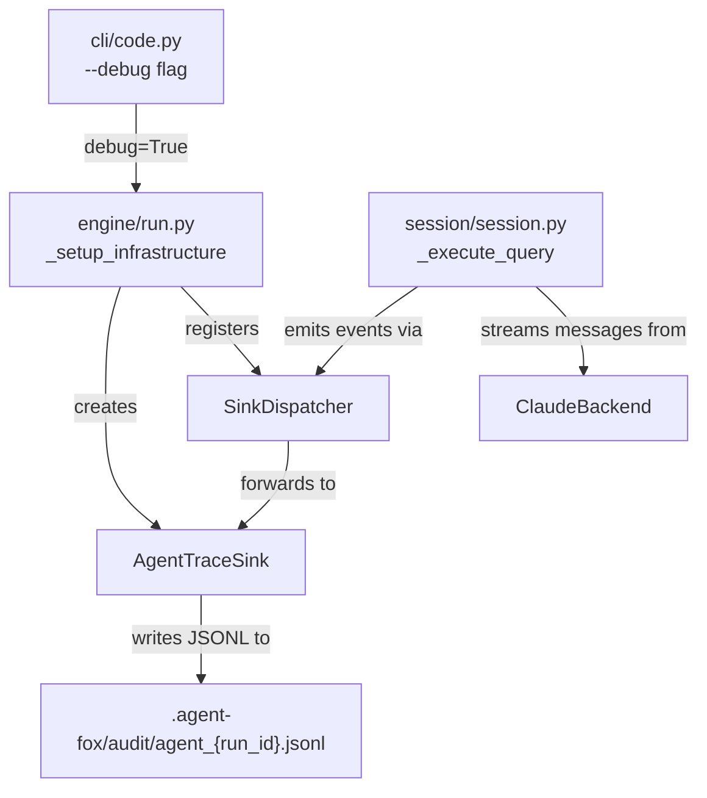

# Design Document: Agent Conversation Trace

## Overview

Add an `AgentTraceSink` that captures the full agent–model conversation as a
JSONL file when `--debug` is active. The sink replaces the existing `JsonlSink`
(which only recorded operational telemetry) and writes to
`.agent-fox/audit/agent_{run_id}.jsonl` for correlation with audit logs.

The sink plugs into the existing `SinkDispatcher` + `SessionSink` protocol.
Session-level code emits trace events at the same points where it currently
records telemetry, with the addition of a `session.init` event at the start.

## Architecture



### Module Responsibilities

1. **`agent_fox/knowledge/agent_trace.py`** (new) — `AgentTraceSink` class,
   `truncate_tool_input` helper, trace event serialization.
2. **`agent_fox/session/session.py`** (modified) — Emits `session.init` event
   before backend execution; emits `session.result` on `ResultMessage`;
   existing `AssistantMessage` and `ToolUseMessage` handling extended to
   call the trace sink.
3. **`agent_fox/engine/run.py`** (modified) — Replaces `JsonlSink` creation
   with `AgentTraceSink` creation when `debug=True`. Passes `run_id` to the
   sink.
4. **`agent_fox/knowledge/jsonl_sink.py`** (deleted) — Old debug sink removed.
5. **`agent_fox/knowledge/audit.py`** (unchanged) — Retention logic already
   targets only `audit_*.jsonl`; agent trace files are naturally preserved.

## Execution Paths

### Path 1: Debug trace file created and populated during a coding session

1. `cli/code.py: code_command` — passes `debug=True` to `run_code`
2. `engine/run.py: _setup_infrastructure` — creates `AgentTraceSink(audit_dir, run_id)`, registers it with `SinkDispatcher`
3. `engine/engine.py: Orchestrator._init_run` — generates `run_id`, passes it to session runner
4. `session/session.py: run_session` — calls `_execute_query` with `sink_dispatcher`
5. `session/session.py: _execute_query` — emits `session.init` trace event with prompts
6. `session/session.py: _execute_query` — iterates backend message stream:
   - `AssistantMessage` → emits `assistant.message` trace event
   - `ToolUseMessage` → emits `tool.use` trace event (with truncated input)
   - `ResultMessage` → emits `session.result` trace event
7. `knowledge/agent_trace.py: AgentTraceSink._write_event` — serializes event as JSON, appends to `.agent-fox/audit/agent_{run_id}.jsonl`

### Path 2: Old JsonlSink replaced — no legacy trace files produced

1. `cli/code.py: code_command` — passes `debug=True`
2. `engine/run.py: _setup_infrastructure` — creates `AgentTraceSink` (NOT `JsonlSink`)
3. No file is written to `.agent-fox/{timestamp}_{session_id}.jsonl`

## Components and Interfaces

### AgentTraceSink

```python
class AgentTraceSink:
    """SessionSink that writes conversation-level trace events to JSONL."""

    def __init__(self, audit_dir: Path, run_id: str) -> None: ...

    def record_session_init(
        self,
        *,
        run_id: str,
        node_id: str,
        model_id: str,
        archetype: str,
        system_prompt: str,
        task_prompt: str,
    ) -> None:
        """Emit a session.init event. Called before backend execution."""

    def record_assistant_message(
        self,
        *,
        run_id: str,
        node_id: str,
        content: str,
    ) -> None:
        """Emit an assistant.message event."""

    def record_tool_use(
        self,
        *,
        run_id: str,
        node_id: str,
        tool_name: str,
        tool_input: dict[str, Any],
    ) -> None:
        """Emit a tool.use event with truncated input values."""

    def record_tool_error_trace(
        self,
        *,
        run_id: str,
        node_id: str,
        tool_name: str,
        error_message: str,
    ) -> None:
        """Emit a tool.error event."""

    def record_session_result(
        self,
        *,
        run_id: str,
        node_id: str,
        status: str,
        input_tokens: int,
        output_tokens: int,
        cache_read_input_tokens: int,
        cache_creation_input_tokens: int,
        duration_ms: int,
        is_error: bool,
        error_message: str | None,
    ) -> None:
        """Emit a session.result event."""

    # SessionSink protocol methods (no-ops except close):
    def record_session_outcome(self, outcome: SessionOutcome) -> None: ...
    def record_tool_call(self, call: ToolCall) -> None: ...
    def record_tool_error(self, error: ToolError) -> None: ...
    def emit_audit_event(self, event: AuditEvent) -> None: ...
    def close(self) -> None: ...
```

### truncate_tool_input

```python
def truncate_tool_input(
    tool_input: dict[str, Any],
    max_len: int = 10_000,
) -> dict[str, Any]:
    """Return a shallow copy with string values truncated to max_len chars."""
```

### Trace Event Schema

Every event is a JSON object with at minimum:

```json
{
  "event_type": "session.init | assistant.message | tool.use | tool.error | session.result",
  "run_id": "<run_id>",
  "node_id": "<node_id>",
  "timestamp": "<ISO 8601>"
}
```

Plus event-specific fields (see Data Models below).

## Data Models

### session.init

```json
{
  "event_type": "session.init",
  "run_id": "20260414_120000_abc123",
  "node_id": "05_feature:coder:1",
  "timestamp": "2026-04-14T12:00:00+00:00",
  "model_id": "claude-sonnet-4-6",
  "archetype": "coder",
  "system_prompt": "You are a coding agent...",
  "task_prompt": "Implement the feature described in..."
}
```

### assistant.message

```json
{
  "event_type": "assistant.message",
  "run_id": "20260414_120000_abc123",
  "node_id": "05_feature:coder:1",
  "timestamp": "2026-04-14T12:00:01+00:00",
  "content": "I'll start by reading the existing code..."
}
```

### tool.use

```json
{
  "event_type": "tool.use",
  "run_id": "20260414_120000_abc123",
  "node_id": "05_feature:coder:1",
  "timestamp": "2026-04-14T12:00:02+00:00",
  "tool_name": "Read",
  "tool_input": {
    "file_path": "/path/to/file.py"
  }
}
```

### tool.error

```json
{
  "event_type": "tool.error",
  "run_id": "20260414_120000_abc123",
  "node_id": "05_feature:coder:1",
  "timestamp": "2026-04-14T12:00:05+00:00",
  "tool_name": "Bash",
  "error_message": "Command failed with exit code 1"
}
```

### session.result

```json
{
  "event_type": "session.result",
  "run_id": "20260414_120000_abc123",
  "node_id": "05_feature:coder:1",
  "timestamp": "2026-04-14T12:00:30+00:00",
  "status": "completed",
  "input_tokens": 15000,
  "output_tokens": 3200,
  "cache_read_input_tokens": 8000,
  "cache_creation_input_tokens": 2000,
  "duration_ms": 30000,
  "is_error": false,
  "error_message": null
}
```

## Operational Readiness

- **Observability:** The trace file itself is the observability artifact.
  Standard `jq` queries can extract events by type, node, or time range.
- **Rollout:** Feature is gated behind `--debug` — no impact on normal runs.
- **Rollback:** Remove the `AgentTraceSink` registration in
  `_setup_infrastructure` to disable.
- **Migration:** The old `JsonlSink` module is deleted. Any code importing it
  must be updated. No data migration needed — old trace files remain on disk
  but are no longer produced.

## Correctness Properties

### Property 1: Event Completeness

*For any* session executed with `debug=True` that yields at least one
`AssistantMessage`, `ToolUseMessage`, or `ResultMessage`, the `AgentTraceSink`
SHALL emit a trace event for every canonical message yielded by the backend
stream, plus a `session.init` event before the stream begins.

**Validates: Requirements 2.1, 3.1, 4.1, 6.1**

### Property 2: Tool Input Truncation Preserves Keys

*For any* `tool_input` dict, `truncate_tool_input(tool_input)` SHALL return a
dict with the same keys as the input. String values longer than `max_len`
SHALL be shortened to exactly `max_len` characters plus `" [truncated]"`.
Non-string values SHALL be identical to the input.

**Validates: Requirements 4.2, 4.3, 4.E1**

### Property 3: File Location Correctness

*For any* run with `debug=True`, all trace events SHALL be written to exactly
one file at path `.agent-fox/audit/agent_{run_id}.jsonl` where `run_id`
matches the value from `generate_run_id()`.

**Validates: Requirements 1.2, 7.3**

### Property 4: Write Failure Isolation

*For any* I/O error during trace event writing, the session SHALL continue
execution without raising an exception to the caller.

**Validates: Requirements 1.E2**

### Property 5: Retention Isolation

*For any* invocation of `enforce_audit_retention` that deletes audit files for
old runs, no `agent_*.jsonl` file SHALL be deleted.

**Validates: Requirements 8.1, 8.2, 8.E1**

### Property 6: No Legacy Trace Files

*For any* run with `debug=True`, the system SHALL NOT create files matching
the old pattern `.agent-fox/{timestamp}_{session_id}.jsonl`.

**Validates: Requirements 7.2, 7.3**

## Error Handling

| Error Condition | Behavior | Requirement |
|----------------|----------|-------------|
| Audit directory missing | Create `.agent-fox/audit/` on first write | 103-REQ-1.E1 |
| JSONL write I/O error | Log warning, continue session | 103-REQ-1.E2 |
| Empty tool_input dict | Emit event with empty dict | 103-REQ-4.E1 |

## Technology Stack

- Python 3.12+
- Standard library: `json`, `pathlib`, `datetime`, `logging`
- No new dependencies

## Definition of Done

A task group is complete when ALL of the following are true:

1. All subtasks within the group are checked off (`[x]`)
2. All spec tests (`test_spec.md` entries) for the task group pass
3. All property tests for the task group pass
4. All previously passing tests still pass (no regressions)
5. No linter warnings or errors introduced
6. Code is committed on a feature branch and merged into `develop`
7. Feature branch is merged back to `develop`
8. `tasks.md` checkboxes are updated to reflect completion

## Testing Strategy

- **Unit tests** validate `AgentTraceSink` event writing, `truncate_tool_input`,
  and file creation logic in isolation using temporary directories.
- **Property-based tests** (Hypothesis) verify `truncate_tool_input` preserves
  keys and correctly truncates/preserves values across arbitrary input dicts.
- **Integration tests** run a mock backend through `_execute_query` with a real
  `AgentTraceSink` and verify the resulting JSONL file contains the expected
  events in order.
- **Deletion verification** confirms the old `JsonlSink` module is absent and
  no imports reference it.
