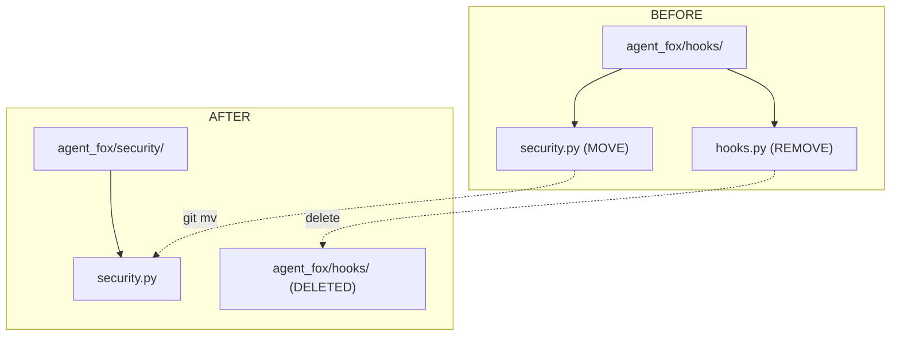

# Design Document: Remove Hook Runner

## Overview

This spec is a surgical removal of the unused hook runner subsystem and a
relocation of the security module to its own top-level package. The changes
are purely structural -- no behavioral change to the security module, no new
features. The `ConfigReloader` return type is modernized from a positional
tuple to a named dataclass as part of the cleanup.

## Architecture



### Module Responsibilities

1. **`agent_fox/security/__init__.py`** -- Package marker; may re-export
   public names for convenience.
2. **`agent_fox/security/security.py`** -- Unchanged module: command
   allowlist enforcement, PreToolUse hook factory. (Moved from
   `agent_fox/hooks/security.py`.)
3. **`agent_fox/core/config.py`** -- `HookConfig` removed;
   `AgentFoxConfig.hooks` field removed.
4. **`agent_fox/core/errors.py`** -- `HookError` removed.
5. **`agent_fox/engine/engine.py`** -- `ReloadResult` dataclass added;
   `ConfigReloader.reload()` returns `ReloadResult | None`;
   `_apply_reloaded_config` unpacks by field name.

## Execution Paths

### Path 1: Security allowlist enforcement (unchanged behavior, new import path)

1. `session/session.py: _execute_query` -- imports `make_pre_tool_use_hook`
   from `agent_fox.security.security`
2. `security/security.py: make_pre_tool_use_hook(config)` -> `Callable`
3. `security/security.py: hook(tool_name, tool_input)` ->
   `{"decision": "allow"|"block", ...}`
4. `session/session.py: _permission_callback` -- wraps hook result into bool
5. `backend.execute(permission_callback=...)` -- side effect: blocked
   commands are rejected

### Path 2: Config hot-reload (ReloadResult dataclass)

1. `engine/engine.py: Orchestrator._apply_reloaded_config` -- calls
   `self._config_reloader.reload(...)`
2. `engine/engine.py: ConfigReloader.reload(...)` -> `ReloadResult | None`
3. `engine/engine.py: Orchestrator._apply_reloaded_config` -- unpacks
   `result.config`, `result.circuit`, `result.archetypes`, `result.planning`
4. Applies each to the corresponding orchestrator attribute -- side effect:
   orchestrator state updated

### Path 3: Sync barrier sequence (hook call removed)

1. `engine/barrier.py: run_sync_barrier_sequence(...)` -- no longer receives
   `hook_config` or `no_hooks`
2. Sync barrier hooks block removed -- proceeds directly to hot-load step
3. `engine/hot_load.py: hot_load_specs(...)` -- unchanged

## Components and Interfaces

### New Types

```python
@dataclass(frozen=True)
class ReloadResult:
    """Result of a successful config hot-reload."""
    config: OrchestratorConfig
    circuit: CircuitBreaker
    archetypes: ArchetypesConfig | None
    planning: PlanningConfig
```

### Removed Types

- `HookConfig` (Pydantic model)
- `HookContext` (dataclass)
- `HookResult` (dataclass)
- `HookError` (exception)

### Removed Functions

- `build_hook_env()`
- `run_hook()`
- `run_hooks()`
- `_run_phase_hooks()`
- `run_pre_session_hooks()`
- `run_post_session_hooks()`
- `run_sync_barrier_hooks()`

### Removed Parameters

| Function / Class | Removed Params |
|-----------------|----------------|
| `NodeSessionRunner.__init__` | `hook_config`, `no_hooks` |
| `NodeSessionRunner._build_hook_context` | (entire method) |
| `run_sync_barrier_sequence` | `hook_config`, `no_hooks` |
| `Orchestrator.__init__` | `hook_config`, `no_hooks` |
| `session_runner_factory` | (no longer passes `hook_config`, `no_hooks`) |
| `code_cmd` (CLI) | `--no-hooks` |

### Removed CLI Flags

| Flag | Command |
|------|---------|
| `--no-hooks` | `agent-fox code` |

## Data Models

### ReloadResult

| Field | Type | Description |
|-------|------|-------------|
| `config` | `OrchestratorConfig` | Updated orchestrator config |
| `circuit` | `CircuitBreaker` | Rebuilt circuit breaker |
| `archetypes` | `ArchetypesConfig \| None` | Updated archetypes config |
| `planning` | `PlanningConfig` | Updated planning config |

## Operational Readiness

- **Rollout**: Single commit, no migration needed. Existing `[hooks]` TOML
  sections are silently ignored.
- **Rollback**: `git revert` restores all removed code.
- **Observability**: No change -- security module logging unchanged.

## Correctness Properties

### Property 1: Security Module Functional Equivalence

*For any* valid `SecurityConfig` and any command string, the security module
at `agent_fox.security.security` SHALL produce identical results to the
pre-relocation module at `agent_fox.hooks.security` for
`make_pre_tool_use_hook`, `check_command_allowed`,
`build_effective_allowlist`, and `extract_command_name`.

**Validates: Requirements 103-REQ-2.1, 103-REQ-2.2**

### Property 2: Hook Runner Absence

*For any* module in the production codebase (`agent_fox/`), the module SHALL
NOT import or reference `HookConfig`, `HookContext`, `HookResult`,
`HookError`, `run_hook`, `run_hooks`, `run_pre_session_hooks`,
`run_post_session_hooks`, or `run_sync_barrier_hooks`.

**Validates: Requirements 103-REQ-1.1, 103-REQ-1.2, 103-REQ-1.3,
103-REQ-1.6**

### Property 3: ReloadResult Field Access

*For any* successful config reload, the `ReloadResult` dataclass SHALL expose
all four fields (`config`, `circuit`, `archetypes`, `planning`) by name, and
`_apply_reloaded_config` SHALL access them by name (not by positional index).

**Validates: Requirements 103-REQ-3.1, 103-REQ-3.2**

### Property 4: TOML Backward Compatibility

*For any* valid TOML config file that contains a `[hooks]` section, THE
system SHALL parse the file successfully and return an `AgentFoxConfig`
without error.

**Validates: Requirements 103-REQ-1.4, 103-REQ-1.E1**

## Error Handling

| Error Condition | Behavior | Requirement |
|----------------|----------|-------------|
| TOML has `[hooks]` section | Silently ignored | 103-REQ-1.E1 |
| Import from old `agent_fox.hooks.security` path | ImportError (expected after removal) | 103-REQ-2.E1 |
| ConfigReloader error | Returns `None` (unchanged) | 103-REQ-3.3 |

## Technology Stack

- Python 3.12+
- Pydantic v2 (config models)
- pytest + Hypothesis (testing)
- ruff (linting/formatting)

## Definition of Done

A task group is complete when ALL of the following are true:

1. All subtasks within the group are checked off (`[x]`)
2. All spec tests (`test_spec.md` entries) for the task group pass
3. All property tests for the task group pass
4. All previously passing tests still pass (no regressions)
5. No linter warnings or errors introduced
6. Code is committed on a feature branch and merged into `develop`
7. Feature branch is merged back to `develop`
8. `tasks.md` checkboxes are updated to reflect completion

## Testing Strategy

- **Property tests** verify security module equivalence post-relocation and
  the absence of hook runner references in production code.
- **Unit tests** verify `ReloadResult` dataclass behavior, TOML backward
  compatibility, and that engine modules no longer accept removed parameters.
- **Integration smoke test** verifies the security allowlist enforcement
  path end-to-end after relocation.
- Existing security tests are relocated but otherwise unchanged.
