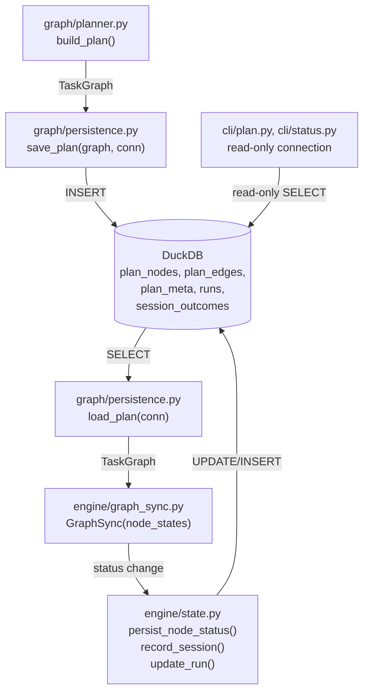
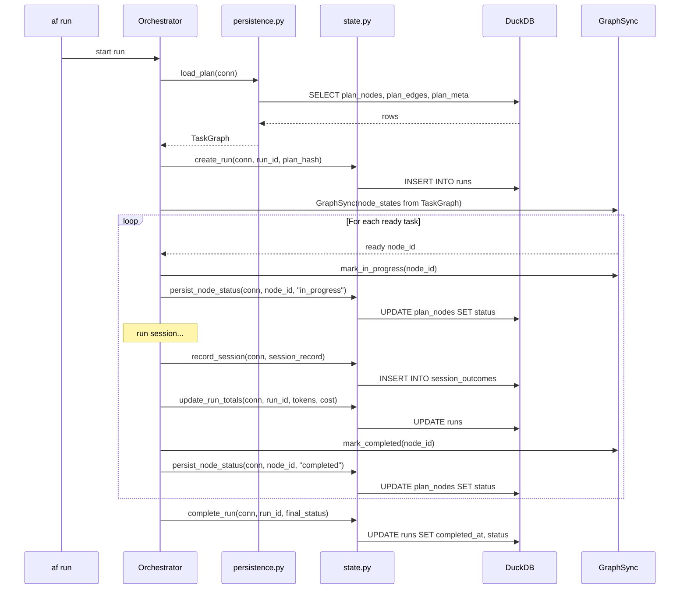

# Design Document: DB-Based Plan State

## Overview

Replace the file-based plan and execution state stores (`plan.json`,
`state.jsonl`) with four DuckDB tables (`plan_nodes`, `plan_edges`,
`plan_meta`, `runs`) and extend the existing `session_outcomes` table. The
in-memory `GraphSync` pattern (shared mutable dict for ready-task detection)
is preserved — the dict is loaded from DB on startup and flushed to DB after
each status transition.

## Architecture





### Module Responsibilities

1. **`agent_fox/graph/persistence.py`** (modified) — Replace file-based
   `save_plan`/`load_plan` with DuckDB equivalents. Accept `conn` instead
   of `Path`.
2. **`agent_fox/engine/state.py`** (rewritten) — Remove `StateManager` and
   JSONL logic. Add `persist_node_status`, `record_session`, `create_run`,
   `update_run_totals`, `complete_run`, `load_execution_state` functions
   that operate on DuckDB.
3. **`agent_fox/knowledge/migrations.py`** (modified) — Add v9 migration
   creating plan tables and extending session_outcomes.
4. **`agent_fox/core/paths.py`** (modified) — Remove `PLAN_PATH` and
   `STATE_PATH` constants.
5. **`agent_fox/engine/engine.py`** (modified) — Update `_init_run`,
   `_load_graph`, remove `_sync_plan_statuses`. Pass `conn` instead of
   file paths.
6. **`agent_fox/cli/plan.py`** (modified) — Render plan from DB, not file.
7. **`agent_fox/cli/status.py`** (modified) — Read status from DB with
   read-only connection.
8. **`agent_fox/graph/types.py`** (modified) — Add `cost_blocked` and
   `merge_blocked` to `NodeStatus` enum.

## Execution Paths

### Path 1: Plan creation and persistence

1. `cli/plan.py: plan_cmd` — invokes planner
2. `graph/planner.py: build_plan(specs_dir, ...)` -> `TaskGraph`
3. `graph/persistence.py: save_plan(graph, conn)` — writes to DuckDB
4. DuckDB: `plan_nodes`, `plan_edges`, `plan_meta` tables populated
5. Observable: plan queryable via `af plan` or direct SQL

### Path 2: Plan load and execution start

1. `engine/engine.py: _init_run()` — starts orchestration
2. `graph/persistence.py: load_plan(conn)` -> `TaskGraph`
3. `engine/state.py: create_run(conn, run_id, plan_hash)` — INSERT into runs
4. `engine/graph_sync.py: GraphSync(node_states, edges)` — in-memory working copy
5. `engine/engine.py` — dispatches ready nodes via GraphSync

### Path 3: Node status update (per session)

1. Session completes -> `engine/result_handler.py` determines outcome
2. `engine/graph_sync.py: mark_completed(node_id)` — updates in-memory dict
3. `engine/state.py: persist_node_status(conn, node_id, status)` — UPDATE plan_nodes
4. `engine/state.py: record_session(conn, record)` — INSERT into session_outcomes
5. `engine/state.py: update_run_totals(conn, run_id, delta)` — UPDATE runs
6. Observable: `plan_nodes.status` reflects new state, `session_outcomes` has new row

### Path 4: Status query (concurrent read)

1. `cli/status.py: status_cmd` — opens read-only DuckDB connection
2. SELECT from `plan_nodes`, `session_outcomes`, `runs`
3. Renders progress dashboard (node counts by status, costs, problem nodes)
4. Observable: dashboard shown to operator without blocking orchestrator

### Path 5: Plan change detection on resume

1. `engine/engine.py: _init_run()` — loads existing plan from DB
2. `engine/state.py: compute_plan_hash(specs_dir)` — hash current specs
3. Compare with `plan_meta.content_hash` from DB
4. If mismatch: prompt user to re-plan or abort
5. If match: resume from persisted node statuses

## Components and Interfaces

### DuckDB Schema (v9 Migration)

```sql
-- Plan nodes (replaces plan.json nodes + state.jsonl node_states)
CREATE TABLE plan_nodes (
    id              VARCHAR PRIMARY KEY,
    spec_name       VARCHAR NOT NULL,
    group_number    INTEGER NOT NULL,
    title           VARCHAR NOT NULL,
    body            TEXT NOT NULL DEFAULT '',
    archetype       VARCHAR NOT NULL DEFAULT 'coder',
    mode            VARCHAR,
    model_tier      VARCHAR,
    status          VARCHAR NOT NULL DEFAULT 'pending',
    subtask_count   INTEGER NOT NULL DEFAULT 0,
    optional        BOOLEAN NOT NULL DEFAULT FALSE,
    instances       INTEGER NOT NULL DEFAULT 1,
    sort_position   INTEGER NOT NULL,
    blocked_reason  VARCHAR,
    created_at      TIMESTAMP NOT NULL DEFAULT CURRENT_TIMESTAMP,
    updated_at      TIMESTAMP NOT NULL DEFAULT CURRENT_TIMESTAMP,
    -- No UNIQUE on (spec_name, group_number): multiple nodes share the same
    -- group (e.g. coder + reviewer sub-nodes)
);

-- Plan edges (replaces plan.json edges)
CREATE TABLE plan_edges (
    from_node   VARCHAR NOT NULL,
    to_node     VARCHAR NOT NULL,
    edge_type   VARCHAR NOT NULL DEFAULT 'intra_spec',
    PRIMARY KEY (from_node, to_node)
);

-- Plan metadata (replaces plan.json top-level fields)
CREATE TABLE plan_meta (
    id              INTEGER PRIMARY KEY DEFAULT 1 CHECK (id = 1),
    content_hash    VARCHAR NOT NULL,
    created_at      TIMESTAMP NOT NULL DEFAULT CURRENT_TIMESTAMP,
    fast_mode       BOOLEAN NOT NULL DEFAULT FALSE,
    filtered_spec   VARCHAR,
    version         VARCHAR NOT NULL DEFAULT ''
);

-- Run tracking (replaces state.jsonl run-level fields)
CREATE TABLE runs (
    id                  VARCHAR PRIMARY KEY,
    plan_content_hash   VARCHAR NOT NULL,
    started_at          TIMESTAMP NOT NULL DEFAULT CURRENT_TIMESTAMP,
    completed_at        TIMESTAMP,
    status              VARCHAR NOT NULL DEFAULT 'running',
    total_input_tokens  BIGINT NOT NULL DEFAULT 0,
    total_output_tokens BIGINT NOT NULL DEFAULT 0,
    total_cost          DOUBLE NOT NULL DEFAULT 0.0,
    total_sessions      INTEGER NOT NULL DEFAULT 0
);

-- Extend session_outcomes (add SessionRecord fields)
ALTER TABLE session_outcomes ADD COLUMN run_id VARCHAR;
ALTER TABLE session_outcomes ADD COLUMN attempt INTEGER DEFAULT 1;
ALTER TABLE session_outcomes ADD COLUMN cost DOUBLE DEFAULT 0.0;
ALTER TABLE session_outcomes ADD COLUMN model VARCHAR;
ALTER TABLE session_outcomes ADD COLUMN archetype VARCHAR;
ALTER TABLE session_outcomes ADD COLUMN commit_sha VARCHAR;
ALTER TABLE session_outcomes ADD COLUMN error_message TEXT;
ALTER TABLE session_outcomes ADD COLUMN is_transport_error BOOLEAN DEFAULT FALSE;
```

### Updated NodeStatus Enum

```python
class NodeStatus(StrEnum):
    PENDING = "pending"
    IN_PROGRESS = "in_progress"
    COMPLETED = "completed"
    FAILED = "failed"
    BLOCKED = "blocked"
    SKIPPED = "skipped"
    COST_BLOCKED = "cost_blocked"
    MERGE_BLOCKED = "merge_blocked"
```

### Key Function Signatures

```python
# graph/persistence.py — replaces file-based save/load
def save_plan(graph: TaskGraph, conn: duckdb.DuckDBPyConnection) -> None:
    """Persist TaskGraph to plan_nodes, plan_edges, plan_meta tables.
    Runs in a single transaction. Clears existing plan data first."""

def load_plan(conn: duckdb.DuckDBPyConnection) -> TaskGraph | None:
    """Load TaskGraph from DuckDB tables. Returns None if no plan exists."""


# engine/state.py — replaces StateManager
def persist_node_status(
    conn: duckdb.DuckDBPyConnection,
    node_id: str,
    status: str,
    blocked_reason: str | None = None,
) -> None:
    """UPDATE plan_nodes SET status, updated_at for a single node."""

def record_session(
    conn: duckdb.DuckDBPyConnection,
    record: SessionOutcomeRecord,
) -> None:
    """INSERT a session outcome row with all extended fields."""

def create_run(
    conn: duckdb.DuckDBPyConnection,
    run_id: str,
    plan_hash: str,
) -> None:
    """INSERT a new run row with status='running'."""

def update_run_totals(
    conn: duckdb.DuckDBPyConnection,
    run_id: str,
    input_tokens: int,
    output_tokens: int,
    cost: float,
) -> None:
    """UPDATE runs to accumulate token and cost counters."""

def complete_run(
    conn: duckdb.DuckDBPyConnection,
    run_id: str,
    status: str,
) -> None:
    """UPDATE runs SET completed_at, status."""

def load_execution_state(
    conn: duckdb.DuckDBPyConnection,
) -> dict[str, str]:
    """Load node_states dict from plan_nodes for GraphSync initialization."""

def load_run(
    conn: duckdb.DuckDBPyConnection,
    run_id: str | None = None,
) -> RunRecord | None:
    """Load the most recent run, or a specific run by ID."""
```

### SessionOutcomeRecord (replaces SessionRecord)

```python
@dataclass
class SessionOutcomeRecord:
    """Unified session record — written directly to session_outcomes table."""
    id: str
    spec_name: str
    task_group: str
    node_id: str
    touched_path: str        # comma-separated or first file
    status: str
    input_tokens: int
    output_tokens: int
    duration_ms: int
    created_at: str
    run_id: str
    attempt: int
    cost: float
    model: str
    archetype: str
    commit_sha: str
    error_message: str | None
    is_transport_error: bool
```

## Data Models

### Content Hash Computation

The content hash algorithm is unchanged: SHA-256 of canonical JSON containing
nodes (without status/blocked_reason), edges, and topological order. The hash
excludes mutable runtime state so that resuming a plan produces the same hash
as the initial plan.

```python
def compute_plan_hash(graph: TaskGraph) -> str:
    """Compute content hash from plan structure, excluding runtime state."""
    canonical = {
        "nodes": {
            nid: {k: v for k, v in vars(node).items()
                  if k not in ("status", "blocked_reason", "updated_at")}
            for nid, node in sorted(graph.nodes.items())
        },
        "edges": sorted(
            [{"source": e.source, "target": e.target, "kind": e.kind}
             for e in graph.edges],
            key=lambda e: (e["source"], e["target"]),
        ),
        "order": graph.order,
    }
    return hashlib.sha256(
        json.dumps(canonical, sort_keys=True, separators=(",", ":")).encode()
    ).hexdigest()
```

## Operational Readiness

- **Observability:** Plan state is queryable via standard SQL. `af status`
  renders from DB. Audit events continue to be written to `audit_events`.
- **Rollout:** Clean break — old files ignored. No feature flag needed.
- **Rollback:** Revert the commit. Old file-based code is restored. Existing
  `plan.json`/`state.jsonl` files (if present) are picked up by old code.
- **Migration:** v9 schema migration adds new tables and extends
  session_outcomes. Existing session_outcomes rows get NULL for new columns.

## Correctness Properties

### Property 1: Plan Round-Trip Equivalence

*For any* valid `TaskGraph`, `save_plan(graph, conn)` followed by
`load_plan(conn)` SHALL produce a `TaskGraph` structurally equivalent to
the original (same nodes with same fields, same edges, same topological
order).

**Validates: Requirements 1.1, 1.2**

### Property 2: Status Transition Atomicity

*For any* node status transition, `persist_node_status(conn, node_id, status)`
SHALL update exactly one `plan_nodes` row, and a subsequent
`load_execution_state(conn)` SHALL reflect the new status for that node.

**Validates: Requirements 2.1, 2.4**

### Property 3: Content Hash Stability

*For any* `TaskGraph`, the content hash computed from the in-memory graph
SHALL equal the content hash recomputed after a save/load round-trip
through DuckDB.

**Validates: Requirements 1.4**

### Property 4: Session Record Completeness

*For any* `SessionOutcomeRecord`, `record_session(conn, record)` SHALL
insert a row whose columns match all fields of the record, and a subsequent
SELECT SHALL return all field values including nullable ones.

**Validates: Requirements 3.1, 3.2**

### Property 5: Run Aggregate Accuracy

*For any* sequence of `update_run_totals` calls with token and cost deltas,
the final `runs` row SHALL contain the sum of all deltas for each counter.

**Validates: Requirements 4.3**

### Property 6: Concurrent Read Safety

*For any* write operation on the plan tables, a concurrent read-only
connection SHALL see either the pre-write or post-write state, never a
partial update.

**Validates: Requirements 6.3**

## Error Handling

| Error Condition | Behavior | Requirement |
|----------------|----------|-------------|
| No plan in DB | `load_plan` returns None | 105-REQ-1.E1 |
| Empty plan (0 nodes) | Returns TaskGraph with empty collections | 105-REQ-1.E2 |
| Crash during session | `in_progress` nodes reset to `pending` on resume | 105-REQ-2.E1 |
| Null error_message | Stored as SQL NULL | 105-REQ-3.E1 |
| Crash during run | Run row stays `running`; updated on resume | 105-REQ-4.E1 |
| Legacy files on disk | Ignored silently | 105-REQ-5.E1 |
| DB file missing for status | "No plan found" message | 105-REQ-6.E1 |

## Technology Stack

- Python 3.12+
- DuckDB (existing dependency)
- Standard library: `dataclasses`, `hashlib`, `json`
- Existing modules: `knowledge/db.py`, `knowledge/migrations.py`,
  `graph/types.py`, `engine/graph_sync.py`

## Definition of Done

A task group is complete when ALL of the following are true:

1. All subtasks within the group are checked off (`[x]`)
2. All spec tests (`test_spec.md` entries) for the task group pass
3. All property tests for the task group pass
4. All previously passing tests still pass (no regressions)
5. No linter warnings or errors introduced
6. Code is committed on a feature branch and merged into `develop`
7. Feature branch is merged back to `develop`
8. `tasks.md` checkboxes are updated to reflect completion

## Testing Strategy

- **Unit tests** validate save/load round-trips, status transitions, session
  recording, and run tracking using in-memory DuckDB fixtures.
- **Property-based tests** (Hypothesis) verify plan round-trip equivalence,
  content hash stability, and run aggregate accuracy across random TaskGraphs.
- **Integration tests** run the full orchestration cycle with DB state and
  verify concurrent read access via separate connections.
