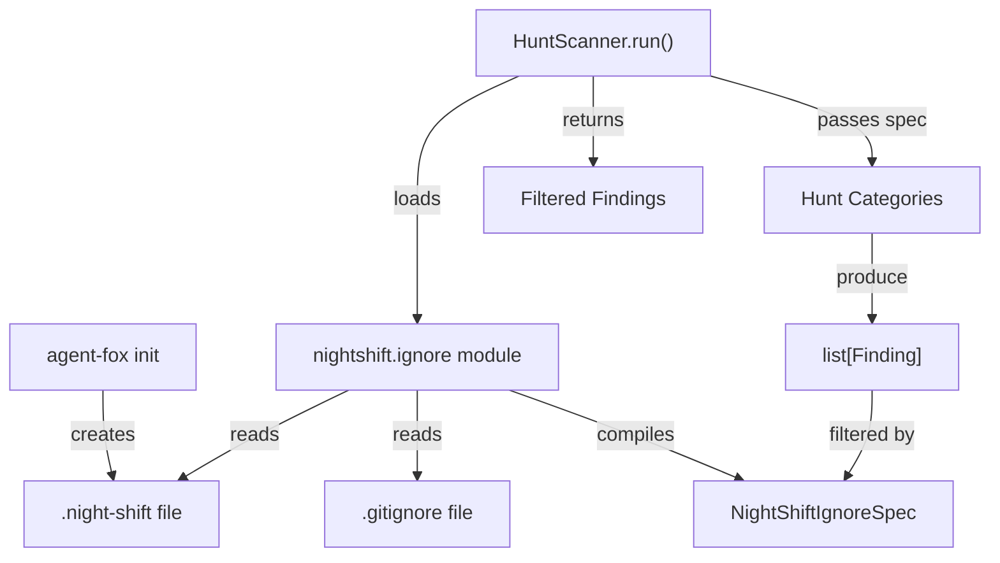

# Design Document: Night-Shift Ignore File

## Overview

A new module `agent_fox.nightshift.ignore` provides gitignore-style file
exclusion for the night-shift hunt scan. It loads patterns from the
`.night-shift` file, combines them with hardcoded default exclusions, and
exposes a predicate that the `HuntScanner` uses to filter findings. The
`init` command is extended to create a seed `.night-shift` file.

## Architecture



### Module Responsibilities

1. **`agent_fox.nightshift.ignore`** — Loads `.night-shift` and `.gitignore`
   files, compiles them into a `NightShiftIgnoreSpec`, exposes
   `is_ignored(rel_path)` predicate and `filter_findings(findings)` helper.
2. **`agent_fox.nightshift.hunt`** — Extended to load the ignore spec and
   filter findings after category execution.
3. **`agent_fox.workspace.init_project`** — Extended with
   `_ensure_nightshift_ignore()` to create the seed file during init.
4. **`agent_fox.cli.init`** — Extended to report `.night-shift` creation.

## Execution Paths

### Path 1: Hunt scan applies ignore filtering

1. `nightshift/engine.py: NightShiftEngine._run_hunt_scan_inner` — calls `HuntScanner(registry, config)`
2. `nightshift/hunt.py: HuntScanner.run(project_root)` — calls `load_ignore_spec(project_root)`
3. `nightshift/ignore.py: load_ignore_spec(project_root)` → `NightShiftIgnoreSpec`
   - Reads `.night-shift` from `project_root / ".night-shift"`
   - Reads `.gitignore` from `project_root / ".gitignore"`
   - Prepends `DEFAULT_EXCLUSIONS` patterns
   - Compiles via `pathspec.PathSpec.from_lines("gitwildmatch", all_patterns)`
   - Returns `NightShiftIgnoreSpec(spec=compiled_spec, defaults_spec=defaults_only_spec)`
4. `nightshift/hunt.py: HuntScanner.run` — runs categories via `asyncio.gather`
5. `nightshift/hunt.py: HuntScanner.run` — calls `filter_findings(all_findings, ignore_spec)` → `list[Finding]`
6. `nightshift/ignore.py: filter_findings(findings, spec)` → `list[Finding]`
   - For each finding, checks `affected_files` against spec
   - Removes ignored paths from `affected_files`
   - Drops findings whose `affected_files` become empty
   - Returns filtered list

### Path 2: Init creates `.night-shift` file

1. `cli/init.py: init_cmd` — calls `init_project(project_root)`
2. `workspace/init_project.py: init_project` — calls `_ensure_nightshift_ignore(path)`
3. `workspace/init_project.py: _ensure_nightshift_ignore(project_root)` → `str`
   - Checks if `.night-shift` exists; returns `"skipped"` if so
   - Writes seed content with comment header and default patterns
   - Returns `"created"`
4. `workspace/init_project.py: init_project` — includes status in `InitResult`
5. `cli/init.py: init_cmd` — prints `"Created .night-shift."` if status is `"created"`

## Components and Interfaces

### CLI Changes

No new CLI commands. The `init` command gains a new output line.

### Core Data Types

```python
@dataclass(frozen=True)
class NightShiftIgnoreSpec:
    """Compiled ignore spec combining defaults, .gitignore, and .night-shift."""
    spec: pathspec.PathSpec        # Combined spec (defaults + gitignore + nightshift)
    defaults_spec: pathspec.PathSpec  # Defaults-only spec (for guaranteed exclusion)

    def is_ignored(self, rel_path: str) -> bool:
        """Test whether a POSIX-relative path is ignored."""
        return self.defaults_spec.match_file(rel_path) or self.spec.match_file(rel_path)
```

### Module Interfaces

```python
# agent_fox/nightshift/ignore.py

DEFAULT_EXCLUSIONS: list[str] = [
    ".agent-fox/**",
    ".git/**",
    "node_modules/**",
    "__pycache__/**",
    ".claude/**",
]

NIGHTSHIFT_IGNORE_FILENAME: str = ".night-shift"

def load_ignore_spec(project_root: Path) -> NightShiftIgnoreSpec:
    """Load and compile the combined ignore spec.

    Reads .night-shift and .gitignore from project_root, prepends
    DEFAULT_EXCLUSIONS, and returns a compiled NightShiftIgnoreSpec.

    Never raises — returns a defaults-only spec on any error.
    """

def filter_findings(
    findings: list[Finding],
    spec: NightShiftIgnoreSpec,
) -> list[Finding]:
    """Filter findings by removing ignored affected_files entries.

    - Removes ignored paths from each finding's affected_files.
    - Drops findings whose affected_files become empty after filtering.
    - Findings with no affected_files (empty list) are kept as-is.
    """
```

```python
# agent_fox/workspace/init_project.py (additions)

NIGHTSHIFT_IGNORE_SEED: str  # Seed content for .night-shift

def _ensure_nightshift_ignore(project_root: Path) -> str:
    """Create .night-shift seed file if absent. Returns 'created' or 'skipped'."""
```

### Modified Interfaces

```python
# agent_fox/nightshift/hunt.py — HuntScanner.run() gains filtering

class HuntScanner:
    async def run(self, project_root: Path, ...) -> list[Finding]:
        # ... existing category execution ...
        ignore_spec = load_ignore_spec(project_root)
        return filter_findings(all_findings, ignore_spec)
```

```python
# agent_fox/workspace/init_project.py — InitResult gains field

@dataclass(frozen=True)
class InitResult:
    # ... existing fields ...
    nightshift_ignore: str = "skipped"  # "created" | "skipped"
```

## Data Models

### `.night-shift` seed file content

```
# .night-shift — controls which files/folders the night-shift hunt scan skips.
# Syntax: same as .gitignore (one pattern per line, # for comments).
# These patterns are additive to .gitignore — both are applied.
#
# The following directories are always excluded by default:
# .agent-fox/**
# .git/**
# node_modules/**
# __pycache__/**
# .claude/**
```

## Operational Readiness

- **Observability:** Warnings are logged when `.night-shift` cannot be read
  or parsed. Debug-level log when the file is loaded successfully, including
  the number of user-supplied patterns.
- **Rollout:** Feature is always active. No feature flag needed — behavior
  is backward-compatible (no `.night-shift` file = no user exclusions).
- **Migration:** None required. Existing projects gain the file via
  `agent-fox init` (re-init is idempotent).

## Correctness Properties

### Property 1: Default exclusions are always applied

*For any* `.night-shift` file content (including empty, missing, or
malformed), the ignore spec SHALL always exclude paths matching the default
exclusion patterns.

**Validates: Requirements 106-REQ-2.1, 106-REQ-2.E1**

### Property 2: User patterns are additive

*For any* set of user-supplied patterns in `.night-shift`, the resulting
ignore spec SHALL exclude the union of default exclusions, `.gitignore`
exclusions, and user-supplied exclusions — never a strict subset of the
defaults.

**Validates: Requirements 106-REQ-1.2, 106-REQ-3.3**

### Property 3: Graceful degradation on error

*For any* error during `.night-shift` loading (missing file, permission
error, encoding error, empty file), `load_ignore_spec()` SHALL return a
valid `NightShiftIgnoreSpec` that at minimum applies default exclusions,
and SHALL never raise an exception.

**Validates: Requirements 106-REQ-1.4, 106-REQ-1.E1, 106-REQ-1.E2, 106-REQ-3.E1**

### Property 4: Finding filtering preserves non-ignored findings

*For any* list of findings and ignore spec, `filter_findings()` SHALL
return a list where: (a) every finding with no `affected_files` is preserved
unchanged, (b) every finding whose `affected_files` are all non-ignored is
preserved unchanged, and (c) no finding with only ignored `affected_files`
appears in the result.

**Validates: Requirements 106-REQ-3.2**

### Property 5: Path matching uses POSIX-relative paths

*For any* file path tested against the ignore spec, the path SHALL be
expressed as a POSIX-relative path from the repository root (forward slashes,
no leading `./`).

**Validates: Requirements 106-REQ-6.2**

### Property 6: Init idempotency

*For any* project root, calling `_ensure_nightshift_ignore()` multiple times
SHALL create the file at most once and never modify an existing file.

**Validates: Requirements 106-REQ-4.1, 106-REQ-4.E1**

## Error Handling

| Error Condition | Behavior | Requirement |
|----------------|----------|-------------|
| `.night-shift` file missing | Return defaults-only spec | 106-REQ-1.4 |
| `.night-shift` unreadable (permission/encoding) | Log warning, return defaults-only spec | 106-REQ-1.E1 |
| `.night-shift` empty (no patterns) | Return defaults-only spec | 106-REQ-1.E2 |
| `pathspec` import fails | Log warning, skip filtering | 106-REQ-3.E1 |
| Init cannot create file | Log warning, continue | 106-REQ-4.E2 |
| Existing `.night-shift` on init | Skip, do not modify | 106-REQ-4.E1 |

## Technology Stack

- **pathspec** (>=0.12) — gitignore-style pattern matching. Promoted from
  optional to required dependency.
- **Python 3.12+** — dataclasses, pathlib, logging.

## Definition of Done

A task group is complete when ALL of the following are true:

1. All subtasks within the group are checked off (`[x]`)
2. All spec tests (`test_spec.md` entries) for the task group pass
3. All property tests for the task group pass
4. All previously passing tests still pass (no regressions)
5. No linter warnings or errors introduced
6. Code is committed on a feature branch and merged into `develop`
7. Feature branch is merged back to `develop`
8. `tasks.md` checkboxes are updated to reflect completion

## Testing Strategy

- **Unit tests:** Test `load_ignore_spec()` with various file states (missing,
  empty, valid patterns, unreadable). Test `filter_findings()` with different
  finding/pattern combinations. Test `is_ignored()` predicate with diverse
  path patterns.
- **Property-based tests:** Use Hypothesis to generate arbitrary pattern sets
  and verify that default exclusions always hold, and that filtering never
  adds findings.
- **Integration tests:** Smoke test that exercises the full path from
  `HuntScanner.run()` through ignore loading and finding filtering with a
  real `.night-shift` file on disk.
