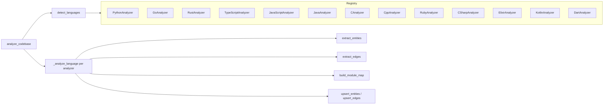

# Design Document: Additional Language Analyzers

## Overview

This spec adds four new `LanguageAnalyzer` implementations (C#, Elixir,
Kotlin, Dart) to the existing multi-language entity graph. Each analyzer
follows the established pattern: one file in `agent_fox/knowledge/lang/`,
implementing entity extraction, edge extraction, and module map building
using tree-sitter grammars. No protocol, database, or orchestration changes
are needed.

## Architecture

The architecture is unchanged from spec 102. New analyzers slot into the
existing pipeline:



### Module Responsibilities

1. `agent_fox/knowledge/lang/csharp_lang.py` — C# analyzer: entity/edge
   extraction from `.cs` files using `tree-sitter-c-sharp`.
2. `agent_fox/knowledge/lang/elixir_lang.py` — Elixir analyzer: entity/edge
   extraction from `.ex`/`.exs` files using `tree-sitter-elixir`.
3. `agent_fox/knowledge/lang/kotlin_lang.py` — Kotlin analyzer: entity/edge
   extraction from `.kt`/`.kts` files using `tree-sitter-kotlin`.
4. `agent_fox/knowledge/lang/dart_lang.py` — Dart analyzer: entity/edge
   extraction from `.dart` files using `tree-sitter-dart-orchard`.
5. `agent_fox/knowledge/lang/registry.py` — Updated to register all four new
   analyzers in `_build_default_registry()`.

## Execution Paths

### Path 1: Codebase analysis with new language files

1. `agent_fox/knowledge/static_analysis.py: analyze_codebase(repo_root, conn)`
   — entry point (unchanged)
2. `agent_fox/knowledge/lang/registry.py: detect_languages(repo_root)`
   -> `list[LanguageAnalyzer]` — discovers analyzers with matching files
3. `agent_fox/knowledge/lang/registry.py: get_default_registry()`
   -> `LanguageRegistry` — includes new analyzers if grammar installed
4. `agent_fox/knowledge/static_analysis.py: _analyze_language(repo_root, analyzer, ...)`
   — per-language extraction loop
5. `<new_lang>.py: build_module_map(repo_root, files)` -> `dict[str, str]`
6. `<new_lang>.py: make_parser()` -> `Parser`
7. `agent_fox/knowledge/static_analysis.py: _parse_file(file, parser)` -> `Tree | None`
8. `<new_lang>.py: extract_entities(tree, rel_path)` -> `list[Entity]`
9. `<new_lang>.py: extract_edges(tree, rel_path, entities, module_map)`
   -> `list[EntityEdge]`
10. `agent_fox/knowledge/entities.py: upsert_entities(conn, entities, language=name)`
    — side effect: entities persisted to DuckDB

### Path 2: Registry handles missing grammar

1. `agent_fox/knowledge/lang/registry.py: _build_default_registry()`
   — constructs registry
2. `agent_fox/knowledge/lang/registry.py: _try_register(registry, AnalyzerClass, name)`
   — attempts instantiation + `make_parser()` probe
3. If `ImportError` raised by grammar import: log info, skip registration
4. Registry proceeds with remaining analyzers

## Components and Interfaces

### Analyzer Classes

Each new analyzer implements the `LanguageAnalyzer` protocol with the same
interface:

```python
class CSharpAnalyzer:
    @property
    def language_name(self) -> str: ...       # "csharp"
    @property
    def file_extensions(self) -> set[str]: ... # {".cs"}
    def make_parser(self) -> Parser: ...
    def extract_entities(self, tree, rel_path: str) -> list[Entity]: ...
    def extract_edges(self, tree, rel_path: str, entities: list[Entity],
                      module_map: dict[str, str]) -> list[EntityEdge]: ...
    def build_module_map(self, repo_root: Path,
                         files: list[Path]) -> dict[str, str]: ...
```

Same pattern for `ElixirAnalyzer`, `KotlinAnalyzer`, `DartAnalyzer`.

### Entity Type Mappings

| Language | FILE | MODULE | CLASS | FUNCTION |
|----------|------|--------|-------|----------|
| C# | filename | `namespace` | `class`, `struct`, `interface`, `enum`, `record` | methods (qualified) |
| Elixir | filename | `defmodule` | (none) | `def`, `defp` (qualified) |
| Kotlin | filename | `package` | `class`, `interface`, `object`, `enum class`, `data class` | `fun` (qualified) |
| Dart | filename | `library` (explicit only) | `class`, `mixin`, `enum`, `extension` | functions/methods (qualified) |

### Edge Type Mappings

| Language | CONTAINS | IMPORTS | EXTENDS |
|----------|----------|---------|---------|
| C# | file->ns, ns->class, class->method | `using` directives | `:` clause (base class, interfaces) |
| Elixir | file->module, module->function | `use`, `import`, `alias`, `require` | (none) |
| Kotlin | file->class, class->method, file->fun | `import` statements | `:` clause (superclass, interfaces) |
| Dart | file->class, class->method, file->fun | `import` statements | `extends`, `implements`, `with` |

### Tree-Sitter Node Type Mappings

#### C# (`tree_sitter_c_sharp`)

| Entity/Edge | Tree-sitter node types |
|-------------|----------------------|
| MODULE | `namespace_declaration` |
| CLASS | `class_declaration`, `struct_declaration`, `interface_declaration`, `enum_declaration`, `record_declaration` |
| FUNCTION | `method_declaration`, `constructor_declaration` |
| IMPORTS | `using_directive` |
| EXTENDS | `base_list` |

#### Elixir (`tree_sitter_elixir`)

| Entity/Edge | Tree-sitter node types |
|-------------|----------------------|
| MODULE | `call` node with `defmodule` identifier |
| FUNCTION | `call` node with `def` or `defp` identifier |
| IMPORTS | `call` node with `use`, `import`, `alias`, or `require` identifier |

Note: Elixir tree-sitter represents keywords as function calls. `defmodule`,
`def`, `defp`, `use`, `import`, `alias`, and `require` are all `call` nodes
whose function name is the keyword.

#### Kotlin (`tree_sitter_kotlin`)

| Entity/Edge | Tree-sitter node types |
|-------------|----------------------|
| MODULE | `package_header` |
| CLASS | `class_declaration`, `object_declaration` (covers `interface`, `enum class`, `data class` via modifiers) |
| FUNCTION | `function_declaration` |
| IMPORTS | `import_header` |
| EXTENDS | `delegation_specifier` within class declaration |

#### Dart (`tree_sitter_dart` via `tree-sitter-dart-orchard`)

| Entity/Edge | Tree-sitter node types |
|-------------|----------------------|
| MODULE | `library_name` |
| CLASS | `class_definition`, `mixin_declaration`, `enum_declaration`, `extension_declaration` |
| FUNCTION | `function_signature` + body, `method_signature` + body |
| IMPORTS | `import_or_export` with `import` keyword |
| EXTENDS | `superclass`, `interfaces`, `mixins` |

## Data Models

No new data models. All analyzers produce `Entity` and `EntityEdge` instances
using the existing types from `agent_fox/knowledge/entities.py`.

## Operational Readiness

- **Observability:** Entity counts per language are already logged by
  `analyze_codebase()`. The `languages_analyzed` tuple in `AnalysisResult`
  will automatically include new language names.
- **Rollout:** New analyzers are additive. They activate only when matching
  files are detected. No migration needed.
- **Rollback:** Remove grammar packages from `pyproject.toml` and the
  `_try_register` calls from `registry.py`. Analyzers deactivate via
  `ImportError` handling.

## Correctness Properties

### Property 1: Protocol Conformance

*For any* analyzer in {CSharpAnalyzer, ElixirAnalyzer, KotlinAnalyzer,
DartAnalyzer}, the analyzer SHALL satisfy `isinstance(analyzer, LanguageAnalyzer)`
at runtime and expose non-empty `language_name` and `file_extensions`.

**Validates: Requirements 1.1, 2.1, 3.1, 4.1**

### Property 2: Entity Validity

*For any* valid source file in {C#, Elixir, Kotlin, Dart}, `extract_entities()`
SHALL return a list where every entity has a non-empty `entity_name`, a valid
`EntityType`, and a non-empty `entity_path` equal to the provided `rel_path`.

**Validates: Requirements 1.3, 2.3, 3.3, 4.3**

### Property 3: Edge Referential Integrity

*For any* edges returned by `extract_edges()`, each `source_id` SHALL be an
entity ID from the provided entities list, and each `target_id` SHALL be either
an entity ID or a well-formed sentinel string matching `path:*` or `class:*`.

**Validates: Requirements 1.4, 2.5, 3.4, 4.4**

### Property 4: Extension Uniqueness

*For any* two analyzers registered in the default registry, their
`file_extensions` sets SHALL be disjoint.

**Validates: Requirement 5.2**

### Property 5: Graceful Grammar Absence

*For any* analyzer whose tree-sitter grammar package is not installed,
`make_parser()` SHALL raise `ImportError`, and the default registry SHALL
not contain that analyzer.

**Validates: Requirements 5.3, 5.E1**

### Property 6: Module Map Path Format

*For any* analyzer and any set of input files, `build_module_map()` SHALL
return a dict whose values are all non-empty strings containing no backslash
characters and no leading `/`.

**Validates: Requirements 1.5, 2.6, 3.5, 4.5**

### Property 7: Elixir No-Class Invariant

*For any* Elixir source file, `extract_entities()` SHALL never return an
entity with `entity_type == EntityType.CLASS`, and `extract_edges()` SHALL
never return an edge with `relationship == EdgeType.EXTENDS`.

**Validates: Requirement 2.4**

## Error Handling

| Error Condition | Behavior | Requirement |
|----------------|----------|-------------|
| Grammar package not installed | Skip registration, log info | 107-REQ-5.3 |
| Import references external dependency | Skip silently | 107-REQ-1.E1, 2.E2, 3.E2, 4.E1 |
| File fails to parse (tree-sitter error) | Return partial entities from parseable portions | (inherits from 102-REQ-2.E1) |
| Multiple namespaces in C# file | Create separate MODULE entities | 107-REQ-1.E2 |
| Nested defmodule in Elixir | Create MODULE with fully-qualified name | 107-REQ-2.E1 |
| Dart file without library directive | No MODULE entity created | 107-REQ-4.E2 |

## Technology Stack

- **tree-sitter-c-sharp** >= 0.23 — C# grammar for tree-sitter
- **tree-sitter-elixir** >= 0.3.4 — Elixir grammar for tree-sitter
- **tree-sitter-kotlin** >= 1.0 — Kotlin grammar for tree-sitter
- **tree-sitter-dart-orchard** >= 0.3.1 — Dart grammar (community fork)
- **tree-sitter** >= 0.23 — Core tree-sitter Python bindings (existing)

## Definition of Done

A task group is complete when ALL of the following are true:

1. All subtasks within the group are checked off (`[x]`)
2. All spec tests (`test_spec.md` entries) for the task group pass
3. All property tests for the task group pass
4. All previously passing tests still pass (no regressions)
5. No linter warnings or errors introduced
6. Code is committed on a feature branch and merged into `develop`
7. Feature branch is merged back to `develop`
8. `tasks.md` checkboxes are updated to reflect completion

## Testing Strategy

- **Unit tests:** One test class per language in
  `tests/unit/knowledge/test_lang_analyzers.py` following the existing
  pattern (test properties, entity extraction, edge extraction, module map).
- **Property tests:** Add strategies to
  `tests/property/knowledge/test_multilang_props.py` for C#, Kotlin, and
  Dart (entity validity, edge referential integrity). Elixir entity validity
  tested separately (no CLASS entities).
- **Integration smoke test:** Call `analyze_codebase()` on a temp directory
  containing files from all four new languages and verify
  `languages_analyzed` includes them.
