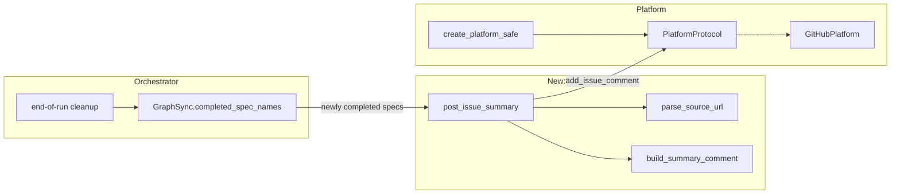

# Design Document: Issue Session Summary

## Overview

This spec adds a post-completion hook to the orchestrator that posts a
roll-up summary comment to the originating GitHub issue when all task
groups of a spec are fully implemented. The implementation consists of
three new components — a source URL parser, a summary builder, and a
platform wiring path — plus minimal changes to the orchestrator's
end-of-run cleanup and infrastructure setup.

## Architecture



### Module Responsibilities

1. `agent_fox/engine/issue_summary.py` — New module containing source URL
   parsing, summary comment construction, and the top-level
   `post_issue_summaries()` function that ties them together.
2. `agent_fox/engine/engine.py` — Modified to call `post_issue_summaries()`
   during end-of-run cleanup and to accept an optional `platform` parameter.
3. `agent_fox/engine/run.py` — Modified to create a platform instance
   (if configured) and pass it to the orchestrator.
4. `agent_fox/nightshift/platform_factory.py` — New function
   `create_platform_safe()` that returns `None` instead of `sys.exit(1)`
   when the platform is not configured.

## Execution Paths

### Path 1: Spec completes with a GitHub source URL

1. `agent_fox/engine/engine.py: Orchestrator.run()` — main dispatch loop
   finishes (all tasks dispatched)
2. `agent_fox/engine/engine.py: Orchestrator.run()` (finally block) —
   enters end-of-run cleanup
3. `agent_fox/engine/graph_sync.py: GraphSync.completed_spec_names()`
   -> `set[str]` — returns all fully-completed spec names
4. `agent_fox/engine/issue_summary.py: post_issue_summaries(platform,
   specs_dir, completed_specs, already_posted)` — iterates newly completed
   specs
5. `agent_fox/engine/issue_summary.py: parse_source_url(prd_path)`
   -> `SourceIssue | None` — reads `prd.md`, extracts issue URL
6. `agent_fox/engine/issue_summary.py: _get_develop_head(repo_root)`
   -> `str` — runs `git rev-parse develop`
7. `agent_fox/engine/issue_summary.py: build_summary_comment(spec_name,
   commit_sha, tasks_path)` -> `str` — constructs the comment body
8. `agent_fox/platform/protocol.py: PlatformProtocol.add_issue_comment(
   issue_number, body)` — side effect: comment posted to GitHub

### Path 2: No platform configured

1. `agent_fox/engine/run.py: _setup_infrastructure()` — calls
   `create_platform_safe(config, project_root)`
2. `agent_fox/nightshift/platform_factory.py: create_platform_safe()`
   -> `None` — platform type is `"none"` or `GITHUB_PAT` missing
3. `agent_fox/engine/run.py: _setup_infrastructure()` — passes
   `platform=None` to orchestrator kwargs
4. `agent_fox/engine/engine.py: Orchestrator.run()` (finally block) —
   skips `post_issue_summaries()` because `self._platform is None`

### Path 3: Source URL is not a valid issue URL

1. `agent_fox/engine/issue_summary.py: post_issue_summaries()` — iterates
   newly completed spec
2. `agent_fox/engine/issue_summary.py: parse_source_url(prd_path)`
   -> `None` — source line is a file path or user prompt, not an issue URL
3. `agent_fox/engine/issue_summary.py: post_issue_summaries()` — skips
   this spec, continues to next

### Path 4: Comment posting fails

1. `agent_fox/engine/issue_summary.py: post_issue_summaries()` — calls
   `platform.add_issue_comment()`
2. `add_issue_comment()` raises an exception (network error, auth failure)
3. `agent_fox/engine/issue_summary.py: post_issue_summaries()` — catches
   the exception, logs warning, continues to next spec

## Components and Interfaces

### Source URL Parser

```python
@dataclass(frozen=True)
class SourceIssue:
    """Parsed issue reference from a prd.md Source section."""
    forge: str          # "github" (extensible to "gitlab", "linear", etc.)
    owner: str          # e.g., "agent-fox-dev"
    repo: str           # e.g., "agent-fox"
    issue_number: int   # e.g., 359

def parse_source_url(prd_path: Path) -> SourceIssue | None:
    """Extract the issue URL from prd.md's ## Source section.

    Returns None if:
    - prd.md does not exist
    - ## Source section is missing
    - Source line does not contain a recognized issue URL
    """
```

The parser reads `prd.md` line by line, looks for `## Source`, then
extracts the URL from the `Source: <url>` line. The URL is matched
against known forge patterns:

| Forge | Pattern | Captures |
|-------|---------|----------|
| GitHub | `https://github.com/{owner}/{repo}/issues/{number}` | owner, repo, number |

Future forge patterns (GitLab, Linear) can be added to the same function
by appending to a list of `(regex, forge_name)` tuples.

### Summary Comment Builder

```python
def build_summary_comment(
    spec_name: str,
    commit_sha: str,
    tasks_path: Path,
) -> str:
    """Construct the Markdown comment body for the issue."""
```

The comment follows this template:

```markdown
## Spec Implemented

Spec `{spec_name}` has been fully implemented and merged to `develop`.

**Commit:** `{commit_sha}`

### Task Groups

- {group_1_title}
- {group_2_title}
- ...

---
*Auto-generated by agent-fox.*
```

Task group titles are extracted from `tasks.md` using `parse_tasks()`.

### Top-Level Posting Function

```python
async def post_issue_summaries(
    platform: PlatformProtocol,
    specs_dir: Path,
    completed_specs: set[str],
    already_posted: set[str],
    repo_root: Path,
) -> set[str]:
    """Post summary comments for newly completed specs.

    Returns the set of spec names that were successfully posted,
    so the caller can update its tracking set.
    """
```

### Safe Platform Factory

```python
def create_platform_safe(
    config: object,
    project_root: Path,
) -> GitHubPlatform | None:
    """Create a platform instance, returning None if not configured.

    Unlike create_platform(), does not call sys.exit() on missing
    config or credentials.
    """
```

### Orchestrator Changes

The `Orchestrator.__init__()` receives a new optional parameter:

```python
def __init__(
    self,
    config: OrchestratorConfig,
    ...
    platform: PlatformProtocol | None = None,  # NEW
) -> None:
```

In the `finally` block of `run()`, after existing cleanup (audit report
cleanup, consolidation, memory rendering):

```python
# 108-REQ-4.2: Post issue summaries for completed specs
if self._platform is not None and self._graph_sync is not None:
    try:
        completed = self._graph_sync.completed_spec_names()
        newly_completed = completed - self._issue_summaries_posted
        if newly_completed:
            posted = await post_issue_summaries(
                self._platform,
                self._specs_dir or Path(".specs"),
                newly_completed,
                self._issue_summaries_posted,
                Path.cwd(),
            )
            self._issue_summaries_posted.update(posted)
    except Exception:
        logger.warning("Issue summary posting failed", exc_info=True)
```

## Data Models

### SourceIssue

```python
@dataclass(frozen=True)
class SourceIssue:
    forge: str          # "github"
    owner: str          # "agent-fox-dev"
    repo: str           # "agent-fox"
    issue_number: int   # 359
```

No database changes. No new configuration fields. The `SourceIssue`
dataclass is internal to the `issue_summary` module.

## Operational Readiness

- **Observability:** Successful posts are logged at INFO level. Failures
  are logged at WARNING. The `already_posted` set prevents duplicate
  comments across multiple runs (within the same process).
- **Rollout:** The feature activates only when a platform is configured
  and specs have source URLs. No migration needed.
- **Rollback:** Remove the `post_issue_summaries()` call from the
  orchestrator's `finally` block. The platform wiring can remain.

## Correctness Properties

### Property 1: Source URL Purity

*For any* file path, `parse_source_url()` SHALL be a pure function that
either returns a valid `SourceIssue` or `None`, and SHALL never raise an
exception.

**Validates: Requirements 1.1, 1.E1, 1.E2, 1.E3**

### Property 2: No Duplicate Summaries

*For any* spec name, `post_issue_summaries()` SHALL post at most one
comment per spec per orchestrator run. Specs in the `already_posted` set
SHALL be skipped.

**Validates: Requirement 2.E1**

### Property 3: Graceful Platform Absence

*For any* orchestrator run where `platform` is `None`, the system SHALL
not attempt any issue comment operations and SHALL not log any warnings
related to issue summaries.

**Validates: Requirement 5.E1**

### Property 4: Comment Structure

*For any* summary comment produced by `build_summary_comment()`, the
comment SHALL contain the spec name, the commit SHA, and the footer line
`*Auto-generated by agent-fox.*`.

**Validates: Requirements 3.1, 3.2, 3.4**

### Property 5: Failure Isolation

*For any* exception raised by `add_issue_comment()`, the orchestrator
run SHALL still complete normally (run status is not affected).

**Validates: Requirement 4.E1**

## Error Handling

| Error Condition | Behavior | Requirement |
|----------------|----------|-------------|
| `prd.md` missing | Return `None` from parser | 108-REQ-1.E3 |
| `## Source` section missing | Return `None` from parser | 108-REQ-1.E1 |
| Source is not a URL | Return `None` from parser | 108-REQ-1.E2 |
| Platform not configured | Skip silently | 108-REQ-5.E1 |
| `add_issue_comment()` fails | Log warning, continue | 108-REQ-4.E1 |
| `git rev-parse` fails | Use `"unknown"` as SHA | 108-REQ-6.E1 |
| Forge type mismatch | Log info, skip posting | 108-REQ-4.E2 |

## Technology Stack

No new dependencies. Uses existing:
- `agent_fox/platform/protocol.py` — `PlatformProtocol`
- `agent_fox/platform/github.py` — `GitHubPlatform`
- `agent_fox/nightshift/platform_factory.py` — platform factory
- `agent_fox/spec/parser.py` — `parse_tasks()`
- `agent_fox/engine/graph_sync.py` — `completed_spec_names()`

## Definition of Done

A task group is complete when ALL of the following are true:

1. All subtasks within the group are checked off (`[x]`)
2. All spec tests for the task group pass
3. All previously passing tests still pass (no regressions)
4. No linter warnings or errors introduced
5. Code is committed on a feature branch and merged into `develop`
6. `tasks.md` checkboxes are updated to reflect completion

## Testing Strategy

- **Unit tests:** Test `parse_source_url()`, `build_summary_comment()`,
  and `post_issue_summaries()` in
  `tests/unit/engine/test_issue_summary.py`. Mock `PlatformProtocol` for
  comment posting tests.
- **Unit tests:** Test `create_platform_safe()` in
  `tests/unit/nightshift/test_platform_factory.py`.
- **Integration test:** Test the full flow from orchestrator end-of-run
  through to comment posting with a mock platform in
  `tests/integration/engine/test_issue_summary_smoke.py`.
