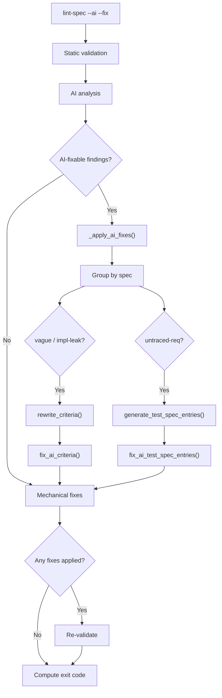

# Design Document: AI Fix Pipeline Wiring

## Overview

This spec wires two existing but disconnected AI-powered fix capabilities
into the `lint-spec --ai --fix` pipeline. No new AI functions or fixers are
created; the scope is limited to dispatch logic in `agent_fox/spec/lint.py`.

## Architecture



### Module Responsibilities

1. **`agent_fox.spec.lint`** -- Extended with `_apply_ai_fixes()` (sync
   wrapper) and `_apply_ai_fixes_async()` (async inner). Dispatches
   AI-fixable findings to the correct generator+fixer pair. Contains batch
   limit constants.
2. **`agent_fox.spec.ai_validation`** -- Unchanged. Provides
   `rewrite_criteria()` and `generate_test_spec_entries()`.
3. **`agent_fox.spec.fixers.ai`** -- Unchanged. Provides
   `fix_ai_criteria()` and `fix_ai_test_spec_entries()`.
4. **`agent_fox.spec.fixers.types`** -- Unchanged. Provides
   `AI_FIXABLE_RULES`, `_REQ_ID_IN_MESSAGE`, `FixResult`.

## Execution Paths

### Path 1: AI criteria rewrite via lint-spec --ai --fix

1. `cli/lint_specs.py: lint_specs_cmd` -- CLI entry point, passes `ai=True, fix=True`
2. `spec/lint.py: run_lint_specs(ai=True, fix=True)` -- orchestration
3. `spec/validators/runner.py: validate_specs()` -> `list[Finding]` -- static validation
4. `spec/lint.py: _merge_ai_findings()` -> `list[Finding]` -- adds vague-criterion / implementation-leak findings
5. `spec/lint.py: _apply_ai_fixes(findings, discovered, specs_dir)` -> `list[FixResult]` -- NEW dispatch
6. `spec/ai_validation.py: rewrite_criteria(spec_name, req_text, findings, model)` -> `dict[str, str]` -- existing AI generator
7. `spec/fixers/ai.py: fix_ai_criteria(spec_name, req_path, rewrites, findings_map)` -> `list[FixResult]` -- side effect: requirements.md rewritten on disk

### Path 2: AI test spec generation via lint-spec --ai --fix

1. `cli/lint_specs.py: lint_specs_cmd` -- CLI entry point, passes `ai=True, fix=True`
2. `spec/lint.py: run_lint_specs(ai=True, fix=True)` -- orchestration
3. `spec/validators/runner.py: validate_specs()` -> `list[Finding]` -- static validation (produces untraced-requirement findings)
4. `spec/lint.py: _apply_ai_fixes(findings, discovered, specs_dir)` -> `list[FixResult]` -- NEW dispatch
5. `spec/ai_validation.py: generate_test_spec_entries(spec_name, req_text, ts_text, ids, model)` -> `dict[str, str]` -- existing AI generator
6. `spec/fixers/ai.py: fix_ai_test_spec_entries(spec_name, ts_path, entries)` -> `list[FixResult]` -- side effect: test_spec.md entries inserted on disk

## Components and Interfaces

### New: AI Fix Dispatch Helper

```python
# agent_fox/spec/lint.py

_MAX_REWRITE_BATCH = 20   # Max criteria per rewrite_criteria() call
_MAX_UNTRACED_BATCH = 20  # Max requirement IDs per generate_test_spec_entries() call


async def _apply_ai_fixes_async(
    findings: list[Finding],
    discovered: list[SpecInfo],
    specs_dir: Path,
    model: str,
) -> list[FixResult]:
    """Dispatch AI-fixable findings to the correct generator+fixer pair.

    For each spec:
    1. Criteria rewrites: vague-criterion / implementation-leak findings
       -> rewrite_criteria() -> fix_ai_criteria()
    2. Test spec generation: untraced-requirement findings
       -> generate_test_spec_entries() -> fix_ai_test_spec_entries()

    Returns list of all FixResult objects produced.
    """


def _apply_ai_fixes(
    findings: list[Finding],
    discovered: list[SpecInfo],
    specs_dir: Path,
) -> list[FixResult]:
    """Synchronous wrapper for AI fix dispatch.

    Resolves the STANDARD model tier and delegates to
    _apply_ai_fixes_async() via asyncio.run().
    Returns empty list on any top-level failure.
    """
```

### Modified: run_lint_specs Integration Point

```python
# agent_fox/spec/lint.py -- modified section of run_lint_specs()

    all_fix_results: list = []
    if fix:
        # AI fixes first (requires --ai)
        if ai:
            ai_fix_results = _apply_ai_fixes(findings, discovered, specs_dir)
            all_fix_results.extend(ai_fix_results)

        # Mechanical fixes
        from agent_fox.spec.fixers import apply_fixes
        known_specs = _build_known_specs(discovered)
        fix_results = apply_fixes(findings, discovered, specs_dir, known_specs)
        all_fix_results.extend(fix_results)

        if all_fix_results:
            # Re-validate after fixes
            findings = validate_specs(specs_dir, discovered)
            if ai:
                findings = _merge_ai_findings(findings, discovered, specs_dir)
```

## Data Models

No new data models. The spec uses existing types:

- `Finding` from `agent_fox.spec.validators`
- `FixResult` from `agent_fox.spec.fixers.types`
- `SpecInfo` from `agent_fox.spec.discovery`
- `AI_FIXABLE_RULES` from `agent_fox.spec.fixers.types`
- `_REQ_ID_IN_MESSAGE` from `agent_fox.spec.fixers.types`

## Correctness Properties

### Property 1: AI Fix Isolation

*For any* invocation of `run_lint_specs` with `fix=True` and `ai=False`, zero
AI generator calls (`rewrite_criteria`, `generate_test_spec_entries`) SHALL be
made.

**Validates: Requirements 109-REQ-1.2**

### Property 2: Dispatch Correctness

*For any* list of findings containing rules from `AI_FIXABLE_RULES`, the
dispatch function SHALL route `vague-criterion` and `implementation-leak`
findings to `rewrite_criteria()` and `untraced-requirement` findings to
`generate_test_spec_entries()`, never crossing the dispatch boundary.

**Validates: Requirements 109-REQ-2.1, 109-REQ-3.1**

### Property 3: Ordering Invariant

*For any* spec with both criteria rewrite findings and untraced-requirement
findings, the rewrite operation SHALL complete (including file write) before
test spec generation begins for that spec.

**Validates: Requirements 109-REQ-4.1**

### Property 4: Batch Size Bound

*For any* set of N criteria findings for a single spec, the system SHALL make
at most `ceil(N / _MAX_REWRITE_BATCH)` calls to `rewrite_criteria()`. The
same bound applies to `generate_test_spec_entries()` with
`_MAX_UNTRACED_BATCH`.

**Validates: Requirements 109-REQ-2.3, 109-REQ-3.2**

### Property 5: Per-Spec Error Isolation

*For any* AI generator failure affecting one spec, all other specs' AI fixes
SHALL still be attempted and their results returned.

**Validates: Requirements 109-REQ-2.E1, 109-REQ-3.E1**

### Property 6: Single-Pass Fix Guarantee

*For any* AI fix invocation, the system SHALL perform exactly one pass of
AI fixes followed by at most one re-validation. The re-validation SHALL NOT
trigger another AI fix pass.

**Validates: Requirements 109-REQ-5.1, 109-REQ-5.2**

## Error Handling

| Error Condition | Behavior | Requirement |
|----------------|----------|-------------|
| `rewrite_criteria()` raises exception | Log warning, skip spec, continue others | 109-REQ-2.E1 |
| `rewrite_criteria()` returns empty dict | Skip `fix_ai_criteria()` for that batch | 109-REQ-2.E2 |
| `generate_test_spec_entries()` raises exception | Log warning, skip spec, continue others | 109-REQ-3.E1 |
| `generate_test_spec_entries()` returns empty dict | Skip `fix_ai_test_spec_entries()` for that batch | 109-REQ-3.E2 |
| Spec has requirements.md but no test_spec.md | Skip test spec generation for that spec | 109-REQ-3.E3 |
| No AI_FIXABLE_RULES findings | Return empty list, no AI calls | 109-REQ-1.E1 |
| Re-validation still flags rewritten criterion | Report as remaining finding, no re-fix | 109-REQ-5.E1 |
| `_apply_ai_fixes()` top-level failure | Log warning, return empty list | (defensive) |

## Technology Stack

- Python 3.12+
- `asyncio.run()` for async boundary (same pattern as `_merge_ai_findings()`)
- Existing `agent_fox.core.models.resolve_model` for STANDARD tier
- Existing `_REQ_ID_IN_MESSAGE` regex for requirement ID extraction
- No new dependencies

## Operational Readiness

- **Observability:** AI fix dispatch is logged at INFO level (spec name, rule
  count). Failures logged at WARNING. Individual fix results carry rule and
  description for summary output.
- **Cost control:** Batch limits (`_MAX_REWRITE_BATCH`, `_MAX_UNTRACED_BATCH`)
  cap prompt size. Per-spec grouping ensures at most one rewrite call and one
  generation call per spec per batch.
- **Rollback:** Since fixes modify spec files on disk, users can revert with
  `git checkout` if results are unsatisfactory.

## Definition of Done

A task group is complete when ALL of the following are true:

1. All subtasks within the group are checked off (`[x]`)
2. All spec tests (`test_spec.md` entries) for the task group pass
3. All property tests for the task group pass
4. All previously passing tests still pass (no regressions)
5. No linter warnings or errors introduced
6. Code is committed on a feature branch and merged into `develop`
7. Feature branch is merged back to `develop`
8. `tasks.md` checkboxes are updated to reflect completion

## Testing Strategy

- **Unit tests:** Mock `rewrite_criteria()`, `generate_test_spec_entries()`,
  `fix_ai_criteria()`, and `fix_ai_test_spec_entries()` to test dispatch
  logic, ordering, batching, error handling, and findings_map construction
  in isolation.
- **Property tests:** Use Hypothesis to generate varied finding lists and
  verify dispatch correctness, batch bounds, and error isolation invariants.
- **Integration smoke tests:** Test the full `run_lint_specs(ai=True,
  fix=True)` flow with mocked AI responses to verify end-to-end wiring
  from CLI flags through to file modifications.
