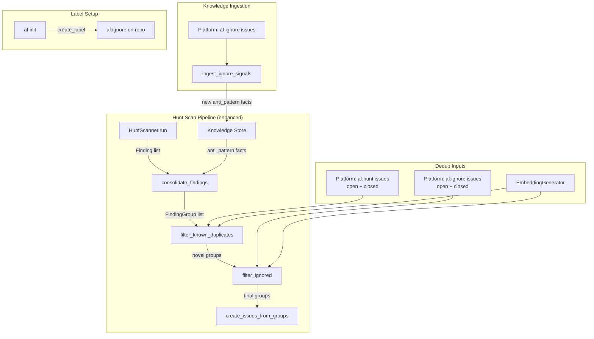

# Design Document: Hunt Scan Duplicate Detection and `af:ignore` Label

## Overview

Extends the night-shift hunt scan dedup pipeline with embedding-based semantic
similarity matching and a new `af:ignore` label for user-driven false-positive
suppression. The system uses the existing local `EmbeddingGenerator`
(sentence-transformers, `all-MiniLM-L6-v2`) to compute vector embeddings and
cosine similarity, and integrates with the knowledge store to persist
false-positive patterns as `anti_pattern` facts for long-term learning.

## Architecture



### Module Responsibilities

1. **`platform/labels.py`** — defines `LABEL_IGNORE` constant, color, and
   `LabelSpec` entry in `REQUIRED_LABELS`.
2. **`nightshift/dedup.py`** — fingerprint and embedding-based dedup for
   `af:hunt` issues; cosine similarity helper; text representation builders.
3. **`nightshift/ignore_filter.py`** (new) — `filter_ignored()` function
   for `af:ignore` suppression using embedding similarity.
4. **`nightshift/ignore_ingest.py`** (new) — `ingest_ignore_signals()`
   function for knowledge store ingestion of `af:ignore` issues.
5. **`nightshift/engine.py`** — wires the enhanced pipeline: ingestion
   pre-phase, critic with false positives, dedup with similarity, ignore
   filter.
6. **`nightshift/critic.py`** — accepts `false_positives` parameter, appends
   to system prompt.
7. **`core/config.py`** — adds `similarity_threshold` field to
   `NightShiftConfig`.

## Execution Paths

### Path 1: Hunt scan with enhanced dedup

1. `cli/nightshift.py: night_shift_cmd` — starts engine
2. `nightshift/engine.py: NightShiftEngine._run_hunt_scan` — orchestrates scan
3. `nightshift/engine.py: NightShiftEngine._run_hunt_scan` — calls `ingest_ignore_signals()` pre-phase
4. `nightshift/ignore_ingest.py: ingest_ignore_signals(platform, knowledge_conn)` → `int` (count)
5. `nightshift/engine.py: NightShiftEngine._run_hunt_scan` — queries knowledge store for `anti_pattern` facts → `list[str]`
6. `nightshift/engine.py: NightShiftEngine._run_hunt_scan_inner` — calls scanner
7. `nightshift/hunt.py: HuntScanner.run(project_root)` → `list[Finding]`
8. `nightshift/critic.py: consolidate_findings(findings, false_positives=fps)` → `list[FindingGroup]`
9. `nightshift/dedup.py: filter_known_duplicates(groups, platform, similarity_threshold=t)` → `list[FindingGroup]`
10. `nightshift/ignore_filter.py: filter_ignored(groups, platform, similarity_threshold=t)` → `list[FindingGroup]`
11. `nightshift/finding.py: create_issues_from_groups(groups, platform)` → `list[IssueResult]`
12. `platform/github.py: GitHubPlatform.create_issue` — side effect: issue created on GitHub

### Path 2: `af:ignore` knowledge ingestion

1. `nightshift/engine.py: NightShiftEngine._run_hunt_scan` — calls pre-phase
2. `nightshift/ignore_ingest.py: ingest_ignore_signals(platform, knowledge_conn, embedder)` → `int`
3. `platform/github.py: GitHubPlatform.list_issues_by_label("af:ignore", state="all")` → `list[IssueResult]`
4. `nightshift/ignore_ingest.py: _is_ingested(issue)` → `bool` (checks for marker)
5. `nightshift/ignore_ingest.py: _build_fact_from_issue(issue)` → `Fact`
6. `knowledge/git_mining.py: _write_fact(conn, fact, embedder)` — side effect: fact stored in DuckDB
7. `platform/github.py: GitHubPlatform.update_issue(number, body)` — side effect: marker appended

### Path 3: AI critic with false-positive awareness

1. `nightshift/engine.py: NightShiftEngine._run_hunt_scan` — queries knowledge store
2. `knowledge/search.py: VectorSearch` or direct DuckDB query — `anti_pattern` facts with spec_name `"nightshift:ignore"` → `list[str]`
3. `nightshift/critic.py: consolidate_findings(findings, false_positives=fps)` — appends to system prompt
4. `nightshift/critic.py: _run_critic(findings)` — AI call with enhanced prompt → response text
5. `nightshift/critic.py: _parse_critic_response(response, findings)` → `list[FindingGroup]`

## Components and Interfaces

### CLI Commands

No new CLI commands. Existing `agent-fox night-shift` and `agent-fox init`
are enhanced.

### Core Data Types

```python
# platform/labels.py — new constants
LABEL_IGNORE: str = "af:ignore"
LABEL_IGNORE_COLOR: str = "999999"  # gray

# core/config.py — new field on NightShiftConfig
similarity_threshold: float = 0.85  # clamped [0.0, 1.0]
```

### Module Interfaces

```python
# nightshift/dedup.py — enhanced signature
async def filter_known_duplicates(
    groups: list[FindingGroup],
    platform: PlatformProtocol,
    *,
    similarity_threshold: float = 0.85,
    embedder: EmbeddingGenerator | None = None,
) -> list[FindingGroup]: ...

# nightshift/dedup.py — new helpers
def cosine_similarity(a: list[float], b: list[float]) -> float: ...
def build_finding_group_text(group: FindingGroup) -> str: ...
def build_issue_text(issue: IssueResult) -> str: ...

# nightshift/ignore_filter.py — new module
async def filter_ignored(
    groups: list[FindingGroup],
    platform: PlatformProtocol,
    *,
    similarity_threshold: float = 0.85,
    embedder: EmbeddingGenerator | None = None,
) -> list[FindingGroup]: ...

# nightshift/ignore_ingest.py — new module
async def ingest_ignore_signals(
    platform: PlatformProtocol,
    conn: duckdb.DuckDBPyConnection,
    embedder: EmbeddingGenerator,
    *,
    sink: SinkDispatcher | None = None,
    run_id: str = "",
) -> int: ...

# nightshift/critic.py — enhanced signature
async def consolidate_findings(
    findings: list[Finding],
    *,
    false_positives: list[str] | None = None,
    sink: SinkDispatcher | None = None,
    run_id: str = "",
) -> list[FindingGroup]: ...
```

## Data Models

### Text Representations for Embedding

**FindingGroup text:**
```
{category}: {title}
Files: {file1}, {file2}, ...
```

**Issue text:**
```
{title}
{body[:500]}
```

### Knowledge Ingestion Marker

Appended to issue body as:
```html
<!-- af:knowledge-ingested -->
```

Detected via regex: `r"<!-- af:knowledge-ingested -->"`

### Anti-pattern Fact Schema

```python
Fact(
    id=uuid4(),
    content="Hunt false positive: {issue_title}. Category: {category}. "
            "Files: {affected_files}. User marked as af:ignore.",
    category="anti_pattern",
    spec_name="nightshift:ignore",
    keywords=[...],  # extracted from issue title
    confidence=0.9,
    created_at=datetime.now(UTC).isoformat(),
    session_id=None,
    commit_sha=None,
)
```

### Configuration Extension

```toml
[night_shift]
# Cosine similarity threshold for duplicate/ignore detection (0.0 to 1.0)
# Higher values = stricter matching (fewer suppressed findings)
# Lower values = looser matching (more aggressive dedup)
similarity_threshold = 0.85
```

## Operational Readiness

### Observability

- **INFO log** on every group skipped by embedding similarity (with score and
  matching issue number)
- **INFO log** on every `af:ignore` issue ingested into knowledge store
- **WARNING log** on embedding computation failure (with fallback to
  fingerprint-only)
- **WARNING log** on platform API failure (with fail-open behaviour)
- Existing audit events (`HUNT_SCAN_COMPLETE`) continue to fire

### Rollout

- The feature is backwards-compatible: the `af:ignore` label is only active
  if created on the repo (via `af init`), and the similarity threshold
  defaults to 0.85 which is conservative.
- Users can disable similarity matching by setting
  `similarity_threshold = 1.0`.
- No migration needed: existing issues without embeddings are handled
  gracefully (fail-open).

## Correctness Properties

### Property 1: Fingerprint Superset

*For any* set of FindingGroups passed to `filter_known_duplicates()`, the
enhanced function SHALL return a subset that is equal to or smaller than
the subset returned by fingerprint-only matching.

**Validates: Requirements 3.2, 3.3**

### Property 2: Cosine Similarity Symmetry

*For any* two non-None embedding vectors `a` and `b`,
`cosine_similarity(a, b)` SHALL equal `cosine_similarity(b, a)`.

**Validates: Requirements 2.4**

### Property 3: Cosine Similarity Bounds

*For any* two non-None, non-zero embedding vectors `a` and `b`,
`cosine_similarity(a, b)` SHALL return a value in `[-1.0, 1.0]`.

**Validates: Requirements 2.4**

### Property 4: Cosine Similarity Null Safety

*For any* input where either vector is `None` or zero-length,
`cosine_similarity(a, b)` SHALL return `0.0`.

**Validates: Requirements 2.4, 2.E1**

### Property 5: Ignore Filter Independence

*For any* set of FindingGroups, `filter_ignored()` SHALL not modify groups
that have no semantic match to any `af:ignore` issue (similarity below
threshold).

**Validates: Requirements 4.1, 4.3**

### Property 6: Ingestion Idempotency

*For any* `af:ignore` issue, calling `ingest_ignore_signals()` twice SHALL
produce exactly one fact in the knowledge store (the second call detects
the marker and skips).

**Validates: Requirements 5.1, 5.3, 5.E1**

### Property 7: Threshold Monotonicity

*For any* set of FindingGroups and fixed set of existing issues, increasing
the `similarity_threshold` SHALL result in an equal or larger set of novel
groups returned (fewer suppressed).

**Validates: Requirements 7.1, 7.E1, 7.E2**

### Property 8: Fail-Open Guarantee

*For any* failure in embedding computation or platform API calls, the filter
functions SHALL return all input groups unmodified (no data loss).

**Validates: Requirements 3.E1, 3.E2, 4.E2, 4.E3**

### Property 9: Critic Prompt Stability

*For any* empty or None `false_positives` input, `consolidate_findings()`
SHALL produce identical output to the current implementation (no prompt
modification).

**Validates: Requirements 6.E2**

## Error Handling

| Error Condition | Behavior | Requirement |
|----------------|----------|-------------|
| EmbeddingGenerator fails to load | Fall back to fingerprint-only matching | 110-REQ-2.E2 |
| `embed_text()` returns None | Treat similarity as 0.0 | 110-REQ-2.E1 |
| Platform API failure (list issues) | Return all groups unfiltered | 110-REQ-3.E2 |
| Embedding computation failure | Fall back to fingerprint-only | 110-REQ-3.E1 |
| No `af:ignore` issues exist | Return all groups unfiltered | 110-REQ-4.E1 |
| Platform API failure (af:ignore) | Return all groups unfiltered | 110-REQ-4.E2 |
| Embedding failure for af:ignore | Return all groups unfiltered | 110-REQ-4.E3 |
| Knowledge store unavailable | Skip ingestion, log warning | 110-REQ-5.E3 |
| Issue body update fails | Log warning, continue | 110-REQ-5.E2 |
| Knowledge store query fails | Empty false_positives list | 110-REQ-6.E1 |
| false_positives is empty/None | No prompt modification | 110-REQ-6.E2 |

## Technology Stack

- **Python 3.11+** — project language
- **sentence-transformers** — local embedding model (`all-MiniLM-L6-v2`,
  384 dimensions), already a project dependency
- **DuckDB** — knowledge store for anti_pattern facts, already a project
  dependency
- **httpx** — GitHub API calls (via existing `GitHubPlatform`), already a
  project dependency
- **math** (stdlib) — cosine similarity computation (dot product, sqrt)

## Definition of Done

A task group is complete when ALL of the following are true:

1. All subtasks within the group are checked off (`[x]`)
2. All spec tests (`test_spec.md` entries) for the task group pass
3. All property tests for the task group pass
4. All previously passing tests still pass (no regressions)
5. No linter warnings or errors introduced
6. Code is committed on a feature branch and merged into `develop`
7. Feature branch is merged back to `develop`
8. `tasks.md` checkboxes are updated to reflect completion

## Testing Strategy

- **Unit tests** for `cosine_similarity()`, text representation builders,
  ingestion marker detection/embedding, and label constants.
- **Property-based tests** (Hypothesis) for cosine similarity properties
  (symmetry, bounds, null safety), threshold monotonicity, and ingestion
  idempotency.
- **Integration tests** for the full dedup pipeline with mock platform and
  embedder, verifying that fingerprint + similarity + ignore filtering
  produce correct results end-to-end.
- **Smoke tests** for execution paths 1-3 with real components (except
  platform API, which is mocked).
