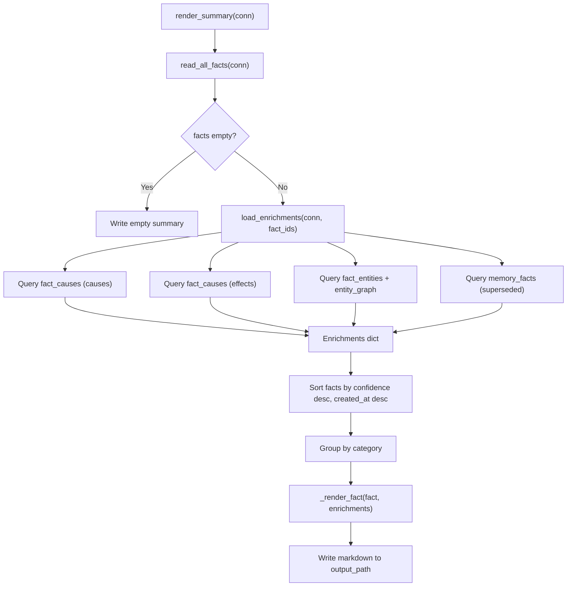

# Design Document: Rich Memory Rendering

## Overview

This spec enriches the `docs/memory.md` rendering with causal chains, entity
links, supersession history, and relative age metadata. All enrichment data
already exists in DuckDB tables. The implementation modifies only
`agent_fox/knowledge/rendering.py`, adding batch enrichment loading and an
updated per-fact renderer that emits indented sub-bullets.

## Architecture



### Module Responsibilities

1. **`agent_fox.knowledge.rendering`** -- Extended with `load_enrichments()`,
   `_format_relative_age()`, updated `_render_fact()`, and updated
   `render_summary()`. Contains enrichment limits as constants.
2. **`agent_fox.knowledge.store`** -- Unchanged. Provides `read_all_facts()`.
3. **`agent_fox.knowledge.facts`** -- Unchanged. Provides `Fact` dataclass.

## Execution Paths

### Path 1: Rich rendering with enrichments

1. `knowledge/rendering.py: render_summary(conn, output_path)` -- entry point
2. `knowledge/store.py: read_all_facts(conn)` -> `list[Fact]` -- load active facts
3. `knowledge/rendering.py: load_enrichments(conn, fact_ids)` -> `Enrichments` -- batch load all enrichment data
4. Sort facts by confidence desc, created_at desc
5. Group facts by category
6. `knowledge/rendering.py: _render_fact(fact, enrichments, now)` -> `str` -- render each fact with sub-bullets
7. Write markdown to `output_path`

### Path 2: Degraded rendering (no connection or enrichment failure)

1. `knowledge/rendering.py: render_summary(conn=None, output_path)` -- entry point
2. `knowledge/store.py: read_all_facts(conn=None)` -> `list[Fact]` -- load from read-only DB
3. `knowledge/rendering.py: load_enrichments(conn=None, fact_ids)` -> empty `Enrichments` -- skip all queries
4. Sort, group, render as in Path 1 but with no sub-bullets

## Components and Interfaces

### New: Enrichments Data Container

```python
@dataclass
class Enrichments:
    """Container for batch-loaded enrichment data keyed by fact ID."""

    causes: dict[str, list[str]]     # fact_id -> list of cause fact content snippets
    effects: dict[str, list[str]]    # fact_id -> list of effect fact content snippets
    entity_paths: dict[str, list[str]]  # fact_id -> list of file paths
    superseded: dict[str, str]       # fact_id -> superseded fact content snippet
```

### New: Enrichment Constants

```python
_MAX_CAUSES = 2        # Max cause sub-bullets per fact
_MAX_EFFECTS = 2       # Max effect sub-bullets per fact
_MAX_ENTITY_PATHS = 3  # Max entity path sub-bullets per fact
_CAUSE_TRUNCATE = 60   # Max characters for cause/effect content
_SUPERSEDED_TRUNCATE = 80  # Max characters for superseded content
```

### New: load_enrichments()

```python
def load_enrichments(
    conn: duckdb.DuckDBPyConnection | None,
    fact_ids: list[str],
) -> Enrichments:
    """Batch-load all enrichment data for the given fact IDs.

    Executes at most 4 queries:
    1. Causes: fact_causes WHERE effect_id IN (fact_ids) JOIN memory_facts
    2. Effects: fact_causes WHERE cause_id IN (fact_ids) JOIN memory_facts
    3. Entity paths: fact_entities JOIN entity_graph WHERE entity_type='FILE'
    4. Superseded: memory_facts WHERE superseded_by IN (fact_ids)

    Returns an empty Enrichments if conn is None or any query fails.
    Each query failure is independent -- other queries still execute.
    """
```

### New: _format_relative_age()

```python
def _format_relative_age(created_at: str, now: datetime) -> str | None:
    """Compute relative age string from ISO timestamp.

    Returns None if created_at is missing or unparseable.
    Format: "Xd ago" (<60 days), "Xmo ago" (60-364 days), "Xy ago" (365+ days).
    """
```

### Modified: _render_fact()

```python
def _render_fact(
    fact: Fact,
    enrichments: Enrichments,
    now: datetime,
) -> str:
    """Render a single fact as markdown with optional sub-bullets.

    Output format:
        - {content} _(spec: {spec_name}, confidence: {confidence}, {age})_
          - cause: {truncated content}
          - effect: {truncated content}
          - files: {path1}, {path2}, {path3} +N more
          - replaces: {truncated old content}
    """
```

### Modified: render_summary()

```python
def render_summary(
    conn: duckdb.DuckDBPyConnection | None = None,
    output_path: Path = DEFAULT_SUMMARY_PATH,
) -> None:
    """Generate enriched markdown summary of all facts.

    Changes from current implementation:
    - Adds summary header line with fact count and last-updated date
    - Sorts facts by confidence desc, created_at desc within each category
    - Loads enrichment data in batch and passes to _render_fact()
    - Passes current datetime to _render_fact() for age computation
    """
```

## Data Models

No new data models. Uses existing:

- `Fact` from `agent_fox.knowledge.facts`
- DuckDB tables: `memory_facts`, `fact_causes`, `fact_entities`, `entity_graph`

The `Enrichments` dataclass is internal to `rendering.py`.

## Enrichment Queries

### Query 1: Causes (facts that caused the rendered facts)

```sql
SELECT CAST(fc.effect_id AS VARCHAR), mf.content
FROM fact_causes fc
JOIN memory_facts mf ON fc.cause_id = mf.id
WHERE fc.effect_id IN ({placeholders})
```

Groups results by effect_id, stores cause content snippets.

### Query 2: Effects (facts that the rendered facts caused)

```sql
SELECT CAST(fc.cause_id AS VARCHAR), mf.content
FROM fact_causes fc
JOIN memory_facts mf ON fc.effect_id = mf.id
WHERE fc.cause_id IN ({placeholders})
```

Groups results by cause_id, stores effect content snippets.

### Query 3: Entity paths

```sql
SELECT CAST(fe.fact_id AS VARCHAR), eg.entity_path
FROM fact_entities fe
JOIN entity_graph eg ON fe.entity_id = eg.id
WHERE fe.fact_id IN ({placeholders})
  AND eg.entity_type = 'FILE'
  AND eg.deleted_at IS NULL
```

Groups results by fact_id, stores file paths.

### Query 4: Superseded content

```sql
SELECT CAST(superseded_by AS VARCHAR), content
FROM memory_facts
WHERE superseded_by IS NOT NULL
  AND CAST(superseded_by AS VARCHAR) IN ({placeholders})
```

Maps superseding fact ID to the old content it replaced.

## Correctness Properties

### Property 1: Enrichment Independence

*For any* failure in one enrichment query, all other enrichment queries SHALL
still execute and their results SHALL be available for rendering. A fact with
partial enrichment data SHALL render whatever data is available.

**Validates: Requirements 111-REQ-7.E1**

### Property 2: Sort Stability

*For any* list of facts within a single category, the rendered order SHALL be
deterministic: confidence descending, then created_at descending, with stable
tie-breaking (no randomization).

**Validates: Requirements 111-REQ-3.1, 111-REQ-3.E1**

### Property 3: Sub-Bullet Bounds

*For any* fact, the number of cause sub-bullets SHALL be at most
`_MAX_CAUSES`, the number of effect sub-bullets SHALL be at most
`_MAX_EFFECTS`, and the number of entity path entries SHALL be at most
`_MAX_ENTITY_PATHS`. Content truncation SHALL produce strings no longer than
the configured limit plus an ellipsis character.

**Validates: Requirements 111-REQ-4.2, 111-REQ-5.1, 111-REQ-5.2**

### Property 4: Age Format Correctness

*For any* valid `created_at` timestamp, `_format_relative_age()` SHALL return
a string matching the pattern `\d+(d|mo|y) ago` with correct boundary
transitions at 60 days and 365 days.

**Validates: Requirements 111-REQ-2.2**

### Property 5: Graceful Degradation

*For any* invocation of `render_summary()` where the DuckDB connection is
None, the output SHALL contain all facts in the correct sorted order with
metadata (spec, confidence, age) but no enrichment sub-bullets, and the
function SHALL not raise an exception.

**Validates: Requirements 111-REQ-7.E2**

## Error Handling

| Error Condition | Behavior | Requirement |
|----------------|----------|-------------|
| Enrichment query fails (SQL error, missing table) | Log warning, return empty data for that enrichment type | 111-REQ-7.E1 |
| DuckDB connection is None | Skip all enrichments, render basic format | 111-REQ-7.E2 |
| `created_at` missing or unparseable | Omit age from metadata parenthetical | 111-REQ-2.E1 |
| All `created_at` values unparseable | Omit "last updated" from summary header | 111-REQ-1.E1 |
| No facts exist | Render empty summary (unchanged behavior) | (existing) |
| Fact has no enrichment data | Render fact without sub-bullets | 111-REQ-4.E1, 111-REQ-5.E1, 111-REQ-6.E1 |

## Technology Stack

- Python 3.12+
- DuckDB (existing dependency)
- `datetime` stdlib for age computation
- No new dependencies

## Rendered Output Example

```markdown
# Agent-Fox Memory

_42 facts | last updated: 2026-04-15_

## Gotchas

- DuckDB FK constraints block UPDATE on referenced tables _(spec: entity_graph, confidence: 0.90, 14d ago)_
  - cause: Switched from SQLite to DuckDB for vector support
  - effect: Removed FK constraints, enforce at app layer
  - files: agent_fox/knowledge/db.py, agent_fox/knowledge/migrations.py
  - replaces: DuckDB has minor FK issues with concurrent access

- Pre-commit hooks fail silently when pyproject.toml is malformed _(spec: base_app, confidence: 0.80, 45d ago)_

## Patterns

- Use asyncio.run() for async boundary in sync CLI commands _(spec: ai_validation, confidence: 0.90, 7d ago)_
  - files: agent_fox/spec/lint.py, agent_fox/spec/ai_validation.py
```

## Definition of Done

A task group is complete when ALL of the following are true:

1. All subtasks within the group are checked off (`[x]`)
2. All spec tests (`test_spec.md` entries) for the task group pass
3. All property tests for the task group pass
4. All previously passing tests still pass (no regressions)
5. No linter warnings or errors introduced
6. Code is committed on a feature branch and merged into `develop`
7. Feature branch is merged back to `develop`
8. `tasks.md` checkboxes are updated to reflect completion

## Testing Strategy

- **Unit tests:** Mock DuckDB connection to test enrichment loading, age
  formatting, fact rendering with various enrichment combinations, sort
  ordering, and graceful degradation.
- **Property tests:** Use Hypothesis to generate varied fact lists and
  enrichment data, verifying sort stability, sub-bullet bounds, age format
  correctness, and enrichment independence.
- **Integration smoke tests:** Use a real in-memory DuckDB with seeded data
  to verify end-to-end rendering produces valid markdown with correct
  enrichments.
