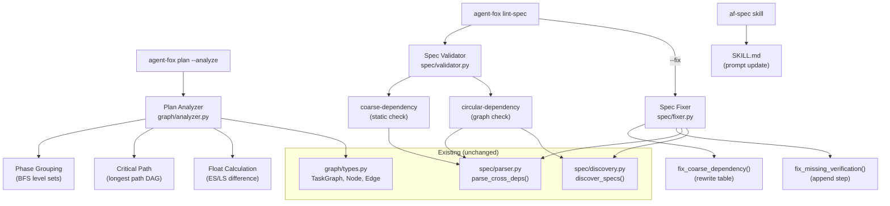

# Design Document: Plan Analysis and Dependency Quality

## Overview

This spec adds parallelism analysis and critical path computation to the
plan command, two new lint rules for dependency quality, auto-fix for
mechanically fixable findings, and a prompt update to the af-spec skill.
All analysis algorithms operate on the existing `TaskGraph` data structure
from spec 02.

## Architecture



### Module Responsibilities

1. `agent_fox/graph/analyzer.py` (NEW) -- Parallelism analysis and critical
   path computation. Pure functions operating on `TaskGraph`.
2. `agent_fox/spec/validator.py` (EXTEND) -- Add `coarse-dependency` and
   `circular-dependency` rules to the existing validation pipeline.
3. `agent_fox/spec/fixer.py` (NEW) -- Auto-fix functions for mechanically
   fixable findings. Each fixer reads a file, applies a transformation, and
   writes back.
4. `agent_fox/cli/plan.py` (EXTEND) -- Add `--analyze` flag; call analyzer
   and format output.
5. `agent_fox/cli/lint_spec.py` (EXTEND) -- Add `--fix` flag; call fixers
   before re-validating.
6. `skills/af-spec/SKILL.md` (EXTEND) -- Update Step 2 instructions for
   dependency granularity.

## Components and Interfaces

### Plan Analyzer

```python
# agent_fox/graph/analyzer.py
from __future__ import annotations
from dataclasses import dataclass
from agent_fox.graph.types import TaskGraph


@dataclass(frozen=True)
class NodeTiming:
    """Scheduling metadata for a single node."""
    node_id: str
    earliest_start: int   # ES: max(ES(pred) + 1) for all preds; 0 for sources
    latest_start: int     # LS: min(LS(succ) - 1) for all succs; ES for sinks
    float: int            # LS - ES; 0 = critical path


@dataclass(frozen=True)
class Phase:
    """A set of nodes that can execute concurrently."""
    phase_number: int     # 1-indexed
    earliest_start: int   # shared ES for all nodes in this phase
    node_ids: list[str]   # nodes in this phase

    @property
    def worker_count(self) -> int:
        return len(self.node_ids)


@dataclass(frozen=True)
class PlanAnalysis:
    """Complete analysis result."""
    phases: list[Phase]
    critical_path: list[str]       # ordered node IDs on the critical path
    critical_path_length: int
    peak_parallelism: int          # max workers across all phases
    total_nodes: int
    total_phases: int
    timings: dict[str, NodeTiming] # node_id -> timing
    has_alternative_critical_paths: bool


def analyze_plan(graph: TaskGraph) -> PlanAnalysis:
    """Compute parallelism phases, critical path, and float for all nodes.

    Algorithm:
    1. Forward pass: compute earliest_start for each node using
       topological order. ES(n) = max(ES(pred) + 1) for all predecessors;
       0 for source nodes.
    2. Determine makespan = max(ES) + 1.
    3. Backward pass: compute latest_start for each node.
       LS(n) = min(LS(succ) - 1) for all successors; ES(n) for sinks
       (nodes where ES == makespan - 1, or no successors with max ES).
    4. Float = LS - ES. Nodes with float == 0 are on the critical path.
    5. Group nodes by ES to form phases.
    6. Trace the critical path by following zero-float nodes from source
       to sink.

    Args:
        graph: A resolved TaskGraph (with populated order).

    Returns:
        PlanAnalysis with phases, critical path, and timings.
    """
    ...


def format_analysis(analysis: PlanAnalysis, graph: TaskGraph) -> str:
    """Format the analysis result for terminal display.

    Output structure:
        Parallelism Analysis
        ====================

        Phase 1 (1 worker):
          01_project_scaffold:1 -- Write failing spec tests

        Phase 2 (1 worker):
          01_project_scaffold:2 -- Implement configuration loading

        ...

        Phase 6 (4 workers):
          03_markdown_vault:1 -- Write failing spec tests
          04_background_indexing:1 -- Write failing spec tests
          06_cli_client:1 -- Write failing spec tests
          08_mkdocs_site:1 -- Write failing spec tests

        Critical Path (28 nodes):
          01_project_scaffold:1 -> ... -> 05_snippet_expiry:5

        Summary:
          Phases:          12
          Peak workers:    4
          Critical path:   28 nodes
          Total nodes:     46
          Nodes with float: 18 (08_mkdocs_site has 23 groups of float)

    Args:
        analysis: The computed PlanAnalysis.
        graph: The TaskGraph (for node titles).

    Returns:
        Formatted string for terminal output.
    """
    ...
```

### Lint Rule Extensions

```python
# Extensions to agent_fox/spec/validator.py

def _check_coarse_dependency(
    spec_name: str,
    prd_path: Path,
) -> list[Finding]:
    """Detect specs using the standard (coarse) dependency table format.

    Scans prd.md for the standard header pattern
    '| This Spec | Depends On |'. If found, produces a Warning.

    This is a static regex check -- no parsing of the table contents
    is needed, only detection of the header format.
    """
    ...


def _check_circular_dependency(
    specs: list[SpecInfo],
) -> list[Finding]:
    """Detect dependency cycles across all specs.

    1. Parse each spec's prd.md dependency table.
    2. Build a directed graph of spec-level dependencies
       (ignoring group numbers).
    3. Run cycle detection (DFS with coloring or Kahn's algorithm).
    4. For each cycle found, produce an Error finding.

    Skips edges referencing specs not in the discovered set
    (the broken-dependency rule handles those).
    """
    ...
```

### Spec Fixer

```python
# agent_fox/spec/fixer.py
from __future__ import annotations
from dataclasses import dataclass
from pathlib import Path

from agent_fox.spec.discovery import SpecInfo
from agent_fox.spec.validator import Finding


@dataclass(frozen=True)
class FixResult:
    """Result of applying a single fix."""
    rule: str           # rule name that was fixed
    spec_name: str      # spec that was modified
    file: str           # file that was modified
    description: str    # human-readable description of what changed


# Set of rules that have auto-fixers
FIXABLE_RULES = {"coarse-dependency", "missing-verification"}


def fix_coarse_dependency(
    spec_name: str,
    prd_path: Path,
    known_specs: dict[str, list[int]],
    current_spec_groups: list[int],
) -> list[FixResult]:
    """Rewrite a standard-format dependency table to group-level format.

    Algorithm:
    1. Read prd.md and locate the standard header line
       ('| This Spec | Depends On |').
    2. Parse each data row to extract (this_spec, depends_on, description).
    3. For each row, look up the upstream spec in known_specs:
       - from_group = last group of upstream spec (or 0 if unknown)
       - to_group = first group of current spec (or 0 if unknown)
    4. Replace the entire table (header + separator + rows) with the
       alt-format equivalent:
       '| Spec | From Group | To Group | Relationship |'
    5. Write the modified content back to prd_path.

    Returns a list of FixResult describing what was changed.
    Returns an empty list if no standard-format table was found.
    """
    ...


def fix_missing_verification(
    spec_name: str,
    tasks_path: Path,
) -> list[FixResult]:
    """Append a verification step to task groups that lack one.

    For each task group without a N.V subtask:
    1. Find the last subtask line of the group.
    2. Insert after it:
         - [ ] N.V Verify task group N
           - [ ] All spec tests pass
           - [ ] No linter warnings
           - [ ] No regressions in existing tests

    Returns a list of FixResult, one per group fixed.
    Returns an empty list if all groups already have verification steps.
    """
    ...


def apply_fixes(
    findings: list[Finding],
    discovered_specs: list[SpecInfo],
    specs_dir: Path,
    known_specs: dict[str, list[int]],
) -> list[FixResult]:
    """Apply all available auto-fixes for the given findings.

    Iterates through findings, identifies those with FIXABLE_RULES,
    groups them by spec and rule, and applies the appropriate fixer.

    Deduplicates by (spec_name, rule) to avoid applying the same fixer
    twice to the same file.

    Returns a list of all FixResults applied.
    """
    ...
```

### CLI Extensions

```python
# Extension to agent_fox/cli/plan.py

@click.command("plan")
@click.option("--fast", is_flag=True, help="Exclude optional tasks")
@click.option("--spec", "filter_spec", default=None, help="Plan a single spec")
@click.option("--reanalyze", is_flag=True, help="Discard cached plan")
@click.option("--verify", is_flag=True, help="Verify dependency consistency")
@click.option("--analyze", is_flag=True, help="Show parallelism analysis")
@click.pass_context
def plan_cmd(ctx, fast, filter_spec, reanalyze, verify, analyze):
    """Build an execution plan from specifications."""
    # ... existing plan logic ...

    if analyze:
        from agent_fox.graph.analyzer import analyze_plan, format_analysis
        analysis = analyze_plan(graph)
        click.echo(format_analysis(analysis, graph))
```

```python
# Extension to agent_fox/cli/lint_spec.py

@click.command("lint-spec")
@click.option("--format", "output_format", ...)
@click.option("--ai", is_flag=True, ...)
@click.option("--fix", is_flag=True, default=False,
              help="Automatically fix mechanically fixable findings.")
@click.pass_context
def lint_spec(ctx, output_format, ai, fix):
    """Validate specification files for structural and quality problems."""
    # ... existing discovery and validation ...

    if fix:
        from agent_fox.spec.fixer import apply_fixes
        fix_results = apply_fixes(findings, discovered, specs_dir, known_specs)
        if fix_results:
            # Print fix summary to stderr
            summary = _format_fix_summary(fix_results)
            click.echo(summary, err=True)
            # Re-validate to get remaining findings
            findings = validate_specs(specs_dir, discovered)
            if ai:
                # re-run AI validation too
                ...

    # Output remaining findings
    _output_findings(findings, output_format)
    ctx.exit(compute_exit_code(findings))
```

## Data Models

### NodeTiming

| Field | Type | Description |
|-------|------|-------------|
| node_id | str | Node identifier |
| earliest_start | int | Earliest possible start phase (0-indexed) |
| latest_start | int | Latest possible start without delaying project |
| float | int | Scheduling flexibility (LS - ES) |

### Phase

| Field | Type | Description |
|-------|------|-------------|
| phase_number | int | 1-indexed phase number |
| earliest_start | int | Shared ES for all nodes in phase |
| node_ids | list[str] | Nodes executable in this phase |

### PlanAnalysis

| Field | Type | Description |
|-------|------|-------------|
| phases | list[Phase] | All phases in order |
| critical_path | list[str] | Ordered critical path node IDs |
| critical_path_length | int | Number of nodes on critical path |
| peak_parallelism | int | Max workers in any phase |
| total_nodes | int | Total nodes in graph |
| total_phases | int | Number of phases |
| timings | dict[str, NodeTiming] | Per-node timing data |
| has_alternative_critical_paths | bool | Whether tied paths exist |

### FixResult

| Field | Type | Description |
|-------|------|-------------|
| rule | str | Rule name that was fixed |
| spec_name | str | Spec that was modified |
| file | str | File that was modified |
| description | str | Human-readable description of the fix |

## Correctness Properties

### Property 1: Phase Completeness

*For any* task graph, the union of all phase node_ids SHALL equal the set
of all node IDs in the graph. No node is omitted and no node appears in
multiple phases.

**Validates:** 20-REQ-1.2

### Property 2: Phase Ordering Respects Dependencies

*For any* edge (A -> B) in the task graph, A's phase number SHALL be
strictly less than B's phase number.

**Validates:** 20-REQ-1.2

### Property 3: Critical Path Is Longest

*For any* task graph, the critical path length SHALL equal the graph's
makespan (the number of phases). No chain of dependent nodes is longer.

**Validates:** 20-REQ-2.1

### Property 4: Zero Float Implies Critical Path

*For any* node with float == 0, that node SHALL appear on the critical
path. *For any* node with float > 0, that node SHALL NOT appear on the
critical path.

**Validates:** 20-REQ-2.3

### Property 5: Float Non-Negativity

*For any* node in the task graph, float SHALL be >= 0.

**Validates:** 20-REQ-2.3

### Property 6: Cycle Detection Equivalence

*For any* set of specs, the `circular-dependency` lint rule SHALL detect a
cycle if and only if `resolve_order()` from spec 02 would raise a
`PlanError` on the same dependency set (at spec granularity).

**Validates:** 20-REQ-4.2

### Property 7: Fix Idempotency

*For any* spec, applying `fix_coarse_dependency` twice SHALL produce the
same file content as applying it once (the second run finds no standard-
format table and makes no changes).

**Validates:** 20-REQ-6.2

### Property 8: Fix Preserves Semantics

*For any* spec with a standard-format dependency table, applying
`fix_coarse_dependency` SHALL produce a group-level table that resolves
to the same set of cross-spec edges as the original standard table (using
the same sentinel resolution logic).

**Validates:** 20-REQ-6.3

## Error Handling

| Error Condition | Behavior | Requirement |
|----------------|----------|-------------|
| Empty task graph with --analyze | Display "No tasks to analyze", return | 20-REQ-1.E1 |
| Fully serial graph | Show one node per phase, all with worker count 1 | 20-REQ-1.E2 |
| Tied critical paths | Display one path, note alternatives exist | 20-REQ-2.E1 |
| No dependency tables in any spec | No coarse-dependency or circular-dependency findings | 20-REQ-3.E1, 20-REQ-4.E2 |
| Dependency references missing spec | Skip edge in cycle detection (handled by broken-dependency rule) | 20-REQ-4.E1 |
| --fix with no fixable findings | Normal lint output, no files modified | 20-REQ-6.E1 |
| Upstream spec has no tasks.md | Use 0 as From Group sentinel | 20-REQ-6.E2 |
| File write fails | Log warning, skip that fix, continue | 20-REQ-6.E3 |

## Testing Strategy

- **Unit tests** for `analyze_plan()`: verify phase grouping, critical path,
  float computation on known graphs (linear chain, diamond, wide parallel,
  complex DAG).
- **Unit tests** for `coarse-dependency` rule: specs with standard format,
  group-level format, no deps, mixed formats.
- **Unit tests** for `circular-dependency` rule: acyclic specs, cyclic
  specs, self-referencing spec, missing spec references.
- **Unit tests** for `fix_coarse_dependency()`: verify table rewrite,
  group number lookup, sentinel fallback, idempotency.
- **Unit tests** for `fix_missing_verification()`: verify step insertion,
  idempotency, groups that already have verification.
- **Unit tests** for `apply_fixes()`: verify deduplication, fix summary,
  unfixable findings preserved.
- **Property tests** for analysis: properties 1-5 on randomly generated
  DAGs.
- **Integration test** for `agent-fox plan --analyze` CLI end-to-end.
- **Integration test** for `agent-fox lint-spec --fix` CLI end-to-end.

## Definition of Done

A task group is complete when ALL of the following are true:

1. All subtasks within the group are checked off (`[x]`)
2. All spec tests for the task group pass
3. All property tests pass
4. All previously passing tests still pass (no regressions)
5. No linter warnings or errors introduced
6. Code is committed on a feature branch and pushed to remote
