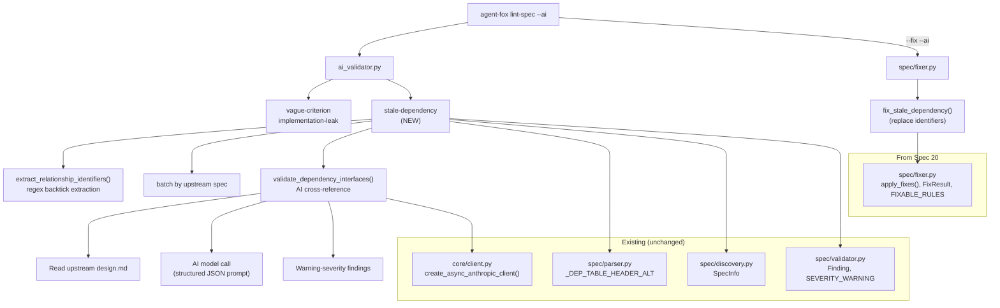

# Design Document: Dependency Interface Validation

## Overview

This spec adds a `stale-dependency` AI lint rule that validates code
identifiers in dependency Relationship text against the upstream spec's
`design.md`. It extends the existing AI validation pipeline in
`ai_validator.py` with a new async function, integrates into the
`lint-spec --ai` workflow, and adds an auto-fixer for AI-suggested
corrections that integrates with the `--fix` framework from spec 20.

## Architecture



### Module Responsibilities

1. `agent_fox/spec/ai_validator.py` (EXTEND) -- Add
   `extract_relationship_identifiers()`, `validate_dependency_interfaces()`,
   and `run_stale_dependency_validation()`. Follows the same async pattern as
   `analyze_acceptance_criteria()`.
2. `agent_fox/spec/fixer.py` (EXTEND) -- Add `fix_stale_dependency()` and
   register `stale-dependency` in `FIXABLE_RULES`.

## Components and Interfaces

### Identifier Extraction

```python
# Addition to agent_fox/spec/ai_validator.py

import re

_BACKTICK_TOKEN = re.compile(r"`([^`]+)`")


@dataclass(frozen=True)
class DependencyRef:
    """A code identifier extracted from a dependency Relationship cell."""
    declaring_spec: str      # spec that declares the dependency
    upstream_spec: str       # spec being depended on
    identifier: str          # extracted code identifier (normalized)
    raw_relationship: str    # original Relationship text for context


def extract_relationship_identifiers(
    declaring_spec: str,
    prd_path: Path,
) -> list[DependencyRef]:
    """Extract backtick-delimited code identifiers from dependency tables.

    Parses prd.md for the alternative dependency table format
    (| Spec | From Group | To Group | Relationship |) and extracts all
    backtick-delimited tokens from the Relationship column.

    Normalization:
    - Strip trailing parentheses: `Delete()` -> `Delete`
    - Preserve dotted paths: `store.SnippetStore.Delete` stays as-is

    Returns an empty list if no dependency table or no backtick tokens found.
    """
    ...
```

### AI Cross-Reference Validation

```python
# Addition to agent_fox/spec/ai_validator.py

_STALE_DEP_PROMPT = """\
You are an expert software architect reviewing specification documents. \
You will be given a design document from an upstream specification and a \
list of code identifiers that downstream specifications claim to depend on.

For each identifier, determine whether the upstream design document defines, \
describes, or reasonably implies that identifier. Consider:
- Exact name matches (type, function, method, struct, interface)
- Qualified names (e.g., `store.Store` matching a `Store` type in a \
  `store` package section)
- Method references (e.g., `Store.Delete` matching a `Delete` method on \
  `Store`)
- Standard library or language built-ins (e.g., `error`, `context.Context`, \
  `slog`) should be marked as "found" since they are not defined in specs

Return your analysis as a JSON object with this exact structure:
{
  "results": [
    {
      "identifier": "the identifier being checked",
      "found": true or false,
      "explanation": "brief reason why it was or was not found",
      "suggestion": "if not found, a suggested correction or null"
    }
  ]
}

Upstream design document ({upstream_spec}):

{design_content}

---

Identifiers to validate:
{identifiers_json}
"""


async def validate_dependency_interfaces(
    upstream_spec: str,
    design_content: str,
    refs: list[DependencyRef],
    model: str,
) -> list[Finding]:
    """Validate dependency identifiers against an upstream design document.

    Sends a single AI request per upstream spec containing the design.md
    content and all identifiers referencing that spec. Parses the
    structured JSON response and produces Warning-severity findings for
    identifiers the AI determines are not present.

    Args:
        upstream_spec: Name of the upstream spec.
        design_content: Full text of the upstream spec's design.md.
        refs: All DependencyRef objects targeting this upstream spec.
        model: AI model identifier.

    Returns:
        List of Warning-severity findings for unresolved identifiers.
    """
    ...
```

### Orchestration

```python
# Addition to agent_fox/spec/ai_validator.py

async def run_stale_dependency_validation(
    discovered_specs: list[SpecInfo],
    specs_dir: Path,
    model: str,
) -> list[Finding]:
    """Run stale-dependency validation across all discovered specs.

    Algorithm:
    1. For each spec with a prd.md, extract dependency identifiers.
    2. Group identifiers by upstream spec name.
    3. For each upstream spec group:
       a. Read the upstream spec's design.md (once per upstream spec).
       b. If design.md doesn't exist, skip (no finding).
       c. Call validate_dependency_interfaces() with all refs for that
          upstream spec.
    4. Collect and return all findings.

    If the AI model is unavailable, log a warning and return empty list.
    """
    ...
```

### Integration with run_ai_validation

```python
# Modified in agent_fox/spec/ai_validator.py

async def run_ai_validation(
    discovered_specs: list[SpecInfo],
    model: str,
    specs_dir: Path | None = None,  # NEW parameter for design.md lookup
) -> list[Finding]:
    """Run AI validation across all discovered specs.

    Runs both the existing acceptance criteria analysis and the new
    stale-dependency validation. The specs_dir parameter is needed for
    the stale-dependency rule to locate upstream design.md files.
    """
    findings: list[Finding] = []

    # Existing: acceptance criteria analysis
    for spec in discovered_specs:
        # ... existing code ...

    # NEW: stale-dependency validation
    if specs_dir is not None:
        try:
            stale_findings = await run_stale_dependency_validation(
                discovered_specs, specs_dir, model
            )
            findings.extend(stale_findings)
        except Exception as exc:
            logger.warning(
                "Stale-dependency validation unavailable: %s. Skipping.",
                exc,
            )

    return findings
```

### Auto-Fix for Stale Dependencies

```python
# Addition to agent_fox/spec/fixer.py

def fix_stale_dependency(
    spec_name: str,
    prd_path: Path,
    fixes: list[IdentifierFix],
) -> list[FixResult]:
    """Apply AI-suggested identifier corrections to Relationship text.

    For each IdentifierFix:
    1. Read prd.md content.
    2. Find the backtick-delimited original identifier in Relationship text.
    3. Replace it with the suggested identifier (preserving backticks).
    4. Write the modified content back.

    Skips fixes where:
    - suggestion is None or empty
    - the suggested identifier already appears in the Relationship text
    - the original identifier is not found in the file

    Args:
        spec_name: Name of the spec whose prd.md is being fixed.
        prd_path: Path to the prd.md file.
        fixes: List of (original_identifier, suggested_identifier) pairs
               extracted from AI validation findings.

    Returns:
        List of FixResult, one per identifier corrected.
    """
    ...


@dataclass(frozen=True)
class IdentifierFix:
    """A single identifier correction from AI validation."""
    original: str       # the stale identifier (e.g., "SnippetStore")
    suggestion: str     # the AI-suggested replacement (e.g., "Store")
    upstream_spec: str  # which upstream spec this relates to
```

The `stale-dependency` rule must be added to `FIXABLE_RULES` in `fixer.py`:

```python
FIXABLE_RULES = {"coarse-dependency", "missing-verification", "stale-dependency"}
```

The `apply_fixes()` function from spec 20 needs a small extension: for
`stale-dependency` fixes, it must extract `IdentifierFix` objects from the
finding messages (the suggestion is embedded in the message text) and pass
them to `fix_stale_dependency()`. The finding message format from
`validate_dependency_interfaces()` includes structured text:
`"... identifier \`{id}\` not found ... Suggestion: {suggestion}"`.

A simpler approach: store the original identifier and suggestion as
structured data on the Finding. Since `Finding` is frozen and adding fields
would break the existing interface, the fixer can parse the suggestion from
the message text using a regex:
```python
_SUGGESTION_PATTERN = re.compile(r"Suggestion: (.+)$")
_IDENTIFIER_PATTERN = re.compile(r"identifier `([^`]+)`")
```

## Data Models

### DependencyRef

| Field | Type | Description |
|-------|------|-------------|
| declaring_spec | str | Spec that declares the dependency |
| upstream_spec | str | Spec being depended on |
| identifier | str | Normalized code identifier |
| raw_relationship | str | Original Relationship text |

### IdentifierFix

| Field | Type | Description |
|-------|------|-------------|
| original | str | The stale identifier to replace |
| suggestion | str | The AI-suggested replacement |
| upstream_spec | str | Which upstream spec this relates to |

### AI Response Schema

```json
{
  "results": [
    {
      "identifier": "string",
      "found": "boolean",
      "explanation": "string",
      "suggestion": "string | null"
    }
  ]
}
```

### Finding Output

Each unresolved identifier produces a `Finding` with:

| Field | Value |
|-------|-------|
| spec_name | The declaring spec's name |
| file | `"prd.md"` |
| rule | `"stale-dependency"` |
| severity | `"warning"` |
| message | `"Dependency on {upstream_spec}: identifier \`{id}\` not found in design.md. {explanation}. Suggestion: {suggestion}"` |
| line | `None` |

The message format is designed so `fix_stale_dependency()` can parse out
the original identifier and suggestion using regex.

## Correctness Properties

### Property 1: Extraction Completeness

*For any* dependency table row with N backtick-delimited tokens, the
extraction function SHALL return exactly N `DependencyRef` objects for that
row.

**Validates:** 21-REQ-1.1

### Property 2: Normalization Idempotency

*For any* identifier that does not end with `()`, normalization SHALL return
the identifier unchanged. *For any* identifier ending with `()`, normalization
SHALL strip the trailing `()` exactly once.

**Validates:** 21-REQ-1.2

### Property 3: Batching Correctness

*For any* set of specs, the number of AI calls for `stale-dependency` SHALL
equal the number of distinct upstream specs referenced by dependency rows
with backtick-delimited identifiers.

**Validates:** 21-REQ-3.1, 21-REQ-3.2

### Property 4: Fix Precision

*For any* fix applied by `fix_stale_dependency()`, the replacement SHALL
affect only the specific backtick-delimited token matching the original
identifier, leaving all other content in the file unchanged.

**Validates:** 21-REQ-5.2

## Error Handling

| Error Condition | Behavior | Requirement |
|----------------|----------|-------------|
| Upstream design.md missing | Skip validation for that upstream spec, no finding | 21-REQ-2.E1 |
| AI model unavailable | Log warning, skip stale-dependency rule, return empty | 21-REQ-2.E2 |
| AI response malformed JSON | Log warning for that upstream spec, continue | 21-REQ-2.E3 |
| No backtick tokens in any Relationship | Zero AI calls, empty findings | 21-REQ-3.E1 |
| Relationship cell empty | Skip row, no finding | 21-REQ-1.E1 |
| AI suggestion is null/empty | Skip fix for that finding, report finding only | 21-REQ-5.E1 |
| --fix without --ai | stale-dependency not detected, not fixed | 21-REQ-5.E2 |
| Suggested identifier already present | Skip fix to avoid duplicates | 21-REQ-5.E3 |

## Testing Strategy

- **Unit tests** for `extract_relationship_identifiers()`: verify backtick
  extraction, parenthesis stripping, dotted path preservation, empty cells,
  standard library tokens.
- **Unit tests** for `validate_dependency_interfaces()`: mock AI responses,
  verify finding generation for unresolved identifiers, verify no findings for
  resolved identifiers.
- **Unit tests** for batching: verify multiple rows to same upstream spec
  produce a single AI call.
- **Unit tests** for graceful degradation: missing design.md, AI unavailable,
  malformed response.
- **Unit tests** for `fix_stale_dependency()`: verify identifier replacement,
  skip when no suggestion, skip when already fixed, verify surrounding text
  preserved.
- **Integration test** for `lint-spec --ai` with a test spec containing
  stale dependency references.
- **Integration test** for `lint-spec --fix --ai` with a test spec
  containing fixable stale references.

## Definition of Done

A task group is complete when ALL of the following are true:

1. All subtasks within the group are checked off (`[x]`)
2. All spec tests for the task group pass
3. All previously passing tests still pass (no regressions)
4. No linter warnings or errors introduced
5. Code is committed on a feature branch and pushed to remote
