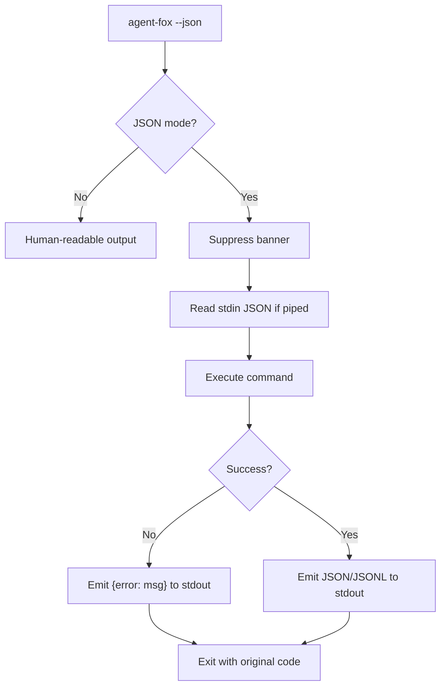
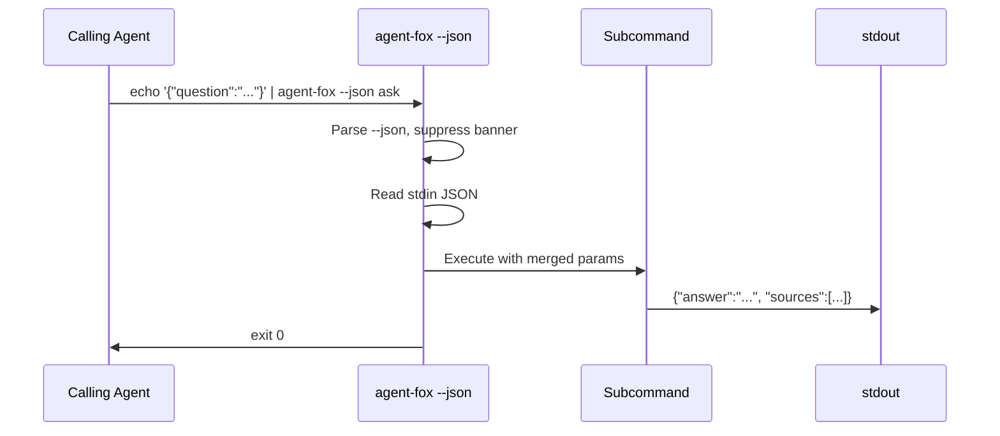

# Design Document: Global --json Flag

## Overview

A global `--json` flag is added to the `main` Click group. When active, all
subcommands switch to structured JSON I/O. The flag flows through
`ctx.obj["json"]` to every subcommand. A `JsonOutput` helper centralizes
JSON emission logic (single objects, JSONL, error envelopes). Existing
`--format` options and YAML formatters are removed.

## Architecture





### Module Responsibilities

1. **`agent_fox.cli.app`** — Adds `--json` to `main` group, stores in
   `ctx.obj`, conditionally suppresses banner.
2. **`agent_fox.cli.json_io`** (new) — `JsonOutput` helper: `emit()` for
   single JSON objects, `emit_line()` for JSONL, `emit_error()` for error
   envelopes, `read_stdin()` for JSON input parsing.
3. **`agent_fox.cli.{command}`** — Each command checks `ctx.obj["json"]`
   and branches to JSON output path.
4. **`agent_fox.reporting.formatters`** — `OutputFormat.YAML` removed,
   YAML formatter classes removed. `OutputFormat` simplified to
   `TABLE` and `JSON` only.

## Components and Interfaces

### JsonOutput Helper

```python
# agent_fox/cli/json_io.py

import json
import sys
from typing import Any

def emit(data: dict[str, Any]) -> None:
    """Write a single JSON object to stdout, followed by newline."""
    click.echo(json.dumps(data, indent=2, default=str))

def emit_line(data: dict[str, Any]) -> None:
    """Write a compact JSON object to stdout (JSONL mode, no indent)."""
    click.echo(json.dumps(data, default=str))

def emit_error(message: str) -> None:
    """Write an error envelope to stdout."""
    click.echo(json.dumps({"error": message}))

def read_stdin() -> dict[str, Any]:
    """Read JSON from stdin if not a TTY. Returns empty dict otherwise."""
    if sys.stdin.isatty():
        return {}
    text = sys.stdin.read().strip()
    if not text:
        return {}
    return json.loads(text)
```

### BannerGroup Modification

```python
# agent_fox/cli/app.py (modified)

@click.group(cls=BannerGroup, invoke_without_command=True)
@click.option("--json", "json_mode", is_flag=True, help="JSON I/O mode")
@click.pass_context
def main(ctx, verbose, quiet, json_mode):
    ctx.obj["json"] = json_mode
    # Suppress banner when JSON mode is active
    if not json_mode:
        render_banner(...)
```

### Command Pattern

Each command follows this pattern:

```python
@click.command()
@click.pass_context
def some_cmd(ctx):
    json_mode = ctx.obj.get("json", False)
    # ... execute logic ...
    if json_mode:
        json_io.emit({"key": "value"})
    else:
        click.echo("Human-readable output")
```

### Error Handler Modification

```python
# BannerGroup.invoke (modified)

def invoke(self, ctx):
    try:
        super().invoke(ctx)
    except Exception as exc:
        if ctx.obj.get("json"):
            json_io.emit_error(str(exc))
            sys.exit(1)
        else:
            # existing behavior
```

## Data Models

### Error Envelope

```json
{"error": "No specifications found in .specs/ directory"}
```

### Status Envelope

```json
{"status": "ok"}
```

### JSONL Event (streaming commands)

```json
{"event": "progress", "task": "implementing", "detail": "Writing tests..."}
{"event": "complete", "summary": {"tasks": 3, "tokens": 12500}}
```

## Correctness Properties

### Property 1: JSON Exclusivity

*For any* command invoked with `--json`, stdout SHALL contain only valid
JSON (or JSONL) — no banner text, no Rich formatting, no bare strings.

**Validates: Requirements 23-REQ-2.2, 23-REQ-3.1 through 23-REQ-3.7**

### Property 2: Error Envelope Structure

*For any* command that fails in JSON mode, the stdout output SHALL be
parseable as a JSON object containing an `"error"` key with a non-empty
string value.

**Validates: Requirements 23-REQ-6.1, 23-REQ-6.3**

### Property 3: Exit Code Preservation

*For any* command invoked with `--json`, the exit code SHALL be identical
to the exit code produced without `--json` for the same inputs.

**Validates: Requirements 23-REQ-6.2**

### Property 4: Flag Precedence

*For any* command where both CLI flags and stdin JSON provide the same
parameter, the CLI flag value SHALL take precedence.

**Validates: Requirements 23-REQ-7.2**

### Property 5: Default Mode Unchanged

*For any* command invoked without `--json`, the output SHALL be identical
to the current behavior (human-readable text).

**Validates: Requirements 23-REQ-1.3**

### Property 6: No Stdin Blocking

*For any* command invoked with `--json` from an interactive terminal (TTY),
the command SHALL NOT block waiting for stdin input.

**Validates: Requirements 23-REQ-7.3**

## Error Handling

| Error Condition | Behavior | Requirement |
|----------------|----------|-------------|
| Invalid JSON on stdin | Emit error envelope, exit 1 | 23-REQ-7.E1 |
| Unknown stdin fields | Ignore silently | 23-REQ-7.E2 |
| Unhandled exception in JSON mode | Emit error envelope, exit 1 | 23-REQ-6.E1 |
| User passes removed `--format` flag | Click usage error (standard) | 23-REQ-8.E1 |
| Streaming command interrupted | Emit `{"status": "interrupted"}` | 23-REQ-5.E1 |
| Batch command with no data | Emit valid JSON with empty fields | 23-REQ-3.E1 |

## Technology Stack

- Python 3.12+
- Click (existing CLI framework)
- `json` standard library module
- `sys.stdin` for input detection

## Operational Readiness

- **Observability:** JSON mode logs to stderr at configured level. No
  stdout pollution.
- **Rollback:** Removing `--json` flag from `main` group reverts all
  behavior. Individual commands fall back to human output by default.
- **Migration:** The `--format` removal is a breaking change for users
  who pass `--format yaml` or `--format json`. These users should switch
  to `--json`.

## Definition of Done

A task group is complete when ALL of the following are true:

1. All subtasks within the group are checked off (`[x]`)
2. All spec tests (`test_spec.md` entries) for the task group pass
3. All property tests for the task group pass
4. All previously passing tests still pass (no regressions)
5. No linter warnings or errors introduced
6. Code is committed on a feature branch and pushed to remote
7. Feature branch is merged back to `develop`
8. `tasks.md` checkboxes are updated to reflect completion

## Testing Strategy

- **Unit tests:** Test `JsonOutput` helper functions with known inputs.
- **Unit tests:** Test `read_stdin()` with mock stdin (TTY vs pipe).
- **Integration tests:** Test each command with `--json` via Click test
  runner, verify stdout is valid JSON.
- **Property tests:** For all commands, verify JSON-mode output is
  parseable and contains expected keys.
- **Regression tests:** Verify commands without `--json` produce
  identical output to baseline.
