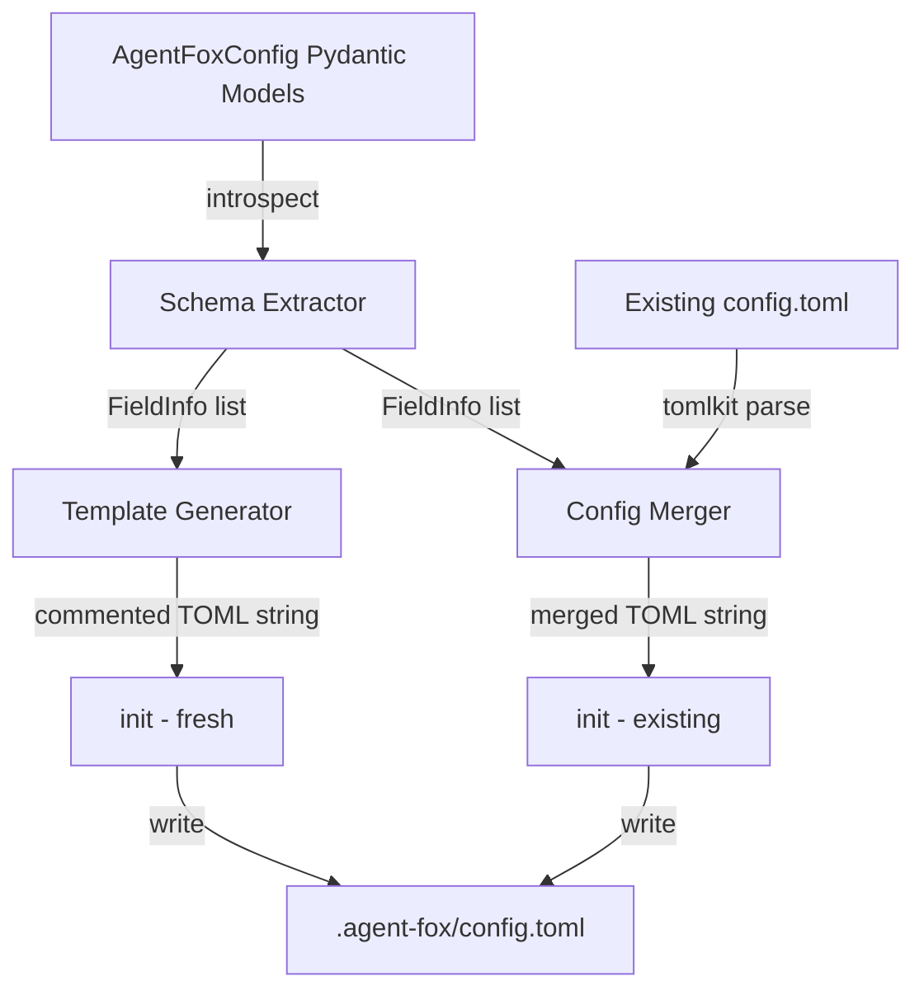

# Design Document: Config Generation

## Overview

This spec replaces the static `_DEFAULT_CONFIG` string in `agent_fox/cli/init.py`
with a programmatic config generator that introspects the Pydantic models in
`agent_fox/core/config.py`. It adds a merge capability so that re-running `init`
updates existing configs non-destructively. The `tomlkit` library is used for
comment-preserving TOML round-trip.

## Architecture



### Module Responsibilities

1. **`agent_fox/core/config_gen.py`** (new) — Schema extraction, template
   generation, and config merge logic.
2. **`agent_fox/core/config.py`** (modified) — Remove `MemoryConfig` class and
   `memory` field. Add `description` metadata to `Field()` calls for fields
   that lack it.
3. **`agent_fox/cli/init.py`** (modified) — Replace `_DEFAULT_CONFIG` with
   calls to the generator/merger. Update the re-init path to merge.

## Components and Interfaces

### Schema Extraction

```python
@dataclass
class FieldSpec:
    """Describes a single config field for template generation."""
    name: str              # TOML key name (uses alias if defined)
    section: str           # dot-separated section path, e.g. "archetypes.instances"
    python_type: str       # human-readable type string, e.g. "int", "bool"
    default: Any           # resolved default value (factory invoked)
    description: str       # brief description for the comment
    bounds: str | None     # e.g. "1-8" or ">=0", None if unconstrained
    is_nested: bool        # True if this field is a nested BaseModel

@dataclass
class SectionSpec:
    """Describes a config section (TOML table)."""
    path: str              # dot-separated section path
    fields: list[FieldSpec]
    subsections: list[SectionSpec]

def extract_schema(model: type[BaseModel], prefix: str = "") -> list[SectionSpec]:
    """Walk a Pydantic model tree and return a flat list of SectionSpecs."""

def get_field_bounds(model: type[BaseModel], field_name: str) -> str | None:
    """Extract clamping bounds from field_validator source or annotations."""
```

### Template Generator

```python
def generate_config_template(schema: list[SectionSpec]) -> str:
    """Render a fully-commented config.toml from extracted schema."""
```

### Config Merger

```python
def merge_config(
    existing_content: str,
    schema: list[SectionSpec],
) -> str:
    """Merge an existing config.toml with the current schema.

    - Preserves active (uncommented) user values.
    - Adds missing fields as commented entries.
    - Marks unrecognized active fields as DEPRECATED.
    - Preserves user comments and formatting.
    """
```

### Public API (used by init.py)

```python
def generate_default_config() -> str:
    """Generate a complete commented config.toml from AgentFoxConfig."""
    schema = extract_schema(AgentFoxConfig)
    return generate_config_template(schema)

def merge_existing_config(existing_content: str) -> str:
    """Merge an existing config.toml with the current schema."""
    schema = extract_schema(AgentFoxConfig)
    return merge_config(existing_content, schema)
```

## Data Models

### Generated TOML Format

```toml
# agent-fox configuration
# Generated from schema — do not remove section headers.
# Uncomment and edit values to customize.

# [orchestrator]
# Maximum parallel sessions (1-8, default: 1)
# parallel = 1
# Sync interval in task groups (>=0, default: 5)
# sync_interval = 5
# Hot-load specs between sessions (default: true)
# hot_load = true
# ...

# [routing]
# Retries before model escalation (0-3, default: 1)
# retries_before_escalation = 1
# ...
```

### Field Comment Format

```
# <description> (<bounds>, default: <value>)
# <key> = <toml_value>
```

For fields without bounds:
```
# <description> (default: <value>)
# <key> = <toml_value>
```

For fields with `None` default:
```
# <description> (not set by default)
# <key> =
```

### Deprecated Field Format

```
# DEPRECATED: '<key>' is no longer recognized
# <key> = <original_value>
```

## Operational Readiness

### Observability

- Log at DEBUG level when generating a fresh config.
- Log at INFO level when merging: report counts of preserved, added, and
  deprecated fields.
- Log at WARNING level when skipping merge due to invalid TOML.

### Rollout

- The `tomlkit` dependency is added to `pyproject.toml`.
- Existing `config.toml` files are not migrated automatically — they are
  updated on next `init` re-run.
- `load_config` continues to use `tomllib` (no behavior change for loading).

### Compatibility

- Existing configs with the old format continue to load without error.
- The `[memory]` section, if present, is silently ignored by `load_config`
  (Pydantic `extra="ignore"` on root model after removing the field).

## Correctness Properties

### Property 1: Template Completeness

*For any* `AgentFoxConfig` model definition, the generated config template
SHALL contain exactly one commented entry for every scalar field in every
section and subsection of the model.

**Validates: Requirements 33-REQ-1.1, 33-REQ-1.2, 33-REQ-4.2**

### Property 2: Round-Trip Default Equivalence

*For any* generated config template, uncommenting all fields and loading the
result via `load_config` SHALL produce an `AgentFoxConfig` whose field values
are identical to `AgentFoxConfig()` (all defaults).

**Validates: Requirements 33-REQ-1.4, 33-REQ-3.2**

### Property 3: Merge Value Preservation

*For any* valid `config.toml` containing active fields recognized by the
current schema, merging with the current schema SHALL preserve every active
field's key and value unchanged in the output.

**Validates: Requirements 33-REQ-2.1, 33-REQ-2.5**

### Property 4: Merge Completeness

*For any* valid `config.toml` that is missing fields present in the current
schema, merging SHALL add every missing field as a commented entry, such that
the set of field names in the merged output equals the set of field names in
the schema.

**Validates: Requirements 33-REQ-2.2**

### Property 5: Deprecated Field Detection

*For any* valid `config.toml` containing active fields NOT present in the
current schema, merging SHALL mark each such field with a `# DEPRECATED`
prefix and comment out its value.

**Validates: Requirements 33-REQ-2.4**

### Property 6: Schema Extraction Determinism

*For any* invocation of `extract_schema(AgentFoxConfig)`, the returned
`SectionSpec` list SHALL have identical structure, field ordering, and default
values.

**Validates: Requirements 33-REQ-1.5, 33-REQ-4.1**

### Property 7: Merge Idempotency

*For any* `config.toml` that is already fully merged (contains all schema
fields), re-merging SHALL produce byte-for-byte identical output.

**Validates: Requirements 33-REQ-2.5**

## Error Handling

| Error Condition | Behavior | Requirement |
|----------------|----------|-------------|
| Existing config.toml has invalid TOML | Log warning, skip merge, file untouched | 33-REQ-2.E1 |
| Existing config.toml is empty/whitespace | Treat as fresh generation | 33-REQ-2.E2 |
| Field has alias (e.g. `skeptic_settings`) | Use alias as TOML key | 33-REQ-3.E1 |
| Field default is `None` | Comment says "not set by default" | 33-REQ-1.E1 |
| Field default is `[]` | TOML value is `[]` | 33-REQ-1.E2 |
| Field default is `{}` | TOML value is `{}` | 33-REQ-1.E3 |
| `[memory]` in existing TOML after removal | Silently ignored by load_config | 33-REQ-5.2 |

## Technology Stack

- **Python 3.11+** — project baseline
- **Pydantic v2** — config model introspection (`model_fields`, `model_json_schema`)
- **tomlkit** — comment-preserving TOML read/write (new dependency)
- **tomllib** — stdlib TOML reader (unchanged, used by `load_config`)
- **pytest / Hypothesis** — testing

## Definition of Done

A task group is complete when ALL of the following are true:

1. All subtasks within the group are checked off (`[x]`)
2. All spec tests (`test_spec.md` entries) for the task group pass
3. All property tests for the task group pass
4. All previously passing tests still pass (no regressions)
5. No linter warnings or errors introduced
6. Code is committed on a feature branch and pushed to remote
7. Feature branch is merged back to `develop`
8. `tasks.md` checkboxes are updated to reflect completion

## Testing Strategy

- **Unit tests** validate schema extraction, template generation, and merge
  logic in isolation using crafted Pydantic models.
- **Property tests** (Hypothesis) verify template completeness, round-trip
  equivalence, merge preservation, and idempotency across generated inputs.
- **Integration tests** verify the full `init` command flow (fresh + re-init)
  using the Click test runner and temporary git repos.
