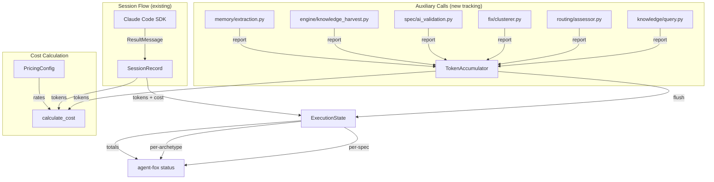

# Design Document: Comprehensive Token Tracking

## Overview

This spec introduces three changes to make token/cost reporting accurate and
configurable: (1) a token accumulator that captures auxiliary LLM call usage,
(2) configurable pricing via `config.toml`, and (3) per-archetype and per-spec
cost breakdowns in reporting. The design is minimally invasive — auxiliary call
sites get a one-line instrumentation call, pricing moves from code to config,
and `SessionRecord` gains one field.

## Architecture



### Module Responsibilities

1. **`agent_fox/core/token_tracker.py`** (new) — Thread-safe token accumulator
   for auxiliary LLM calls. Singleton per process.
2. **`agent_fox/core/config.py`** (modified) — New `PricingConfig` model with
   per-model pricing defaults.
3. **`agent_fox/core/models.py`** (modified) — Remove pricing from `ModelEntry`,
   update `calculate_cost()` to accept pricing config.
4. **`agent_fox/engine/state.py`** (modified) — Add `archetype` to
   `SessionRecord`, integrate accumulator flush.
5. **`agent_fox/reporting/status.py`** (modified) — Per-archetype and per-spec
   cost aggregation.
6. **`agent_fox/reporting/formatters.py`** (modified) — Render new cost
   breakdowns.
7. **Auxiliary call sites** (6 files, modified) — One-line instrumentation.

## Components and Interfaces

### Token Accumulator

```python
@dataclass
class TokenUsage:
    """A single auxiliary LLM call's token usage."""
    input_tokens: int
    output_tokens: int
    model: str

class TokenAccumulator:
    """Thread-safe accumulator for auxiliary LLM token usage.

    Module-level singleton. Call sites use the module functions
    directly — no need to pass the accumulator around.
    """

    def record(self, input_tokens: int, output_tokens: int, model: str) -> None:
        """Record token usage from an auxiliary LLM call."""

    def flush(self) -> list[TokenUsage]:
        """Return all recorded usages and reset the accumulator."""

    def total(self) -> tuple[int, int]:
        """Return (total_input_tokens, total_output_tokens) without flushing."""

# Module-level convenience functions
def record_auxiliary_usage(input_tokens: int, output_tokens: int, model: str) -> None:
    """Record auxiliary token usage to the global accumulator."""

def flush_auxiliary_usage() -> list[TokenUsage]:
    """Flush and return all accumulated auxiliary usages."""

def get_auxiliary_totals() -> tuple[int, int]:
    """Get current auxiliary totals without flushing."""
```

### Pricing Config

```python
class ModelPricing(BaseModel):
    """Pricing for a single model."""
    model_config = ConfigDict(extra="ignore")

    input_price_per_m: float = 0.0   # USD per million input tokens
    output_price_per_m: float = 0.0  # USD per million output tokens

class PricingConfig(BaseModel):
    """Per-model pricing configuration."""
    model_config = ConfigDict(extra="ignore")

    models: dict[str, ModelPricing] = Field(default_factory=lambda: {
        "claude-haiku-4-5": ModelPricing(input_price_per_m=1.00, output_price_per_m=5.00),
        "claude-sonnet-4-6": ModelPricing(input_price_per_m=3.00, output_price_per_m=15.00),
        "claude-opus-4-6": ModelPricing(input_price_per_m=15.00, output_price_per_m=75.00),
    })
```

Config TOML representation:

```toml
[pricing.models.claude-haiku-4-5]
input_price_per_m = 1.00
output_price_per_m = 5.00

[pricing.models.claude-sonnet-4-6]
input_price_per_m = 3.00
output_price_per_m = 15.00

[pricing.models.claude-opus-4-6]
input_price_per_m = 15.00
output_price_per_m = 75.00
```

### Updated `calculate_cost`

```python
def calculate_cost(
    input_tokens: int,
    output_tokens: int,
    model_id: str,
    pricing: PricingConfig,
) -> float:
    """Calculate cost using config-based pricing.

    Falls back to zero cost if model not found in pricing config.
    """
```

### Updated `SessionRecord`

```python
@dataclass
class SessionRecord:
    node_id: str
    attempt: int
    status: str
    input_tokens: int
    output_tokens: int
    cost: float
    duration_ms: int
    error_message: str | None
    timestamp: str
    model: str | None = None
    files_touched: list[str] = field(default_factory=list)
    archetype: str = "coder"  # NEW — defaults for backward compat
```

### Instrumentation Pattern

Each auxiliary call site adds two lines after the API call:

```python
response = client.messages.create(...)
# Track auxiliary token usage
record_auxiliary_usage(
    input_tokens=response.usage.input_tokens,
    output_tokens=response.usage.output_tokens,
    model=model_entry.model_id,
)
```

### Reporting Additions

`StatusReport` gains two new fields:

```python
@dataclass
class StatusReport:
    # ... existing fields ...
    cost_by_archetype: dict[str, float]  # archetype -> total cost
    cost_by_spec: dict[str, float]       # spec_name -> total cost
```

## Data Models

### Accumulator State (in-memory only)

```python
_usages: list[TokenUsage]  # append-only during session, flushed at boundary
_lock: threading.Lock       # thread safety for parallel sessions
```

### Pricing Config Defaults

| Model | Input $/M | Output $/M |
|-------|-----------|------------|
| claude-haiku-4-5 | $1.00 | $5.00 |
| claude-sonnet-4-6 | $3.00 | $15.00 |
| claude-opus-4-6 | $15.00 | $75.00 |

## Operational Readiness

### Observability

- Log at DEBUG when auxiliary tokens are recorded.
- Log at WARNING when a model ID is not found in pricing config.
- Log at WARNING when API response lacks usage data.
- Log at INFO the auxiliary token total when flushing at session boundary.

### Migration / Compatibility

- `SessionRecord` gains `archetype` field with default `"coder"` — backward
  compatible with existing `state.jsonl` entries that lack the field.
- `ModelEntry` loses pricing fields — any code reading `model.input_price_per_m`
  must be updated to use `PricingConfig`.
- Existing `config.toml` files without `[pricing]` section work unchanged
  (Pydantic defaults apply).

## Correctness Properties

### Property 1: Auxiliary Token Completeness

*For any* orchestration run with N auxiliary LLM calls, the token accumulator
SHALL record exactly N entries, and `flush()` SHALL return all N entries and
reset the accumulator to empty.

**Validates: Requirements 34-REQ-1.1, 34-REQ-1.2**

### Property 2: Total Token Conservation

*For any* orchestration run, the reported `total_input_tokens` SHALL equal
the sum of all session `input_tokens` plus all auxiliary `input_tokens`, and
the same for output tokens.

**Validates: Requirements 34-REQ-1.3, 34-REQ-1.4**

### Property 3: Pricing Config Precedence

*For any* `calculate_cost()` call with a model ID present in `PricingConfig`,
the cost SHALL be computed using the config prices, not any hardcoded values.

**Validates: Requirements 34-REQ-2.1, 34-REQ-2.3**

### Property 4: Pricing Default Equivalence

*For any* `AgentFoxConfig` loaded without a `[pricing]` section, the
`PricingConfig` SHALL contain default entries for all models in
`MODEL_REGISTRY` with prices matching published Anthropic rates.

**Validates: Requirements 34-REQ-2.2, 34-REQ-2.E1, 34-REQ-5.1**

### Property 5: Archetype Preservation

*For any* `SessionRecord` created during an archetype session, the `archetype`
field SHALL match the archetype name passed to `NodeSessionRunner`.

**Validates: Requirements 34-REQ-3.1, 34-REQ-3.2**

### Property 6: Per-Spec Aggregation Correctness

*For any* set of `SessionRecord` entries, the per-spec cost breakdown SHALL
equal the sum of costs for all records sharing the same spec prefix.

**Validates: Requirements 34-REQ-4.1, 34-REQ-4.2**

## Error Handling

| Error Condition | Behavior | Requirement |
|----------------|----------|-------------|
| Auxiliary LLM call fails before response | Record zero tokens | 34-REQ-1.E1 |
| API response lacks `usage` data | Record zero tokens, log warning | 34-REQ-1.E2 |
| `[pricing]` section absent | Use built-in defaults | 34-REQ-2.E1 |
| Negative or non-numeric pricing value | Clamp to zero, log warning | 34-REQ-2.E2 |
| `SessionRecord` from old state.jsonl lacks archetype | Default to "coder" | 34-REQ-3.E1 |
| `node_id` lacks colon separator | Use full node_id as spec name | 34-REQ-4.E1 |
| Model ID not in pricing config | Zero cost, log warning | 34-REQ-2.4 |

## Technology Stack

- **Python 3.11+** — project baseline
- **Pydantic v2** — `PricingConfig` model
- **threading.Lock** — thread safety for accumulator (parallel sessions)
- **pytest / Hypothesis** — testing

## Definition of Done

A task group is complete when ALL of the following are true:

1. All subtasks within the group are checked off (`[x]`)
2. All spec tests (`test_spec.md` entries) for the task group pass
3. All property tests for the task group pass
4. All previously passing tests still pass (no regressions)
5. No linter warnings or errors introduced
6. Code is committed on a feature branch and pushed to remote
7. Feature branch is merged back to `develop`
8. `tasks.md` checkboxes are updated to reflect completion

## Testing Strategy

- **Unit tests** validate the accumulator, pricing config, cost calculation,
  and reporting aggregation in isolation.
- **Property tests** (Hypothesis) verify token conservation, pricing
  precedence, and aggregation correctness across generated inputs.
- **Integration tests** verify end-to-end: auxiliary calls record to
  accumulator, flush into state, and appear in status output.
