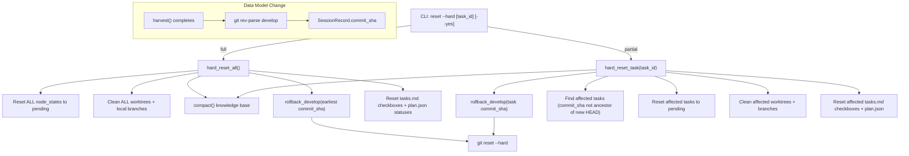

# Design Document: Hard Reset Command

## Overview

The hard reset feature extends the existing `reset` command with a `--hard`
flag that performs a comprehensive project wipe. It builds on the existing
reset engine (`agent_fox/engine/reset.py`) by adding two new functions:
`hard_reset_all()` and `hard_reset_task()`. A prerequisite data-model change
adds `commit_sha` to `SessionRecord` so the rollback target can be determined.

The design keeps the existing soft-reset path completely untouched. The `--hard`
flag gates all new behavior.

## Architecture



### Module Responsibilities

1. **`agent_fox/engine/state.py`** — Add `commit_sha` field to `SessionRecord`
   and update deserialization.
2. **`agent_fox/engine/session_lifecycle.py`** — Capture develop HEAD SHA after
   successful harvest.
3. **`agent_fox/engine/reset.py`** — Add `hard_reset_all()`,
   `hard_reset_task()`, `rollback_develop()`, `reset_tasks_md_checkboxes()`,
   and `reset_plan_statuses()` functions.
4. **`agent_fox/cli/reset.py`** — Add `--hard` flag, wire to new engine
   functions, display results.

## Components and Interfaces

### CLI Surface

```
agent-fox reset [TASK_ID] [--hard] [--yes/-y]
```

The `--hard` flag is mutually compatible with `TASK_ID` and `--yes`.
When `--hard` is provided, the command dispatches to `hard_reset_all()` or
`hard_reset_task()` instead of the existing `reset_all()` / `reset_task()`.

### Core Data Types

```python
# Extension to existing SessionRecord (state.py)
@dataclass
class SessionRecord:
    # ... existing fields ...
    commit_sha: str = ""  # develop HEAD after harvest (empty if no code merged)

# New result type (reset.py)
@dataclass(frozen=True)
class HardResetResult:
    reset_tasks: list[str]         # all task IDs reset to pending
    cleaned_worktrees: list[str]   # worktree dirs removed
    cleaned_branches: list[str]    # local branches deleted
    compaction: tuple[int, int]    # (original_count, surviving_count)
    rollback_sha: str | None       # target commit SHA, or None if skipped
```

### Module Interfaces

```python
# reset.py — new functions

def hard_reset_all(
    state_path: Path,
    plan_path: Path,
    worktrees_dir: Path,
    repo_path: Path,
    memory_path: Path,
) -> HardResetResult:
    """Full hard reset: all tasks, all artifacts, code rollback."""

def hard_reset_task(
    task_id: str,
    state_path: Path,
    plan_path: Path,
    worktrees_dir: Path,
    repo_path: Path,
    memory_path: Path,
) -> HardResetResult:
    """Partial hard reset: target task + cascaded tasks, code rollback."""

def rollback_develop(
    repo_path: Path,
    target_sha: str,
) -> None:
    """Reset the develop branch to the given commit SHA.

    Checks out develop and runs git reset --hard <target_sha>.
    Raises AgentFoxError if the SHA cannot be resolved.
    """

def find_rollback_target(
    session_history: list[SessionRecord],
    repo_path: Path,
    target_commit_sha: str | None = None,
) -> str | None:
    """Determine the rollback commit SHA.

    For full reset (target_commit_sha=None): finds the earliest
    commit_sha in session_history and returns its first-parent
    predecessor on develop.

    For partial reset (target_commit_sha given): returns the
    first-parent predecessor of target_commit_sha on develop.

    Returns None if no valid rollback target can be determined.
    """

def find_affected_tasks(
    session_history: list[SessionRecord],
    new_head: str,
    repo_path: Path,
) -> list[str]:
    """Find task IDs whose commit_sha is not an ancestor of new_head.

    Uses `git merge-base --is-ancestor` to check each completed
    task's commit_sha against the new develop HEAD.
    """

def reset_tasks_md_checkboxes(
    affected_task_ids: list[str],
    specs_dir: Path,
) -> None:
    """Reset tasks.md checkboxes for affected task groups to [ ].

    For each affected task ID (format: spec_name:group_number),
    finds the corresponding tasks.md, locates the top-level
    checkbox for that group number, and replaces [x] or [-] with [ ].
    Skips missing files silently.
    """

def reset_plan_statuses(
    plan_path: Path,
    affected_task_ids: list[str],
) -> None:
    """Set node statuses in plan.json to 'pending' for affected tasks.

    Reads plan.json, updates each affected node's status field,
    and writes it back. Skips if plan.json does not exist.
    """
```

```python
# session_lifecycle.py — modification to _run_and_harvest

async def _capture_develop_head(repo_root: Path) -> str:
    """Return the current SHA of the develop branch HEAD.

    Returns empty string if git rev-parse fails.
    """
```

## Data Models

### SessionRecord Extension

```python
@dataclass
class SessionRecord:
    node_id: str
    attempt: int
    status: str
    input_tokens: int
    output_tokens: int
    cost: float
    duration_ms: int
    error_message: str | None
    timestamp: str
    model: str = ""
    files_touched: list[str] = field(default_factory=list)
    commit_sha: str = ""  # NEW: develop HEAD after harvest
```

Backward compatibility: `_deserialize_state()` already uses `.get()` with
defaults for optional fields, so existing state.jsonl files without
`commit_sha` will deserialize with `commit_sha=""`.

### HardResetResult

```python
@dataclass(frozen=True)
class HardResetResult:
    reset_tasks: list[str]
    cleaned_worktrees: list[str]
    cleaned_branches: list[str]
    compaction: tuple[int, int]   # (original_count, surviving_count)
    rollback_sha: str | None      # target commit, None if skipped
```

### JSON Output Schema

```json
{
  "reset_tasks": ["spec:1", "spec:2"],
  "cleaned_worktrees": [".agent-fox/worktrees/spec/1"],
  "cleaned_branches": ["feature/spec/1"],
  "compaction": {"original_count": 42, "surviving_count": 38},
  "rollback": {"target_sha": "abc123...", "skipped": false}
}
```

When rollback is skipped: `"rollback": {"target_sha": null, "skipped": true}`.

## Operational Readiness

### Observability

- All rollback and cleanup operations are logged at INFO level.
- Failures to resolve git SHAs or delete branches are logged at WARNING.
- The `HardResetResult` provides a complete audit of what was done.

### Rollback Strategy

Hard reset is itself the rollback mechanism. If a hard reset is interrupted
mid-operation, the state file may be inconsistent. Since state.jsonl is
append-only, the previous state lines are preserved and can be recovered
manually.

### Migration/Compatibility

- No migration needed. The `commit_sha` field defaults to empty string.
- Existing projects without `commit_sha` data will simply skip code rollback
  on `--hard`.

## Correctness Properties

### Property 1: Total Task Reset

*For any* ExecutionState with N tasks in any combination of statuses, the
hard reset SHALL set all N tasks to `pending`.

**Validates: Requirements 3.1, 4.2, 4.3**

### Property 2: Counter Preservation

*For any* ExecutionState, the hard reset SHALL preserve `total_input_tokens`,
`total_output_tokens`, `total_cost`, `total_sessions`, and `session_history`
unchanged.

**Validates: Requirements 3.6**

### Property 3: Commit SHA Capture Completeness

*For any* successful session where harvest produces a non-empty list of touched
files, the resulting `SessionRecord` SHALL have a non-empty `commit_sha`.

**Validates: Requirements 1.1, 1.2**

### Property 4: Rollback Target Correctness

*For any* session history containing at least one non-empty `commit_sha`, the
rollback target for a full hard reset SHALL be the first-parent predecessor of
the chronologically earliest `commit_sha`.

**Validates: Requirements 3.5**

### Property 5: Affected Task Identification

*For any* partial hard reset, a task is affected (reset to pending) if and
only if its `commit_sha` is non-empty AND is NOT an ancestor of the new
develop HEAD.

**Validates: Requirements 4.3**

### Property 6: Graceful Degradation

*For any* session history where all `commit_sha` fields are empty, the hard
reset SHALL complete successfully with `rollback_sha=None` and all tasks reset
to pending.

**Validates: Requirements 3.E1, 4.E1**

### Property 7: Backward-Compatible Deserialization

*For any* state.jsonl file written before the `commit_sha` field was added,
deserialization SHALL produce `SessionRecord` objects with `commit_sha=""`.

**Validates: Requirements 1.3**

### Property 8: Artifact Synchronization Consistency

*For any* set of affected task IDs after a hard reset, the `tasks.md`
checkboxes for those task groups SHALL be `[ ]` and the corresponding
`plan.json` node statuses SHALL be `"pending"`.

**Validates: Requirements 7.1, 7.2**

## Error Handling

| Error Condition | Behavior | Requirement |
|----------------|----------|-------------|
| `git rev-parse develop` fails after harvest | Log warning, set commit_sha="" | 35-REQ-1.E1 |
| No commit_sha in any SessionRecord | Skip rollback, reset states only | 35-REQ-3.E1 |
| Rollback target SHA unresolvable | Log warning, skip rollback, proceed | 35-REQ-3.E2 |
| Target task_id not in plan | Raise AgentFoxError with valid IDs | 35-REQ-4.E2 |
| Target task has no commit_sha | Skip rollback, reset task state only | 35-REQ-4.E1 |
| User declines confirmation | Abort, print cancellation message | 35-REQ-5.E1 |
| tasks.md file missing for a spec | Skip that file, continue | 35-REQ-7.E1 |
| plan.json does not exist | Skip plan status update, continue | 35-REQ-7.E2 |

## Technology Stack

- **Python 3.12+** — same as existing codebase.
- **Click** — CLI framework (existing dependency).
- **Git CLI** — `git rev-parse`, `git reset --hard`, `git merge-base
  --is-ancestor`, `git branch -D` via subprocess.
- No new external dependencies.

## Definition of Done

A task group is complete when ALL of the following are true:

1. All subtasks within the group are checked off (`[x]`)
2. All spec tests (`test_spec.md` entries) for the task group pass
3. All property tests for the task group pass
4. All previously passing tests still pass (no regressions)
5. No linter warnings or errors introduced
6. Code is committed on a feature branch and pushed to remote
7. Feature branch is merged back to `develop`
8. `tasks.md` checkboxes are updated to reflect completion

## Testing Strategy

- **Unit tests** verify each function in isolation using mock git operations
  and in-memory state.
- **Property tests** (Hypothesis) verify invariants: counter preservation,
  total task reset, graceful degradation across randomized states.
- **Integration tests** use a real git repository (created in tmp) to verify
  end-to-end rollback behavior including `git reset --hard` and ancestor
  checks.
