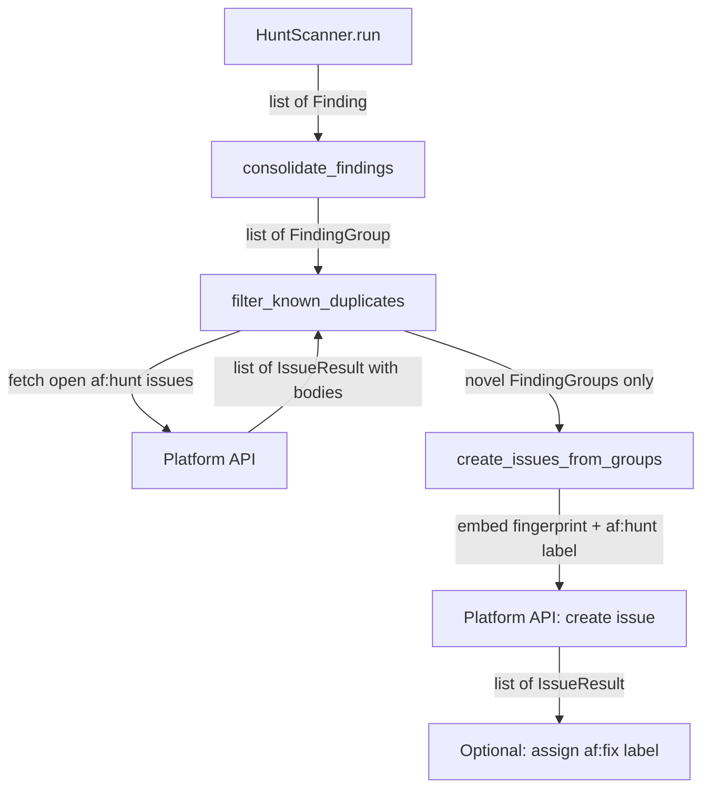

# Design Document: Cross-Iteration Hunt Scan Deduplication

## Overview

This design adds a deduplication gate to the hunt scan pipeline, inserted
between finding consolidation and issue creation. A new `dedup.py` module
handles fingerprint computation, embedding, extraction, and duplicate filtering.
The existing `create_issues_from_groups()` in `finding.py` is modified to embed
fingerprints and attach the `af:hunt` label. The `_run_hunt_scan()` method in
`engine.py` gains a single new call to the dedup gate.

## Architecture



### Module Responsibilities

1. **`agent_fox/nightshift/dedup.py`** (new) — Fingerprint computation,
   embedding, extraction, and the duplicate-filtering gate.
2. **`agent_fox/nightshift/finding.py`** (modified) — `create_issues_from_groups()`
   updated to embed fingerprint in body and pass `af:hunt` label.
3. **`agent_fox/nightshift/engine.py`** (modified) — `_run_hunt_scan()` calls
   `filter_known_duplicates()` before `create_issues_from_groups()`.

## Execution Paths

### Path 1: Hunt scan with dedup gate (happy path)

1. `nightshift/engine.py: NightShiftEngine._run_hunt_scan` — orchestrates scan
2. `nightshift/engine.py: NightShiftEngine._run_hunt_scan_inner` — calls scanner
3. `nightshift/hunt.py: HuntScanner.run` -> `list[Finding]`
4. `nightshift/critic.py: consolidate_findings(findings)` -> `list[FindingGroup]`
5. `nightshift/dedup.py: filter_known_duplicates(groups, platform)` -> `list[FindingGroup]`
   - 5a. `platform/protocol.py: PlatformProtocol.list_issues_by_label("af:hunt", state="open")` -> `list[IssueResult]`
   - 5b. `nightshift/dedup.py: extract_fingerprint(issue.body)` -> `str | None` (for each issue)
   - 5c. `nightshift/dedup.py: compute_fingerprint(group)` -> `str` (for each group)
   - 5d. Filter out groups whose fingerprint is in the known set; log skips at INFO
6. `nightshift/finding.py: create_issues_from_groups(novel_groups, platform)` -> `list[IssueResult]`
   - 6a. `nightshift/dedup.py: compute_fingerprint(group)` -> `str`
   - 6b. `nightshift/dedup.py: embed_fingerprint(body, fingerprint)` -> `str`
   - 6c. `platform/protocol.py: PlatformProtocol.create_issue(title, body, labels=["af:hunt"])` -> `IssueResult`
7. `platform/github.py: GitHubPlatform.assign_label(number, "af:fix")` — side effect: label assigned (only if `--auto`)

### Path 2: Hunt scan with platform failure during dedup (fail-open)

1-4. Same as Path 1.
5. `nightshift/dedup.py: filter_known_duplicates(groups, platform)` -> `list[FindingGroup]`
   - 5a. `platform/protocol.py: PlatformProtocol.list_issues_by_label(...)` raises `IntegrationError`
   - 5b. Log warning, return all groups unfiltered
6-7. Same as Path 1 (all groups proceed to creation).

## Components and Interfaces

### New Module: `agent_fox/nightshift/dedup.py`

```python
FINGERPRINT_LABEL: str = "af:hunt"

_FINGERPRINT_PATTERN: re.Pattern = re.compile(
    r"<!-- af:fingerprint:([0-9a-f]{16}) -->"
)

def compute_fingerprint(group: FindingGroup) -> str:
    """Compute a 16-char hex fingerprint for a FindingGroup.

    Hash input: category + NUL + sorted(deduplicated(affected_files)) joined by NUL.
    Returns first 16 hex characters of SHA-256 digest.
    """

def embed_fingerprint(body: str, fingerprint: str) -> str:
    """Append fingerprint marker to issue body.

    Returns body + newline + '<!-- af:fingerprint:{fp} -->'.
    """

def extract_fingerprint(body: str) -> str | None:
    """Extract fingerprint from issue body.

    Returns 16-char hex string or None if no marker found.
    Matches first occurrence if multiple markers present.
    """

async def filter_known_duplicates(
    groups: list[FindingGroup],
    platform: PlatformProtocol,
) -> list[FindingGroup]:
    """Fetch open af:hunt issues, extract fingerprints, return novel groups.

    On platform failure: logs warning, returns all groups (fail-open).
    For each skipped group: logs INFO with group title and matching issue number.
    """
```

### Modified: `agent_fox/nightshift/finding.py`

```python
async def create_issues_from_groups(
    groups: list[FindingGroup],
    platform: object,
) -> list[IssueResult]:
    """Create one platform issue per FindingGroup.

    MODIFIED: Embeds fingerprint in body and passes af:hunt label.
    """
```

### Modified: `agent_fox/nightshift/engine.py`

```python
async def _run_hunt_scan(self) -> None:
    # ... existing code ...
    groups = await consolidate_findings(findings)
    groups = await filter_known_duplicates(groups, self._platform)  # NEW
    created = await create_issues_from_groups(groups, self._platform)
    # ... existing label assignment ...
```

## Data Models

### Fingerprint Marker Format

```
<!-- af:fingerprint:a1b2c3d4e5f67890 -->
```

- Embedded as the last line of the issue body.
- 16 hex characters (64 bits of SHA-256).
- HTML comment: invisible in rendered markdown, preserved in API responses.

### Fingerprint Hash Input

```
{category}\0{file_1}\0{file_2}\0...\0{file_n}
```

- Fields separated by null byte (`\0`) to prevent ambiguity.
- `affected_files` are deduplicated, sorted lexicographically, then joined.
- If `affected_files` is empty, input is just `{category}`.

## Operational Readiness

- **Observability**: Duplicate skips are logged at INFO with group title and
  matching issue number. The existing `night_shift.hunt_scan_complete` audit
  event is unaffected.
- **Rollout**: No migration needed. Pre-existing issues lack `af:hunt` label
  and fingerprint marker — they are invisible to the dedup gate. First scan
  after deployment creates issues with markers; subsequent scans deduplicate.
- **Rollback**: Remove the `filter_known_duplicates()` call from `engine.py`.
  Issues already created with `af:hunt` label and fingerprint marker are
  harmless.

## Correctness Properties

### Property 1: Fingerprint Determinism

*For any* two FindingGroups with identical `category` and identical
`affected_files` sets (ignoring order and duplicates), `compute_fingerprint`
SHALL return the same value.

**Validates: Requirements 79-REQ-1.1, 79-REQ-1.2, 79-REQ-5.1, 79-REQ-5.2**

### Property 2: Fingerprint Uniqueness

*For any* two FindingGroups that differ in `category` or in their deduplicated
sorted `affected_files` sets, `compute_fingerprint` SHALL return different
values (with negligible collision probability).

**Validates: Requirements 79-REQ-1.3, 79-REQ-1.E2**

### Property 3: Embed-Extract Round-Trip

*For any* valid issue body string and any 16-character hex fingerprint,
`extract_fingerprint(embed_fingerprint(body, fp))` SHALL return `fp`.

**Validates: Requirements 79-REQ-2.1, 79-REQ-2.2**

### Property 4: Dedup Gate Conservation

*For any* list of FindingGroups and set of known fingerprints,
`filter_known_duplicates` SHALL return a subset of the input list. Every
returned group's fingerprint SHALL NOT be in the known set. Every omitted
group's fingerprint SHALL be in the known set.

**Validates: Requirements 79-REQ-4.2, 79-REQ-4.3, 79-REQ-4.4, 79-REQ-4.E3**

### Property 5: Fail-Open Guarantee

*For any* platform failure during `list_issues_by_label`, `filter_known_duplicates`
SHALL return all input groups unchanged.

**Validates: Requirements 79-REQ-4.E1**

### Property 6: Empty Files Stability

*For any* FindingGroup with an empty `affected_files` list, `compute_fingerprint`
SHALL produce a valid 16-character hex string derived solely from the `category`.

**Validates: Requirements 79-REQ-1.E1**

## Error Handling

| Error Condition | Behavior | Requirement |
|----------------|----------|-------------|
| Platform API failure during dedup fetch | Log warning, proceed without filtering (fail-open) | 79-REQ-4.E1 |
| No fingerprint marker in issue body | Ignore issue during dedup matching | 79-REQ-2.E2 |
| Multiple fingerprint markers in body | Use first match | 79-REQ-2.E1 |
| Label assignment failure | Log warning, continue | 79-REQ-3.E1 |
| All groups are duplicates | Return empty list, create no issues | 79-REQ-4.E3 |
| No open af:hunt issues exist | Proceed with empty known set (create all) | 79-REQ-4.E2 |
| Duplicate entries in affected_files | Deduplicate before hashing | 79-REQ-5.E1 |

## Technology Stack

- Python 3.12+ (hashlib for SHA-256, re for marker extraction)
- Existing `PlatformProtocol` interface (no new platform methods)
- Existing `IssueResult` dataclass (body field already populated)

## Definition of Done

A task group is complete when ALL of the following are true:

1. All subtasks within the group are checked off (`[x]`)
2. All spec tests (`test_spec.md` entries) for the task group pass
3. All property tests for the task group pass
4. All previously passing tests still pass (no regressions)
5. No linter warnings or errors introduced
6. Code is committed on a feature branch and merged into `develop`
7. `tasks.md` checkboxes are updated to reflect completion

## Testing Strategy

- **Unit tests**: Test `compute_fingerprint`, `embed_fingerprint`,
  `extract_fingerprint` in isolation with concrete inputs/outputs.
- **Property tests**: Use Hypothesis to verify determinism, uniqueness,
  round-trip, conservation, and fail-open properties.
- **Integration tests**: Test `filter_known_duplicates` with a mock platform
  returning pre-built IssueResult objects. Test the full pipeline from
  `_run_hunt_scan` through issue creation with dedup active.
