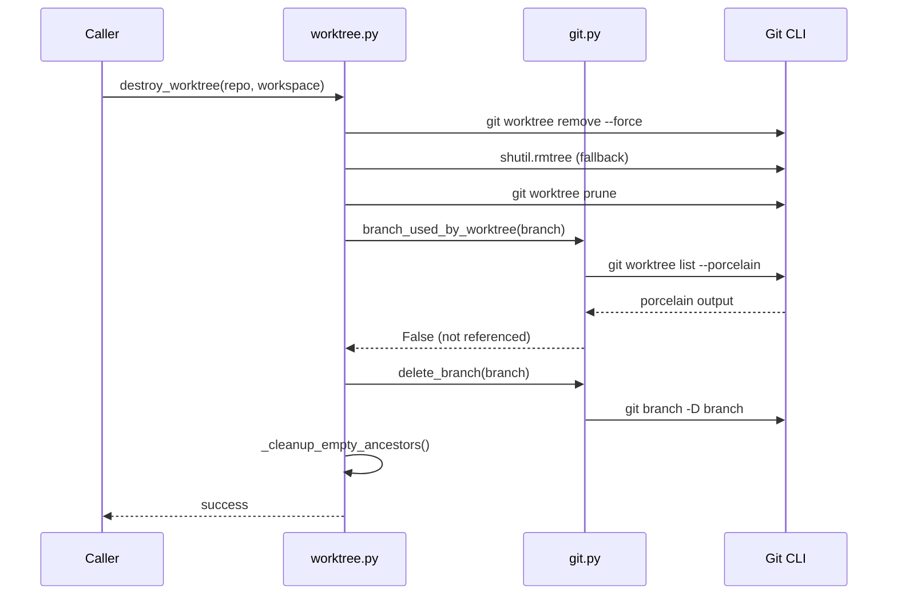

# Design Document: Worktree Cleanup Hardening

## Overview

This design modifies two existing modules — `workspace/worktree.py` and
`workspace/git.py` — to eliminate the stale-worktree race condition. No new
modules are introduced. The changes add a verification step between registry
pruning and branch deletion, make `delete_branch` self-healing for stale
worktree errors, and clean up orphaned directories.

## Architecture



### Module Responsibilities

1. **`agent_fox/workspace/git.py`** (modified) — Adds `branch_used_by_worktree()`
   verification function. Modifies `delete_branch()` to handle "used by
   worktree" errors with prune-and-retry.
2. **`agent_fox/workspace/worktree.py`** (modified) — Adds post-prune
   verification before branch deletion in both `create_worktree` and
   `destroy_worktree`. Adds orphaned directory cleanup.

## Execution Paths

### Path 1: destroy_worktree with stale registry (happy path after fix)

1. `workspace/worktree.py: destroy_worktree(repo_root, workspace)` — entry point
2. `git CLI: git worktree remove --force` — attempts clean removal (may fail)
3. `shutil.rmtree()` — fallback directory removal
4. `git CLI: git worktree prune` — clean registry
5. `workspace/git.py: branch_used_by_worktree(repo_root, branch)` -> `bool`
   - 5a. `git CLI: git worktree list --porcelain` -> parsed output
   - 5b. Returns `False` if branch not found in any worktree entry
6. `workspace/git.py: delete_branch(repo_root, branch, force=True)` — deletes branch
7. `workspace/worktree.py: _cleanup_empty_ancestors(worktree_path, root)` — removes empty dirs

### Path 2: destroy_worktree with persistent stale entry (retry path)

1-4. Same as Path 1.
5. `workspace/git.py: branch_used_by_worktree(repo_root, branch)` -> `True` (still referenced)
6. `git CLI: git worktree prune` — second prune attempt
7. `workspace/git.py: branch_used_by_worktree(repo_root, branch)` -> `bool`
   - If `True`: log warning, skip branch deletion, go to step 9
   - If `False`: proceed to step 8
8. `workspace/git.py: delete_branch(repo_root, branch, force=True)` — deletes branch
9. `workspace/worktree.py: _cleanup_empty_ancestors(worktree_path, root)` — removes empty dirs

### Path 3: delete_branch self-healing on "used by worktree"

1. `workspace/git.py: delete_branch(repo_root, branch, force=True)` — entry point
2. `git CLI: git branch -D branch` — fails with "used by worktree"
3. `git CLI: git worktree prune` — clean stale entries
4. `git CLI: git branch -D branch` — retry
   - Success: return normally
   - Failure: log warning, return without raising

### Path 4: create_worktree with stale worktree (cleaned path)

1. `workspace/worktree.py: create_worktree(repo_root, spec, group)` — entry point
2. `git CLI: git worktree remove --force` — remove stale
3. `shutil.rmtree()` — fallback removal
4. `workspace/worktree.py: _cleanup_empty_ancestors(worktree_path, root)` — clean empties
5. `git CLI: git worktree prune` — clean registry
6. `workspace/git.py: branch_used_by_worktree(repo_root, branch)` -> `bool`
   - If `True`: second prune + re-verify (same as Path 2 steps 6-7)
7. `workspace/git.py: delete_branch(repo_root, branch, force=True)` — delete stale branch
8. `workspace/git.py: create_branch(repo_root, branch, base)` — create fresh branch
9. `git CLI: git worktree add` — create worktree

## Components and Interfaces

### New function: `branch_used_by_worktree`

```python
async def branch_used_by_worktree(
    repo_root: Path,
    branch: str,
) -> bool:
    """Check if a branch is referenced by any git worktree.

    Parses `git worktree list --porcelain` output.
    Returns True if the branch appears in any worktree's `branch` line.
    Returns False if not found or if the command fails (optimistic fallback).
    """
```

### Modified function: `delete_branch`

```python
async def delete_branch(
    repo_path: Path,
    branch_name: str,
    force: bool = False,
) -> None:
    """Delete a local git branch.

    MODIFIED: If deletion fails with "used by worktree", prunes stale
    worktree entries and retries once. If the retry also fails, logs a
    warning and returns without raising (non-fatal).
    """
```

### New helper: `_cleanup_empty_ancestors`

```python
def _cleanup_empty_ancestors(
    worktree_path: Path,
    root: Path,
) -> None:
    """Remove empty directories from worktree_path up to (not including) root.

    Silently skips non-empty directories and swallows errors.
    """
```

## Data Models

No new data models. Existing `WorkspaceInfo` is unchanged.

### `git worktree list --porcelain` output format

```
worktree /path/to/main
HEAD abc123
branch refs/heads/develop

worktree /path/to/worktree
HEAD def456
branch refs/heads/feature/spec/0
```

Each worktree entry is separated by a blank line. The `branch` line contains
the full ref (e.g., `refs/heads/feature/spec/0`). Detached worktrees have no
`branch` line.

## Operational Readiness

- **Observability**: Stale worktree recovery is logged at WARNING. Successful
  verification is logged at DEBUG. Orphan cleanup is logged at DEBUG.
- **Rollout**: Pure bug fix. No migration needed.
- **Rollback**: Revert the changes — the existing behavior returns (racy but
  functional with manual cleanup).

## Correctness Properties

### Property 1: Post-Prune Verification Prevents Branch Deletion Failure

*For any* worktree directory that has been removed from the filesystem,
after `destroy_worktree` completes, `delete_branch` SHALL either succeed or
be skipped (not raise `WorkspaceError`).

**Validates: Requirements 80-REQ-1.1, 80-REQ-1.E1**

### Property 2: delete_branch Self-Healing

*For any* call to `delete_branch` that fails with "used by worktree" where
the referenced worktree directory does not exist on the filesystem,
`delete_branch` SHALL prune and retry, and SHALL not raise `WorkspaceError`.

**Validates: Requirements 80-REQ-2.1, 80-REQ-2.2**

### Property 3: Legitimate Worktree Protection

*For any* call to `delete_branch` that fails with "used by worktree" where
the referenced worktree directory **does** exist, `delete_branch` SHALL raise
`WorkspaceError`.

**Validates: Requirements 80-REQ-2.E1**

### Property 4: Orphan Directory Cleanup

*For any* completed `destroy_worktree` call, no empty directories SHALL remain
between the worktree path and the worktrees root.

**Validates: Requirements 80-REQ-3.1, 80-REQ-3.E1**

### Property 5: branch_used_by_worktree Accuracy

*For any* branch name, `branch_used_by_worktree` SHALL return `True` if and
only if `git worktree list --porcelain` contains a `branch refs/heads/{name}`
line.

**Validates: Requirements 80-REQ-1.3**

## Error Handling

| Error Condition | Behavior | Requirement |
|----------------|----------|-------------|
| Branch still referenced after two prunes | Log warning, skip deletion | 80-REQ-1.E1 |
| `git worktree list --porcelain` fails | Log warning, proceed optimistically | 80-REQ-1.E2 |
| `delete_branch` "used by worktree" (stale) | Prune + retry once | 80-REQ-2.1 |
| `delete_branch` retry also fails | Log warning, return without raising | 80-REQ-2.2 |
| `delete_branch` "used by worktree" (live) | Raise WorkspaceError | 80-REQ-2.E1 |
| Ancestor directory not empty | Leave in place | 80-REQ-3.E1 |
| Ancestor removal fails (permissions) | Log warning, continue | 80-REQ-3.E2 |

## Technology Stack

- Python 3.12+ (pathlib, shutil, asyncio)
- Git CLI (`git worktree list --porcelain`, `git worktree prune`, `git branch -D`)

## Definition of Done

A task group is complete when ALL of the following are true:

1. All subtasks within the group are checked off (`[x]`)
2. All spec tests (`test_spec.md` entries) for the task group pass
3. All property tests for the task group pass
4. All previously passing tests still pass (no regressions)
5. No linter warnings or errors introduced
6. Code is committed on a feature branch and merged into `develop`
7. `tasks.md` checkboxes are updated to reflect completion

## Testing Strategy

- **Unit tests**: Test `branch_used_by_worktree` with mocked `run_git` output.
  Test `_cleanup_empty_ancestors` with real temp directories. Test
  `delete_branch` self-healing with mocked git responses.
- **Property tests**: Verify `branch_used_by_worktree` parsing against
  generated porcelain output. Verify ancestor cleanup never removes non-empty
  directories.
- **Integration tests**: Test `destroy_worktree` and `create_worktree` with
  simulated stale state using real git repos in tmp directories.
