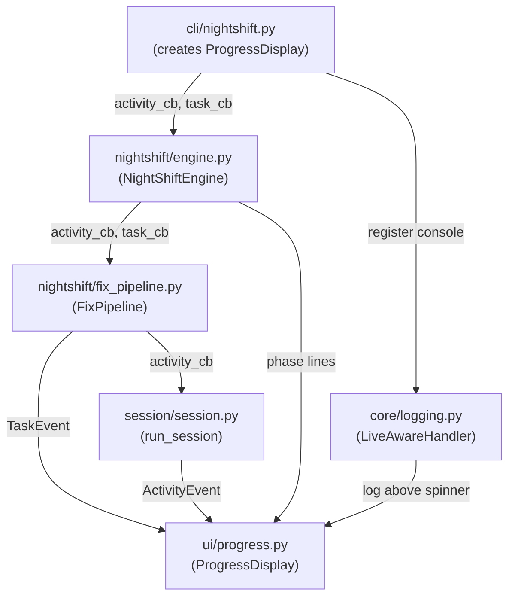

# Design Document: Night Shift — Issue-First Ordering & Console Status Output

## Overview

Two changes to the night-shift daemon:

1. **Issue-first gate** in the engine event loop: hunt scans are suppressed
   while open `af:fix` issues exist. After every hunt scan, an immediate issue
   check drains newly created issues before the next hunt scan can fire.

2. **Console status output** reusing the existing `ProgressDisplay` from
   `agent_fox.ui.progress`, wired through the engine and fix pipeline via
   callback parameters, with phase-transition permanent lines and an
   idle-state spinner.

## Architecture



### Module Responsibilities

1. **cli/nightshift.py** — Creates `ProgressDisplay`, starts/stops it, passes
   callbacks to the engine, prints summary on exit.
2. **nightshift/engine.py** — Implements the issue-first gate in the event
   loop, emits phase-transition lines via callbacks, passes callbacks to
   `FixPipeline`, manages idle-state spinner updates.
3. **nightshift/fix_pipeline.py** — Accepts callbacks, passes
   `activity_callback` to `run_session`, emits `TaskEvent`s on archetype
   completion/failure.
4. **ui/progress.py** — Existing `ProgressDisplay` (unchanged). Renders
   spinner and permanent lines.
5. **core/logging.py** — Existing `LiveAwareHandler` (unchanged). Routes
   log messages through Rich console.

## Execution Paths

### Path 1: Night-shift startup with issue-first gate

1. `cli/nightshift.py: night_shift_cmd` — creates `ProgressDisplay`, starts it
2. `cli/nightshift.py: night_shift_cmd` — creates `NightShiftEngine` with callbacks
3. `nightshift/engine.py: NightShiftEngine.run` — emits phase line "Checking for af:fix issues…"
4. `nightshift/engine.py: NightShiftEngine._run_issue_check` — fetches and processes issues
5. `nightshift/engine.py: NightShiftEngine._run_issue_check` → calls `_process_fix` for each issue
6. `nightshift/fix_pipeline.py: FixPipeline.process_issue` — runs skeptic/coder/verifier, emitting `ActivityEvent`s and `TaskEvent`s
7. `nightshift/engine.py: NightShiftEngine.run` — after all issues processed, checks if any `af:fix` remain → `bool`
8. `nightshift/engine.py: NightShiftEngine.run` — if no issues remain, emits phase line "Starting hunt scan…"
9. `nightshift/engine.py: NightShiftEngine._run_hunt_scan` — runs scan, creates issues → `int` (issues created count)
10. `nightshift/engine.py: NightShiftEngine.run` — emits phase line with findings/issues count
11. `nightshift/engine.py: NightShiftEngine.run` — post-hunt issue check (81-REQ-1.3), processes new `af:fix` issues
12. `nightshift/engine.py: NightShiftEngine.run` — enters idle loop, updates spinner with next action time

### Path 2: Fix session with activity display

1. `nightshift/engine.py: NightShiftEngine._process_fix` — emits phase line "Fixing issue #42: <title>"
2. `nightshift/fix_pipeline.py: FixPipeline.process_issue` — creates spec, branch
3. `nightshift/fix_pipeline.py: FixPipeline._run_session("skeptic", ...)` — calls `run_session` with `activity_callback`
4. `session/session.py: run_session` — emits `ActivityEvent`s to callback (tool use, thinking)
5. `nightshift/fix_pipeline.py: FixPipeline._run_session` → `SessionOutcome`
6. `nightshift/fix_pipeline.py: FixPipeline.process_issue` — emits `TaskEvent(status="completed", archetype="skeptic", ...)`
7. Steps 3-6 repeat for "coder" and "verifier" archetypes
8. `nightshift/engine.py: NightShiftEngine._process_fix` — emits phase line "✔ Issue #42 fixed (2m 30s)" or "✘ Issue #42 failed"
9. `nightshift/fix_pipeline.py: FixPipeline.process_issue` → `FixMetrics`

### Path 3: Idle state with timer display

1. `nightshift/engine.py: NightShiftEngine.run` — calculates next action time from elapsed timers
2. `nightshift/engine.py: NightShiftEngine.run` — formats time in local timezone via `datetime.now().astimezone()`
3. `nightshift/engine.py: NightShiftEngine.run` — updates spinner text: "Waiting until 03:42 for next issue check"
4. `nightshift/engine.py: NightShiftEngine.run` — on timer elapse, clears idle message and starts phase

## Components and Interfaces

### CLI Layer (`cli/nightshift.py`)

No new CLI flags. Changes to `night_shift_cmd`:

```python
def night_shift_cmd(ctx: click.Context, auto: bool) -> None:
    # ... existing setup ...
    theme = create_theme(config.theme)
    quiet = ctx.obj.get("quiet", False)
    progress = ProgressDisplay(theme, quiet=quiet)
    progress.start()
    try:
        engine = NightShiftEngine(
            config=config,
            platform=platform,
            auto_fix=auto,
            activity_callback=progress.activity_callback,
            task_callback=progress.task_callback,
        )
        state = asyncio.run(engine.run())
    finally:
        progress.stop()
```

### Engine (`nightshift/engine.py`)

**Constructor changes:**

```python
class NightShiftEngine:
    def __init__(
        self,
        config: object,
        platform: object,
        *,
        auto_fix: bool = False,
        activity_callback: ActivityCallback | None = None,
        task_callback: TaskCallback | None = None,
    ) -> None: ...
```

**New method — phase line emission:**

```python
def _emit_phase_line(self, text: str, style: str = "bold cyan") -> None:
    """Emit a permanent status line via the task callback.

    Uses a synthetic TaskEvent to render a permanent line via
    ProgressDisplay. If no callback is set, this is a no-op.
    """
```

**New method — idle spinner update:**

```python
def _update_idle_spinner(
    self, issue_remaining: float, hunt_remaining: float
) -> None:
    """Update the spinner with the next scheduled action time."""
```

**New method — pre-hunt issue gate:**

```python
async def _drain_issues(self) -> None:
    """Run issue check and process all af:fix issues until none remain."""
```

**Event loop changes in `run()`:**

The timed loop changes from independent timers to a gated sequence:

```
while not shutting_down:
    sleep(tick)
    accumulate elapsed

    if issue_elapsed >= issue_interval:
        _run_issue_check()
        issue_elapsed = 0

    if hunt_elapsed >= hunt_interval:
        # GATE: drain issues first
        _drain_issues()
        if not shutting_down:
            _run_hunt_scan()
            hunt_elapsed = 0
            # Post-hunt drain (81-REQ-1.3)
            _drain_issues()

    _update_idle_spinner(...)
```

### Fix Pipeline (`nightshift/fix_pipeline.py`)

**Constructor changes:**

```python
class FixPipeline:
    def __init__(
        self,
        config: object,
        platform: object,
        activity_callback: ActivityCallback | None = None,
        task_callback: TaskCallback | None = None,
    ) -> None: ...
```

**`_run_session` changes:**

- Pass `activity_callback` to `run_session()`.
- Wrap each archetype call with timing. On completion, emit `TaskEvent` via
  `task_callback`.

### Phase Line Rendering

Phase lines are rendered as permanent `ProgressDisplay` lines. Rather than
adding a new method to `ProgressDisplay`, the engine uses
`ProgressDisplay.on_task_event` with a synthetic `TaskEvent` whose `status`
is a custom value (e.g. `"phase"`) and `node_id` carries the phase text.

Alternatively (simpler): the engine calls `progress_display._live.console.print()`
directly through a thin wrapper. Since the engine already holds the
`task_callback`, and `ProgressDisplay.on_task_event` formats `TaskEvent`s with
specific icons, a better approach is to add a lightweight `print_status`
method to `ProgressDisplay` that prints an arbitrary `Text` object as a
permanent line. This is a minimal addition (~5 lines) that keeps the API clean.

**Decision:** Add `ProgressDisplay.print_status(text: str, style: str)` method.

```python
def print_status(self, text: str, style: str = "bold cyan") -> None:
    """Print a permanent status line above the spinner."""
    if self._quiet:
        return
    with self._lock:
        line = Text(text, style=style)
        if self._is_tty and self._live is not None:
            self._live.console.print(line)
        else:
            self._console.print(line, highlight=False)
```

The engine receives a `status_callback: Callable[[str, str], None] | None`
that maps to `ProgressDisplay.print_status`.

**Revised constructor:**

```python
class NightShiftEngine:
    def __init__(
        self,
        config: object,
        platform: object,
        *,
        auto_fix: bool = False,
        activity_callback: ActivityCallback | None = None,
        task_callback: TaskCallback | None = None,
        status_callback: Callable[[str, str], None] | None = None,
    ) -> None: ...
```

## Data Models

No new configuration fields. No new persistent state.

`NightShiftState` gains no new fields — all display state is transient and
lives in the `ProgressDisplay`.

## Operational Readiness

- **Observability**: Existing audit events are unchanged. Phase lines provide
  visual observability for interactive operators.
- **Rollout**: Backward-compatible. Omitting callbacks produces current
  behaviour.
- **Migration**: None required.

## Correctness Properties

### Property 1: Hunt Gate Invariant

*For any* sequence of engine ticks, THE engine SHALL NOT invoke
`_run_hunt_scan` while the platform reports at least one open `af:fix` issue.

**Validates: Requirements 81-REQ-1.1, 81-REQ-1.4**

### Property 2: Post-Hunt Drain

*For any* hunt scan completion, THE engine SHALL invoke `_run_issue_check`
before the next hunt scan can be scheduled.

**Validates: Requirements 81-REQ-1.3, 81-REQ-1.E3**

### Property 3: Startup Order

*For any* engine start, THE engine SHALL invoke `_run_issue_check` and process
all returned issues before invoking `_run_hunt_scan` for the first time.

**Validates: Requirements 81-REQ-1.2**

### Property 4: Callback Propagation

*For any* fix session that runs to completion, THE session runner SHALL
receive a non-None `activity_callback` if one was provided to the engine
constructor, AND the fix pipeline SHALL emit exactly one `TaskEvent` per
archetype session.

**Validates: Requirements 81-REQ-5.1, 81-REQ-5.2, 81-REQ-5.3**

### Property 5: Idle Display Accuracy

*For any* idle period where both timers are pending, THE spinner text SHALL
reference the earlier of the two next-action times.

**Validates: Requirements 81-REQ-4.1, 81-REQ-4.E1**

### Property 6: Display Lifecycle

*For any* engine run, THE `ProgressDisplay` SHALL be started before the first
engine operation and stopped after the last engine operation, regardless of
how the engine exits (clean shutdown, signal, or exception).

**Validates: Requirements 81-REQ-2.1, 81-REQ-2.2**

### Property 7: Backward Compatibility

*For any* engine constructed with all callbacks set to `None`, THE engine
SHALL produce no display output and behave identically to the current
implementation (except for the issue-first ordering change).

**Validates: Requirements 81-REQ-5.E1**

### Property 8: Phase Line Emission

*For any* phase transition (issue check start, hunt scan start, hunt scan
complete, issue fix complete, issue fix failed), THE engine SHALL emit exactly
one status line via the `status_callback`.

**Validates: Requirements 81-REQ-3.1, 81-REQ-3.2, 81-REQ-3.3, 81-REQ-3.4,
81-REQ-3.5**

## Error Handling

| Error Condition | Behavior | Requirement |
|----------------|----------|-------------|
| Platform API fails during pre-hunt issue check | Log warning, proceed with hunt scan | 81-REQ-1.E1 |
| Individual issue fix fails | Continue to next issue, still run hunt scan after | 81-REQ-1.E2 |
| stdout is not a TTY | Disable Live spinner, print plain lines | 81-REQ-2.E1 |
| --quiet flag active | Suppress all display output | 81-REQ-2.E2 |
| Callbacks are None | No display output, engine operates normally | 81-REQ-5.E1 |
| ProgressDisplay raises during phase line | Catch, log debug, continue (display is best-effort) | 81-REQ-3.E1 |

## Technology Stack

- **Rich** (existing dependency): `Console`, `Live`, `Spinner`, `Text`
- **Python `datetime`**: `datetime.now().astimezone()` for local timezone
- **Threading**: Existing `threading.Lock` in `ProgressDisplay`
- No new dependencies.

## Definition of Done

A task group is complete when ALL of the following are true:

1. All subtasks within the group are checked off (`[x]`)
2. All spec tests (`test_spec.md` entries) for the task group pass
3. All property tests for the task group pass
4. All previously passing tests still pass (no regressions)
5. No linter warnings or errors introduced
6. Code is committed on a feature branch and merged into `develop`
7. Feature branch is merged back to `develop`
8. `tasks.md` checkboxes are updated to reflect completion

## Testing Strategy

- **Unit tests**: Test the issue-first gate logic in isolation by mocking
  `_run_issue_check`, `_run_hunt_scan`, and the platform's
  `list_issues_by_label`. Verify call ordering and suppression.
- **Property tests**: Use Hypothesis to generate sequences of timer ticks
  and issue counts, asserting the hunt gate invariant holds.
- **Integration tests**: Test the full CLI → engine → display pipeline with
  a mock platform, verifying that phase lines and activity events appear
  in the correct order.
- **Display tests**: Extend existing `tests/unit/ui/test_progress.py` to
  cover the new `print_status` method.
