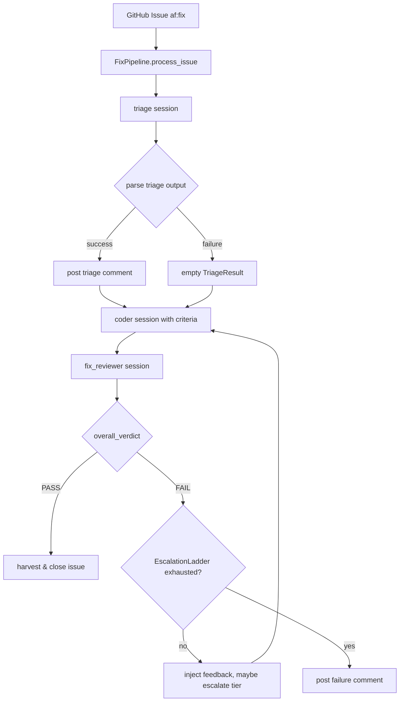

# Design Document: Fix Pipeline Triage & Reviewer Archetypes

## Overview

Replace the skeptic and verifier archetypes in the night-shift fix pipeline
with two purpose-built archetypes: **triage** (pre-coder analysis and
acceptance criteria generation) and **fix_reviewer** (post-coder verification
against those criteria). Add a retry loop with model escalation to the fix
pipeline so that reviewer FAIL verdicts trigger coder retries using the
existing `EscalationLadder` mechanism.

## Architecture



### Module Responsibilities

1. `agent_fox/archetypes.py` — Register `triage` and `fix_reviewer` entries
   in `ARCHETYPE_REGISTRY`.
2. `agent_fox/_templates/prompts/triage.md` — Prompt template directing the
   agent to explore the codebase and produce acceptance criteria as
   test-spec-style test cases.
3. `agent_fox/_templates/prompts/fix_reviewer.md` — Prompt template directing
   the agent to verify against triage criteria and produce PASS/FAIL verdicts.
4. `agent_fox/nightshift/fix_pipeline.py` — Rewrite pipeline loop: run
   triage, parse output, post comment, run coder with criteria context, run
   reviewer, parse verdict, post comment, retry/escalate on FAIL.
5. `agent_fox/session/review_parser.py` — Add `parse_triage_output()` and
   `parse_fix_review_output()` functions, extend `_resolve_wrapper_key()`
   variant map with `acceptance_criteria` key.

## Execution Paths

### Path 1: Triage analyzes issue and posts criteria

1. `nightshift/fix_pipeline.py: FixPipeline.process_issue()` — entry point
2. `nightshift/fix_pipeline.py: FixPipeline._run_session("triage", spec=spec)` → `SessionOutcome`
3. `session/review_parser.py: parse_triage_output(outcome.response, ...)` → `TriageResult`
4. `nightshift/fix_pipeline.py: FixPipeline._format_triage_comment(triage_result)` → `str`
5. `platform/github.py: GitHubPlatform.add_issue_comment(issue_number, comment)` — side effect: comment posted

### Path 2: Coder receives triage criteria and implements fix

1. `nightshift/fix_pipeline.py: FixPipeline._build_coder_prompt(spec, triage_result, review_feedback=None)` → `(system_prompt, task_prompt)`
2. `nightshift/fix_pipeline.py: FixPipeline._run_coder_session(spec, system_prompt, task_prompt, model_id=None)` → `SessionOutcome`
3. `session/session.py: run_session(workspace, ..., system_prompt, task_prompt)` → `SessionOutcome`

### Path 3: Reviewer verifies and posts verdict

1. `nightshift/fix_pipeline.py: FixPipeline._build_reviewer_prompt(spec, triage_result)` → `(system_prompt, task_prompt)`
2. `nightshift/fix_pipeline.py: FixPipeline._run_session("fix_reviewer", spec=spec, system_prompt=..., task_prompt=...)` → `SessionOutcome`
3. `session/review_parser.py: parse_fix_review_output(outcome.response, ...)` → `FixReviewResult`
4. `nightshift/fix_pipeline.py: FixPipeline._format_review_comment(review_result)` → `str`
5. `platform/github.py: GitHubPlatform.add_issue_comment(issue_number, comment)` — side effect: comment posted

### Path 4: Retry on FAIL with escalation

1. `nightshift/fix_pipeline.py: FixPipeline._coder_review_loop(spec, triage_result)` — manages retry loop
2. `routing/escalation.py: EscalationLadder.record_failure()` — tracks failure, may escalate tier
3. `routing/escalation.py: EscalationLadder.current_tier` → `ModelTier` — resolves model for next attempt
4. `nightshift/fix_pipeline.py: FixPipeline._build_coder_prompt(spec, triage_result, review_feedback=review_result)` — injects reviewer evidence
5. Path 2 (coder) and Path 3 (reviewer) repeat
6. On `EscalationLadder.is_exhausted`: `platform/github.py: GitHubPlatform.add_issue_comment(...)` — failure comment posted

## Components and Interfaces

### Data Types

```python
@dataclass(frozen=True)
class AcceptanceCriterion:
    """A single acceptance criterion from the triage agent."""
    id: str           # e.g. "AC-1"
    description: str
    preconditions: str
    expected: str
    assertion: str

@dataclass(frozen=True)
class TriageResult:
    """Parsed triage output."""
    summary: str
    affected_files: list[str]
    criteria: list[AcceptanceCriterion]

@dataclass(frozen=True)
class FixReviewVerdict:
    """A single per-criterion verdict from the fix reviewer."""
    criterion_id: str  # matches AcceptanceCriterion.id
    verdict: str       # "PASS" or "FAIL"
    evidence: str

@dataclass(frozen=True)
class FixReviewResult:
    """Parsed fix reviewer output."""
    verdicts: list[FixReviewVerdict]
    overall_verdict: str  # "PASS" or "FAIL"
    summary: str
```

### Parse Functions

```python
# In session/review_parser.py

def parse_triage_output(
    response: str,
    spec_name: str,
    session_id: str,
) -> TriageResult:
    """Parse triage JSON into TriageResult.
    Returns empty TriageResult on parse failure."""

def parse_fix_review_output(
    response: str,
    spec_name: str,
    session_id: str,
) -> FixReviewResult:
    """Parse fix reviewer JSON into FixReviewResult.
    Returns FixReviewResult with overall_verdict='FAIL' on parse failure."""
```

### Pipeline Methods

```python
# In nightshift/fix_pipeline.py

class FixPipeline:
    async def _run_triage(self, spec: InMemorySpec) -> TriageResult:
        """Run triage session, parse output, post comment."""

    def _build_coder_prompt(
        self,
        spec: InMemorySpec,
        triage: TriageResult,
        review_feedback: FixReviewResult | None = None,
    ) -> tuple[str, str]:
        """Build system/task prompts with triage criteria and optional feedback."""

    def _build_reviewer_prompt(
        self,
        spec: InMemorySpec,
        triage: TriageResult,
    ) -> tuple[str, str]:
        """Build system/task prompts with triage criteria for verification."""

    async def _run_coder_session(
        self,
        spec: InMemorySpec,
        system_prompt: str,
        task_prompt: str,
        model_id: str | None = None,
    ) -> SessionOutcome:
        """Run coder with optional model override for escalation."""

    async def _coder_review_loop(
        self,
        spec: InMemorySpec,
        triage: TriageResult,
        metrics: FixMetrics,
    ) -> bool:
        """Coder-reviewer loop with retry and escalation. Returns True on PASS."""

    def _format_triage_comment(self, triage: TriageResult) -> str:
        """Render TriageResult as markdown for issue comment."""

    def _format_review_comment(self, review: FixReviewResult) -> str:
        """Render FixReviewResult as markdown for issue comment."""
```

### Triage JSON Schema

```json
{
  "summary": "Root-cause analysis: the bug is caused by ...",
  "affected_files": ["agent_fox/nightshift/engine.py"],
  "acceptance_criteria": [
    {
      "id": "AC-1",
      "description": "Engine drains issues before starting hunt scan",
      "preconditions": "Two open issues with af:fix label exist",
      "expected": "Both issues are processed before hunt scan begins",
      "assertion": "After engine startup, issue count drops to 0 before first scan"
    }
  ]
}
```

### Fix Reviewer JSON Schema

```json
{
  "verdicts": [
    {
      "criterion_id": "AC-1",
      "verdict": "PASS",
      "evidence": "Test test_drain_before_scan passes; code calls _drain_issues() at line 142"
    }
  ],
  "overall_verdict": "PASS",
  "summary": "All 3 acceptance criteria satisfied, test suite passes (2688 tests)"
}
```

## Data Models

### Wrapper Key Extensions

The `_resolve_wrapper_key()` fuzzy-match variant map in
`session/review_parser.py` gains one new entry:

```python
"acceptance_criteria": {"acceptance_criteria", "criteria", "test_cases"},
```

The existing `"verdicts"` entry already covers the reviewer output format.

### InMemorySpec Extension

No schema change needed. The triage result is passed between pipeline methods
as a separate `TriageResult` object, not stored in the spec.

## Operational Readiness

### Observability

- Triage and fix_reviewer sessions appear in audit logs with their own
  archetype labels, making them filterable.
- `TaskEvent` emissions per archetype already exist (81-REQ-5.3).
- Parse failures logged as warnings (consistent with existing behavior).

### Rollout

- Feature flag not needed — the change is internal to the fix pipeline.
- Old skeptic/verifier templates remain for the spec-based pipeline.

### Migration

- No data migration needed. The fix pipeline is stateless between runs.

## Correctness Properties

### Property 1: Triage output completeness

*For any* triage JSON output containing an `acceptance_criteria` array,
*each* element in the array SHALL contain all five required fields (`id`,
`description`, `preconditions`, `expected`, `assertion`), and any element
missing a required field SHALL be excluded from the parsed `TriageResult`.

**Validates: Requirements 2.1, 2.2**

### Property 2: Reviewer verdict coverage

*For any* fix reviewer JSON output containing a `verdicts` array, *each*
element SHALL have a `verdict` field whose value is exactly `"PASS"` or
`"FAIL"`, and the `overall_verdict` SHALL be `"FAIL"` if any individual
verdict is `"FAIL"`.

**Validates: Requirements 5.1, 5.3**

### Property 3: Escalation ladder consistency

*For any* sequence of N consecutive reviewer FAIL verdicts processed by the
fix pipeline's retry loop, the `EscalationLadder` state (current tier,
failures at tier, exhaustion flag) SHALL be identical to the state produced
by calling `EscalationLadder.record_failure()` exactly N times on a fresh
ladder with the same config.

**Validates: Requirements 8.2, 8.3, 8.4**

### Property 4: Retry feedback injection

*For any* reviewer FAIL verdict, the subsequent coder session's task prompt
SHALL contain the reviewer's `evidence` text for every criterion that
received a `"FAIL"` verdict.

**Validates: Requirements 8.1**

### Property 5: Pipeline archetype sequence

*For any* invocation of `FixPipeline.process_issue()` that completes without
exception, the archetypes executed SHALL begin with `"triage"` and, on the
final successful pass, end with `"fix_reviewer"` whose `overall_verdict` is
`"PASS"` (or the ladder is exhausted).

**Validates: Requirements 7.1, 8.4**

### Property 6: Comment posting resilience

*For any* failure in `GitHubPlatform.add_issue_comment()` during triage or
review comment posting, the pipeline SHALL continue execution without
raising an exception to the caller.

**Validates: Requirements 3.E1, 6.E1**

## Error Handling

| Error Condition | Behavior | Requirement |
|----------------|----------|-------------|
| Triage output not parseable | Return empty TriageResult, log warning | 82-REQ-2.E1 |
| Triage session exception/timeout | Proceed with coder using issue body only | 82-REQ-7.E1 |
| Triage comment post fails | Log warning, continue | 82-REQ-3.E1 |
| Reviewer output not parseable | Treat as FAIL (forces retry) | 82-REQ-5.1 |
| No triage criteria for reviewer | Reviewer verifies from issue text | 82-REQ-5.E1 |
| Review comment post fails | Log warning, continue | 82-REQ-6.E1 |
| Escalation ladder exhausted | Post failure comment, return metrics | 82-REQ-8.4 |

## Technology Stack

- Python 3.12+
- Existing dependencies only: `claude_agent_sdk` (agent backend),
  `httpx` (GitHub API via `GitHubPlatform`), `dataclasses`, `json`, `re`.
- No new external dependencies.

## Definition of Done

A task group is complete when ALL of the following are true:

1. All subtasks within the group are checked off (`[x]`)
2. All spec tests (`test_spec.md` entries) for the task group pass
3. All property tests for the task group pass
4. All previously passing tests still pass (no regressions)
5. No linter warnings or errors introduced
6. Code is committed on a feature branch and merged into `develop`
7. `tasks.md` checkboxes are updated to reflect completion

## Testing Strategy

- **Unit tests**: Parse functions tested with valid/invalid/malformed JSON
  inputs. Pipeline methods tested with mocked `run_session` and
  `GitHubPlatform`.
- **Property tests**: Hypothesis-driven tests for parse completeness
  (Property 1), verdict validation (Property 2), and escalation consistency
  (Property 3).
- **Integration smoke tests**: End-to-end pipeline test with mock platform
  and mock agent backend verifying the full triage → coder → reviewer →
  retry flow.
