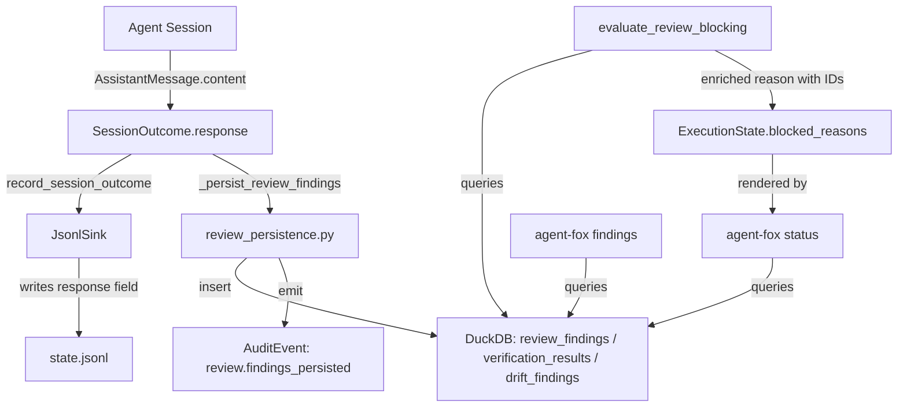

# Design Document: Review Archetype Output Visibility

## Overview

This spec adds observability for review archetype outputs at two levels:
(1) logging — raw response persistence, audit events on successful finding
insertion, enriched blocking reasons; (2) introspection — a CLI `findings`
command and a status findings summary. All changes are additive; no existing
behavior is modified.

## Architecture



### Module Responsibilities

1. `agent_fox/knowledge/jsonl_sink.py` — Write `response` field in session
   outcome JSONL records.
2. `agent_fox/engine/review_persistence.py` — Emit `review.findings_persisted`,
   `review.verdicts_persisted`, `review.drift_persisted` audit events after
   successful DuckDB inserts.
3. `agent_fox/knowledge/audit.py` — New `AuditEventType` enum members for
   persistence events.
4. `agent_fox/engine/result_handler.py` — Enrich blocking reason string in
   `evaluate_review_blocking()` with finding IDs and descriptions.
5. `agent_fox/cli/findings.py` — New CLI command `agent-fox findings`.
6. `agent_fox/reporting/findings.py` — Query and format findings from DuckDB.
7. `agent_fox/reporting/status.py` — Add findings summary section to status
   report.
8. `agent_fox/cli/app.py` — Register new `findings` command.

## Execution Paths

### Path 1: Raw response written to JSONL

1. `session/session.py: _execute_query` — captures `AssistantMessage.content`
   into `state.last_response`
2. `session/session.py: run_session` — populates `SessionOutcome(response=...)`
3. `knowledge/jsonl_sink.py: JsonlSink.record_session_outcome` — writes
   `response` field to state.jsonl
4. Side effect: JSONL file on disk contains response text

### Path 2: Findings persistence emits audit event

1. `engine/session_lifecycle.py: _persist_review_findings` — calls
   `persist_review_findings()`
2. `engine/review_persistence.py: persist_review_findings` — extracts JSON,
   parses findings, inserts to DuckDB
3. `knowledge/review_store.py: insert_findings` → `int` (count of inserted
   findings)
4. `engine/review_persistence.py: persist_review_findings` — emits
   `review.findings_persisted` audit event with count and severity summary
5. Side effect: audit event in `.agent-fox/audit/*.jsonl`

### Path 3: Enriched blocking reason

1. `engine/result_handler.py: _handle_success` — calls
   `check_skeptic_blocking()`
2. `engine/result_handler.py: evaluate_review_blocking` — queries
   `query_findings_by_session()`, gets `list[ReviewFinding]`
3. `engine/result_handler.py: _format_block_reason` — formats reason string
   with finding IDs and truncated descriptions → `str`
4. `engine/result_handler.py: evaluate_review_blocking` — returns
   `BlockDecision(reason=enriched_reason)`
5. `engine/engine.py: _block_task` — stores in
   `state.blocked_reasons[node_id]`
6. Side effect: enriched reason visible in `agent-fox status`

### Path 4: CLI findings command

1. `cli/app.py: main.add_command(findings_cmd)` — registers command
2. `cli/findings.py: findings_cmd` — parses options, opens DuckDB
3. `reporting/findings.py: query_findings` — queries DuckDB with filters →
   `list[FindingRow]`
4. `reporting/findings.py: format_findings_table` — formats as table or JSON
   → `str`
5. Side effect: formatted output to stdout

### Path 5: Status findings summary

1. `cli/status.py: status_cmd` — calls `generate_status()`
2. `reporting/status.py: generate_status` — calls
   `_build_findings_summary()` if DB available
3. `reporting/findings.py: query_findings_summary` — queries DuckDB for
   specs with active critical/major findings → `list[FindingsSummary]`
4. `reporting/status.py: StatusReport` — includes `findings_summary` field
5. Side effect: "Review Findings" section in status output

## Components and Interfaces

### New Data Types

```python
@dataclass(frozen=True)
class FindingRow:
    """Unified row for displaying findings from any review table."""
    id: str
    severity: str
    archetype: str  # "skeptic", "verifier", "oracle"
    spec_name: str
    task_group: str
    description: str
    created_at: datetime

@dataclass(frozen=True)
class FindingsSummary:
    """Per-spec summary of active findings by severity."""
    spec_name: str
    critical: int
    major: int
    minor: int
    observation: int
```

### New Functions

```python
# reporting/findings.py
def query_findings(
    conn: DuckDBPyConnection,
    *,
    spec: str | None = None,
    severity: str | None = None,
    archetype: str | None = None,
    run_id: str | None = None,
    active_only: bool = True,
) -> list[FindingRow]: ...

def query_findings_summary(
    conn: DuckDBPyConnection,
) -> list[FindingsSummary]: ...

def format_findings_table(
    findings: list[FindingRow],
    json_output: bool = False,
) -> str: ...

# engine/result_handler.py (modified)
def _format_block_reason(
    archetype: str,
    findings: list[ReviewFinding],
    threshold: int,
    spec_name: str,
    task_group: str,
) -> str: ...
```

### New Audit Event Types

```python
class AuditEventType(str, Enum):
    # ... existing ...
    REVIEW_FINDINGS_PERSISTED = "review.findings_persisted"
    REVIEW_VERDICTS_PERSISTED = "review.verdicts_persisted"
    REVIEW_DRIFT_PERSISTED = "review.drift_persisted"
```

### CLI Command

```
agent-fox findings [OPTIONS]

Options:
  --spec TEXT       Filter by spec name
  --severity TEXT   Minimum severity (critical, major, minor, observation)
  --archetype TEXT  Filter by archetype (skeptic, verifier, oracle)
  --run TEXT        Filter by run ID
  --json           Output as JSON array
```

## Data Models

### JSONL Session Outcome Record (modified)

```json
{
  "type": "session_outcome",
  "id": "uuid",
  "spec_name": "...",
  "node_id": "...",
  "status": "completed",
  "input_tokens": 1234,
  "output_tokens": 567,
  "duration_ms": 45000,
  "response": "{ \"findings\": [...] }",
  "created_at": "2026-04-07T..."
}
```

### Audit Event Payload: review.findings_persisted

```json
{
  "archetype": "skeptic",
  "count": 3,
  "severity_summary": {"critical": 1, "major": 2},
  "spec_name": "82_fix_pipeline",
  "task_group": "2"
}
```

### Enriched Blocking Reason Format

```
Skeptic found 2 critical finding(s) (threshold: 1) for spec:group —
F-abc123: Missing error handling for null inp…, F-def456: No validation on…
```

## Operational Readiness

- **Observability:** New audit events provide a positive signal for successful
  persistence (vs. only failure signals today). The `findings` command allows
  ad-hoc inspection without DuckDB tooling.
- **Rollout:** All changes are additive. The JSONL field addition is
  backward-compatible (older readers ignore unknown fields). No migration
  needed.
- **Rollback:** Remove the `response` field from JSONL writes. Remove audit
  event emissions. Revert blocking reason format. Remove CLI command
  registration.

## Correctness Properties

### Property 1: Response Field Completeness

*For any* session outcome with a non-empty `response` field, the JSONL sink
SHALL write a record containing a `response` key whose value equals the
`SessionOutcome.response` value (or its truncation if over 100,000 chars).

**Validates: Requirements 84-REQ-1.1, 84-REQ-1.2, 84-REQ-1.E1**

### Property 2: Audit Event Emission on Persistence

*For any* successful review finding insertion that produces count > 0, the
system SHALL emit exactly one `review.findings_persisted` (or
`review.verdicts_persisted` / `review.drift_persisted`) audit event whose
`count` field equals the number of inserted records.

**Validates: Requirements 84-REQ-2.1, 84-REQ-2.2, 84-REQ-2.3**

### Property 3: Enriched Block Reason Contains Finding IDs

*For any* skeptic blocking decision where critical findings exist, the
blocking reason string SHALL contain at least one finding ID matching the
pattern `F-[a-f0-9]+` and the count of critical findings.

**Validates: Requirements 84-REQ-3.1, 84-REQ-3.E1**

### Property 4: Findings Query Monotonic Severity Filter

*For any* severity filter value S applied to `query_findings()`, the
returned set SHALL contain only findings whose severity is at or above S
in the ordering critical > major > minor > observation.

**Validates: Requirements 84-REQ-4.3**

### Property 5: Findings Command Output Completeness

*For any* non-empty result from `query_findings()`, the formatted table
output SHALL contain one row per finding with severity, archetype,
spec_name, and a non-empty description.

**Validates: Requirements 84-REQ-4.1, 84-REQ-4.6**

### Property 6: Status Summary Omission

*For any* state where no spec has active critical or major findings, the
status report SHALL not include a "Review Findings" section.

**Validates: Requirements 84-REQ-5.1, 84-REQ-5.2**

## Error Handling

| Error Condition | Behavior | Requirement |
|----------------|----------|-------------|
| Response > 100k chars | Truncate + append "[truncated]" | 84-REQ-1.E1 |
| Audit event emission fails | Log warning, continue | 84-REQ-2.E1 |
| > 3 critical findings in block | Show first 3 IDs + "and N more" | 84-REQ-3.E1 |
| No knowledge DB for findings cmd | Print message, exit 0 | 84-REQ-4.E1 |
| Empty query result | Print message, exit 0 | 84-REQ-4.E2 |
| DB open fails in status | Omit section, log debug | 84-REQ-5.E1 |

## Technology Stack

- Python 3.12+
- Click (CLI framework, already in use)
- DuckDB (already in use for review storage)
- JSONL (existing logging format)

## Definition of Done

A task group is complete when ALL of the following are true:

1. All subtasks within the group are checked off (`[x]`)
2. All spec tests (`test_spec.md` entries) for the task group pass
3. All property tests for the task group pass
4. All previously passing tests still pass (no regressions)
5. No linter warnings or errors introduced
6. Code is committed on a feature branch and merged into `develop`
7. Feature branch is merged back to `develop`
8. `tasks.md` checkboxes are updated to reflect completion

## Testing Strategy

- **Unit tests:** Each new function (JSONL field writing, audit event
  emission, block reason formatting, query functions, CLI output) tested
  in isolation with mock DuckDB connections and fake findings data.
- **Property tests:** Hypothesis-based tests for severity filtering
  monotonicity, truncation correctness, and finding ID presence in block
  reasons.
- **Integration tests:** Smoke tests that exercise the full path from
  `persist_review_findings()` through audit event emission and from
  `findings_cmd` through formatted output.
