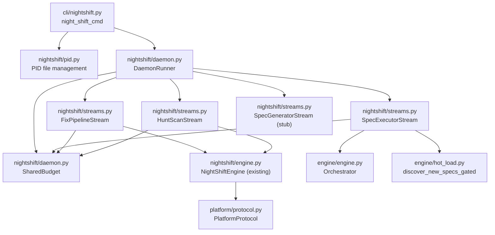
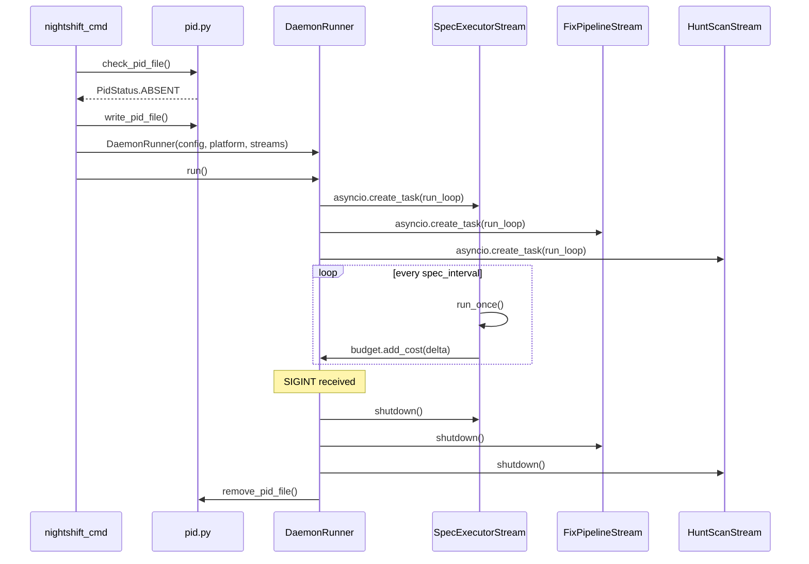

# Design Document: Daemon Framework

## Overview

The daemon framework refactors `night-shift` into a unified long-running
process with pluggable work streams. A `DaemonRunner` class manages stream
lifecycles, PID file locking, shared cost budget, and signal handling. Four
built-in work streams wrap existing capabilities (spec executor, fix pipeline,
hunt scans) plus a stub for spec generation (spec 86). The `PlatformProtocol`
is extended with `create_pull_request()` for the draft-PR merge strategy.

## Architecture





### Module Responsibilities

1. **`nightshift/stream.py`** — `WorkStream` protocol definition.
2. **`nightshift/streams.py`** — Four concrete stream classes wrapping existing
   capabilities.
3. **`nightshift/daemon.py`** — `DaemonRunner` class (lifecycle, scheduling,
   `SharedBudget`) and signal handling.
4. **`nightshift/pid.py`** — PID file read/write/check/remove utilities.
5. **`nightshift/engine.py`** — Existing `NightShiftEngine` (unchanged except
   removing the `run()` timed-loop; stream wrappers call individual methods).
6. **`nightshift/config.py`** — Extended `NightShiftConfig` with new fields.
7. **`platform/protocol.py`** — Extended `PlatformProtocol` with
   `create_pull_request()`.
8. **`platform/github.py`** — `GitHubPlatform.create_pull_request()`
   implementation.
9. **`cli/nightshift.py`** — Updated CLI with `--no-*` flags, PID management.
10. **`cli/code.py`** — PID check guard, `--watch` alias.
11. **`cli/plan.py`** — PID check guard.

## Execution Paths

### Path 1: Daemon startup

1. `cli/nightshift.py: night_shift_cmd` — CLI entry, parses flags
2. `nightshift/pid.py: check_pid_file(pid_path)` → `PidStatus` (ALIVE, STALE, ABSENT)
3. `nightshift/pid.py: write_pid_file(pid_path)` — writes current PID
4. `nightshift/daemon.py: DaemonRunner.__init__(config, platform, streams, budget)` — registers streams
5. `nightshift/daemon.py: DaemonRunner.run()` — emits `NIGHT_SHIFT_START` audit event, launches asyncio tasks
6. Side effect: PID file written, audit event emitted, stream tasks running

### Path 2: Spec executor discovers and executes specs

1. `nightshift/streams.py: SpecExecutorStream.run_once()` — triggered by timer
2. `engine/hot_load.py: discover_new_specs_gated(specs_dir, known_specs, repo_root)` → `list[SpecInfo]`
3. `nightshift/streams.py: SpecExecutorStream._run_batch(specs)` — builds plan, creates Orchestrator
4. `engine/engine.py: Orchestrator.run()` → `ExecutionState`
5. `nightshift/daemon.py: SharedBudget.add_cost(state.total_cost)` — reports cost
6. Side effect: specs executed, cost added to shared budget

### Path 3: Fix pipeline processes issues

1. `nightshift/streams.py: FixPipelineStream.run_once()` — triggered by timer
2. `nightshift/engine.py: NightShiftEngine._drain_issues()` → `bool`
3. `nightshift/engine.py: NightShiftEngine._run_issue_check()` — polls platform
4. `nightshift/engine.py: NightShiftEngine._process_fix(issue)` — runs fix pipeline
5. `nightshift/daemon.py: SharedBudget.add_cost(cost_delta)` — reports cost delta
6. Side effect: issues fixed, cost added to shared budget

### Path 4: Hunt scan discovers issues

1. `nightshift/streams.py: HuntScanStream.run_once()` — triggered by timer
2. `nightshift/engine.py: NightShiftEngine._run_hunt_scan()` — runs all categories
3. `nightshift/engine.py: NightShiftEngine._run_hunt_scan_inner()` → `list[Finding]`
4. `nightshift/critic.py: consolidate_findings(findings)` → `list[FindingGroup]`
5. `nightshift/finding.py: create_issues_from_groups(groups, platform)` → `list[IssueResult]`
6. `nightshift/daemon.py: SharedBudget.add_cost(cost_delta)` — reports cost delta
7. Side effect: issues created on platform, cost added to shared budget

### Path 5: Graceful shutdown

1. Signal handler catches SIGINT/SIGTERM
2. `nightshift/daemon.py: DaemonRunner.request_shutdown()` — sets `_shutting_down` event
3. Each stream's current `run_once()` completes (not interrupted mid-operation)
4. `nightshift/daemon.py: DaemonRunner._shutdown_streams()` — calls `shutdown()` on each stream
5. `nightshift/daemon.py: DaemonRunner.run()` — emits `NIGHT_SHIFT_START` audit event with `"phase": "stop"` payload
6. `nightshift/pid.py: remove_pid_file(pid_path)` — removes PID file
7. Side effect: PID file removed, audit event emitted, daemon exits

### Path 6: `code`/`plan` PID check

1. `cli/code.py: code_cmd()` or `cli/plan.py: plan_cmd()` — CLI entry
2. `nightshift/pid.py: check_pid_file(pid_path)` → `PidStatus`
3. If `ALIVE`: `sys.exit(1)` with error message
4. If `STALE` or `ABSENT`: proceed normally
5. Side effect: command blocked or allowed based on daemon state

### Path 7: Draft PR creation (merge_strategy="pr")

1. Caller (fix pipeline or spec executor) completes work on feature branch
2. `platform/protocol.py: PlatformProtocol.create_pull_request(title, body, head, base, draft=True)` — protocol method
3. `platform/github.py: GitHubPlatform.create_pull_request()` — POST to GitHub REST API
4. Returns `PullRequestResult(number, url, html_url)` to caller
5. Side effect: draft PR created on GitHub

## Components and Interfaces

### WorkStream Protocol (`nightshift/stream.py`)

```python
from typing import Protocol, runtime_checkable

@runtime_checkable
class WorkStream(Protocol):
    @property
    def name(self) -> str: ...

    @property
    def interval(self) -> int: ...

    @property
    def enabled(self) -> bool: ...

    async def run_once(self) -> None: ...

    async def shutdown(self) -> None: ...
```

### SharedBudget (`nightshift/daemon.py`)

```python
@dataclass
class SharedBudget:
    max_cost: float | None
    _total_cost: float = 0.0

    def add_cost(self, cost: float) -> None:
        self._total_cost += cost

    @property
    def total_cost(self) -> float:
        return self._total_cost

    @property
    def exceeded(self) -> bool:
        if self.max_cost is None:
            return False
        return self._total_cost >= self.max_cost
```

### DaemonRunner (`nightshift/daemon.py`)

```python
class DaemonRunner:
    def __init__(
        self,
        config: AgentFoxConfig,
        platform: PlatformProtocol | None,
        streams: list[WorkStream],
        budget: SharedBudget,
        *,
        activity_callback: ActivityCallback | None = None,
        task_callback: TaskCallback | None = None,
        status_callback: Callable[[str, str], None] | None = None,
    ) -> None: ...

    def request_shutdown(self) -> None: ...

    async def run(self) -> DaemonState: ...
```

### DaemonState (`nightshift/daemon.py`)

```python
@dataclass
class DaemonState:
    total_cost: float = 0.0
    total_sessions: int = 0
    issues_created: int = 0
    issues_fixed: int = 0
    hunt_scans_completed: int = 0
    specs_executed: int = 0
    uptime_seconds: float = 0.0
```

### PID File Utilities (`nightshift/pid.py`)

```python
class PidStatus(Enum):
    ALIVE = "alive"
    STALE = "stale"
    ABSENT = "absent"

def check_pid_file(pid_path: Path) -> tuple[PidStatus, int | None]: ...
def write_pid_file(pid_path: Path) -> None: ...
def remove_pid_file(pid_path: Path) -> None: ...
```

### PullRequestResult (`platform/github.py`)

```python
@dataclass(frozen=True)
class PullRequestResult:
    number: int
    url: str
    html_url: str
```

### PlatformProtocol Extension (`platform/protocol.py`)

```python
async def create_pull_request(
    self,
    title: str,
    body: str,
    head: str,
    base: str,
    draft: bool = True,
) -> PullRequestResult: ...
```

### NightShiftConfig Extensions (`nightshift/config.py`)

```python
class NightShiftConfig(BaseModel):
    # Existing fields...
    issue_check_interval: int = 900
    hunt_scan_interval: int = 14400
    categories: NightShiftCategoryConfig
    quality_gate_timeout: int = 600

    # New fields
    spec_interval: int = 60          # minimum 10
    spec_gen_interval: int = 300     # minimum 60
    enabled_streams: list[str] = ["specs", "fixes", "hunts", "spec_gen"]
    merge_strategy: str = "direct"   # "direct" or "pr"
```

## Data Models

### Configuration Schema (config.toml)

```toml
[night_shift]
issue_check_interval = 900
hunt_scan_interval = 14400
quality_gate_timeout = 600
spec_interval = 60
spec_gen_interval = 300
enabled_streams = ["specs", "fixes", "hunts", "spec_gen"]
merge_strategy = "direct"

[night_shift.categories]
dependency_freshness = true
# ... existing category toggles
```

### PID File Format

Plain integer at `.agent-fox/daemon.pid`:

```
12345
```

### Stream Name Mapping

| Config Name | Stream Class | Default Interval |
|-------------|-------------|-----------------|
| `specs` | `SpecExecutorStream` | 60s |
| `fixes` | `FixPipelineStream` | 900s |
| `hunts` | `HuntScanStream` | 14400s |
| `spec_gen` | `SpecGeneratorStream` | 300s |

## Operational Readiness

### Observability

- Daemon start/stop emits `NIGHT_SHIFT_START` audit events (with `"phase":
  "stop"` payload on shutdown).
- Each stream logs cycle start/end at INFO level.
- Cost budget changes logged at DEBUG level.
- PID file operations logged at INFO level.

### Rollout / Rollback

- The refactored `night-shift` command is backward-compatible: with no new
  flags, it behaves like the existing command (fix pipeline + hunt scans).
- `code --watch` continues to work via alias mapping.
- Rolling back: revert the commit; the old `NightShiftEngine.run()` loop
  is restored.

### Migration

- No data migration required. The PID file is created fresh on each startup.
- Existing `[night_shift]` config section is extended, not replaced. Old
  configs work with defaults for new fields.

## Correctness Properties

### Property 1: PID Mutual Exclusion

*For any* sequence of daemon startup attempts on the same repo, THE PID file
mechanism SHALL ensure that at most one daemon process is running at any time:
if a live PID file exists, subsequent startup attempts fail.

**Validates: Requirements 85-REQ-2.1, 85-REQ-2.E1, 85-REQ-3.1, 85-REQ-3.2**

### Property 2: Cost Monotonicity and Limit

*For any* sequence of `add_cost(c)` calls where `c >= 0`, the `SharedBudget`
total cost SHALL be monotonically non-decreasing, AND once `total_cost >=
max_cost` the `exceeded` property SHALL return True and remain True.

**Validates: Requirements 85-REQ-5.1, 85-REQ-5.2, 85-REQ-5.E1**

### Property 3: Stream Isolation

*For any* work stream that raises an exception during `run_once()`, THE daemon
SHALL continue running all other registered streams without interruption. The
faulting stream SHALL be retried on its next cycle.

**Validates: Requirements 85-REQ-1.4, 85-REQ-1.E1**

### Property 4: Shutdown Completeness

*For any* graceful shutdown sequence, THE daemon SHALL call `shutdown()` on
every registered stream, remove the PID file, and emit a stop audit event,
regardless of which stream was active when the signal arrived.

**Validates: Requirements 85-REQ-2.2, 85-REQ-2.4, 85-REQ-2.5**

### Property 5: Config Interval Clamping

*For any* `spec_interval` value below 10, THE `NightShiftConfig` validator
SHALL clamp it to 10. *For any* `spec_gen_interval` below 60, it SHALL clamp
to 60. The clamped value SHALL always be >= the documented minimum.

**Validates: Requirements 85-REQ-9.1, 85-REQ-9.E1**

### Property 6: Platform Degradation

*For any* configuration where `platform.type == "none"`, THE daemon SHALL
disable exactly the fix pipeline, hunt scans, and spec generator streams,
leaving only the spec executor enabled (unless also disabled via CLI flag).

**Validates: Requirements 85-REQ-7.1, 85-REQ-7.E1**

### Property 7: Enabled Stream Filtering

*For any* combination of `--no-*` CLI flags and `enabled_streams` config, THE
daemon SHALL run only streams that are both in `enabled_streams` AND not
disabled by a `--no-*` flag. The set of running streams SHALL equal the
intersection of config-enabled and CLI-enabled streams.

**Validates: Requirements 85-REQ-1.3, 85-REQ-6.1, 85-REQ-9.2**

## Error Handling

| Error Condition | Behavior | Requirement |
|----------------|----------|-------------|
| PID file exists with live process | Exit with code 1 | 85-REQ-2.E1 |
| PID file exists with dead process | Warn, remove, proceed | 85-REQ-2.E2 |
| PID file write failure | Exit with code 1 | 85-REQ-2.E3 |
| Stream `run_once()` exception | Log, retry next cycle | 85-REQ-1.4 |
| All streams disabled | Warn, idle loop | 85-REQ-1.E2 |
| `create_pull_request()` failure | Log, comment with branch name | 85-REQ-8.E1 |
| Unknown `merge_strategy` value | Warn, fall back to "direct" | 85-REQ-8.E2 |
| Unknown stream name in `enabled_streams` | Warn, ignore | 85-REQ-9.2 |
| Empty `enabled_streams` list | Treat as all enabled | 85-REQ-9.E2 |
| `discover_new_specs_gated()` exception | Log, retry next cycle | 85-REQ-10.E1 |
| Platform type is "none" | Disable platform-dependent streams | 85-REQ-7.1 |

## Technology Stack

- **Language:** Python 3.12+
- **Async:** asyncio (existing)
- **Config:** Pydantic v2 models (existing `NightShiftConfig`)
- **HTTP:** httpx (existing, for GitHub API)
- **CLI:** Click (existing)
- **Testing:** pytest, pytest-asyncio, Hypothesis
- **Package manager:** uv

## Definition of Done

A task group is complete when ALL of the following are true:

1. All subtasks within the group are checked off (`[x]`)
2. All spec tests (`test_spec.md` entries) for the task group pass
3. All property tests for the task group pass
4. All previously passing tests still pass (no regressions)
5. No linter warnings or errors introduced
6. Code is committed on a feature branch and merged into `develop`
7. Feature branch is merged back to `develop`
8. `tasks.md` checkboxes are updated to reflect completion

## Testing Strategy

### Unit Tests

- **PID file module:** test check/write/remove with real temp files; test
  stale detection with a PID that is not alive.
- **SharedBudget:** test cost accumulation, `exceeded` property, None limit.
- **NightShiftConfig extensions:** test field defaults, clamping, validation.
- **WorkStream protocol:** test `isinstance` checks against concrete classes.
- **DaemonRunner:** test stream registration, enabled-stream filtering.

### Property-Based Tests (Hypothesis)

- **Cost monotonicity:** generate random sequences of `add_cost()` calls,
  verify total is monotonically non-decreasing and `exceeded` triggers
  correctly.
- **Interval clamping:** generate random interval values, verify clamped
  output is always >= minimum.
- **Stream filtering:** generate random enabled/disabled combinations, verify
  the running set is the correct intersection.

### Integration Tests

- **Daemon lifecycle:** start DaemonRunner with mock streams, verify PID file
  creation, stream `run_once()` invocation, shutdown cleanup.
- **Spec executor:** mock `discover_new_specs_gated()` to return specs, verify
  Orchestrator is instantiated and cost is reported.
- **Fix/hunt streams:** mock NightShiftEngine methods, verify stream wrappers
  call them and report cost deltas.
- **PR creation:** mock httpx to verify correct GitHub API call shape.

### Smoke Tests

- End-to-end daemon start → stream cycle → shutdown with mock platform,
  verifying PID file lifecycle, audit events, and cost tracking.
