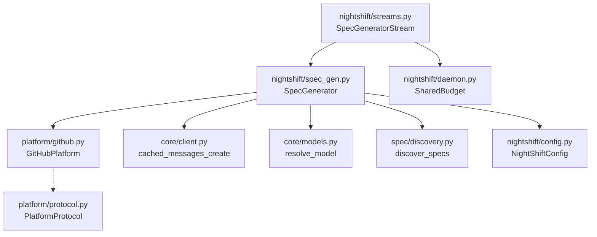
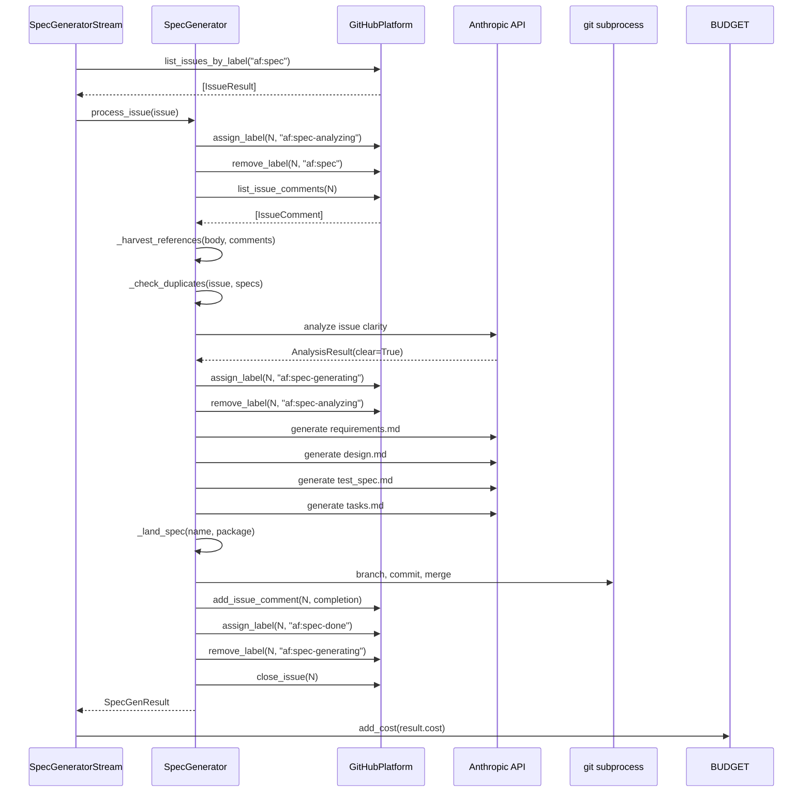

# Design Document: Spec Generator

## Overview

The spec generator extends the daemon with an autonomous issue-to-spec
pipeline. A `SpecGenerator` class in `nightshift/spec_gen.py` orchestrates
the full workflow: issue discovery, AI analysis, clarification loop, spec
document generation, and git landing. The `SpecGeneratorStream` (currently
a stub in `nightshift/streams.py` from spec 85) is replaced with a real
implementation that delegates to `SpecGenerator`. Three new platform methods
(`remove_label`, `list_issue_comments`, `get_issue`) support the label state
machine and context gathering.

## Architecture





### Module Responsibilities

1. **`nightshift/spec_gen.py`** — `SpecGenerator` class: orchestrates
   analysis, clarification, generation, and landing. Contains AI prompt
   constants and all spec-generation logic.
2. **`nightshift/streams.py`** — `SpecGeneratorStream`: replaces the stub
   from spec 85. Polls for issues, delegates to `SpecGenerator`, reports
   cost to `SharedBudget`.
3. **`platform/github.py`** — `GitHubPlatform`: adds `remove_label()`,
   `list_issue_comments()`, `get_issue()`, and `IssueComment` dataclass.
4. **`platform/protocol.py`** — `PlatformProtocol`: adds the three new
   method signatures.
5. **`nightshift/config.py`** — `NightShiftConfig`: adds
   `max_clarification_rounds`, `max_budget_usd`, `spec_gen_model_tier`.

## Execution Paths

### Path 1: Clear issue — generate and land spec

1. `nightshift/streams.py: SpecGeneratorStream.run_once()` — triggered by timer
2. `platform/github.py: GitHubPlatform.list_issues_by_label("af:spec")` → `list[IssueResult]`
3. `nightshift/spec_gen.py: SpecGenerator.process_issue(issue)` → `SpecGenResult`
4. `platform/github.py: GitHubPlatform.assign_label(N, "af:spec-analyzing")`
5. `platform/github.py: GitHubPlatform.remove_label(N, "af:spec")`
6. `platform/github.py: GitHubPlatform.list_issue_comments(N)` → `list[IssueComment]`
7. `nightshift/spec_gen.py: SpecGenerator._harvest_references(body, comments)` → `list[ReferencedIssue]`
8. `nightshift/spec_gen.py: SpecGenerator._check_duplicates(issue, existing_specs)` → `DuplicateCheckResult(is_duplicate=False)`
9. `nightshift/spec_gen.py: SpecGenerator._analyze_issue(issue, comments, context)` → `AnalysisResult(clear=True)`
10. `platform/github.py: GitHubPlatform.assign_label(N, "af:spec-generating")`
11. `platform/github.py: GitHubPlatform.remove_label(N, "af:spec-analyzing")`
12. `nightshift/spec_gen.py: SpecGenerator._generate_spec_package(issue, context)` → `SpecPackage`
13. `nightshift/spec_gen.py: SpecGenerator._land_spec(spec_name, package)` → `str` (commit hash)
14. `platform/github.py: GitHubPlatform.add_issue_comment(N, completion_comment)`
15. `platform/github.py: GitHubPlatform.assign_label(N, "af:spec-done")`
16. `platform/github.py: GitHubPlatform.remove_label(N, "af:spec-generating")`
17. `platform/github.py: GitHubPlatform.close_issue(N)`
18. Side effect: 5 spec files committed to `develop`, issue closed

### Path 2: Ambiguous issue — post clarification

1. `nightshift/streams.py: SpecGeneratorStream.run_once()` — triggered by timer
2. `nightshift/spec_gen.py: SpecGenerator.process_issue(issue)` → `SpecGenResult`
3. Steps 4-7 from Path 1 (label transition, fetch comments, harvest refs)
4. `nightshift/spec_gen.py: SpecGenerator._analyze_issue(...)` → `AnalysisResult(clear=False, questions=[...])`
5. `nightshift/spec_gen.py: SpecGenerator._format_clarification_comment(questions, round_num, max_rounds)` → `str`
6. `platform/github.py: GitHubPlatform.add_issue_comment(N, clarification_comment)`
7. `platform/github.py: GitHubPlatform.assign_label(N, "af:spec-pending")`
8. `platform/github.py: GitHubPlatform.remove_label(N, "af:spec-analyzing")`
9. Side effect: clarification comment posted, issue waiting for human

### Path 3: Pending issue with response — re-analyze

1. `nightshift/streams.py: SpecGeneratorStream.run_once()` — triggered by timer
2. `platform/github.py: GitHubPlatform.list_issues_by_label("af:spec-pending")` → `list[IssueResult]`
3. `platform/github.py: GitHubPlatform.list_issue_comments(N)` → `list[IssueComment]`
4. `nightshift/spec_gen.py: SpecGenerator._has_new_human_comment(comments)` → `True`
5. `platform/github.py: GitHubPlatform.assign_label(N, "af:spec-analyzing")`
6. `platform/github.py: GitHubPlatform.remove_label(N, "af:spec-pending")`
7. Continue as Path 1 step 6+ or Path 2 step 4+ (depending on analysis result)
8. Side effect: issue re-analyzed with new context

### Path 4: Max rounds exceeded — escalation

1. `nightshift/spec_gen.py: SpecGenerator._count_clarification_rounds(comments)` → `n >= max_rounds`
2. `nightshift/spec_gen.py: SpecGenerator._format_escalation_comment(open_questions)` → `str`
3. `platform/github.py: GitHubPlatform.add_issue_comment(N, escalation_comment)`
4. `platform/github.py: GitHubPlatform.assign_label(N, "af:spec-blocked")`
5. `platform/github.py: GitHubPlatform.remove_label(N, "af:spec-analyzing")`
6. Side effect: issue blocked with explanation

### Path 5: Cost cap exceeded during generation

1. `nightshift/spec_gen.py: SpecGenerator._generate_spec_package()` — cost tracker crosses `max_budget_usd`
2. `nightshift/spec_gen.py: SpecGenerator._format_budget_comment(cost, limit)` → `str`
3. `platform/github.py: GitHubPlatform.add_issue_comment(N, budget_comment)`
4. `platform/github.py: GitHubPlatform.assign_label(N, "af:spec-blocked")`
5. `platform/github.py: GitHubPlatform.remove_label(N, "af:spec-generating")`
6. Side effect: generation aborted, issue blocked

## Components and Interfaces

### IssueComment (`platform/github.py`)

```python
@dataclass(frozen=True)
class IssueComment:
    id: int
    body: str
    user: str          # GitHub login
    created_at: str    # ISO 8601
```

### New GitHubPlatform Methods

```python
async def remove_label(self, issue_number: int, label: str) -> None: ...
async def list_issue_comments(self, issue_number: int) -> list[IssueComment]: ...
async def get_issue(self, issue_number: int) -> IssueResult: ...
```

### SpecGenOutcome (`nightshift/spec_gen.py`)

```python
class SpecGenOutcome(StrEnum):
    GENERATED = "generated"    # spec created and landed
    PENDING = "pending"        # clarification posted, waiting
    BLOCKED = "blocked"        # escalated or error
    SKIPPED = "skipped"        # stale, no-op, or waiting
```

### SpecGenResult (`nightshift/spec_gen.py`)

```python
@dataclass(frozen=True)
class SpecGenResult:
    outcome: SpecGenOutcome
    issue_number: int
    spec_name: str | None = None
    commit_hash: str | None = None
    cost: float = 0.0
```

### AnalysisResult (`nightshift/spec_gen.py`)

```python
@dataclass(frozen=True)
class AnalysisResult:
    clear: bool
    questions: list[str]    # empty if clear
    summary: str            # brief analysis narrative
```

### DuplicateCheckResult (`nightshift/spec_gen.py`)

```python
@dataclass(frozen=True)
class DuplicateCheckResult:
    is_duplicate: bool
    overlapping_spec: str | None = None   # e.g. "42_webhook_support"
    explanation: str = ""
```

### ReferencedIssue (`nightshift/spec_gen.py`)

```python
@dataclass(frozen=True)
class ReferencedIssue:
    number: int
    title: str
    body: str
    comments: list[IssueComment]
```

### SpecPackage (`nightshift/spec_gen.py`)

```python
@dataclass(frozen=True)
class SpecPackage:
    spec_name: str                   # e.g. "87_webhook_support"
    files: dict[str, str]            # filename -> content
    source_issue_url: str
```

### SpecGenerator (`nightshift/spec_gen.py`)

```python
class SpecGenerator:
    def __init__(
        self,
        platform: PlatformProtocol,
        config: NightShiftConfig,
        repo_root: Path,
    ) -> None: ...

    async def process_issue(self, issue: IssueResult) -> SpecGenResult:
        """Full pipeline: analyze, clarify or generate, land."""

    # --- Internal methods ---

    async def _analyze_issue(
        self,
        issue: IssueResult,
        comments: list[IssueComment],
        context: _SpecGenContext,
    ) -> AnalysisResult: ...

    async def _check_duplicates(
        self,
        issue: IssueResult,
        existing_specs: list[SpecInfo],
    ) -> DuplicateCheckResult: ...

    async def _generate_spec_package(
        self,
        issue: IssueResult,
        comments: list[IssueComment],
        context: _SpecGenContext,
    ) -> SpecPackage: ...

    async def _land_spec(
        self,
        package: SpecPackage,
        issue_number: int,
    ) -> str:
        """Create branch, write files, commit, merge. Returns commit hash."""

    def _harvest_references(
        self,
        body: str,
        comments: list[IssueComment],
    ) -> list[ReferencedIssue]: ...

    def _has_new_human_comment(
        self,
        comments: list[IssueComment],
    ) -> bool: ...

    def _count_clarification_rounds(
        self,
        comments: list[IssueComment],
    ) -> int: ...

    def _is_fox_comment(self, comment: IssueComment) -> bool: ...

    def _find_next_spec_number(self) -> int: ...

    def _spec_name_from_title(self, title: str, prefix: int) -> str: ...

    # --- Label transition helpers ---

    async def _transition_label(
        self,
        issue_number: int,
        from_label: str,
        to_label: str,
    ) -> None:
        """Assign to_label, then remove from_label."""

    # --- Comment formatters ---

    def _format_clarification_comment(
        self, questions: list[str], round_num: int, max_rounds: int,
    ) -> str: ...

    def _format_completion_comment(
        self, package: SpecPackage, commit_hash: str,
    ) -> str: ...

    def _format_escalation_comment(
        self, open_questions: list[str],
    ) -> str: ...

    def _format_budget_comment(
        self, cost: float, limit: float,
    ) -> str: ...
```

### SpecGeneratorStream (updated, `nightshift/streams.py`)

```python
class SpecGeneratorStream:
    """WorkStream that polls af:spec issues and generates specs.

    Replaces the no-op stub from spec 85.
    """

    def __init__(
        self,
        config: NightShiftConfig,
        platform: PlatformProtocol,
        repo_root: Path,
    ) -> None: ...

    @property
    def name(self) -> str:
        return "spec-generator"

    @property
    def interval(self) -> int:
        return self._config.spec_gen_interval

    @property
    def enabled(self) -> bool:
        return self._enabled

    async def run_once(self) -> None:
        """One cycle: discover issues, process one, report cost."""

    async def shutdown(self) -> None:
        """No-op — no persistent resources."""
```

### NightShiftConfig Extensions (`nightshift/config.py`)

```python
class NightShiftConfig(BaseModel):
    # ... existing fields ...

    # New fields (spec 86)
    max_clarification_rounds: int = Field(
        default=3,
        description="Max clarification rounds before escalation (min 1)",
    )
    max_budget_usd: float = Field(
        default=2.0,
        description="Per-spec generation cost cap in USD (0 = unlimited)",
    )
    spec_gen_model_tier: str = Field(
        default="ADVANCED",
        description="Model tier for spec generation (SIMPLE/STANDARD/ADVANCED)",
    )
```

## Data Models

### Label Constants

```python
LABEL_SPEC = "af:spec"
LABEL_ANALYZING = "af:spec-analyzing"
LABEL_PENDING = "af:spec-pending"
LABEL_GENERATING = "af:spec-generating"
LABEL_DONE = "af:spec-done"
LABEL_BLOCKED = "af:spec-blocked"
```

### Fox Comment Signature

All fox comments start with `## Agent Fox`. Detection:

```python
def _is_fox_comment(self, comment: IssueComment) -> bool:
    return comment.body.strip().startswith("## Agent Fox")
```

### Reference Pattern

Issue references are parsed via regex `#(\d+)` from issue body and
comment bodies. The existing `reference_parser.py` module is reused
where possible.

### Spec Name Derivation

```python
def _spec_name_from_title(self, title: str, prefix: int) -> str:
    slug = re.sub(r"[^a-z0-9]+", "_", title.lower()).strip("_")
    slug = slug[:40]  # truncate long titles
    return f"{prefix:02d}_{slug}"
```

## Operational Readiness

### Observability

- `SpecGeneratorStream.run_once()` logs cycle start/end at INFO level.
- Each label transition is logged at INFO level.
- AI API calls log model, token count, and cost at DEBUG level.
- Reference harvesting logs found/skipped references at DEBUG level.
- Cost tracking logs cumulative cost after each API call at DEBUG level.

### Rollout / Rollback

- The spec generator replaces a no-op stub — rolling back restores the
  stub. No data migration needed.
- Generated specs are committed to `develop` via feature branches. If a
  generated spec is bad, it can be reverted with a standard `git revert`.

### Migration

- New config fields have defaults that match the PRD. Existing configs
  work without modification.
- No database or state file migration required (stateless design).

## Correctness Properties

### Property 1: Label Exclusivity

*For any* issue processed by the spec generator, THE system SHALL ensure
that at most one `af:spec-*` label is present on the issue at any point
during processing: the new label is assigned before the old one is removed.

**Validates: Requirements 86-REQ-3.1, 86-REQ-3.2, 86-REQ-3.3, 86-REQ-3.4**

### Property 2: Clarification Round Boundedness

*For any* issue with clarification history, THE `_count_clarification_rounds`
function SHALL return a value between 0 and the total number of fox
clarification comments (inclusive), AND the system SHALL never post more
than `max_clarification_rounds` clarification comments.

**Validates: Requirements 86-REQ-5.1, 86-REQ-5.2**

### Property 3: Fox Comment Detection Consistency

*For any* comment body string, `_is_fox_comment()` SHALL return True if
and only if the stripped body starts with `## Agent Fox`.

**Validates: Requirements 86-REQ-5.3, 86-REQ-2.3, 86-REQ-2.4**

### Property 4: Spec Number Uniqueness

*For any* set of existing spec folders in `.specs/`, `_find_next_spec_number()`
SHALL return a value strictly greater than all existing numeric prefixes.

**Validates: Requirements 86-REQ-6.3, 86-REQ-6.E2**

### Property 5: Remove Label Idempotency

*For any* call to `remove_label(issue_number, label)` where the label is
not present on the issue, THE platform SHALL succeed without raising an
exception.

**Validates: Requirements 86-REQ-1.1, 86-REQ-1.2**

### Property 6: Cost Monotonicity and Cap

*For any* sequence of AI API calls during a single spec generation, THE
cumulative cost tracker SHALL be monotonically non-decreasing, AND if
`max_budget_usd > 0`, generation SHALL abort before the next API call
once the cumulative cost exceeds the limit.

**Validates: Requirements 86-REQ-10.1, 86-REQ-10.2**

### Property 7: Spec Name Derivation Determinism

*For any* issue title and spec prefix, `_spec_name_from_title()` SHALL
produce a valid spec folder name matching the pattern `\d{2}_[a-z0-9_]+`
AND the same inputs SHALL always produce the same output.

**Validates: Requirements 86-REQ-6.3**

## Error Handling

| Error Condition | Behavior | Requirement |
|----------------|----------|-------------|
| Label not present on issue | Succeed silently | 86-REQ-1.2 |
| Non-404 API error on remove_label | Raise IntegrationError | 86-REQ-1.E1 |
| No comments on issue | Return empty list | 86-REQ-1.E2 |
| Issue not found (get_issue) | Raise IntegrationError | 86-REQ-1.E3 |
| No af:spec issues | No-op | 86-REQ-2.E1 |
| Stale issue (>30 days) | Skip with warning | 86-REQ-2.E2 |
| Stale af:spec-analyzing label | Reset to af:spec | 86-REQ-3.E1 |
| Stale af:spec-generating label | Reset to af:spec | 86-REQ-3.E2 |
| Referenced issue inaccessible | Skip with warning | 86-REQ-4.E1 |
| Empty issue body | Treat as ambiguous | 86-REQ-4.E2 |
| Max rounds on first analysis | Post escalation | 86-REQ-5.E1 |
| API call fails during generation | Abort, block issue | 86-REQ-6.E1 |
| No existing specs | Use prefix 01 | 86-REQ-6.E2 |
| No specs for duplicate check | Skip detection | 86-REQ-7.E1 |
| Branch name collision | Append suffix | 86-REQ-8.E1 |
| Merge/PR creation failure | Comment with branch, block | 86-REQ-8.E2 |
| max_clarification_rounds < 1 | Clamp to 1 | 86-REQ-9.E1 |
| Invalid model tier | Fall back to ADVANCED | 86-REQ-9.E2 |
| Budget exceeded mid-generation | Abort, block issue | 86-REQ-10.2 |
| max_budget_usd is 0 or None | Unlimited budget | 86-REQ-10.E1 |

## Technology Stack

- **Language:** Python 3.12+
- **Async:** asyncio
- **AI Client:** Anthropic SDK via `core/client.py` (`cached_messages_create`)
- **Model Resolution:** `core/models.py` (`resolve_model`, `ModelTier`)
- **HTTP:** httpx (for GitHub API, via `GitHubPlatform`)
- **Config:** Pydantic v2 (extending `NightShiftConfig`)
- **Git:** subprocess calls (`git branch`, `git checkout`, `git commit`,
  `git merge`)
- **Testing:** pytest, pytest-asyncio, Hypothesis
- **Spec Discovery:** `spec/discovery.py` (`discover_specs`, `SpecInfo`)

## Definition of Done

A task group is complete when ALL of the following are true:

1. All subtasks within the group are checked off (`[x]`)
2. All spec tests (`test_spec.md` entries) for the task group pass
3. All property tests for the task group pass
4. All previously passing tests still pass (no regressions)
5. No linter warnings or errors introduced
6. Code is committed on a feature branch and merged into `develop`
7. Feature branch is merged back to `develop`
8. `tasks.md` checkboxes are updated to reflect completion

## Testing Strategy

### Unit Tests

- **Platform methods:** mock httpx responses, verify correct API URLs,
  request shapes, and error handling for `remove_label`,
  `list_issue_comments`, `get_issue`.
- **Config extensions:** test defaults, clamping, validation.
- **SpecGenerator helpers:** test `_is_fox_comment`, `_count_rounds`,
  `_has_new_human_comment`, `_find_next_spec_number`,
  `_spec_name_from_title`, `_harvest_references` with concrete inputs.
- **Comment formatters:** verify output matches expected format.

### Property-Based Tests (Hypothesis)

- Label exclusivity (transition always assigns before removing).
- Fox comment detection (consistent with prefix check).
- Spec number uniqueness (always exceeds max existing).
- Cost monotonicity and cap enforcement.
- Spec name derivation (always valid pattern, deterministic).

### Integration Tests

- **End-to-end happy path:** mock platform + AI, verify spec files are
  produced, commit message is correct, issue is closed.
- **Clarification round-trip:** mock platform, verify question comment
  is posted, label transitions occur, re-analysis works after response.
- **Escalation:** verify escalation comment and label after max rounds.
- **Cost cap:** verify generation aborts and issue is blocked.
- **Crash recovery:** verify stale labels are reset.
