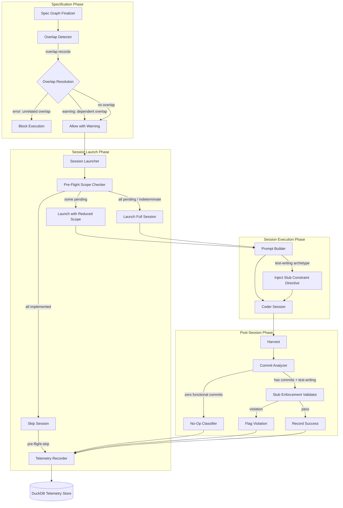
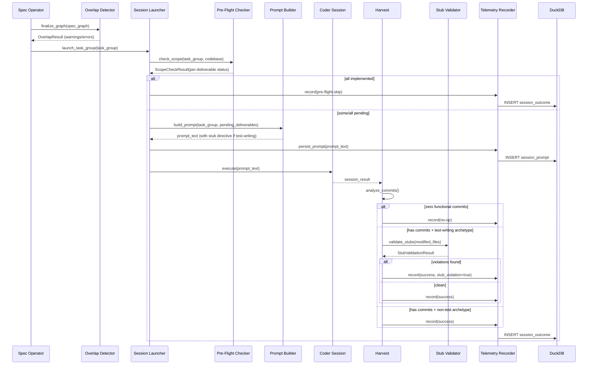

# Design Document: Coder Session Scope Guard

## Overview

This system prevents wasted coder sessions by addressing the root cause: test-writing task groups producing full implementations instead of stubs, and no mechanism to detect already-complete work before launching sessions. The design introduces four interlocking subsystems: (1) stub enforcement that validates test-writing session output, (2) pre-flight scope checking that skips or reduces session scope when work is already done, (3) specification-graph-level scope overlap detection, and (4) telemetry tracking for no-op and pre-flight-skip outcomes. Together, these form a defense-in-depth approach—overlap detection prevents bad plans, pre-flight checks prevent wasted launches, stub enforcement prevents the root cause, and no-op tracking provides feedback for continuous improvement.

## Architecture



### Data Flow: Test-Writing Task Group Lifecycle



### Module Responsibilities

1. **`scope_guard/overlap_detector.py`** — Analyzes specification graph deliverable lists across task groups to find and report scope overlaps.
2. **`scope_guard/preflight_checker.py`** — Compares task group deliverables against codebase state to determine what work remains.
3. **`scope_guard/stub_validator.py`** — Scans post-session file diffs to verify that test-writing sessions produced only stubs in non-test code.
4. **`scope_guard/stub_patterns.py`** — Defines language-specific stub placeholder patterns and test-block detection rules.
5. **`scope_guard/prompt_builder.py`** — Constructs coder session prompts, injecting stub constraint directives for test-writing archetypes.
6. **`scope_guard/session_classifier.py`** — Classifies session outcomes (success, no-op, pre-flight-skip, failure, harvest-error) based on commit analysis.
7. **`scope_guard/telemetry.py`** — Records session outcomes, prompt texts, and scope check results to DuckDB; supports aggregate queries.
8. **`scope_guard/source_parser.py`** — Parses source files to extract function/method boundaries and body contents for stub detection and scope checking.
9. **`scope_guard/models.py`** — Defines all shared data models, enums, and typed structures.

## Execution Paths

### Path 1: Overlap detection at spec graph finalization

1. `scope_guard/overlap_detector.py: detect_overlaps(spec_graph: SpecGraph)` → `OverlapResult`
2. For each pair of task groups, `scope_guard/overlap_detector.py: _compare_deliverables(tg_a: TaskGroup, tg_b: TaskGroup)` → `list[OverlapRecord]`
3. `scope_guard/overlap_detector.py: _classify_overlaps(overlaps: list[OverlapRecord], spec_graph: SpecGraph)` → `OverlapResult` — sets severity to `error` if no dependency, `warning` if dependency exists
4. Side effect: returns `OverlapResult` to caller; caller emits warnings/errors and blocks execution if any `error`-severity overlaps exist.

### Path 2: Pre-flight scope check skips a fully-implemented task group

1. Caller (session launcher) invokes `scope_guard/preflight_checker.py: check_scope(task_group: TaskGroup, codebase_root: Path)` → `ScopeCheckResult`
2. For each deliverable, `scope_guard/source_parser.py: extract_function_body(file_path: Path, function_id: str)` → `FunctionBody | None`
3. For each extracted body, `scope_guard/stub_patterns.py: is_stub_body(body: str, language: Language)` → `bool`
4. `scope_guard/preflight_checker.py: _classify_deliverable(body: FunctionBody | None, is_stub: bool)` → `DeliverableStatus` (pending | already-implemented | indeterminate)
5. All deliverables return `already-implemented` → `ScopeCheckResult.overall == AllImplemented`
6. Caller skips session launch → `scope_guard/telemetry.py: record_session_outcome(outcome: SessionOutcome)` — writes `pre-flight-skip` record
7. Side effect: `pre-flight-skip` row inserted into DuckDB `session_outcomes` table

### Path 3: Pre-flight scope check launches session with reduced scope

1. `scope_guard/preflight_checker.py: check_scope(task_group: TaskGroup, codebase_root: Path)` → `ScopeCheckResult` with mixed statuses
2. `ScopeCheckResult.overall == PartiallyImplemented`
3. Caller invokes `scope_guard/prompt_builder.py: build_prompt(task_group: TaskGroup, scope_result: ScopeCheckResult)` → `PromptText`
4. `scope_guard/prompt_builder.py: _filter_pending_deliverables(scope_result: ScopeCheckResult)` → `list[Deliverable]`
5. Prompt is built listing only pending deliverables with already-implemented ones as context
6. If test-writing archetype: `scope_guard/prompt_builder.py: _inject_stub_directive(prompt: PromptText)` → `PromptText`
7. `scope_guard/telemetry.py: persist_prompt(session_id: str, prompt_text: str)` — side effect: prompt stored in DuckDB
8. Side effect: coder session launched with reduced-scope prompt

### Path 4: Stub enforcement validates a test-writing session

1. Harvest triggers `scope_guard/session_classifier.py: classify_session(session: SessionResult, task_group: TaskGroup)` → `SessionOutcome`
2. `session_classifier.py` determines commits exist and archetype is test-writing → calls `scope_guard/stub_validator.py: validate_stubs(modified_files: list[FileChange], task_group: TaskGroup)` → `StubValidationResult`
3. For each non-test file: `scope_guard/source_parser.py: extract_modified_functions(file_change: FileChange)` → `list[FunctionBody]`
4. For each function: `scope_guard/stub_patterns.py: is_stub_body(body: str, language: Language)` → `bool`
5. `scope_guard/stub_validator.py: _check_test_block_exclusion(file_change: FileChange, function: FunctionBody)` → `bool` — determines if function is inside a test block
6. Non-stub functions outside test blocks are collected as violations
7. `scope_guard/stub_validator.py` returns `StubValidationResult(passed: bool, violations: list[ViolationRecord])`
8. If violations: `scope_guard/telemetry.py: record_session_outcome(outcome: SessionOutcome)` with `stub_violation=True` and violation details
9. Side effect: warning emitted to operator, violation record stored in DuckDB

### Path 5: No-op session classification

1. Harvest invokes `scope_guard/session_classifier.py: classify_session(session: SessionResult, task_group: TaskGroup)` → `SessionOutcome`
2. `scope_guard/session_classifier.py: _count_functional_commits(session: SessionResult)` → `int` — filters whitespace/comment-only commits
3. Count is zero and session did not end in error → `SessionOutcome.classification == "no-op"`
4. `scope_guard/telemetry.py: record_session_outcome(outcome: SessionOutcome)` — side effect: `no-op` row inserted into DuckDB

### Path 6: Session failure classification (agent crash/timeout with no commits)

1. Harvest invokes `scope_guard/session_classifier.py: classify_session(session: SessionResult, task_group: TaskGroup)` → `SessionOutcome`
2. `_count_functional_commits` returns 0, but `session.exit_status` indicates error/timeout
3. `SessionOutcome.classification == "failure"` (not no-op)
4. `scope_guard/telemetry.py: record_session_outcome(outcome: SessionOutcome)` — side effect: `failure` row inserted into DuckDB

### Path 7: Aggregate no-op / pre-flight-skip reporting

1. Operator invokes `scope_guard/telemetry.py: query_waste_report(spec_number: int | None)` → `WasteReport`
2. Executes DuckDB query: `SELECT spec_number, classification, COUNT(*), SUM(cost), SUM(duration) FROM session_outcomes WHERE classification IN ('no-op', 'pre-flight-skip') GROUP BY spec_number, classification`
3. Returns `WasteReport(per_spec: list[SpecWasteSummary])` to caller

### Path 8: Prompt content verification for audit

1. Auditor queries `scope_guard/telemetry.py: get_session_prompt(session_id: str)` → `PromptRecord`
2. Returns `PromptRecord(session_id, prompt_text, truncated: bool, stub_directive_present: bool)`
3. On stub violation, `scope_guard/stub_validator.py: _check_prompt_had_directive(session_id: str)` calls `telemetry.get_session_prompt(session_id)` → `PromptRecord`
4. `ViolationRecord.prompt_directive_present` populated from `PromptRecord.stub_directive_present`

## Components and Interfaces

### Core Data Types

```python
# scope_guard/models.py

from dataclasses import dataclass, field
from enum import Enum
from pathlib import Path
from datetime import datetime


class Language(Enum):
    RUST = "rust"
    PYTHON = "python"
    TYPESCRIPT = "typescript"
    JAVASCRIPT = "javascript"
    UNKNOWN = "unknown"


class DeliverableStatus(Enum):
    PENDING = "pending"
    ALREADY_IMPLEMENTED = "already-implemented"
    INDETERMINATE = "indeterminate"


class SessionClassification(Enum):
    SUCCESS = "success"
    NO_OP = "no-op"
    PRE_FLIGHT_SKIP = "pre-flight-skip"
    FAILURE = "failure"
    HARVEST_ERROR = "harvest-error"


class OverlapSeverity(Enum):
    WARNING = "warning"
    ERROR = "error"


@dataclass(frozen=True)
class Deliverable:
    file_path: str
    function_id: str  # fully qualified: "module::function" or "Class.method"
    task_group_number: int


@dataclass(frozen=True)
class FunctionBody:
    function_id: str
    file_path: str
    body_text: str
    language: Language
    start_line: int
    end_line: int
    inside_test_block: bool


@dataclass(frozen=True)
class DeliverableCheckResult:
    deliverable: Deliverable
    status: DeliverableStatus
    reason: str


@dataclass(frozen=True)
class ScopeCheckResult:
    task_group_number: int
    deliverable_results: list[DeliverableCheckResult]
    overall: str  # "all-pending", "all-implemented", "partially-implemented", "indeterminate"
    check_duration_ms: int
    deliverable_count: int


@dataclass(frozen=True)
class OverlapRecord:
    deliverable_id: str
    task_group_numbers: list[int]
    severity: OverlapSeverity


@dataclass(frozen=True)
class OverlapResult:
    overlaps: list[OverlapRecord]
    has_errors: bool
    has_warnings: bool


@dataclass(frozen=True)
class ViolationRecord:
    file_path: str
    function_id: str
    body_preview: str  # first 200 chars of the offending body
    prompt_directive_present: bool | None  # None if not yet checked


@dataclass(frozen=True)
class StubValidationResult:
    passed: bool
    violations: list[ViolationRecord]
    skipped_files: list[str]  # files with unsupported languages


@dataclass(frozen=True)
class SessionOutcome:
    session_id: str
    spec_number: int
    task_group_number: int
    classification: SessionClassification
    duration_seconds: float
    cost_dollars: float
    timestamp: datetime
    stub_violation: bool = False
    violation_details: list[ViolationRecord] = field(default_factory=list)
    reason: str = ""


@dataclass(frozen=True)
class PromptRecord:
    session_id: str
    prompt_text: str
    truncated: bool
    stub_directive_present: bool


@dataclass(frozen=True)
class SpecWasteSummary:
    spec_number: int
    no_op_count: int
    pre_flight_skip_count: int
    total_wasted_cost: float
    total_wasted_duration: float


@dataclass(frozen=True)
class WasteReport:
    per_spec: list[SpecWasteSummary]


@dataclass
class TaskGroup:
    number: int
    spec_number: int
    archetype: str  # e.g., "test-writing", "implementation", "integration"
    deliverables: list[Deliverable]
    depends_on: list[int]  # task group numbers this depends on


@dataclass
class SpecGraph:
    spec_number: int
    task_groups: list[TaskGroup]


@dataclass(frozen=True)
class FileChange:
    file_path: str
    language: Language
    diff_text: str


@dataclass
class SessionResult:
    session_id: str
    spec_number: int
    task_group_number: int
    branch_name: str
    base_branch: str
    exit_status: str  # "success", "error", "timeout"
    duration_seconds: float
    cost_dollars: float
    modified_files: list[FileChange]
    commit_count: int
```

### Module Interfaces

```python
# scope_guard/overlap_detector.py
def detect_overlaps(spec_graph: SpecGraph) -> OverlapResult: ...

# scope_guard/preflight_checker.py
def check_scope(task_group: TaskGroup, codebase_root: Path) -> ScopeCheckResult: ...

# scope_guard/stub_validator.py
def validate_stubs(modified_files: list[FileChange], task_group: TaskGroup) -> StubValidationResult: ...

# scope_guard/stub_patterns.py
def is_stub_body(body: str, language: Language) -> bool: ...
def detect_language(file_path: str) -> Language: ...
def get_stub_patterns(language: Language) -> list[re.Pattern]: ...
def is_test_block(body: str, file_path: str, language: Language) -> bool: ...

# scope_guard/prompt_builder.py
def build_prompt(task_group: TaskGroup, scope_result: ScopeCheckResult | None = None) -> str: ...

# scope_guard/session_classifier.py
def classify_session(session: SessionResult, task_group: TaskGroup) -> SessionOutcome: ...

# scope_guard/source_parser.py
def extract_function_body(file_path: Path, function_id: str) -> FunctionBody | None: ...
def extract_all_functions(file_path: Path) -> list[FunctionBody]: ...
def extract_modified_functions(file_change: FileChange) -> list[FunctionBody]: ...

# scope_guard/telemetry.py
def record_session_outcome(outcome: SessionOutcome) -> None: ...
def persist_prompt(session_id: str, prompt_text: str) -> None: ...
def get_session_prompt(session_id: str) -> PromptRecord | None: ...
def query_waste_report(spec_number: int | None = None) -> WasteReport: ...
```

## Data Models

### DuckDB Schema

```sql
CREATE TABLE IF NOT EXISTS session_outcomes (
    session_id          VARCHAR PRIMARY KEY,
    spec_number         INTEGER NOT NULL,
    task_group_number   INTEGER NOT NULL,
    classification      VARCHAR NOT NULL,  -- 'success', 'no-op', 'pre-flight-skip', 'failure', 'harvest-error'
    duration_seconds    DOUBLE NOT NULL,
    cost_dollars        DOUBLE NOT NULL,
    timestamp           TIMESTAMP NOT NULL,
    stub_violation      BOOLEAN DEFAULT FALSE,
    violation_details   JSON,              -- list of ViolationRecord dicts
    reason              VARCHAR DEFAULT ''
);

CREATE TABLE IF NOT EXISTS session_prompts (
    session_id          VARCHAR PRIMARY KEY,
    prompt_text         TEXT NOT NULL,
    truncated           BOOLEAN DEFAULT FALSE,
    stub_directive_present BOOLEAN NOT NULL,
    timestamp           TIMESTAMP NOT NULL
);

CREATE TABLE IF NOT EXISTS scope_check_results (
    id                  INTEGER PRIMARY KEY,
    spec_number         INTEGER NOT NULL,
    task_group_number   INTEGER NOT NULL,
    overall_status      VARCHAR NOT NULL,
    deliverable_count   INTEGER NOT NULL,
    check_duration_ms   INTEGER NOT NULL,
    deliverable_results JSON NOT NULL,     -- list of DeliverableCheckResult dicts
    timestamp           TIMESTAMP NOT NULL
);
```

### Prompt Size Limit

The `session_prompts.prompt_text` column stores full prompt text. If the prompt exceeds 100,000 characters, the system stores the first 500 and last 500 characters separated by `\n...[TRUNCATED]...\n` and sets `truncated = TRUE`. This satisfies `[87-REQ-5.E1]`.

### Stub Directive Format

The stub constraint directive is a tagged instruction block embedded in the prompt:

```
<!-- SCOPE_GUARD:STUB_ONLY -->
CONSTRAINT: For all non-test source code, produce ONLY type signatures and stub 
bodies. Stub bodies must consist solely of a placeholder expression:
- Rust: todo!(), unimplemented!(), or panic!("not implemented")
- Python: raise NotImplementedError or pass (as the sole statement)
- TypeScript/JavaScript: throw new Error("not implemented")
Do NOT implement any business logic in non-test code.
<!-- /SCOPE_GUARD:STUB_ONLY -->
```

The presence of `SCOPE_GUARD:STUB_ONLY` tags is how the system detects whether the directive was included (for `[87-REQ-5.3]`).

### Stub Patterns by Language

| Language | Stub Patterns (body matches) |
|----------|------------------------------|
| Rust | `todo!()`, `todo!("...")`, `unimplemented!()`, `unimplemented!("...")`, `panic!("not implemented")`, `panic!("...")` |
| Python | Body is exactly `raise NotImplementedError` or `raise NotImplementedError("...")`, or body is exactly `pass` |
| TypeScript/JS | `throw new Error("not implemented")`, `throw new Error("...")` |

A body is a stub if and only if, after stripping comments and whitespace, its entire content matches one of the patterns above for its language. Any additional statements disqualify it (`[87-REQ-1.E2]`).

### Test Block Detection

| Language | Test Block Identification |
|----------|--------------------------|
| Rust | Code inside `#[cfg(test)]` module or `#[test]` attributed functions |
| Python | Files matching `test_*.py` or `*_test.py`, or functions/methods starting with `test_`, or code inside classes inheriting from `unittest.TestCase` |
| TypeScript/JS | Files matching `*.test.ts`, `*.spec.ts`, `*.test.js`, `*.spec.js`, or code inside `describe()`/`it()`/`test()` blocks |

## Operational Readiness

### Observability Hooks

- **Scope check telemetry**: Every pre-flight scope check logs duration, deliverable count, and per-deliverable status (`[87-REQ-2.5]`).
- **Stub validation events**: Violations emit structured warnings with file path, function ID, and body preview.
- **Overlap detection events**: Overlaps are logged at warning or error level with involved task group numbers.
- **Session outcome recording**: Every session outcome (including no-ops and pre-flight-skips) is recorded in DuckDB.
- **Waste report queries**: On-demand aggregate queries surface patterns of wasted sessions.

### Rollout Strategy

1. **Phase 1 — Passive monitoring**: Deploy stub validator and session classifier in audit-only mode. Record violations and no-ops but do not block any sessions.
2. **Phase 2 — Pre-flight checks**: Enable pre-flight scope checking. Sessions with all-implemented deliverables are skipped.
3. **Phase 3 — Overlap detection**: Enable overlap detection on spec graph finalization. Warnings only initially.
4. **Phase 4 — Full enforcement**: Promote overlap detection errors to blocking, enable stub violation warnings to operators.

### Rollback Strategy

Each phase can be independently disabled via configuration flags:
- `SCOPE_GUARD_STUB_VALIDATION_ENABLED` (default: `true`)
- `SCOPE_GUARD_PREFLIGHT_ENABLED` (default: `true`)
- `SCOPE_GUARD_OVERLAP_DETECTION_ENABLED` (default: `true`)
- `SCOPE_GUARD_OVERLAP_BLOCKING_ENABLED` (default: `true`)

Setting any flag to `false` disables that subsystem and the system falls back to prior behavior.

### Migration / Compatibility

- DuckDB schema changes are additive (new tables only). No existing tables are modified.
- The system is backward-compatible: task groups without enumerated deliverables trigger `indeterminate` results and proceed normally (`[87-REQ-2.E3]`, `[87-REQ-3.E1]`).
- Existing session records are unaffected; new classification values (`no-op`, `pre-flight-skip`, `harvest-error`) are only applied to future sessions.

## Correctness Properties

### Property 1: Stub Body Purity

*For any* source file in a supported language and *for any* function body string, `is_stub_body(body, language)` SHALL return `True` if and only if the body, after removing comments and whitespace, consists entirely of a single recognized stub placeholder expression for that language, with no additional statements.

**Validates: Requirements 87-REQ-1.2, 87-REQ-1.4, 87-REQ-1.E2**

### Property 2: Test Block Exclusion

*For any* function in a file modified by a test-writing session, `validate_stubs` SHALL exclude that function from stub enforcement if and only if the function resides inside a language-appropriate test block (e.g., `#[cfg(test)]` in Rust, `test_*` in Python).

**Validates: Requirements 87-REQ-1.E1**

### Property 3: Stub Validation Completeness

*For any* test-writing task group session that produces commits modifying non-test source files, `validate_stubs` SHALL return a `StubValidationResult` where every non-stub function body outside test blocks in modified files appears in the `violations` list, and every stub function body is absent from the `violations` list.

**Validates: Requirements 87-REQ-1.2, 87-REQ-1.3**

### Property 4: Deliverable Status Correctness

*For any* deliverable referencing a function in a parseable source file, `check_scope` SHALL classify it as `pending` if the function body is a stub, `already-implemented` if the function body is not a stub, and `indeterminate` if the file cannot be parsed.

**Validates: Requirements 87-REQ-2.1, 87-REQ-2.4, 87-REQ-2.E2**

### Property 5: Nonexistent Deliverable Classification

*For any* deliverable referencing a function or file that does not exist in the codebase, `check_scope` SHALL classify that deliverable as `pending`.

**Validates: Requirements 87-REQ-2.E1**

### Property 6: Pre-Flight Skip Completeness

*For any* task group where `check_scope` returns `overall == "all-implemented"`, the system SHALL not launch a coder session and SHALL record the outcome as `pre-flight-skip` with zero cost.

**Validates: Requirements 87-REQ-2.2**

### Property 7: Reduced Scope Prompt Accuracy

*For any* task group where `check_scope` returns a mix of `pending` and `already-implemented` deliverables, `build_prompt` SHALL include only the `pending` deliverables in the work instructions and SHALL list `already-implemented` deliverables as context.

**Validates: Requirements 87-REQ-2.3**

### Property 8: Overlap Detection Precision

*For any* specification graph with N task groups, `detect_overlaps` SHALL report an overlap between task groups A and B if and only if there exists at least one deliverable with the same `(file_path, function_id)` pair in both A's and B's deliverable lists.

**Validates: Requirements 87-REQ-3.1, 87-REQ-3.E2**

### Property 9: Overlap Severity Classification

*For any* detected overlap between task groups A and B, the overlap severity SHALL be `error` if neither A depends on B nor B depends on A, and `warning` if a dependency relationship exists between them.

**Validates: Requirements 87-REQ-3.3, 87-REQ-3.4**

### Property 10: Overlap Detection Edge Cases

*For any* specification graph with zero or one task groups, or where any task group has an empty deliverable list, `detect_overlaps` SHALL return an empty overlap list for those task groups and SHALL not raise an error.

**Validates: Requirements 87-REQ-3.E1, 87-REQ-3.E3**

### Property 11: Session Classification Mutual Exclusivity

*For any* session result, `classify_session` SHALL return exactly one of `success`, `no-op`, `pre-flight-skip`, `failure`, or `harvest-error`, and these classifications SHALL be mutually exclusive.

**Validates: Requirements 87-REQ-4.1, 87-REQ-4.2, 87-REQ-4.E3**

### Property 12: No-Op vs Failure Distinction

*For any* session with zero functional commits, `classify_session` SHALL return `no-op` if the session exited normally, and `failure` if the session exited with an error or timeout. A session SHALL never be classified as `no-op` when it ended in error.

**Validates: Requirements 87-REQ-4.1, 87-REQ-4.E3**

### Property 13: Whitespace-Only Commits Are No-Ops

*For any* session whose commits consist solely of whitespace, formatting, or comment changes with no functional code changes, `classify_session` SHALL return `no-op`.

**Validates: Requirements 87-REQ-4.E1**

### Property 14: Harvest Error Classification

*For any* session where the harvest process fails to determine commit count (e.g., git error, missing branch), `classify_session` SHALL return `harvest-error` and SHALL not return `no-op`.

**Validates: Requirements 87-REQ-4.E2**

### Property 15: Telemetry Record Completeness

*For any* session classified as `no-op` or `pre-flight-skip`, the recorded telemetry row SHALL contain all of: specification number, task group number, session duration, session cost, timestamp, and the reason classification.

**Validates: Requirements 87-REQ-4.3**

### Property 16: Waste Report Aggregation

*For any* set of session outcome records in the telemetry store, `query_waste_report` SHALL return per-specification aggregates where the sum of `no_op_count` and `pre_flight_skip_count` equals the total number of records with those classifications for that spec, and `total_wasted_cost` equals the sum of `cost_dollars` for those records.

**Validates: Requirements 87-REQ-4.4**

### Property 17: Stub Directive Injection

*For any* test-writing task group, `build_prompt` SHALL include the `SCOPE_GUARD:STUB_ONLY` directive tags in the output prompt text. *For any* non-test-writing task group, `build_prompt` SHALL NOT include the directive tags.

**Validates: Requirements 87-REQ-5.1**

### Property 18: Prompt Persistence and Audit

*For any* coder session that is launched, the system SHALL persist the prompt text in the telemetry store such that `get_session_prompt(session_id)` returns a `PromptRecord