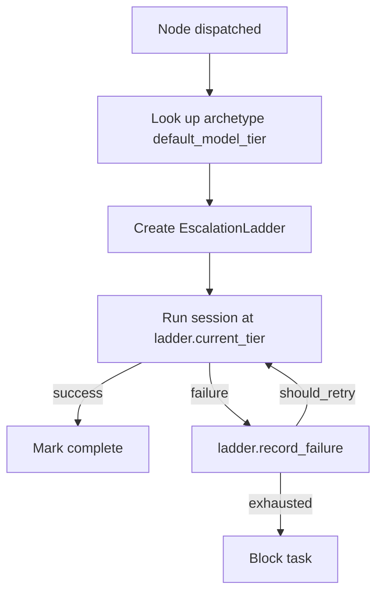

# Design Document: Simplify Model Routing

## Overview

Remove the prediction pipeline from the model routing subsystem, leaving only
the escalation ladder and archetype default tiers. The simplified flow is:

1. Node dispatched -> look up archetype `default_model_tier`
2. Create `EscalationLadder(starting_tier=default, ceiling=ADVANCED)`
3. On failure -> `ladder.record_failure()` -> retry or escalate
4. On exhaustion -> block task

No feature extraction, no statistical model, no LLM assessment, no DuckDB
outcome persistence.

## Architecture



### Module Responsibilities

1. `agent_fox/routing/escalation.py` -- EscalationLadder state machine (unchanged)
2. `agent_fox/routing/core.py` -- Data type definitions only (DuckDB functions removed)
3. `agent_fox/engine/assessment.py` -- AssessmentManager creates ladders from archetype defaults (pipeline call removed)
4. `agent_fox/engine/result_handler.py` -- Uses EscalationLadder for retry decisions (outcome recording removed)
5. `agent_fox/archetypes.py` -- Archetype registry with `default_model_tier` (unchanged)

## Execution Paths

### Path 1: Orchestrator dispatches node with escalation

1. `engine/engine.py: Orchestrator._dispatch_node(node)` -- prepares node for execution
2. `engine/assessment.py: AssessmentManager.assess_node(node_id, archetype)` -- creates EscalationLadder from archetype default tier
3. `engine/engine.py: Orchestrator._run_session(node)` -- runs session at `ladder.current_tier`
4. `engine/result_handler.py: SessionResultHandler.process(record)` -- dispatches to success/failure handler
5. On failure: `engine/result_handler.py: SessionResultHandler._handle_failure(node_id)` -- calls `ladder.record_failure()`, checks `ladder.should_retry()`
6. On retry: loops back to step 3 at `ladder.current_tier` (may have escalated)
7. On exhaustion: `engine/result_handler.py: SessionResultHandler._handle_exhausted(node_id)` -- blocks node

### Path 2: Fix pipeline coder-reviewer loop

1. `nightshift/fix_pipeline.py: FixPipeline._coder_review_loop(issue)` -- creates EscalationLadder(STANDARD, ceiling=ADVANCED)
2. Runs coder session at `ladder.current_tier`
3. Runs reviewer session to evaluate output
4. On reviewer FAIL: `ladder.record_failure()` -> retry or escalate coder
5. On exhaustion: exits loop, reports failure

## Components and Interfaces

### Simplified AssessmentManager

```python
class AssessmentManager:
    def __init__(self, retries_before_escalation: int) -> None:
        self.ladders: dict[str, EscalationLadder] = {}
        self.retries_before_escalation = retries_before_escalation

    async def assess_node(self, node_id: str, archetype: str) -> None:
        """Create escalation ladder from archetype default tier."""
        if node_id in self.ladders:
            return
        entry = get_archetype(archetype)
        tier = ModelTier(entry.default_model_tier)
        self.ladders[node_id] = EscalationLadder(
            starting_tier=tier,
            tier_ceiling=ModelTier.ADVANCED,
            retries_before_escalation=self.retries_before_escalation,
        )
```

### Simplified SessionResultHandler.__init__

```python
def __init__(
    self,
    routing_ladders: dict[str, Any],
    routing_assessments: dict[str, Any],
    retries_before_escalation: int,
    max_retries: int,
    ...
) -> None:
    # No routing_pipeline parameter
```

### Files deleted

- `agent_fox/routing/assessor.py`
- `agent_fox/routing/features.py`
- `agent_fox/routing/calibration.py`
- `agent_fox/routing/duration.py`
- `tests/test_routing/test_assessor.py`
- `tests/test_routing/test_features.py`
- `tests/test_routing/test_calibration.py`
- `tests/test_routing/test_storage.py`
- `tests/test_routing/test_integration.py`
- `tests/test_routing/conftest.py` (or gutted to keep only escalation fixtures)
- `tests/test_routing/helpers.py`

## Data Models

### Retained dataclasses (in `routing/core.py`)

`FeatureVector`, `ComplexityAssessment`, `ExecutionOutcome` -- kept as-is for
backward compatibility. Fields that were populated by the prediction pipeline
will have default/empty values.

### RoutingConfig changes

Remove fields: `training_threshold`, `accuracy_threshold`, `retrain_interval`.
Keep: `retries_before_escalation`, `max_timeout_retries`, `timeout_multiplier`,
`timeout_ceiling_factor`.

## Operational Readiness

- **Rollback**: Revert the commit. All removed files are in git history.
- **Migration**: No data migration. DuckDB tables for routing are abandoned
  (not dropped -- they just stop receiving writes).
- **Observability**: Escalation audit events (`model.escalation`,
  `model.exhausted`) remain unchanged.

## Correctness Properties

### Property 1: Every dispatched node gets an escalation ladder

*For any* node dispatched by the orchestrator, the `AssessmentManager` SHALL
create an `EscalationLadder` with `starting_tier` equal to the node's
archetype `default_model_tier` and `tier_ceiling` equal to
`ModelTier.ADVANCED`.

**Validates: Requirements 89-REQ-1.1, 89-REQ-1.2, 89-REQ-1.3**

### Property 2: Prediction pipeline modules absent

*For any* import path starting with `agent_fox.routing.assessor`,
`agent_fox.routing.features`, `agent_fox.routing.calibration`, or
`agent_fox.routing.duration`, the module SHALL NOT be importable from the
installed package.

**Validates: Requirements 89-REQ-2.1**

### Property 3: No DuckDB routing persistence

*For any* call path through the routing module, no function SHALL write to or
read from DuckDB tables for routing purposes (complexity_assessments or
execution_outcomes).

**Validates: Requirements 89-REQ-2.2, 89-REQ-3.1**

### Property 4: Escalation ladder behavior preserved

*For any* sequence of `record_failure()` calls on an `EscalationLadder`, the
ladder SHALL escalate from `starting_tier` to the next tier after exactly
`retries_before_escalation` failures, and report `is_exhausted` after all
tiers up to `tier_ceiling` are exhausted.

**Validates: Requirements 89-REQ-1.1, 89-REQ-1.2**

### Property 5: Unknown archetype falls back to coder

*For any* archetype name not in `ARCHETYPE_REGISTRY`, the system SHALL use the
`coder` archetype's `default_model_tier` (STANDARD) as the escalation ladder's
starting tier.

**Validates: Requirements 89-REQ-1.E1**

## Error Handling

| Error Condition | Behavior | Requirement |
|----------------|----------|-------------|
| Unknown archetype name | Fall back to coder defaults | 89-REQ-1.E1 |
| Ladder exhausted | Block task | 89-REQ-1.2 |

## Technology Stack

- Python 3.12+, managed with uv
- pytest for testing
- ruff for linting/formatting

## Definition of Done

A task group is complete when ALL of the following are true:

1. All subtasks within the group are checked off (`[x]`)
2. All spec tests (`test_spec.md` entries) for the task group pass
3. All property tests for the task group pass
4. All previously passing tests still pass (no regressions)
5. No linter warnings or errors introduced
6. Code is committed on a feature branch and merged into `develop`
7. `tasks.md` checkboxes are updated to reflect completion

## Testing Strategy

- **Unit tests**: Verify AssessmentManager creates ladders from archetype
  defaults; verify removed modules are absent; verify RoutingConfig shape.
- **Property tests**: Verify escalation ladder invariants (these already exist
  in `test_escalation.py` and are retained).
- **Integration smoke test**: Verify full orchestrator dispatch path creates a
  ladder and uses archetype default tier without importing any removed modules.
