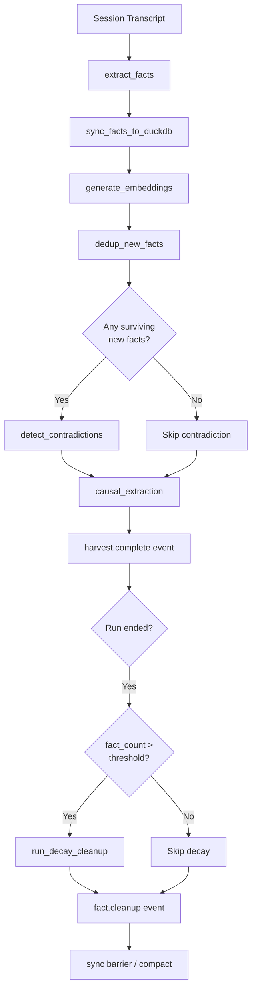

# Design Document: Fact Lifecycle Management

## Overview

Adds three automated mechanisms to the knowledge store to combat fact
staleness: embedding-based deduplication on ingestion, LLM-powered
contradiction detection, and age-based confidence decay with
auto-supersession. All mechanisms use the existing `superseded_by` column
and `mark_superseded()` API — no schema changes required.

## Architecture



### Module Responsibilities

1. **`knowledge/lifecycle.py`** (new): Core lifecycle functions —
   `dedup_new_facts()`, `detect_contradictions()`, `run_decay_cleanup()`,
   `run_cleanup()`.
2. **`knowledge/contradiction.py`** (new): LLM contradiction classification —
   `classify_contradiction_batch()`, prompt template, response parsing.
3. **`engine/knowledge_harvest.py`** (modified): Integrates dedup and
   contradiction detection after fact extraction.
4. **`engine/barrier.py`** (modified): Integrates decay cleanup into
   end-of-run barrier.
5. **`core/config.py`** (modified): New fields on `KnowledgeConfig`.

## Execution Paths

### Path 1: Dedup during harvest

1. `engine/knowledge_harvest.py: extract_and_store_knowledge()` — extracts
   facts, stores to DuckDB, generates embeddings
2. `knowledge/lifecycle.py: dedup_new_facts(conn, new_facts, threshold)`
   → `DedupResult(superseded_ids, surviving_facts)`
3. `knowledge/store.py: MemoryStore.mark_superseded(old_id, new_id)` — marks
   each duplicate's `superseded_by`
4. Side effect: duplicate facts marked superseded in `memory_facts`

### Path 2: Contradiction detection during harvest

1. `engine/knowledge_harvest.py: extract_and_store_knowledge()` — after dedup
2. `knowledge/lifecycle.py: detect_contradictions(conn, new_facts, threshold,
   model, embedder)` → `ContradictionResult(superseded_ids, verdicts)`
3. `knowledge/contradiction.py: classify_contradiction_batch(pairs, model)`
   → `list[ContradictionVerdict]`
4. `knowledge/store.py: MemoryStore.mark_superseded(old_id, new_id)` — marks
   each contradicted fact
5. Side effect: contradicted facts marked superseded in `memory_facts`

### Path 3: Decay cleanup at end-of-run

1. `engine/barrier.py: _sync_barrier()` — end-of-run flow
2. `knowledge/lifecycle.py: run_cleanup(conn, config)` →
   `CleanupResult(expired, deduped, contradicted, remaining)`
3. `knowledge/lifecycle.py: run_decay_cleanup(conn, half_life, floor)` →
   `int` (count of expired facts)
4. `knowledge/store.py: MemoryStore.mark_superseded(id, id)` — self-supersedes
   expired facts
5. Side effect: decayed facts marked self-superseded in `memory_facts`

## Components and Interfaces

### New Module: `knowledge/lifecycle.py`

```python
@dataclass(frozen=True)
class DedupResult:
    superseded_ids: list[str]   # UUIDs of facts that were superseded
    surviving_facts: list[Fact]  # New facts that survived dedup

@dataclass(frozen=True)
class ContradictionVerdict:
    new_fact_id: str
    old_fact_id: str
    contradicts: bool
    reason: str

@dataclass(frozen=True)
class ContradictionResult:
    superseded_ids: list[str]
    verdicts: list[ContradictionVerdict]

@dataclass(frozen=True)
class CleanupResult:
    facts_expired: int
    facts_deduped: int
    facts_contradicted: int
    active_facts_remaining: int

def dedup_new_facts(
    conn: duckdb.DuckDBPyConnection,
    new_facts: list[Fact],
    threshold: float = 0.92,
) -> DedupResult:
    """Check new facts against existing actives for near-duplicates."""

def detect_contradictions(
    conn: duckdb.DuckDBPyConnection,
    new_facts: list[Fact],
    *,
    threshold: float = 0.8,
    model: str = "SIMPLE",
) -> ContradictionResult:
    """Identify and resolve contradictions between new and existing facts."""

def run_decay_cleanup(
    conn: duckdb.DuckDBPyConnection,
    *,
    half_life_days: float = 90.0,
    decay_floor: float = 0.1,
) -> int:
    """Apply age-based decay and auto-supersede expired facts."""

def run_cleanup(
    conn: duckdb.DuckDBPyConnection,
    config: KnowledgeConfig,
    *,
    sink_dispatcher: SinkDispatcher | None = None,
    run_id: str = "",
) -> CleanupResult:
    """Full cleanup: decay + audit event. Called at end-of-run."""
```

### New Module: `knowledge/contradiction.py`

```python
CONTRADICTION_PROMPT: str  # Template for batch contradiction classification

@dataclass(frozen=True)
class ContradictionVerdict:
    new_fact_id: str
    old_fact_id: str
    contradicts: bool
    reason: str

async def classify_contradiction_batch(
    pairs: list[tuple[Fact, Fact]],
    model: str = "SIMPLE",
) -> list[ContradictionVerdict]:
    """Classify a batch of fact pairs for contradiction via LLM."""
```

### Modified: `core/config.py` — KnowledgeConfig additions

```python
class KnowledgeConfig(BaseModel):
    # ... existing fields ...
    dedup_similarity_threshold: float = Field(
        default=0.92,
        description="Cosine similarity threshold for near-duplicate detection",
    )
    contradiction_similarity_threshold: float = Field(
        default=0.8,
        description="Cosine similarity threshold for contradiction candidates",
    )
    contradiction_model: str = Field(
        default="SIMPLE",
        description="Model tier for contradiction classification LLM calls",
    )
    decay_half_life_days: float = Field(
        default=90.0,
        description="Days for fact confidence to halve",
    )
    decay_floor: float = Field(
        default=0.1,
        description="Effective confidence below which facts are auto-superseded",
    )
    cleanup_fact_threshold: int = Field(
        default=500,
        description="Active fact count above which decay cleanup runs",
    )
    cleanup_enabled: bool = Field(
        default=True,
        description="Enable/disable end-of-run fact lifecycle cleanup",
    )
```

## Data Models

### Contradiction Prompt Template

The LLM receives a batch of fact pairs and classifies each:

```
You are a knowledge base curator. For each pair of facts below, determine
whether the NEW fact contradicts the OLD fact. A contradiction means the
new fact makes the old fact incorrect, outdated, or misleading.

Respond with ONLY a JSON array. For each pair, return:
{"pair_index": <N>, "contradicts": true/false, "reason": "..."}

Pairs:
1. OLD: "<old fact content>"   NEW: "<new fact content>"
2. OLD: "<old fact content>"   NEW: "<new fact content>"
...
```

### Decay Formula

```
effective_confidence = stored_confidence * (0.5 ^ (age_days / half_life_days))
```

Where:
- `age_days = (now - created_at).total_seconds() / 86400`
- `half_life_days` defaults to 90
- Result clamped to `[0.0, stored_confidence]`

### Cleanup Trigger Logic

```python
active_count = COUNT(*) FROM memory_facts WHERE superseded_by IS NULL
if active_count > config.knowledge.cleanup_fact_threshold:
    run_decay_cleanup(conn, ...)
```

## Operational Readiness

### Observability

- `fact.cleanup` audit event emitted after each cleanup with counts.
- `harvest.complete` event extended with `dedup_count` and
  `contradiction_count` fields.
- All supersession actions logged at INFO level with fact IDs.

### Rollout

- All new config fields have safe defaults; no breaking changes.
- `cleanup_enabled = false` disables all new behavior.
- Existing `compact()` continues to work alongside new mechanisms.

### Migration

- No schema changes. Uses existing `superseded_by` column and
  `mark_superseded()` API.

## Correctness Properties

### Property 1: Dedup Idempotency

*For any* set of new facts inserted into the knowledge store, running
`dedup_new_facts()` a second time with the same facts SHALL NOT change the
set of active facts (superseded facts remain superseded; surviving facts
remain active).

**Validates: Requirements 1.1, 1.2**

### Property 2: Dedup Threshold Monotonicity

*For any* pair of facts (A, B) with cosine similarity S, if S is below the
dedup threshold then neither fact SHALL be superseded by deduplication. If S
is at or above the threshold, the older fact SHALL be superseded.

**Validates: Requirements 1.1, 1.2, 1.4**

### Property 3: Contradiction Requires LLM Confirmation

*For any* candidate pair identified by embedding similarity, supersession
due to contradiction SHALL only occur when the LLM verdict returns
`contradicts: true`. Embedding similarity alone SHALL NOT trigger
contradiction supersession.

**Validates: Requirements 2.2, 2.3, 2.4**

### Property 4: Contradiction Graceful Degradation

*For any* LLM failure (API error, malformed JSON, missing fields), the
system SHALL leave all facts unchanged (no supersession) and the extraction
pipeline SHALL continue without error.

**Validates: Requirements 2.E1, 2.E3**

### Property 5: Decay Monotonicity

*For any* fact with age A1 < A2, the effective confidence at age A2 SHALL be
less than or equal to the effective confidence at age A1 (confidence never
increases with age).

**Validates: Requirements 3.1**

### Property 6: Decay Floor Auto-Supersession

*For any* fact whose effective confidence falls below the decay floor, the
fact SHALL be marked as self-superseded. *For any* fact whose effective
confidence is at or above the floor, the fact SHALL remain active.

**Validates: Requirements 3.2, 3.4**

### Property 7: Stored Confidence Immutability

*For any* cleanup operation (dedup, contradiction, or decay), the `confidence`
column in `memory_facts` SHALL NOT be modified. Only `superseded_by` may
change.

**Validates: Requirements 3.6**

### Property 8: Cleanup Threshold Gate

*For any* run where the active fact count is at or below the cleanup fact
threshold, age-based decay SHALL NOT execute. Dedup and contradiction
detection (in the harvest pipeline) SHALL still execute regardless of count.

**Validates: Requirements 4.2, 4.3**

### Property 9: Pipeline Order Invariant

*For any* harvest execution, deduplication SHALL complete before contradiction
detection begins. No contradiction check SHALL be performed on a fact that
was already superseded by dedup.

**Validates: Requirements 5.3, 5.E1**

## Error Handling

| Error Condition | Behavior | Requirement |
|----------------|----------|-------------|
| Embedding generation fails for new fact | Skip dedup for that fact | 90-REQ-1.E1 |
| No existing embeddings in DB | Skip dedup entirely | 90-REQ-1.E2 |
| LLM API error during contradiction check | Log warning, skip batch | 90-REQ-2.E1 |
| New fact has no embedding | Skip contradiction for that fact | 90-REQ-2.E2 |
| LLM returns invalid JSON | Treat as non-contradiction | 90-REQ-2.E3 |
| Fact has NULL/unparseable created_at | Skip decay for that fact | 90-REQ-3.E1 |
| Fact has future created_at (clock skew) | Zero decay applied | 90-REQ-3.E2 |
| Cleanup disabled via config | Skip all cleanup, log DEBUG | 90-REQ-4.E1 |
| DuckDB unavailable during cleanup | Log warning, skip cleanup | 90-REQ-4.E2 |
| All new facts removed by dedup | Skip contradiction detection | 90-REQ-5.E1 |

## Technology Stack

- **DuckDB**: Existing knowledge store (VSS extension for cosine distance).
- **SentenceTransformer** (`all-MiniLM-L6-v2`): Existing embedding model for
  similarity queries.
- **Anthropic API**: LLM calls for contradiction classification (via existing
  `cached_messages_create` / `retry_api_call` infrastructure).
- **Python 3.12+**: Runtime.

## Definition of Done

A task group is complete when ALL of the following are true:

1. All subtasks within the group are checked off (`[x]`)
2. All spec tests (`test_spec.md` entries) for the task group pass
3. All property tests for the task group pass
4. All previously passing tests still pass (no regressions)
5. No linter warnings or errors introduced
6. Code is committed on a feature branch and merged into `develop`
7. Feature branch is merged back to `develop`
8. `tasks.md` checkboxes are updated to reflect completion

## Testing Strategy

- **Unit tests**: Each lifecycle function tested with in-memory DuckDB,
  mocked LLM responses, and pre-seeded fact data.
- **Property tests**: Hypothesis-driven tests for decay formula correctness,
  dedup threshold behavior, and confidence immutability invariant.
- **Integration tests**: End-to-end harvest pipeline with mock LLM verifying
  that dedup and contradiction run in sequence and produce correct
  supersession state in DuckDB.
