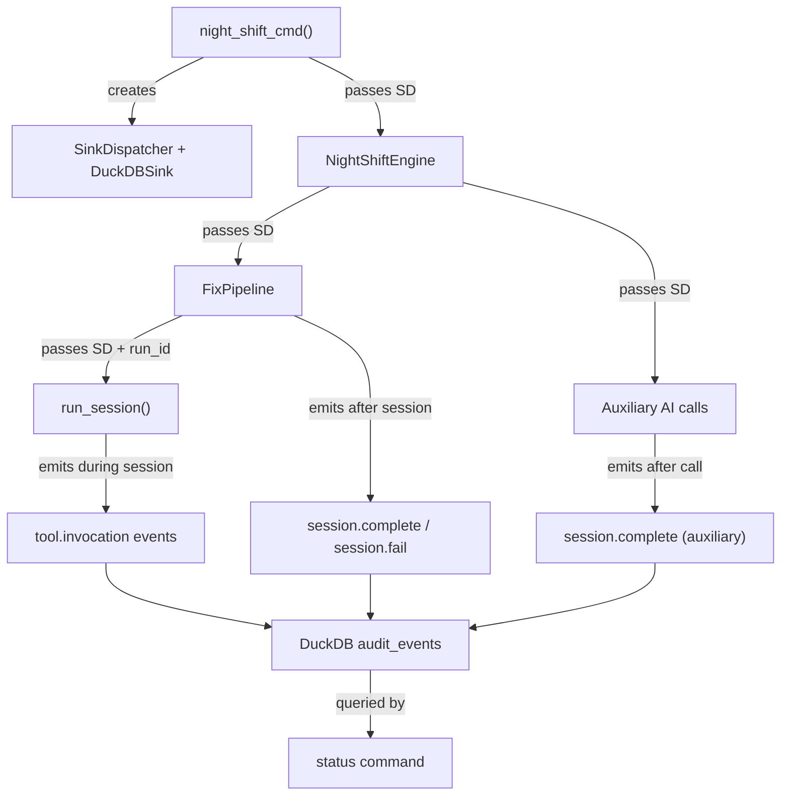

# Design Document: Night-Shift Cost Tracking

## Overview

This spec wires the standard DuckDB-backed audit pipeline into all
night-shift AI operations so that costs appear in the `status` command.
The changes fall into four areas: (1) SinkDispatcher plumbing from CLI
through engine to pipeline, (2) session.complete/session.fail emission
after every fix session, (3) auxiliary cost emission for direct API
calls, and (4) removal of the JSONL-based night-shift audit module.

## Architecture



### Module Responsibilities

1. **`cli/nightshift.py`** — Creates SinkDispatcher + DuckDBSink, passes
   to NightShiftEngine. Closes DuckDB on shutdown.
2. **`nightshift/engine.py`** — Stores SinkDispatcher, passes it to
   FixPipeline and auxiliary AI callers. Uses standard
   `emit_audit_event()` for operational events.
3. **`nightshift/fix_pipeline.py`** — Accepts SinkDispatcher, generates
   per-fix run_id, passes both to `run_session()`. Emits
   session.complete/session.fail after each session.
4. **`nightshift/cost_helpers.py`** (new) — Small helper to emit
   session.complete for auxiliary AI calls that don't go through
   `run_session()`.
5. **`nightshift/critic.py`**, **`nightshift/triage.py`**,
   **`nightshift/staleness.py`**, **`nightshift/categories/quality_gate.py`**
   — Updated to accept SinkDispatcher + run_id and call the cost helper
   after each API call.
6. **`nightshift/daemon.py`** — Updated to use standard audit helper
   instead of removed JSONL module.
7. **`nightshift/audit.py`** — Deleted.

## Execution Paths

### Path 1: Fix session emits cost to DuckDB

1. `cli/nightshift.py: night_shift_cmd` — creates `SinkDispatcher(DuckDBSink(conn))`
2. `cli/nightshift.py: night_shift_cmd` — passes `sink_dispatcher` to `NightShiftEngine()`
3. `nightshift/engine.py: NightShiftEngine._process_fix` — creates `FixPipeline(sink_dispatcher=self._sink)`
4. `nightshift/fix_pipeline.py: FixPipeline.process_issue` — calls `generate_run_id()` → `str`
5. `nightshift/fix_pipeline.py: FixPipeline._run_session` — calls `run_session(sink_dispatcher=..., run_id=...)` → `SessionOutcome`
6. `nightshift/fix_pipeline.py: FixPipeline._emit_session_event` — calls `calculate_cost()` → `float`, then `emit_audit_event(sink, run_id, SESSION_COMPLETE, payload={cost, tokens, ...})`
7. `knowledge/duckdb_sink.py: DuckDBSink.emit_audit_event` — INSERT into `audit_events` table
8. `reporting/status.py: build_status_report_from_audit` — SELECT from `audit_events` aggregates cost

### Path 2: Auxiliary AI call emits cost to DuckDB

1. `nightshift/engine.py: NightShiftEngine._run_hunt_scan` — calls `consolidate_findings(findings, sink=self._sink, run_id=...)`
2. `nightshift/critic.py: _run_critic` — calls `cached_messages_create()` → `response`
3. `nightshift/cost_helpers.py: emit_auxiliary_cost` — extracts tokens from response, calls `calculate_cost()`, emits `session.complete` with archetype `hunt_critic`
4. `knowledge/duckdb_sink.py: DuckDBSink.emit_audit_event` — INSERT into `audit_events`

### Path 3: Night-shift operational event via standard audit

1. `nightshift/engine.py: NightShiftEngine._process_fix` — calls `emit_audit_event(self._sink, run_id, FIX_START, ...)`
2. `engine/audit_helpers.py: emit_audit_event` — constructs `AuditEvent`, calls `sink.emit_audit_event(event)`
3. `knowledge/duckdb_sink.py: DuckDBSink.emit_audit_event` — INSERT into `audit_events`

## Components and Interfaces

### New: `nightshift/cost_helpers.py`

```python
def emit_auxiliary_cost(
    sink: SinkDispatcher | None,
    run_id: str,
    archetype: str,
    response: object,
    model_id: str,
    pricing: PricingConfig,
    *,
    node_id: str = "",
) -> None:
    """Emit a session.complete audit event for an auxiliary AI call.

    Extracts token usage from the Anthropic API response object,
    calculates USD cost, and emits a session.complete event via the
    standard audit helper.

    No-op when sink is None or run_id is empty.
    """
```

### Modified: `nightshift/engine.py: NightShiftEngine.__init__`

```python
def __init__(
    self,
    config: AgentFoxConfig,
    platform: object,
    *,
    auto_fix: bool = False,
    activity_callback: ActivityCallback | None = None,
    task_callback: TaskCallback | None = None,
    status_callback: Callable[[str, str], None] | None = None,
    sink_dispatcher: SinkDispatcher | None = None,       # NEW
) -> None:
```

### Modified: `nightshift/fix_pipeline.py: FixPipeline.__init__`

```python
def __init__(
    self,
    config: AgentFoxConfig,
    platform: object,
    activity_callback: ActivityCallback | None = None,
    task_callback: TaskCallback | None = None,
    sink_dispatcher: SinkDispatcher | None = None,       # NEW
) -> None:
```

### Modified: `nightshift/fix_pipeline.py: FixPipeline._run_session`

Now passes `sink_dispatcher` and `run_id` to `run_session()`.

### New: `nightshift/fix_pipeline.py: FixPipeline._emit_session_event`

```python
def _emit_session_event(
    self,
    outcome: SessionOutcome,
    archetype: str,
    run_id: str,
    *,
    node_id: str = "",
    attempt: int = 1,
) -> None:
    """Emit session.complete or session.fail based on outcome status."""
```

### Modified auxiliary callers

Each function gains optional `sink` and `run_id` parameters:

- `nightshift/critic.py: consolidate_findings(findings, *, sink=None, run_id="")`
- `nightshift/critic.py: _run_critic(findings, *, sink=None, run_id="")`
- `nightshift/triage.py: run_batch_triage(issues, edges, config, *, sink=None, run_id="")`
- `nightshift/staleness.py: check_staleness(fixed, remaining, diff, config, platform, *, sink=None, run_id="")`
- `nightshift/categories/quality_gate.py: QualityGateCategory._run_ai_analysis(..., sink=None, run_id="")`

## Data Models

No new data models. The existing `session.complete` audit event payload
schema is reused:

```json
{
    "archetype": "fix_coder",
    "model_id": "claude-sonnet-4-6",
    "input_tokens": 12345,
    "output_tokens": 678,
    "cache_read_input_tokens": 0,
    "cache_creation_input_tokens": 0,
    "cost": 0.0543,
    "duration_ms": 45000
}
```

For auxiliary calls, `duration_ms` is omitted (not meaningfully measured).

## Operational Readiness

- **Observability:** Night-shift costs become visible in the `status`
  command immediately after deployment. The `cost_by_archetype` breakdown
  shows night-shift-specific archetypes.
- **Rollout:** No migration needed. New audit events are additive — they
  are written to the existing `audit_events` table.
- **Rollback:** Reverting removes the audit events. The status command
  reverts to showing only orchestrator costs.

## Correctness Properties

### Property 1: Audit Event Completeness

*For any* fix pipeline invocation that runs N sessions (triage + coder +
reviewer iterations), the system SHALL emit exactly N `session.complete`
or `session.fail` audit events to DuckDB.

**Validates: Requirements 91-REQ-3.1, 91-REQ-3.2**

### Property 2: Cost Accuracy

*For any* `session.complete` event emitted by the fix pipeline, the `cost`
field in the payload SHALL equal `calculate_cost(input_tokens, output_tokens,
model_id, pricing, cache_read_input_tokens, cache_creation_input_tokens)`.

**Validates: Requirements 91-REQ-3.1**

### Property 3: Graceful Degradation

*For any* night-shift operation where `sink_dispatcher` is None, the system
SHALL complete the operation without raising an exception due to missing
audit infrastructure.

**Validates: Requirements 91-REQ-1.3, 91-REQ-2.E1, 91-REQ-3.E1, 91-REQ-4.E1, 91-REQ-5.E1**

### Property 4: Run ID Uniqueness

*For any* two distinct `FixPipeline.process_issue()` invocations, the
generated `run_id` values SHALL be distinct.

**Validates: Requirements 91-REQ-2.1**

### Property 5: Auxiliary Cost Emission

*For any* auxiliary AI call (critic, batch triage, staleness, quality gate)
that completes successfully, the system SHALL emit exactly one
`session.complete` event with a non-zero `cost` field and the correct
archetype label.

**Validates: Requirements 91-REQ-4.1, 91-REQ-4.2, 91-REQ-4.3, 91-REQ-4.4**

### Property 6: JSONL Audit Removal

*For any* night-shift operation, the system SHALL NOT write to
`.agent-fox/audit/` JSONL files (the legacy audit path).

**Validates: Requirements 91-REQ-5.1**

### Property 7: Status Aggregation Inclusion

*For any* `session.complete` event emitted by night-shift (fix sessions or
auxiliary calls), `build_status_report_from_audit()` SHALL include its
cost in `total_cost` and its archetype in `cost_by_archetype`.

**Validates: Requirements 91-REQ-6.1, 91-REQ-6.2, 91-REQ-6.3**

## Error Handling

| Error Condition | Behavior | Requirement |
|----------------|----------|-------------|
| DuckDB unavailable at startup | Log warning, proceed without SinkDispatcher | 91-REQ-1.E1 |
| SinkDispatcher is None | Skip all audit emission, no error | 91-REQ-2.E1, 91-REQ-4.E1, 91-REQ-5.E1 |
| Audit event write fails | Log debug warning, continue pipeline | 91-REQ-3.E1 |
| Auxiliary AI call fails | Emit session.fail event, continue | 91-REQ-4.5 |

## Technology Stack

- **Python 3.12+**, managed with `uv`
- **DuckDB** — audit event storage
- **Anthropic SDK** — API response objects for token extraction
- **agent-fox audit infrastructure** — `SinkDispatcher`, `DuckDBSink`,
  `emit_audit_event`, `AuditEventType`, `generate_run_id`

## Definition of Done

A task group is complete when ALL of the following are true:

1. All subtasks within the group are checked off (`[x]`)
2. All spec tests (`test_spec.md` entries) for the task group pass
3. All property tests for the task group pass
4. All previously passing tests still pass (no regressions)
5. No linter warnings or errors introduced
6. Code is committed on a feature branch and merged into `develop`
7. Feature branch is merged back to `develop`
8. `tasks.md` checkboxes are updated to reflect completion

## Testing Strategy

- **Unit tests** validate each component in isolation: SinkDispatcher
  wiring, run_id generation, session event emission, auxiliary cost helper,
  JSONL module removal.
- **Property tests** verify invariants: cost accuracy for any token count
  combination, graceful degradation for any None sink, run_id uniqueness.
- **Integration tests** verify the end-to-end path: fix pipeline emits
  events that `build_status_report_from_audit()` aggregates correctly.
  Uses a real in-memory DuckDB connection with mock sessions.
