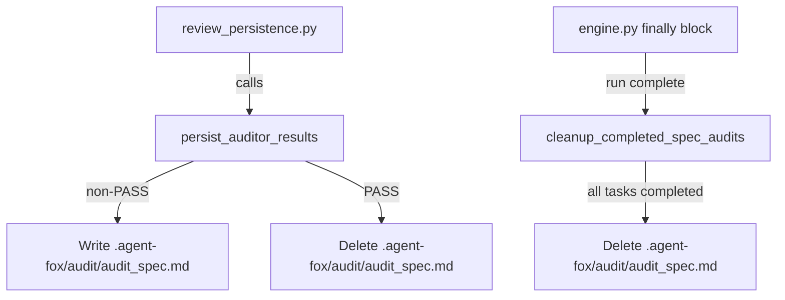

# Design Document: Transient Audit Reports

## Overview

Move audit report output from `.specs/{spec_name}/audit.md` to
`.agent-fox/audit/audit_{spec_name}.md` and add two deletion triggers: on PASS
verdict (immediate) and on spec completion (end-of-run cleanup). The change
touches two modules — `auditor_output.py` (write/delete logic) and `engine.py`
(completion cleanup hook).

## Architecture



### Module Responsibilities

1. `agent_fox/session/auditor_output.py` — writes audit reports to the new
   location, handles PASS deletion, exposes `cleanup_completed_spec_audits`.
2. `agent_fox/engine/engine.py` — calls cleanup at end of run.
3. `agent_fox/engine/graph_sync.py` — provides `completed_spec_names()` to
   identify specs where all nodes are done.

## Execution Paths

### Path 1: Auditor writes non-PASS report

1. `engine/review_persistence.py: persist_and_process_review` — detects auditor
   archetype, parses transcript
2. `session/auditor_output.py: persist_auditor_results(spec_dir, result)` —
   computes `audit_dir = spec_dir.parent.parent / ".agent-fox" / "audit"`,
   ensures directory exists, writes `audit_{spec_name}.md` → side effect:
   file written

### Path 2: Auditor writes PASS report

1. `engine/review_persistence.py: persist_and_process_review` — detects auditor
   archetype, parses transcript
2. `session/auditor_output.py: persist_auditor_results(spec_dir, result)` —
   detects `overall_verdict == "PASS"`, deletes existing file if present → side
   effect: file deleted (or no-op if file absent)

### Path 3: Spec completion cleanup

1. `engine/engine.py: execute` finally block — run completes
2. `engine/graph_sync.py: GraphSync.completed_spec_names()` → `set[str]` —
   groups node_states by spec, returns specs where all nodes are `completed`
3. `session/auditor_output.py: cleanup_completed_spec_audits(project_root,
   completed_specs)` — iterates completed spec names, deletes matching audit
   files → side effect: files deleted

## Components and Interfaces

### Modified: `persist_auditor_results`

```python
def persist_auditor_results(
    spec_dir: Path,
    result: AuditResult,
    *,
    attempt: int = 1,
) -> None:
```

**Signature unchanged.** Internal logic changes:

- Derive `spec_name = spec_dir.name`.
- Derive `audit_dir = spec_dir.parent.parent / ".agent-fox" / "audit"`.
- `audit_dir.mkdir(parents=True, exist_ok=True)`.
- `audit_path = audit_dir / f"audit_{spec_name}.md"`.
- If `result.overall_verdict == "PASS"`: delete `audit_path` if it exists,
  then return early (do not write).
- Otherwise: write report to `audit_path` (overwrites any existing file).

### New: `cleanup_completed_spec_audits`

```python
def cleanup_completed_spec_audits(
    project_root: Path,
    completed_specs: set[str],
) -> None:
```

Iterates `completed_specs`, deletes
`project_root / ".agent-fox" / "audit" / f"audit_{spec}.md"` for each.
Logs warnings on `OSError`, never raises.

### New: `GraphSync.completed_spec_names`

```python
def completed_spec_names(self) -> set[str]:
```

Groups `self.node_states` by spec name (via existing `_spec_name` helper).
Returns the set of spec names where every node has status `"completed"`.

## Data Models

No new data models. The audit report file format is unchanged — only its
filesystem location changes.

## Operational Readiness

- **Observability:** Existing `logger.info` / `logger.error` calls are
  preserved. New deletion actions log at INFO level.
- **Rollback:** Revert the commit. No data migration needed.
- **Compatibility:** No config changes. The `.agent-fox/audit/` directory is
  already gitignored.

## Correctness Properties

### Property 1: Output Location Invariant

*For any* audit result with a non-PASS verdict, `persist_auditor_results` SHALL
write the report to `.agent-fox/audit/audit_{spec_name}.md` and SHALL NOT
create or modify any file inside `.specs/`.

**Validates: Requirements 92-REQ-1.1, 92-REQ-1.3**

### Property 2: PASS Deletion Invariant

*For any* audit result with verdict PASS, after `persist_auditor_results`
returns, no file named `audit_{spec_name}.md` SHALL exist in
`.agent-fox/audit/`.

**Validates: Requirements 92-REQ-3.1, 92-REQ-3.E1**

### Property 3: Completion Cleanup Invariant

*For any* non-empty set of completed spec names,
`cleanup_completed_spec_audits` SHALL delete only the audit report files
matching those spec names and SHALL not raise exceptions.

**Validates: Requirements 92-REQ-4.1, 92-REQ-4.2, 92-REQ-4.E1, 92-REQ-4.E2**

### Property 4: Overwrite Idempotency

*For any* sequence of non-PASS audit results for the same spec,
`persist_auditor_results` SHALL produce exactly one file whose content matches
the last invocation.

**Validates: Requirements 92-REQ-2.1**

## Error Handling

| Error Condition | Behavior | Requirement |
|----------------|----------|-------------|
| `.agent-fox/audit/` cannot be created | Log error, do not raise | 92-REQ-1.E1 |
| Audit file absent on PASS deletion | No-op, no error | 92-REQ-3.E1 |
| Filesystem error on PASS deletion | Log error, do not raise | 92-REQ-3.E2 |
| Audit file absent on completion cleanup | No-op, no error | 92-REQ-4.E1 |
| Filesystem error on completion cleanup (one spec) | Log warning, continue others | 92-REQ-4.E2 |

## Technology Stack

- Python 3.12+ (pathlib, logging)
- No new dependencies

## Definition of Done

A task group is complete when ALL of the following are true:

1. All subtasks within the group are checked off (`[x]`)
2. All spec tests (`test_spec.md` entries) for the task group pass
3. All property tests for the task group pass
4. All previously passing tests still pass (no regressions)
5. No linter warnings or errors introduced
6. Code is committed on a feature branch and merged into `develop`
7. Feature branch is merged back to `develop`
8. `tasks.md` checkboxes are updated to reflect completion

## Testing Strategy

- **Unit tests:** Verify output path, overwrite, PASS deletion, and completion
  cleanup using `tmp_path` fixtures.
- **Property tests:** Use Hypothesis to generate arbitrary spec names and
  verdict sequences, asserting location and deletion invariants.
- **Integration smoke test:** Run `persist_auditor_results` end-to-end for
  FAIL then PASS, confirming file appears then disappears from the correct
  location.
