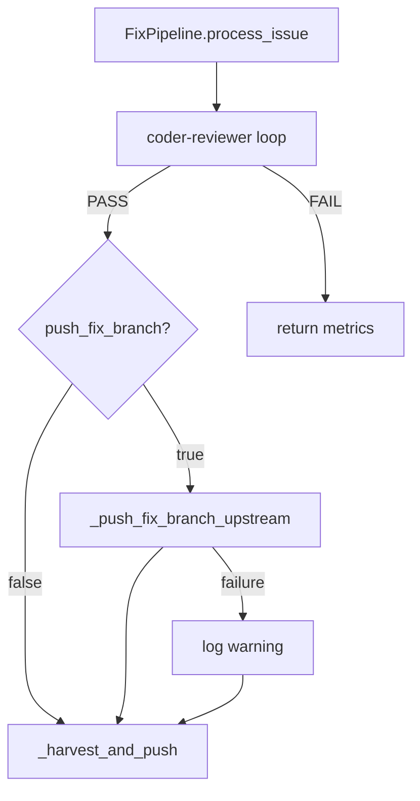

# Design Document: Fix Branch Push to Upstream

## Overview

This feature adds an optional `push_fix_branch` boolean to the `[night_shift]`
config section. When enabled, the fix pipeline pushes the fix branch to
`origin` (force-push) after the coder-reviewer loop passes but before
harvesting into `develop`. The branch naming is also updated to include the
issue number for traceability.

Three existing modules are modified; no new modules are introduced.

## Architecture



### Module Responsibilities

1. **`agent_fox/nightshift/config.py`** -- Holds the `push_fix_branch` field
   on `NightShiftConfig` (default `False`).
2. **`agent_fox/nightshift/spec_builder.py`** -- Generates fix branch names
   with the issue number included.
3. **`agent_fox/nightshift/fix_pipeline.py`** -- Orchestrates the push step
   between coder-reviewer success and harvest.
4. **`agent_fox/workspace/git.py`** -- Existing `push_to_remote` gains a
   `force` parameter for force-push semantics.

## Execution Paths

### Path 1: Fix pipeline with push enabled

1. `nightshift/fix_pipeline.py: FixPipeline.process_issue` -- entry point
2. `nightshift/spec_builder.py: build_in_memory_spec(issue, body)` -> `InMemorySpec` -- spec with branch name `fix/{N}-{slug}`
3. `nightshift/fix_pipeline.py: FixPipeline._coder_review_loop(...)` -> `bool` -- returns `True` on PASS
4. `nightshift/fix_pipeline.py: FixPipeline._push_fix_branch_upstream(spec, workspace)` -> `bool` -- pushes branch to origin
5. `workspace/git.py: push_to_remote(repo_root, branch, force=True)` -> `bool` -- side effect: branch force-pushed to origin
6. `nightshift/fix_pipeline.py: FixPipeline._harvest_and_push(spec, workspace)` -> `str` -- merges into develop

### Path 2: Fix pipeline with push disabled

1. `nightshift/fix_pipeline.py: FixPipeline.process_issue` -- entry point
2. `nightshift/spec_builder.py: build_in_memory_spec(issue, body)` -> `InMemorySpec` -- spec with branch name `fix/{N}-{slug}`
3. `nightshift/fix_pipeline.py: FixPipeline._coder_review_loop(...)` -> `bool` -- returns `True` on PASS
4. `nightshift/fix_pipeline.py: FixPipeline._harvest_and_push(spec, workspace)` -> `str` -- merges into develop (push skipped)

### Path 3: Branch naming

1. `nightshift/spec_builder.py: build_in_memory_spec(issue, body)` -- creates spec
2. `nightshift/spec_builder.py: sanitise_branch_name(title, issue_number)` -> `str` -- returns `fix/{N}-{slug}`

## Components and Interfaces

### Config Field

```python
# In NightShiftConfig (config.py)
push_fix_branch: bool = Field(
    default=False,
    description="Push fix branches to origin before harvest",
)
```

### Branch Naming

```python
# Modified signature in spec_builder.py
def sanitise_branch_name(title: str, issue_number: int | None = None) -> str:
    """Return fix/{issue_number}-{slug} when issue_number is provided,
    or fix/{slug} as fallback."""
```

### Push Method

```python
# New method on FixPipeline (fix_pipeline.py)
async def _push_fix_branch_upstream(
    self,
    spec: InMemorySpec,
    workspace: WorkspaceInfo,
) -> bool:
    """Force-push the fix branch to origin. Returns True on success.
    Logs warning and returns False on failure -- never raises."""
```

### Force-Push Support

```python
# Modified signature in workspace/git.py
async def push_to_remote(
    repo_root: Path,
    branch: str,
    remote: str = "origin",
    *,
    force: bool = False,
) -> bool:
    """Push a branch to the remote. When force=True, uses --force."""
```

## Data Models

### Config TOML

```toml
[night_shift]
push_fix_branch = false   # default; set to true to push fix branches
```

### Branch Name Format

- **With issue number:** `fix/{issue_number}-{sanitized_title}`
  - Example: `fix/42-unused-imports`
- **Empty title fallback:** `fix/{issue_number}`
  - Example: `fix/42`

## Operational Readiness

- **Observability:** Push success/failure is logged at INFO/WARNING level.
  No new audit events are introduced -- the existing session audit trail
  covers the fix pipeline.
- **Rollout:** The feature defaults to `false`. Enable per-project by setting
  `push_fix_branch = true` in `config.toml`. No migration needed.
- **Rollback:** Set `push_fix_branch = false` or remove the field. Remote
  branches already pushed remain on the remote (manual cleanup if desired).

## Correctness Properties

### Property 1: Push Gating

*For any* fix pipeline execution where `config.night_shift.push_fix_branch` is
`False`, the system SHALL NOT invoke `push_to_remote` for the fix branch.

**Validates: Requirements 93-REQ-3.3**

### Property 2: Branch Name Issue Number Inclusion

*For any* issue number N (positive integer) and title T (arbitrary string),
`sanitise_branch_name(T, N)` SHALL produce a string containing the substring
`str(N)`.

**Validates: Requirements 93-REQ-2.1, 93-REQ-2.2**

### Property 3: Push Before Harvest Ordering

*For any* fix pipeline execution where `push_fix_branch` is `True` and the
coder-reviewer loop returns `True`, the push operation SHALL be invoked before
the harvest operation.

**Validates: Requirements 93-REQ-3.1**

### Property 4: Push Failure Resilience

*For any* fix pipeline execution where the push to origin raises an exception
or returns `False`, the system SHALL proceed to execute the harvest step
without raising an exception to the caller.

**Validates: Requirements 93-REQ-3.E1, 93-REQ-3.E2**

### Property 5: Force Push Semantics

*For any* fix branch push when `push_fix_branch` is `True`, the system SHALL
pass `force=True` to the underlying push operation.

**Validates: Requirements 93-REQ-3.2**

## Error Handling

| Error Condition | Behavior | Requirement |
|----------------|----------|-------------|
| `push_fix_branch` is non-coercible to boolean (e.g., `"banana"`, `42`) | Pydantic validation error at config load | 93-REQ-1.E1 |
| Issue title is empty/special-chars-only | Branch name falls back to `fix/{N}` | 93-REQ-2.E1 |
| Push to origin fails (network, auth, etc.) | Log warning with reason, continue to harvest | 93-REQ-3.E1, 93-REQ-3.E2 |

## Technology Stack

- **Python 3.12+** -- existing project language
- **Pydantic v2** -- config model validation (existing)
- **asyncio** -- async push operation (existing pattern)
- **git CLI** -- `git push --force origin {branch}` (via `run_git`)

## Definition of Done

A task group is complete when ALL of the following are true:

1. All subtasks within the group are checked off (`[x]`)
2. All spec tests (`test_spec.md` entries) for the task group pass
3. All property tests for the task group pass
4. All previously passing tests still pass (no regressions)
5. No linter warnings or errors introduced
6. Code is committed on a feature branch and merged into `develop`
7. Feature branch is merged back to `develop`
8. `tasks.md` checkboxes are updated to reflect completion

## Testing Strategy

- **Unit tests** validate config defaults, branch naming, and push gating in
  isolation using mocks for `push_to_remote`.
- **Property tests** verify branch-name invariants (issue number always
  present) and push-gating invariants (never called when disabled) across
  generated inputs.
- **Integration smoke tests** exercise the full fix pipeline path with push
  enabled/disabled, using a mock platform and mock git operations.
