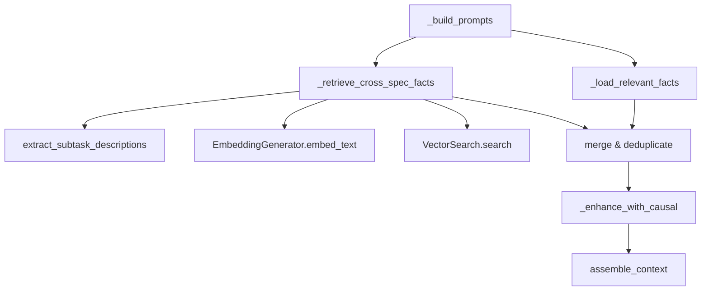

# Design Document: Cross-Spec Vector Retrieval

## Overview

Adds a semantic search step to the session context assembly pipeline.
Between loading spec-specific facts and enhancing them with causal context,
the system embeds the current task group's subtask descriptions, queries
all facts via vector similarity, merges the results (deduplicating by ID),
and passes the unified set through causal enhancement.

The change touches three modules: `session_lifecycle.py` (new retrieval
method + subtask extraction function), `config.py` (new field), and
`run.py` (embedder sharing via factory).

## Architecture



### Module Responsibilities

1. **`engine/session_lifecycle.py`** -- Hosts `extract_subtask_descriptions()`
   and the new `_retrieve_cross_spec_facts()` method on `NodeSessionRunner`.
   Orchestrates the full pipeline: extract → embed → search → merge.
2. **`core/config.py`** -- `KnowledgeConfig.cross_spec_top_k` field.
3. **`engine/run.py`** -- Creates a shared `EmbeddingGenerator` and passes it
   to `NodeSessionRunner` via the factory closure.
4. **`knowledge/search.py`** -- Existing `VectorSearch.search()` (unchanged).
5. **`knowledge/embeddings.py`** -- Existing `EmbeddingGenerator` (unchanged).
6. **`spec/parser.py`** -- Existing `parse_tasks()` (unchanged).

## Execution Paths

### Path 1: Cross-spec vector retrieval during context assembly

1. `engine/session_lifecycle.py: NodeSessionRunner._build_prompts` -- entry
   point, calls `_load_relevant_facts` and `_retrieve_cross_spec_facts`
2. `engine/session_lifecycle.py: NodeSessionRunner._load_relevant_facts` →
   `list[Fact]` (spec-specific facts, existing behavior unchanged)
3. `engine/session_lifecycle.py: NodeSessionRunner._retrieve_cross_spec_facts(spec_dir, relevant_facts)` →
   `list[Fact]` (merged fact list)
   - 3a. `engine/session_lifecycle.py: extract_subtask_descriptions(spec_dir, task_group)` →
     `list[str]` (first non-metadata bullet per subtask)
   - 3b. `knowledge/embeddings.py: EmbeddingGenerator.embed_text(query)` →
     `list[float] | None`
   - 3c. `knowledge/search.py: VectorSearch.search(embedding, top_k=cross_spec_top_k)` →
     `list[SearchResult]`
   - 3d. Convert `SearchResult` → `Fact`, deduplicate by ID, merge →
     `list[Fact]`
4. `engine/session_lifecycle.py: NodeSessionRunner._enhance_with_causal(merged_facts)` →
   `list[str]` (causally enhanced, existing behavior)
5. `session/context.py: assemble_context(spec_dir, task_group, memory_facts=enhanced)` →
   `str` (final prompt context)

### Path 2: Graceful degradation (embedding unavailable)

1. `engine/session_lifecycle.py: NodeSessionRunner._build_prompts` -- entry
2. `engine/session_lifecycle.py: NodeSessionRunner._load_relevant_facts` →
   `list[Fact]`
3. `engine/session_lifecycle.py: NodeSessionRunner._retrieve_cross_spec_facts(spec_dir, relevant_facts)` →
   returns `relevant_facts` unchanged (embedder is `None` or cross_spec_top_k
   is 0)
4. Continues with `_enhance_with_causal` on spec-specific facts only

## Components and Interfaces

### New function: `extract_subtask_descriptions`

```python
def extract_subtask_descriptions(spec_dir: Path, task_group: int) -> list[str]:
    """Extract the first non-metadata bullet from each subtask in a task group.

    Parses tasks.md, locates the matching TaskGroupDef, iterates the group's
    body text to find each subtask line (matching _SUBTASK_PATTERN), then
    scans forward for the first bullet whose text does not start with '_'.

    Args:
        spec_dir: Path to the spec folder (e.g., .specs/12_rate_limiting/).
        task_group: The task group number to extract from.

    Returns:
        List of description strings. Empty if tasks.md is missing, the group
        is not found, or no subtasks have non-metadata bullets.
    """
```

### New method: `NodeSessionRunner._retrieve_cross_spec_facts`

```python
def _retrieve_cross_spec_facts(
    self,
    spec_dir: Path,
    relevant_facts: list[Fact],
) -> list[Fact]:
    """Retrieve and merge cross-spec facts via vector similarity search.

    Extracts subtask descriptions from the current task group, embeds them,
    searches across all facts, and merges with the spec-specific facts
    (deduplicating by fact ID). Returns the merged list. If any step fails
    or cross-spec retrieval is disabled, returns relevant_facts unchanged.

    Args:
        spec_dir: Path to the current spec folder.
        relevant_facts: Spec-specific facts from _load_relevant_facts().

    Returns:
        Merged fact list (spec-specific + cross-spec, deduplicated by ID).
    """
```

### Modified: `NodeSessionRunner.__init__`

Add optional parameter:

```python
embedder: EmbeddingGenerator | None = None,
```

Stored as `self._embedder`.

### Modified: `KnowledgeConfig`

```python
cross_spec_top_k: int = Field(
    default=15,
    description="Number of cross-spec facts to retrieve via vector search (0 to disable)",
)
```

### Modified: `session_runner_factory` (run.py)

The factory closure creates one `EmbeddingGenerator(config.knowledge)` and
passes it as `embedder=embedder` to every `NodeSessionRunner`. If
`EmbeddingGenerator` construction fails, set `embedder=None`.

## Data Models

### SearchResult → Fact conversion

Cross-spec `SearchResult` objects are converted to `Fact` objects for
compatibility with the downstream `enhance_with_causal()` pipeline:

```python
Fact(
    id=result.fact_id,
    content=result.content,
    category=result.category,
    spec_name=result.spec_name,
    keywords=[],           # Not needed by causal enhancement
    confidence=1.0,        # Similarity-ranked, confidence is irrelevant
    created_at="",         # Not needed by causal enhancement
    session_id=result.session_id,
    commit_sha=result.commit_sha,
)
```

### Subtask description extraction algorithm

Given a `TaskGroupDef.body` string (the raw text of a task group), the
extraction works as follows:

1. Split body into lines
2. Iterate lines sequentially
3. When a line matches `_SUBTASK_PATTERN` (from `spec/parser.py`), mark
   the start of a new subtask and reset `found_first_bullet` flag
4. For subsequent lines, look for indented bullet lines: text starts with
   `- ` after stripping leading whitespace, and does NOT match
   `_SUBTASK_PATTERN`
5. If the bullet text starts with `_`, skip it (metadata annotation)
6. Otherwise, capture the bullet text as the subtask's description and
   set `found_first_bullet = True`
7. Return all captured descriptions

## Operational Readiness

### Observability

- Debug-level log when cross-spec retrieval adds facts:
  `"Cross-spec retrieval added %d facts for %s group %d"`
- Debug-level log when skipped (embedder unavailable, top_k=0, or failure):
  `"Cross-spec retrieval skipped for %s: %s"`
- No user-visible output changes. Existing audit pipeline unchanged.

### Rollout

- Feature is enabled by default (`cross_spec_top_k=15`).
- Set `cross_spec_top_k = 0` in config to disable without code changes.
- No migration needed. No schema changes.

## Correctness Properties

### Property 1: Deduplication Invariant

*For any* set of spec-specific facts S and cross-spec search results C, the
merged result M SHALL contain at most one entry per unique fact ID, and
`len(M) <= len(S) + len(C)`.

**Validates: Requirements 94-REQ-3.1, 94-REQ-3.E1**

### Property 2: Budget Independence

*For any* `cross_spec_top_k` value K and spec-specific budget B, the
cross-spec retrieval SHALL return at most K facts, and the total merged
set size SHALL be at most B + K (before deduplication).

**Validates: Requirements 94-REQ-4.1, 94-REQ-2.2**

### Property 3: Graceful Degradation Identity

*For any* failure in the cross-spec retrieval pipeline (exception in
extraction, embedding, search, or merge), the output of
`_retrieve_cross_spec_facts()` SHALL be identical to its `relevant_facts`
input (the function acts as the identity function on failure).

**Validates: Requirements 94-REQ-5.1, 94-REQ-2.E1, 94-REQ-2.E2**

### Property 4: Metadata Bullet Exclusion

*For any* `tasks.md` content, the extracted subtask descriptions SHALL
never contain a string whose first character is `_` (underscore).

**Validates: Requirements 94-REQ-1.2**

### Property 5: Superseded Exclusion

*For any* cross-spec vector search query, the search results SHALL contain
only facts whose `superseded_by` field is `NULL` in the database.

**Validates: Requirements 94-REQ-2.2** (via `exclude_superseded=True`)

## Error Handling

| Error Condition | Behavior | Requirement |
|----------------|----------|-------------|
| `tasks.md` not found | Return empty descriptions, skip retrieval | 94-REQ-1.E1 |
| Task group not in `tasks.md` | Return empty descriptions, skip retrieval | 94-REQ-1.E2 |
| No non-metadata bullets | Return empty descriptions, skip retrieval | 94-REQ-1.E2 |
| Embedding returns `None` | Return spec-specific facts unchanged | 94-REQ-2.E1 |
| Vector search returns `[]` | Return spec-specific facts unchanged | 94-REQ-2.E2 |
| All results are duplicates | Return spec-specific facts unchanged | 94-REQ-3.E1 |
| `cross_spec_top_k` is 0 | Skip retrieval entirely | 94-REQ-4.2 |
| Any exception in pipeline | Catch, return spec-specific facts | 94-REQ-5.1 |
| No embedder provided | Skip retrieval | 94-REQ-6.2 |
| EmbeddingGenerator creation fails | Set embedder to `None`, skip | 94-REQ-6.2 |

## Technology Stack

- **DuckDB**: Existing knowledge store with cosine distance search
- **sentence-transformers**: Existing local embedding model (all-MiniLM-L6-v2)
- **Python 3.12+**: Type hints, dataclasses
- No new dependencies introduced

## Definition of Done

A task group is complete when ALL of the following are true:

1. All subtasks within the group are checked off (`[x]`)
2. All spec tests (`test_spec.md` entries) for the task group pass
3. All property tests for the task group pass
4. All previously passing tests still pass (no regressions)
5. No linter warnings or errors introduced
6. Code is committed on a feature branch and merged into `develop`
7. Feature branch is merged back to `develop`
8. `tasks.md` checkboxes are updated to reflect completion

## Testing Strategy

- **Unit tests**: Test `extract_subtask_descriptions()` with various
  `tasks.md` structures (normal, missing file, empty groups, metadata-only
  bullets). Test `_retrieve_cross_spec_facts()` with mocked embedder and
  vector search. Test deduplication and merge logic. Test config field.
- **Property tests**: Use Hypothesis to verify deduplication invariant,
  budget independence, graceful degradation identity, and metadata exclusion
  across generated inputs.
- **Integration tests**: Smoke test the full pipeline from `_build_prompts`
  through context assembly with a real DuckDB knowledge store, verifying
  cross-spec facts appear in the assembled context.
