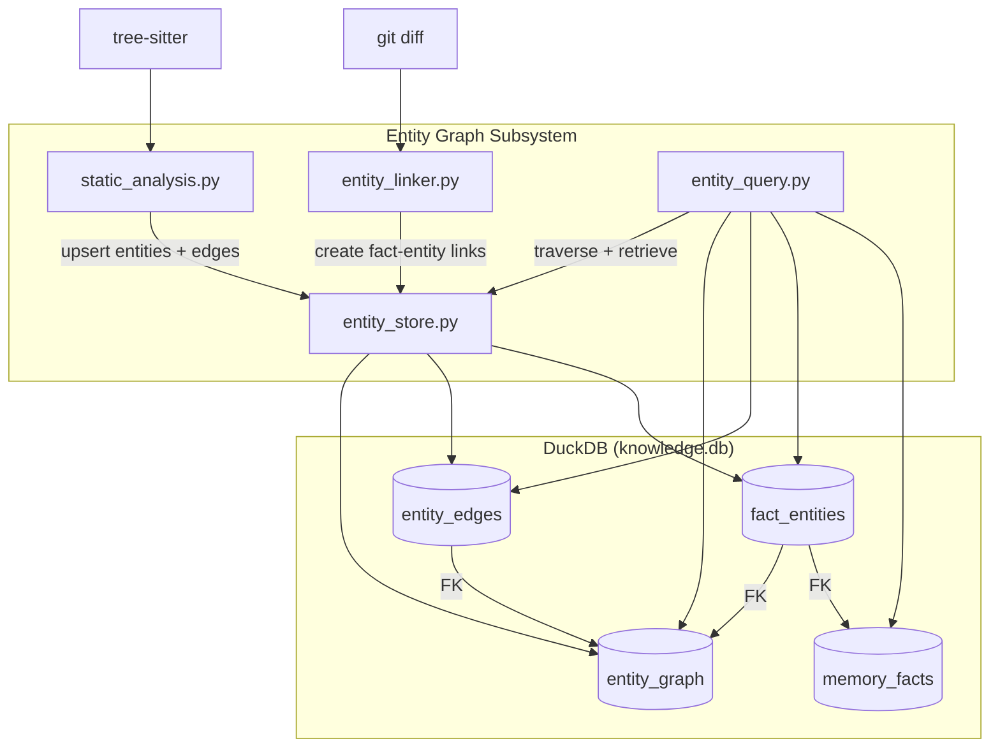

# Design Document: Entity Graph

## Overview

The entity graph adds a structural knowledge layer to the agent-fox knowledge
system. Codebase entities (files, modules, classes, functions) are represented
as typed nodes in a DuckDB graph, connected by directed edges representing
structural relationships (containment, imports, inheritance). A junction table
links existing memory facts to entities, enabling topology-based fact
retrieval.

The subsystem is delivered as a standalone library (four new modules under
`agent_fox/knowledge/`). It is not wired into the knowledge harvest pipeline
or context builder; integration is deferred to a future "knowledge
consolidation" spec.

## Architecture



### Module Responsibilities

1. **`agent_fox/knowledge/entities.py`** -- Data models: `EntityType`,
   `EdgeType`, `Entity`, `EntityEdge`, `AnalysisResult`, `LinkResult` enums
   and dataclasses.
2. **`agent_fox/knowledge/entity_store.py`** -- DuckDB operations: entity and
   edge CRUD, soft-delete, garbage collection, fact-entity link management,
   path-based entity lookup.
3. **`agent_fox/knowledge/static_analysis.py`** -- Tree-sitter analysis:
   multi-language source file scanning, entity and edge extraction via
   per-language analyzers, module map construction, import resolution, full
   codebase analysis orchestration.
4. **`agent_fox/knowledge/entity_linker.py`** -- Fact-entity linking: git diff
   path extraction, fact-to-entity association via commit SHA.

DuckDB schema is extended via migration v8 in
`agent_fox/knowledge/migrations.py`.

## Execution Paths

### Path 1: Full codebase analysis

1. `static_analysis.py: analyze_codebase(repo_root, conn)` -- entry point
2. `lang/registry.py: detect_languages(repo_root)` -> `list[LanguageAnalyzer]`
3. For each detected language:
   a. `lang/registry.py: _scan_files(repo_root, analyzer.file_extensions)` -> `list[Path]`
   b. `analyzer.build_module_map(repo_root, files)` -> `dict[str, str]`
   c. For each source file:
      - `static_analysis.py: _parse_file(file_path, parser)` -> `tree_sitter.Tree`
      - `analyzer.extract_entities(tree, rel_path)` -> `list[Entity]`
      - `analyzer.extract_edges(tree, rel_path, entities, module_map)` -> `list[EntityEdge]`
4. `entity_store.py: upsert_entities(conn, all_entities)` -> `int` (count)
5. `entity_store.py: upsert_edges(conn, all_edges)` -> `int` (count)
6. `entity_store.py: soft_delete_missing(conn, found_entity_keys)` -> `int` (count)
7. Returns `AnalysisResult(entities_upserted, edges_upserted, entities_soft_deleted, languages_analyzed)`

### Path 2: Fact-entity linking via git diff

1. `entity_linker.py: link_facts(conn, facts, repo_root)` -- entry point
2. For each fact with `commit_sha`:
   a. `entity_linker.py: _extract_paths_from_diff(commit_sha, repo_root)` -> `list[str]`
   b. `entity_store.py: find_entities_by_paths(conn, paths)` -> `list[Entity]`
   c. `entity_store.py: create_fact_entity_links(conn, fact.id, [e.id for e in entities])` -> `int`
3. Returns `LinkResult(facts_processed, links_created, facts_skipped)`

### Path 3: Graph query for related facts

1. `entity_query.py: find_related_facts(conn, file_path, max_depth, max_entities)` -- entry point
2. `entity_store.py: find_entities_by_path(conn, file_path)` -> `list[Entity]`
3. `entity_query.py: traverse_neighbors(conn, [e.id for e in entities], max_depth, max_entities)` -> `list[Entity]`
4. `entity_query.py: get_facts_for_entities(conn, [e.id for e in all_entities])` -> `list[Fact]`
5. Returns `list[Fact]`

### Path 4: Garbage collection

1. `entity_store.py: gc_stale_entities(conn, retention_days)` -- entry point
2. `entity_store.py: _find_stale_entity_ids(conn, cutoff_date)` -> `list[str]`
3. `entity_store.py: _cascade_delete_edges(conn, entity_ids)` -- side effect: rows removed from `entity_edges`
4. `entity_store.py: _cascade_delete_fact_links(conn, entity_ids)` -- side effect: rows removed from `fact_entities`
5. `entity_store.py: _hard_delete_entities(conn, entity_ids)` -- side effect: rows removed from `entity_graph`
6. Returns `int` (count of entities removed)

## Components and Interfaces

### Data Models (`entities.py`)

```python
class EntityType(StrEnum):
    FILE = "file"
    MODULE = "module"
    CLASS = "class"
    FUNCTION = "function"

class EdgeType(StrEnum):
    CONTAINS = "contains"
    IMPORTS = "imports"
    EXTENDS = "extends"

@dataclass(frozen=True)
class Entity:
    id: str                 # UUID v4
    entity_type: EntityType
    entity_name: str        # bare name or qualified (e.g., "MyClass.method")
    entity_path: str        # repo-relative path
    created_at: str         # ISO 8601
    deleted_at: str | None  # ISO 8601 or None

@dataclass(frozen=True)
class EntityEdge:
    source_id: str          # UUID of source entity
    target_id: str          # UUID of target entity
    relationship: EdgeType

@dataclass(frozen=True)
class AnalysisResult:
    entities_upserted: int
    edges_upserted: int
    entities_soft_deleted: int

@dataclass(frozen=True)
class LinkResult:
    facts_processed: int
    links_created: int
    facts_skipped: int
```

### Entity Store (`entity_store.py`)

```python
def upsert_entities(conn, entities: list[Entity]) -> int: ...
def upsert_edges(conn, edges: list[EntityEdge]) -> int: ...
def create_fact_entity_links(conn, fact_id: str, entity_ids: list[str]) -> int: ...
def find_entities_by_path(conn, path: str) -> list[Entity]: ...
def find_entities_by_paths(conn, paths: list[str]) -> list[Entity]: ...
def soft_delete_missing(conn, found_keys: set[tuple[str, str, str]]) -> int: ...
def gc_stale_entities(conn, retention_days: int) -> int: ...
```

### Static Analysis (`static_analysis.py`)

```python
def analyze_codebase(repo_root: Path, conn) -> AnalysisResult: ...
```

Internal functions:
```python
def _parse_file(file_path: Path, parser: Parser) -> Tree | None: ...
```

Language-specific operations (entity extraction, edge extraction, module
map construction) are delegated to per-language `LanguageAnalyzer`
implementations registered in the language analyzer registry. See Spec 102
for the detailed per-language analyzer design.

### Entity Linker (`entity_linker.py`)

```python
def link_facts(conn, facts: list[Fact], repo_root: Path) -> LinkResult: ...
```

Internal functions:
```python
def _extract_paths_from_diff(commit_sha: str, repo_root: Path) -> list[str]: ...
```

### Entity Query (`entity_query.py`)

```python
def traverse_neighbors(
    conn, entity_ids: list[str], max_depth: int = 2,
    max_entities: int = 50,
    relationship_types: list[EdgeType] | None = None,
    include_deleted: bool = False,
) -> list[Entity]: ...

def get_facts_for_entities(
    conn, entity_ids: list[str],
    exclude_superseded: bool = True,
) -> list[Fact]: ...

def find_related_facts(
    conn, file_path: str, max_depth: int = 2,
    max_entities: int = 50,
) -> list[Fact]: ...
```

## Data Models

### DuckDB Schema (Migration v8)

```sql
CREATE TABLE entity_graph (
    id           UUID PRIMARY KEY,
    entity_type  VARCHAR NOT NULL,
    entity_name  VARCHAR NOT NULL,
    entity_path  VARCHAR NOT NULL,
    created_at   TIMESTAMP NOT NULL DEFAULT CURRENT_TIMESTAMP,
    deleted_at   TIMESTAMP
);

CREATE TABLE entity_edges (
    source_id    UUID NOT NULL REFERENCES entity_graph(id),
    target_id    UUID NOT NULL REFERENCES entity_graph(id),
    relationship VARCHAR NOT NULL,
    PRIMARY KEY (source_id, target_id, relationship)
);

CREATE TABLE fact_entities (
    fact_id      UUID NOT NULL REFERENCES memory_facts(id),
    entity_id    UUID NOT NULL REFERENCES entity_graph(id),
    PRIMARY KEY (fact_id, entity_id)
);

-- Indexes for common query patterns
CREATE INDEX idx_entity_natural_key
    ON entity_graph(entity_type, entity_path, entity_name);
CREATE INDEX idx_entity_deleted
    ON entity_graph(deleted_at);
CREATE INDEX idx_entity_path
    ON entity_graph(entity_path);
CREATE INDEX idx_edge_source ON entity_edges(source_id);
CREATE INDEX idx_edge_target ON entity_edges(target_id);
CREATE INDEX idx_fact_entity_entity ON fact_entities(entity_id);
```

### Graph Traversal Query (Recursive CTE)

The `traverse_neighbors` function uses a recursive CTE for BFS:

```sql
WITH RECURSIVE neighbors AS (
    SELECT id AS entity_id, 0 AS depth
    FROM entity_graph
    WHERE id IN (?)

    UNION ALL

    SELECT
        CASE
            WHEN e.source_id = n.entity_id THEN e.target_id
            ELSE e.source_id
        END,
        n.depth + 1
    FROM neighbors n
    JOIN entity_edges e
        ON e.source_id = n.entity_id OR e.target_id = n.entity_id
    WHERE n.depth < ?  -- max_depth
)
SELECT DISTINCT eg.*, n.depth
FROM neighbors n
JOIN entity_graph eg ON eg.id = n.entity_id
WHERE eg.deleted_at IS NULL  -- unless include_deleted
ORDER BY n.depth ASC, eg.entity_name ASC
LIMIT ?  -- max_entities
```

### Path Normalization

```python
def normalize_path(path: str, repo_root: Path | None = None) -> str:
    """Normalize a path to repo-relative format.

    - Strips repo_root prefix if present.
    - Resolves '.' and '..' components via posixpath.normpath.
    - Strips leading '/' and trailing '/'.
    - Returns the normalized repo-relative path.
    """
```

## Operational Readiness

### Observability

- All analysis operations log entity/edge counts at INFO level.
- Unparseable files, unresolvable imports, and missing commits log at WARNING.
- GC operations log the count of removed entities at INFO level.

### Migration

- Migration v8 is forward-only and additive (three new tables, no changes to
  existing tables).
- Rollback is not supported (consistent with existing migration strategy).

### Compatibility

- The entity graph tables are independent of all existing tables except
  `memory_facts` (via FK on `fact_entities`).
- No existing code paths are modified by this spec.

## Correctness Properties

### Property 1: Path Normalization

*For any* entity stored via any code path (upsert, analysis, or restore), the
`entity_path` in `entity_graph` SHALL contain no absolute path prefix (no
leading `/`), no `.` or `..` components, and no trailing slash.

**Validates: Requirements 95-REQ-1.3**

### Property 2: Upsert Idempotency

*For any* sequence of entities and edges, upserting the same sequence twice
SHALL produce the same set of rows in the database: the same entity IDs, the
same edge set, and no duplicates.

**Validates: Requirements 95-REQ-1.E1, 95-REQ-2.4, 95-REQ-3.3**

### Property 3: Traversal Bound

*For any* entity graph and any traversal request with `max_depth=D` and
`max_entities=M`, the number of entities returned SHALL not exceed `M`, and no
returned entity's traversal depth SHALL exceed `D`.

**Validates: Requirements 95-REQ-6.1, 95-REQ-6.2**

### Property 4: Soft-Delete Exclusion

*For any* entity with `deleted_at IS NOT NULL`, default traversal (with
`include_deleted=False`) and default fact retrieval SHALL not include that
entity in results, and `find_related_facts` SHALL not return facts linked
exclusively to soft-deleted entities.

**Validates: Requirements 95-REQ-6.E2, 95-REQ-7.1**

### Property 5: Referential Integrity

*For any* edge in `entity_edges`, both `source_id` and `target_id` SHALL
reference existing rows in `entity_graph`. *For any* row in `fact_entities`,
`fact_id` SHALL reference an existing row in `memory_facts` and `entity_id`
SHALL reference an existing row in `entity_graph`.

**Validates: Requirements 95-REQ-2.3, 95-REQ-3.2**

### Property 6: GC Cascade Completeness

*For any* entity hard-deleted by garbage collection, no row in `entity_edges`
or `fact_entities` SHALL reference that entity's ID after GC completes.

**Validates: Requirements 95-REQ-7.2**

## Error Handling

| Error Condition | Behavior | Requirement |
|----------------|----------|-------------|
| Entity with same natural key exists (active) | Return existing ID | 95-REQ-1.E1 |
| Entity with same natural key exists (soft-deleted) | Restore and return ID | 95-REQ-1.E2 |
| Edge source or target does not exist | Raise error | 95-REQ-2.3 |
| Self-referencing edge (source == target) | Raise ValueError | 95-REQ-2.E1 |
| Fact or entity missing for link creation | Raise error | 95-REQ-3.2 |
| Source file unparseable by tree-sitter | Log warning, skip file | 95-REQ-4.E1 |
| Repo root does not exist | Raise ValueError | 95-REQ-4.E2 |
| No source files found for any language | Return zero-count AnalysisResult | 95-REQ-4.E3 |
| Import cannot be resolved via module map | Log warning, skip import | 95-REQ-4.6 |
| Fact has no commit_sha | Skip, increment skipped count | 95-REQ-5.4 |
| commit_sha not in local repo | Log warning, skip fact | 95-REQ-5.E1 |
| Git diff path has no matching entity | Skip path | 95-REQ-5.E2 |
| No entities match starting path/IDs | Return empty list | 95-REQ-6.E1 |
| retention_days zero or negative | Raise ValueError | 95-REQ-7.E1 |
| No entities eligible for GC | Return zero | 95-REQ-7.E2 |

## Technology Stack

- **Python 3.12+** -- consistent with project baseline.
- **DuckDB** -- existing knowledge store database; entity graph tables are
  added via migration v8.
- **tree-sitter** (`tree-sitter` package) -- incremental parser for
  multi-language static analysis.
- **tree-sitter-*** grammar packages -- per-language grammars for tree-sitter
  (Python, Go, Rust, TypeScript, JavaScript, Java, C, C++, Ruby). See Spec
  102 for the full list.
- **subprocess** (stdlib) -- invoking `git diff --name-only` for fact-entity
  linking.
- **pathlib** / **posixpath** (stdlib) -- path normalization.

## Definition of Done

A task group is complete when ALL of the following are true:

1. All subtasks within the group are checked off (`[x]`)
2. All spec tests (`test_spec.md` entries) for the task group pass
3. All property tests for the task group pass
4. All previously passing tests still pass (no regressions)
5. No linter warnings or errors introduced
6. Code is committed on a feature branch and merged into `develop`
7. Feature branch is merged back to `develop`
8. `tasks.md` checkboxes are updated to reflect completion

## Testing Strategy

- **Unit tests** verify each module in isolation: entity store CRUD, path
  normalization, edge validation, soft-delete/GC logic, traversal with small
  hand-crafted graphs, git diff path extraction (with subprocess mocking).
- **Property-based tests** (Hypothesis) verify invariants: path normalization,
  upsert idempotency, traversal bounds, soft-delete exclusion, referential
  integrity, GC cascade completeness.
- **Integration smoke tests** exercise each execution path end-to-end with a
  real DuckDB connection, real tree-sitter parsing on small fixture files, and
  mocked git subprocess calls.
