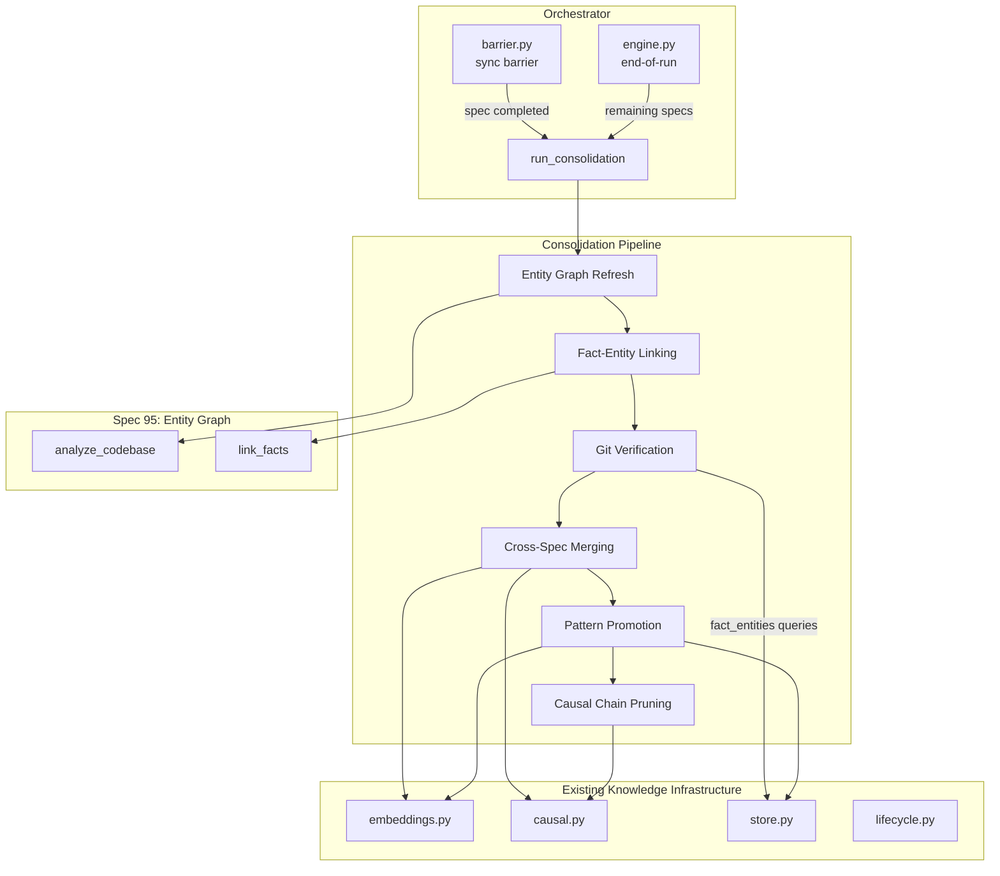
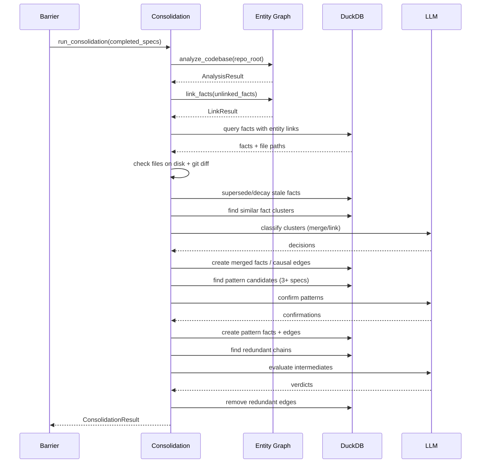

# Design Document: Knowledge Consolidation Agent

## Overview

The knowledge consolidation agent adds a post-spec knowledge quality pass to
the orchestrator. It runs during the sync barrier (when specs complete) and at
end-of-run, executing six ordered steps that leverage the entity graph (spec
95), embedding similarity, LLM classification, and the existing causal graph.

The implementation adds one new module (`knowledge/consolidation.py`) and
modifies two existing modules (`engine/barrier.py`, `engine/engine.py`) to
wire the consolidation pass into the orchestrator lifecycle.

## Architecture





### Module Responsibilities

1. **`agent_fox/knowledge/consolidation.py`** -- Consolidation pipeline
   orchestration and all six consolidation steps: entity graph refresh,
   fact-entity linking, git verification, cross-spec merging, pattern
   promotion, causal chain pruning. LLM prompt templates and response parsing.
2. **`agent_fox/engine/barrier.py`** -- Modified to call consolidation after
   lifecycle cleanup when completed specs are detected.
3. **`agent_fox/engine/engine.py`** -- Modified to call consolidation at
   end-of-run for any remaining completed specs.

## Execution Paths

### Path 1: Consolidation at sync barrier

1. `engine/barrier.py: run_sync_barrier_sequence(...)` -- existing barrier entry point
2. `engine/barrier.py:` (new block after lifecycle cleanup) -- checks `completed_spec_names()` for newly completed specs
3. `knowledge/consolidation.py: run_consolidation(conn, repo_root, completed_specs, model, ...)` -> `ConsolidationResult`
4. `knowledge/consolidation.py: _refresh_entity_graph(conn, repo_root)` -> `AnalysisResult`
   a. `knowledge/static_analysis.py: analyze_codebase(repo_root, conn)` -> `AnalysisResult`
5. `knowledge/consolidation.py: _link_unlinked_facts(conn, repo_root)` -> `LinkResult`
   a. `knowledge/entity_linker.py: link_facts(conn, unlinked, repo_root)` -> `LinkResult`
6. `knowledge/consolidation.py: _verify_against_git(conn, repo_root)` -> `VerificationResult`
   a. Queries `fact_entities JOIN entity_graph` for file entities
   b. Checks file existence on disk
   c. Runs `git diff --numstat` for change detection
   d. Updates `memory_facts` (supersede or halve confidence)
7. `knowledge/consolidation.py: _merge_related_facts(conn, model)` -> `MergeResult`
   a. Queries embeddings for cross-spec clusters
   b. LLM classifies each cluster
   c. Creates consolidated facts or causal edges
8. `knowledge/consolidation.py: _promote_patterns(conn, model)` -> `PromotionResult`
   a. Queries embeddings for 3+ spec clusters
   b. LLM confirms patterns
   c. Creates pattern facts with causal edges
9. `knowledge/consolidation.py: _prune_redundant_chains(conn, model)` -> `PruneResult`
   a. Queries `fact_causes` for A->B->C where A->C exists
   b. LLM evaluates intermediates
   c. Removes redundant edges
10. Audit event `consolidation.complete` emitted with `ConsolidationResult`

### Path 2: Consolidation at end-of-run

1. `engine/engine.py: run()` finally block -- existing cleanup
2. `engine/engine.py:` (new block after `cleanup_completed_spec_audits`) -- determines unconsolidated completed specs
3. `knowledge/consolidation.py: run_consolidation(...)` -- same pipeline as Path 1, steps 4-10
4. Returns `ConsolidationResult` -> logged at INFO level

## Components and Interfaces

### Data Models (`consolidation.py`)

```python
CONSOLIDATION_STALE_SENTINEL = uuid.uuid5(
    uuid.NAMESPACE_DNS, "agent-fox.consolidation.stale"
)

@dataclass(frozen=True)
class VerificationResult:
    facts_checked: int
    superseded_count: int   # all linked files deleted
    decayed_count: int      # files significantly changed
    unchanged_count: int

@dataclass(frozen=True)
class MergeResult:
    clusters_found: int
    facts_merged: int       # original facts superseded
    facts_linked: int       # causal edges added (link decision)
    consolidated_created: int

@dataclass(frozen=True)
class PromotionResult:
    candidates_found: int
    patterns_confirmed: int
    pattern_facts_created: int

@dataclass(frozen=True)
class PruneResult:
    chains_evaluated: int
    intermediates_pruned: int
    edges_removed: int

@dataclass(frozen=True)
class ConsolidationResult:
    entity_refresh: AnalysisResult | None
    facts_linked: int
    verification: VerificationResult | None
    merging: MergeResult | None
    promotion: PromotionResult | None
    pruning: PruneResult | None
    total_llm_cost: float
    errors: list[str]       # step names that failed
```

### Pipeline Entry Point

```python
async def run_consolidation(
    conn: duckdb.DuckDBPyConnection,
    repo_root: Path,
    completed_specs: set[str] | None,
    model: str,
    embedding_generator: EmbeddingGenerator | None = None,
    sink_dispatcher: SinkDispatcher | None = None,
    run_id: str | None = None,
    change_ratio_threshold: float = 0.5,
    merge_similarity_threshold: float = 0.85,
) -> ConsolidationResult: ...
```

### Internal Step Functions

```python
def _refresh_entity_graph(conn, repo_root: Path) -> AnalysisResult: ...
def _link_unlinked_facts(conn, repo_root: Path) -> LinkResult: ...
def _verify_against_git(
    conn, repo_root: Path, change_ratio_threshold: float,
) -> VerificationResult: ...
async def _merge_related_facts(
    conn, model: str, threshold: float,
    embedding_generator: EmbeddingGenerator | None,
) -> MergeResult: ...
async def _promote_patterns(conn, model: str) -> PromotionResult: ...
async def _prune_redundant_chains(conn, model: str) -> PruneResult: ...
```

### LLM Prompt Interfaces

```python
# Cross-spec merging classification
MERGE_PROMPT: str  # Input: cluster of facts; Output: {"action": "merge"|"link", "content": "..."}

# Pattern confirmation
PATTERN_PROMPT: str  # Input: facts from 3+ specs; Output: {"is_pattern": bool, "description": "..."}

# Causal chain evaluation
CHAIN_PROMPT: str  # Input: facts A, B, C; Output: {"meaningful": bool, "reason": "..."}
```

## Data Models

### Git Change Detection

```python
def _compute_change_ratio(
    commit_sha: str, file_path: str, repo_root: Path,
) -> float | None:
    """Run git diff --numstat and return (insertions + deletions) / current_lines.

    Returns None if the commit or file is unavailable.
    """
```

### Unlinked Fact Query

```sql
SELECT f.* FROM memory_facts f
LEFT JOIN fact_entities fe ON f.id = fe.fact_id
WHERE fe.fact_id IS NULL
AND f.superseded_by IS NULL
```

### Redundant Chain Query

```sql
SELECT a.cause_id AS a_id, a.effect_id AS b_id, b.effect_id AS c_id
FROM fact_causes a
JOIN fact_causes b ON a.effect_id = b.cause_id
JOIN fact_causes direct ON a.cause_id = direct.cause_id
    AND b.effect_id = direct.effect_id
```

### Completed-But-Not-Consolidated Tracking

The orchestrator tracks which specs have already been consolidated in the
current run via a `set[str]` (`_consolidated_specs`) on the engine instance.
At end-of-run, it subtracts `_consolidated_specs` from
`completed_spec_names()` to find remaining specs.

## Operational Readiness

### Observability

- `consolidation.complete` audit event with full `ConsolidationResult`.
- `consolidation.cost` audit event with LLM cost breakdown.
- Per-step WARNING logs on failure (non-blocking).
- INFO log with summary counts after each consolidation pass.

### Compatibility

- Entity graph tables (migration v8) are a soft dependency. If the tables
  don't exist, the entity graph steps are skipped gracefully.
- No changes to the fact schema or existing knowledge infrastructure.
- The consolidation pipeline is additive -- it only supersedes, decays, or
  creates facts; it never hard-deletes.

### Rollback

- Consolidation effects can be reversed by clearing `superseded_by` on
  affected facts and removing newly created facts/edges. However, this is
  expected to be unnecessary in practice.

## Correctness Properties

### Property 1: Step Independence

*For any* consolidation pass, if step N raises an exception, the system SHALL
still execute steps N+1 through 6, and the `ConsolidationResult` SHALL
accurately report which steps succeeded and which failed.

**Validates: Requirements 96-REQ-1.2**

### Property 2: Git Verification Accuracy

*For any* active fact linked to file entities, if every linked file has been
deleted from the codebase, the fact SHALL have `superseded_by` set to the
consolidation sentinel after git verification. If at least one linked file
exists, the fact SHALL NOT be superseded by git verification.

**Validates: Requirements 96-REQ-3.2, 96-REQ-3.3**

### Property 3: Merge Idempotency

*For any* set of facts, running the cross-spec merging step twice SHALL not
produce duplicate consolidated facts: facts already superseded by a prior
merge SHALL not appear in new clusters.

**Validates: Requirements 96-REQ-4.1, 96-REQ-4.3**

### Property 4: Pattern Promotion Threshold

*For any* pattern fact created by the promotion step, the original facts in
its cluster SHALL span 3 or more distinct `spec_name` values.

**Validates: Requirements 96-REQ-5.1, 96-REQ-5.3**

### Property 5: Causal Chain Preservation

*For any* redundant chain A->B->C where B is pruned, the direct edge A->C
SHALL exist in `fact_causes` after pruning. The edges A->B and B->C SHALL
NOT exist after pruning.

**Validates: Requirements 96-REQ-6.3**

### Property 6: Confidence Decay Bounds

*For any* fact whose confidence is halved by git verification, the resulting
stored confidence SHALL be strictly positive and less than the original
confidence.

**Validates: Requirements 96-REQ-3.3**

## Error Handling

| Error Condition | Behavior | Requirement |
|----------------|----------|-------------|
| Step raises exception | Log warning, continue next step | 96-REQ-1.2 |
| Zero active facts in DB | Return zero-count result, skip LLM | 96-REQ-1.E1 |
| Entity graph tables missing | Skip entity steps, log warning | 96-REQ-1.E2 |
| Repo root invalid | Skip entity steps, log warning | 96-REQ-2.E1 |
| Fact has no entity links | Skip in git verification | 96-REQ-3.E1 |
| Fact has no commit_sha | File existence check only | 96-REQ-3.E2 |
| Embedding generation fails | Exclude fact from clustering | 96-REQ-4.E1 |
| LLM call fails for cluster | Skip cluster, continue | 96-REQ-4.E2 |
| Pattern group already linked | Skip group | 96-REQ-5.E1 |
| LLM fails for chain eval | Preserve all edges, continue | 96-REQ-6.E1 |
| Cost budget exceeded | Abort step, return partial result | 96-REQ-7.E1 |
| No specs completed | Skip consolidation entirely | 96-REQ-7.E2 |

## Technology Stack

- **Python 3.12+** -- consistent with project baseline.
- **DuckDB** -- existing knowledge store; all mutations via existing tables.
- **Anthropic SDK** -- LLM calls for classification, pattern detection, and
  chain evaluation (same as existing contradiction detection).
- **spec 95 entity graph** -- `analyze_codebase()`, `link_facts()`,
  `find_related_facts()` from `knowledge/static_analysis.py`,
  `knowledge/entity_linker.py`, `knowledge/entity_query.py`.
- **subprocess** (stdlib) -- `git diff --numstat` for change detection.
- **Existing knowledge modules** -- `embeddings.py`, `causal.py`, `store.py`,
  `lifecycle.py` for embedding search, causal graph operations, and fact CRUD.

## Definition of Done

A task group is complete when ALL of the following are true:

1. All subtasks within the group are checked off (`[x]`)
2. All spec tests (`test_spec.md` entries) for the task group pass
3. All property tests for the task group pass
4. All previously passing tests still pass (no regressions)
5. No linter warnings or errors introduced
6. Code is committed on a feature branch and merged into `develop`
7. Feature branch is merged back to `develop`
8. `tasks.md` checkboxes are updated to reflect completion

## Testing Strategy

- **Unit tests** verify each consolidation step in isolation: git verification
  with mocked filesystem and subprocess, cross-spec merging with mocked LLM
  responses, pattern promotion with mocked LLM, causal chain pruning with
  mocked LLM. All use real in-memory DuckDB connections.
- **Property-based tests** (Hypothesis) verify invariants: step independence,
  git verification accuracy, merge idempotency, pattern threshold, chain
  preservation, confidence bounds.
- **Integration smoke tests** exercise Paths 1 and 2 end-to-end with real
  DuckDB, real entity graph operations, and mocked LLM/subprocess calls.
